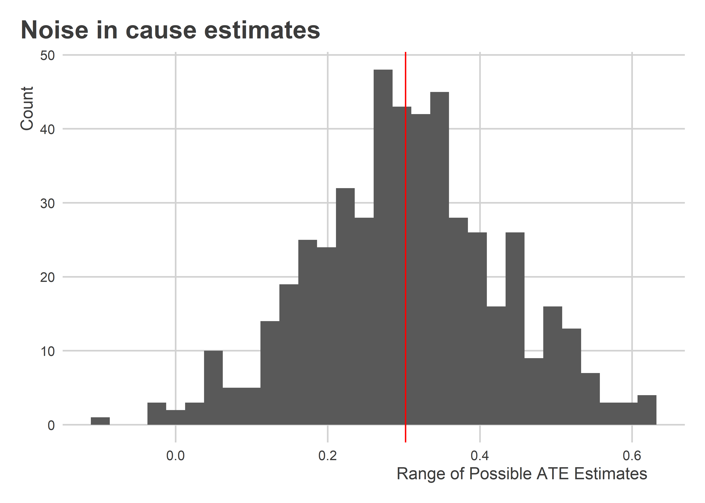
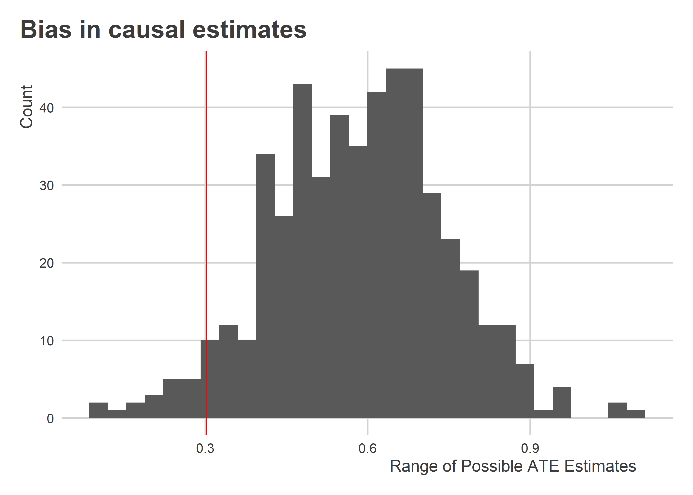
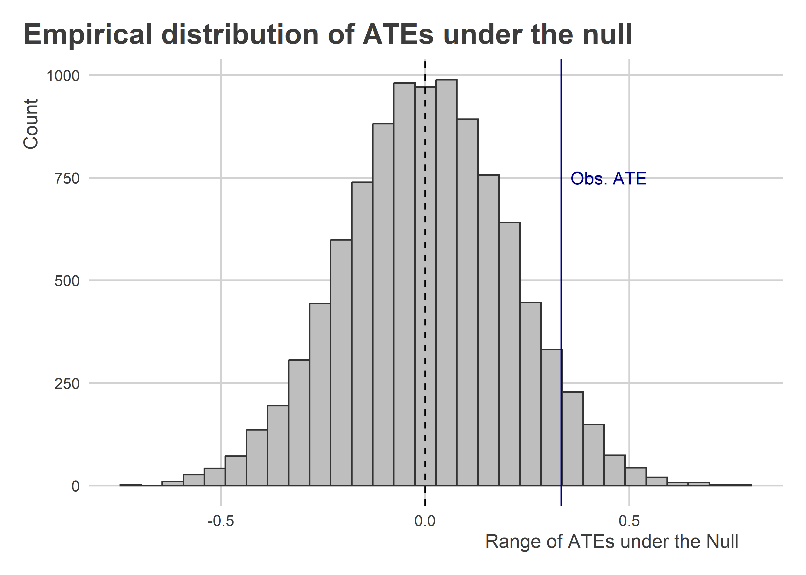

Causation
================

-   [Learning goals](#learning-goals)
-   [Potential Outcomes and
    Couterfactuals](#potential-outcomes-and-couterfactuals)
-   [Bias in Estimating ATEs](#bias-in-estimating-ates)
-   [Causal Inference and the Sharp
    Null](#causal-inference-and-the-sharp-null)
-   [Doing the Right Kind of Inference in
    R](#doing-the-right-kind-of-inference-in-r)
-   [Adjusting for Covariates](#adjusting-for-covariates)
-   [Thinking Clearly about Causation and
    Correlation](#thinking-clearly-about-causation-and-correlation)

## Learning goals

-   Understand the difference between correlation and causation.
-   Cover potential outcomes and counterfactuals.
-   Understand the role of noise and bias in estimating causal effects.

## Potential Outcomes and Couterfactuals

Causal inference is a field that is simultaneously scientific and
philosophical because it is a highly stylized approach of, effectively,
doing thought experiments. These thought experiments ask us to imagine
two or more versions of reality and how the range of potential outcomes
can differ if we tweak just one or two things about the world.

Say we want to know the effect of a new math curiculum on standardized
test scores. This scenario implicitly sets up for us the need to think
about two versions of reality. One where students are “treated” with the
new curriculum and one where they are not. We call these
*counterfactuals*.

Let’s use

to denote treatment where 1 means treatment and 0 means no treatment.
Let

be a continous measure of standardized test scores. Using this notation,
we can specify two versions of the world:


Using this notation, the effect of the curriculum on student scores for
person

is:


This difference or “delta” tells us the causal effect of the curriculum.
Often times, we’re more interested in the average causal effect rather
than the effect for an individual. We would represent this as follows:


With this notation, we can specify the *average treatment effect* or ATE
as:


At this point, you may notice that we have an obvious problem. We can
only observe a student’s scores with or without the curriculum; not both
potential outcomes at the same time.

The problem of causal inference is that causal effects are fundamentally
unobservable, both at the individual level, as well as at the level of
group averages. So where do we get causal estimates from?

This is where research design comes into play. To estimate causal
effects, we have to find a way to make comparisons with the observed or
*revealed* outcomes in our data. The process of assigning a treatment to
observations reveals outcomes. Using our notation, we can express this
process by writing:

")

Say we have a sample of 100 students and 50 of them receive the
treatment or new math curiculum and the rest have the old curriculum. We
can take the difference in mean scores between both groups and use that
difference as our estimate of the ATE:

 & = \text{average outcome for all units where } T_i = 1\\
\overline Y(T_i = 0) & = \text{average outcome for all units where } T_i = 0
\end{aligned}
")

Using this notation we have:

 - \overline Y(T_i = 0)")

We can simulate some data to illustrate:

``` r
set.seed(123)
tibble(
  # values without treatment
  Y0 = rnorm(100),
  
  # values with treatment
  Y1 = 1/2 + rnorm(100),
  
  # treatment assignemnt
  Tr = rep(0:1, each = 50) %>%
    sample(),
  
  # reveal outcomes
  Yobs = Y1 * Tr + Y0 * (1 - Tr)
) -> simData
```

Since we’ve simulated the data, we can directly calculate the ATE:

``` r
theATE <- mean(simData$Y1 - simData$Y0)
theATE
```

    ## [1] 0.3020473

And we can compare this to our estimate of the ATE:

``` r
estATE <- mean(simData$Yobs[simData$Tr==1]) - 
  mean(simData$Yobs[simData$Tr==0])
estATE
```

    ## [1] 0.3333896

The estimated ATE is unlikely to be exactly equal to the true ATE. This
happens for a couple of reasons.

When we estimate quantities using data, our estimates reflect a
combination of three things. These are captured by the following
equation:

*Estimate = Estimand + Bias + Noise*

-   *Estimate*: the thing that we calculate.
-   *Estimand*: the thing we want to estimate.
-   *Bias*: factors that systematically skew our estimate up or down.
-   *Noise*: factors that randomly skew our estimate up or down.

In the case of the data-generating process we simulated above, *Noise*
enters the equation through the randomization process. If we could
repeat the process of assigning students to treatment, we’d see that we
could have gotten a range of different ATE estimates:

``` r
replicate(
  500,
  {
    newData <- simData %>%
      mutate(
        Tr = sample(Tr),
        Yobs = Tr * Y1 + (1 - Tr) * Y0
      )
    newATE <- mean(newData$Yobs[newData$Tr==1]) - 
      mean(newData$Yobs[newData$Tr==0])
    newATE
  },
  "c"
) -> possibleATEs

ggplot() +
  aes(possibleATEs) +
  geom_histogram() +
  geom_vline(xintercept = theATE,
             color = "red") +
  labs(x = "Range of Possible ATE Estimates",
       y = "Count",
       title = "Noise in cause estimates")
```



The red line shows the true ATE and the histogram summarizes the range
of possible ATE estimates we could have obtained with the data.

## Bias in Estimating ATEs

The problem with estimating causal effects is that bias, in addition to
noise, influences our estimate. Bias enters the equation in ways that
would systematically increase or decrease our estimate relative to the
true ATE.

Noise will move the ATE up or down, too, which we saw in the above
histogram. But with noise, the difference isn’t systmatic. It’s just
dumb luck. On average, luck evens us out.

It’s a different story with bias. Bias might influence our estimate if,
for instance, the process whereby students were in the new curriculum or
old curriculum groups was non-random. Say students could opt in or
select in to the curriculum. We’d expect that high performing students
would be most apt to do this. How do you think this would effect
observed or revealed outcomes?

``` r
set.seed(123)
simData %>%
  mutate(
    Tbias = rbinom(100, 1, (Y0 > 0) * 0.8 + (Y0 <= 0) * 0.2),
    Ybias = Tbias * Y1 + (1 - Tbias) * Y0
  ) -> simData
biasATE <- mean(simData$Ybias[simData$Tbias==1]) - 
  mean(simData$Ybias[simData$Tbias==0])
biasATE
```

    ## [1] 0.661612

This estimate is bigger than the previous estimate. Why do you think
that is?

If we repeated this process of letting students opt in, we can see that
this difference isn’t just normal noise. This opt-in policy leads to an
upward bias in our estimate of the ATE:

``` r
replicate(
  500,
  {
    newData <- simData %>%
      mutate(
        Tbias = rbinom(100, 1, (Y0 > 0) * 0.8 + (Y0 <= 0) * 0.2),
        Ybias = Tbias * Y1 + (1 - Tbias) * Y0
      )
    newATE <- mean(newData$Yobs[newData$Tbias==1]) - 
      mean(newData$Yobs[newData$Tbias==0])
    newATE
  },
  "c"
) -> possibleATEs

ggplot() +
  aes(possibleATEs) +
  geom_histogram() +
  geom_vline(xintercept = theATE,
             color = "red") +
  labs(x = "Range of Possible ATE Estimates",
       y = "Count",
       title = "Bias in causal estimates")
```



Bias is often of greatest concern in studies that are *NOT* randomized
trials. In the above example as well as in many observational studies
the process that led to certain individuals receiving some “treatment”
is usually nonrandom. The factors that led individuals to get treatment
also influence the outcome of interest, bias is likely to be a problem.
How do you think we’d adjust for bias in the above example?

## Causal Inference and the Sharp Null

Hypothesis testing, which we’ve already discussed, operates in much the
same way with causal inference as it does with descriptive inferernce.
But when it comes to randomized trials in particular, it often is
justified to test a very special kind of null hypothesis for a treatment
effect: *the sharp null*.

The idea comes from the same Ronald Fisher we talked about last time.
The idea is simple. If the null hypothesis is true than any difference
in means between treatment and control groups is simply due to the luck
of draw with the randomizing process itself. That means we can
rerandomize treatment and get a range of treatment effects under the
null and use this distribution to make an inference about how unlikely
our observed estimate of the ATE is.

This process is called *permutation* and it’s a computational approach
to statistical inference. Here’s how it works using some code:

``` r
replicate(
  10000,
  coef(lm(Yobs ~ sample(Tr), simData))[2],
  "c"
) -> permATEs

2 * min(
  mean(permATEs <= estATE),
  mean(permATEs >= estATE)
) -> p.value
p.value # the permutation p-value
```

    ## [1] 0.1086

This p-value is literally just the proportion of times the permutation
process gives us an ATE at least as extreme as the one we estimated with
the original treatment assignment.

What I like about this approach (and most computational approaches for
that matter) is that we can plot the *empirical* distribution of
possible treatment effects under the null. That is, if the null really
is true, this is what the actual empirical distribution of treatment
effects looks like:

``` r
ggplot() +
  aes(x = permATEs) +
  geom_histogram(
    fill = "gray",
    color = "gray20"
  ) +
  geom_vline(
    xintercept = c(0, estATE),
    lty = c(2, 1),
    color = c("black", "darkblue")
  ) +
  labs(
    x = "Range of ATEs under the Null",
    y = "Count",
    title = "Empirical distribution of ATEs under the null"
  ) +
  annotate(
    "text",
    x = 0.45,
    y = 750,
    label = "Obs. ATE",
    color = "darkblue"
  )
```



## Doing the Right Kind of Inference in R

We’ve discussed how obtaining estimates of population parameters with
samples comes with uncertainty. In this case, uncertainty comes from the
sampling process. As noted above, when thinking about causal effects, we
sometimes want to think about a difference source of uncertainty—the
process of *randomization*.

The `{estimatr}` package has some useful tools for easily implementing
either of these kinds of inferences. Up to now, we’ve used the `lm()`
function to estimate linear models. We often use linear models to
estimate ATEs in addition to doing things like make predictions or
estimate correlations.

The problem with `lm()` is that when we use the `summary()` function to
make inferences, by default it uses so-called “classical” OLS standard
errors. These generally are not the best option because they make
certain assumptions about the sources of uncertainty in the data.
Namely, the assume that the error term in the model is normally
distributed and that each observation is independent of the others. We
call these iid assumptions, short for “independent and identically
distributed.”

In practice, it’s better to use “robust” standard errors. These don’t
make these same strong assumptions, which helps us to make better
inferences with our linear models.

Let’s open the `{estimatr}` package. You’ll need to install it using
`install.packages("estimatr")`.

``` r
library(estimatr)
```

Then we can use the `lm_robust()` function, which is the `{estimatr}`
version of `lm()` but with more bells and whistles. We use it just
`lm()`:

``` r
fit_robust <- lm_robust(Yobs ~ Tr, simData)
```

But when we look at the output we automatically see much more:

``` r
fit_robust
```

    ##             Estimate Std. Error t value Pr(>|t|)  CI Lower CI Upper DF
    ## (Intercept)  0.11380    0.14367 0.79204  0.43025 -0.171321  0.39891 98
    ## Tr           0.33339    0.20096 1.65900  0.10031 -0.065405  0.73218 98

`lm_robust` automatically reports inferences. By default it reports
inferences for a special kind of standard error called “HC2.” The HC
stands for heteroskedasticity consistent, but for our purposes that just
means “robust.” The 2 indicates that its a certain kind of robust
standard error. Specifically, and most usefully for causal inference,
the errors are a good approximation for the variation we’d expect in the
data if random treatment assigment were the main source of uncertainty
in our data.

Check out the difference:

``` r
fit_classic <- lm(Yobs ~ Tr, simData)
summary(fit_classic)
```

    ## 
    ## Call:
    ## lm(formula = Yobs ~ Tr, data = simData)
    ## 
    ## Residuals:
    ##    Min     1Q Median     3Q    Max 
    ## -2.423 -0.671 -0.064  0.613  3.294 
    ## 
    ## Coefficients:
    ##             Estimate Std. Error t value Pr(>|t|)
    ## (Intercept)    0.114      0.142    0.80     0.43
    ## Tr             0.333      0.201    1.66     0.10
    ## 
    ## Residual standard error: 1 on 98 degrees of freedom
    ## Multiple R-squared:  0.0273, Adjusted R-squared:  0.0174 
    ## F-statistic: 2.75 on 1 and 98 DF,  p-value: 0.1

``` r
summary(fit_robust)
```

    ## 
    ## Call:
    ## lm_robust(formula = Yobs ~ Tr, data = simData)
    ## 
    ## Standard error type:  HC2 
    ## 
    ## Coefficients:
    ##             Estimate Std. Error t value Pr(>|t|) CI Lower CI Upper DF
    ## (Intercept)    0.114      0.144   0.792     0.43  -0.1713    0.399 98
    ## Tr             0.333      0.201   1.659     0.10  -0.0654    0.732 98
    ## 
    ## Multiple R-squared:  0.0273 ,    Adjusted R-squared:  0.0174 
    ## F-statistic: 2.75 on 1 and 98 DF,  p-value: 0.1

With this particular sample and data, the strong assumptions of the
classical OLS standard errors don’t do us a disservice—they’re pretty
close to the HC2 errors. That won’t always be the case, especially if
our underlying data weren’t so normal.

## Adjusting for Covariates

If we don’t run an experiment we may need to control for confounders or
variables that we suspect both influence the outcome and our causal
variable of interest.

As we do this, we need to think clearly about what variables we include.
*Pre-treatment covariates* are variables that we would want to control
for because we think they may be correlated with treatment and the
outcome *prior* to treatment assignment. We want to avoide controlling
for *post-treatment* covariates because they only become correlated with
treatment and the outcome after and because of treatment.

The first kind of covariate can help use reduce bias, but the second may
make bias worse.

This is yet another reason not to just throw every variable in your data
at an analysis problem. Make informed choices about what variables to
include in your model.

## Thinking Clearly about Causation and Correlation

We need to think carefully and clearly about our data. If we observe a
significant relationship between two variables, this is never enough to
claim causation. We need to make informed choices, where “informed”
means theory-driven.

Data-driven insights sound cool, but they can be misleading. Data-driven
*and* theory-driven insights are better.

Sometimes this involves invoking complicated theories, but other times
just using common sense is enough. For example, did you know that from
1999 to 2009 there was a strong positive correlation (r = 0.666) between
the number of Nicolas Cage movies in a given year and the number of
swimming pool drownings?

As want as I am to find another reason to hate on Nick Cage’s movies, I
think it’s unlikely that his so-called films *cause* pool drownings. By
this point in the class you’re getting exposed to powerful and useful
tools, but they are no substitute for clear thinking. These two
things—thinking and data—complement each other.
