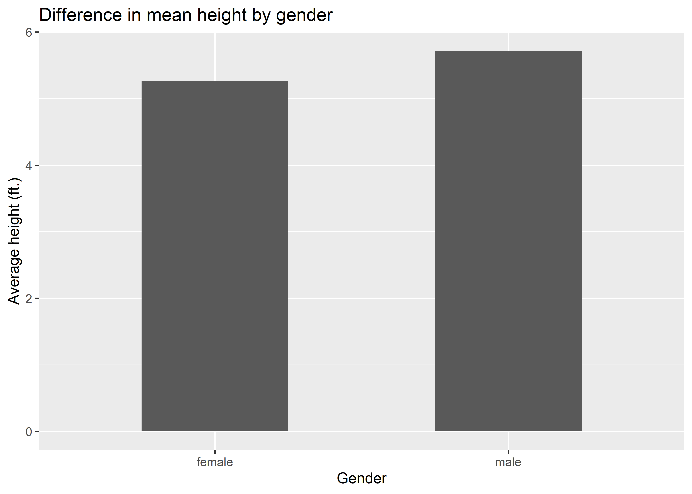

Using tools in `{dplyr}`
================

## Learning Objectives

-   Apply the main dplyr functions to manipulate a dataset
-   Layer complexity by chaining together multiple dplyr functions to
    solve a problem.

## Using dplyr for data manipulation/wrangling

Dplyr is a powerful tool for letting us transform a dataframe into what
we need for analysis.

There are 6 key dplyr functions that we need to know (and much more that
it can do!)

-   `filter()`: Choose observations based on their values (==, !=, \>,
    \<, \>=, \<=)
-   `arrange()`: Reorder the rows (sort based on a variable)
-   `select()`: Choose variables (columns) based on their names
-   `mutate()`: Use existing variables to create new variables
-   `summarize()`: Collapse many variables into a single summary
-   `group_by()`: Specify the scope of the function that you want to
    perform (for example, calculate the average height of plants,
    grouped by each region). ORDERING MATTERS!

To use these functions, don’t forget to tell R to attach the dplyr
package:

``` r
library(dplyr)
```

These are all dplyr functions, sometimes we call them “verbs”, and they
all take input in a similar structure.

`filter(data, colname == "value" & colname >= 1000)`

We can chain together multiple dplyr “layers”, like ggplot, but we use
the %\>% pipe instead of +.

1.  First, we start with the data frame
2.  Then, we add arguments that describe what to do with the data frame,
    using the column (variable) names. Note that we don’t need to put
    the column names in quotes, because we’ve already specified the data
    frame that they are contained in, R will be able to find them as a
    “known” object.
3.  The output is a new data frame

Do you recall using `filter()` in our Garlic Mustard lab? What do we
need to add if we want to save the output so we can do things with it
later?

    filtered_data <- data %>%
        filter(column_name == "some text")

To filter, we need to remember and know how to use the comparison
operators:

-   Greater than `>`
-   Less than `<`
-   Greater than or equal to `>=`
-   Less than or equal to `<=`
-   Equal to `==`
-   Not equal to `!=`
-   In `%in%`
-   Is NA? `is.na()`

Aside: Recall some common mathematical operators (should follow order of
operations).

-   addition `+`
-   subtraction `-`
-   multiplication `*`
-   division `/`
-   square `^2`

We also need to know the logical operators

-   and `&`
-   or `|`
-   not `!`

So let’s try using filter with the NHANES dataset, which is another
datapackage we can install and look at. This is an excerpt from the
Center for Disease Control’s (CDC) National Health and Nutrition
Examination Survey (NHANES), a national study conducted every two years
that gathers data on American’s health, nutrition, and exposure to
environmental chemicals. Data from NHANES is used widely by
environmental health scientists to study the U.S. public’s exposure to
chemicals.

First install the NHANES package:

    install.packages("NHANES")

Then attach it. We can use dim() to check the size of the data (number
of rows and columns).

``` r
library(NHANES)
dim(NHANES)
```

    ## [1] 10000    76

Let’s take a quick look at this dataset - each row is the record for a
person who responded to the survey, and each column is the variables
that they responded to. You can see that there are a lot of variables we
can sort or filter on!

### filter()

Let’s just practice filter first, which we’ve already seen in lab. Let’s
say we want all the data from men.

``` r
NHANES %>%
  filter(Gender == "male")
```

    ## # A tibble: 4,980 × 76
    ##       ID SurveyYr Gender   Age AgeDecade AgeMonths Race1 Race3 Education Marit…¹
    ##    <int> <fct>    <fct>  <int> <fct>         <int> <fct> <fct> <fct>     <fct>  
    ##  1 51624 2009_10  male      34 " 30-39"        409 White <NA>  High Sch… Married
    ##  2 51624 2009_10  male      34 " 30-39"        409 White <NA>  High Sch… Married
    ##  3 51624 2009_10  male      34 " 30-39"        409 White <NA>  High Sch… Married
    ##  4 51625 2009_10  male       4 " 0-9"           49 Other <NA>  <NA>      <NA>   
    ##  5 51638 2009_10  male       9 " 0-9"          115 White <NA>  <NA>      <NA>   
    ##  6 51646 2009_10  male       8 " 0-9"          101 White <NA>  <NA>      <NA>   
    ##  7 51654 2009_10  male      66 " 60-69"        795 White <NA>  Some Col… Married
    ##  8 51656 2009_10  male      58 " 50-59"        707 White <NA>  College … Divorc…
    ##  9 51657 2009_10  male      54 " 50-59"        654 White <NA>  9 - 11th… Married
    ## 10 51667 2009_10  male      50 " 50-59"        603 White <NA>  Some Col… NeverM…
    ## # … with 4,970 more rows, 66 more variables: HHIncome <fct>, HHIncomeMid <int>,
    ## #   Poverty <dbl>, HomeRooms <int>, HomeOwn <fct>, Work <fct>, Weight <dbl>,
    ## #   Length <dbl>, HeadCirc <dbl>, Height <dbl>, BMI <dbl>,
    ## #   BMICatUnder20yrs <fct>, BMI_WHO <fct>, Pulse <int>, BPSysAve <int>,
    ## #   BPDiaAve <int>, BPSys1 <int>, BPDia1 <int>, BPSys2 <int>, BPDia2 <int>,
    ## #   BPSys3 <int>, BPDia3 <int>, Testosterone <dbl>, DirectChol <dbl>,
    ## #   TotChol <dbl>, UrineVol1 <int>, UrineFlow1 <dbl>, UrineVol2 <int>, …
    ## # ℹ Use `print(n = ...)` to see more rows, and `colnames()` to see all variable names

OK but what if we want to filter on two variables, males who are also
married?

``` r
NHANES %>%
  filter(Gender == "male" & MaritalStatus == "Married")
```

    ## # A tibble: 2,029 × 76
    ##       ID SurveyYr Gender   Age AgeDecade AgeMonths Race1 Race3 Education Marit…¹
    ##    <int> <fct>    <fct>  <int> <fct>         <int> <fct> <fct> <fct>     <fct>  
    ##  1 51624 2009_10  male      34 " 30-39"        409 White <NA>  High Sch… Married
    ##  2 51624 2009_10  male      34 " 30-39"        409 White <NA>  High Sch… Married
    ##  3 51624 2009_10  male      34 " 30-39"        409 White <NA>  High Sch… Married
    ##  4 51654 2009_10  male      66 " 60-69"        795 White <NA>  Some Col… Married
    ##  5 51657 2009_10  male      54 " 50-59"        654 White <NA>  9 - 11th… Married
    ##  6 51677 2009_10  male      33 " 30-39"        404 White <NA>  High Sch… Married
    ##  7 51678 2009_10  male      60 " 60-69"        721 White <NA>  High Sch… Married
    ##  8 51694 2009_10  male      38 " 30-39"        458 White <NA>  Some Col… Married
    ##  9 51702 2009_10  male      44 " 40-49"        539 White <NA>  9 - 11th… Married
    ## 10 51702 2009_10  male      44 " 40-49"        539 White <NA>  9 - 11th… Married
    ## # … with 2,019 more rows, 66 more variables: HHIncome <fct>, HHIncomeMid <int>,
    ## #   Poverty <dbl>, HomeRooms <int>, HomeOwn <fct>, Work <fct>, Weight <dbl>,
    ## #   Length <dbl>, HeadCirc <dbl>, Height <dbl>, BMI <dbl>,
    ## #   BMICatUnder20yrs <fct>, BMI_WHO <fct>, Pulse <int>, BPSysAve <int>,
    ## #   BPDiaAve <int>, BPSys1 <int>, BPDia1 <int>, BPSys2 <int>, BPDia2 <int>,
    ## #   BPSys3 <int>, BPDia3 <int>, Testosterone <dbl>, DirectChol <dbl>,
    ## #   TotChol <dbl>, UrineVol1 <int>, UrineFlow1 <dbl>, UrineVol2 <int>, …
    ## # ℹ Use `print(n = ...)` to see more rows, and `colnames()` to see all variable names

OK but what if we want to filter on two variables, college graduates or
homeowners?

``` r
NHANES %>%
  filter(Education == "College Grad" | HomeOwn == "Own")
```

    ## # A tibble: 6,918 × 76
    ##       ID SurveyYr Gender   Age AgeDecade AgeMonths Race1 Race3 Education Marit…¹
    ##    <int> <fct>    <fct>  <int> <fct>         <int> <fct> <fct> <fct>     <fct>  
    ##  1 51624 2009_10  male      34 " 30-39"        409 White <NA>  High Sch… Married
    ##  2 51624 2009_10  male      34 " 30-39"        409 White <NA>  High Sch… Married
    ##  3 51624 2009_10  male      34 " 30-39"        409 White <NA>  High Sch… Married
    ##  4 51625 2009_10  male       4 " 0-9"           49 Other <NA>  <NA>      <NA>   
    ##  5 51646 2009_10  male       8 " 0-9"          101 White <NA>  <NA>      <NA>   
    ##  6 51647 2009_10  female    45 " 40-49"        541 White <NA>  College … Married
    ##  7 51647 2009_10  female    45 " 40-49"        541 White <NA>  College … Married
    ##  8 51647 2009_10  female    45 " 40-49"        541 White <NA>  College … Married
    ##  9 51654 2009_10  male      66 " 60-69"        795 White <NA>  Some Col… Married
    ## 10 51656 2009_10  male      58 " 50-59"        707 White <NA>  College … Divorc…
    ## # … with 6,908 more rows, 66 more variables: HHIncome <fct>, HHIncomeMid <int>,
    ## #   Poverty <dbl>, HomeRooms <int>, HomeOwn <fct>, Work <fct>, Weight <dbl>,
    ## #   Length <dbl>, HeadCirc <dbl>, Height <dbl>, BMI <dbl>,
    ## #   BMICatUnder20yrs <fct>, BMI_WHO <fct>, Pulse <int>, BPSysAve <int>,
    ## #   BPDiaAve <int>, BPSys1 <int>, BPDia1 <int>, BPSys2 <int>, BPDia2 <int>,
    ## #   BPSys3 <int>, BPDia3 <int>, Testosterone <dbl>, DirectChol <dbl>,
    ## #   TotChol <dbl>, UrineVol1 <int>, UrineFlow1 <dbl>, UrineVol2 <int>, …
    ## # ℹ Use `print(n = ...)` to see more rows, and `colnames()` to see all variable names

What does this give us? Rows are college grad & homeowners, and college
graduates only, and homeowners only.

Note: `filter()` only includes rows where the condition is `TRUE`. So if
we want to keep in NA (missing) values, then we need to ask for them
explicitly, for example:

What would we do if we wanted only rows where values in a column were
blank (indicated by NA on the computer). Would this work?

    NHANES %>%
      filter(Education == NA)

Nope! Since NA is a special value that indicates missing data, it cannot
be equal to anything, or not equal to anything. This means we can only
include or exclude NA using functions designed to do that. For example,
is.na() or na.rm=TRUE. The example below would work to find all rows
where Education was either “College Grad” OR was missing.

``` r
NHANES %>%
  filter(Education == "College Grad" | is.na(Education))
```

    ## # A tibble: 4,877 × 76
    ##       ID SurveyYr Gender   Age AgeDecade AgeMonths Race1 Race3 Education Marit…¹
    ##    <int> <fct>    <fct>  <int> <fct>         <int> <fct> <fct> <fct>     <fct>  
    ##  1 51625 2009_10  male       4 " 0-9"           49 Other <NA>  <NA>      <NA>   
    ##  2 51638 2009_10  male       9 " 0-9"          115 White <NA>  <NA>      <NA>   
    ##  3 51646 2009_10  male       8 " 0-9"          101 White <NA>  <NA>      <NA>   
    ##  4 51647 2009_10  female    45 " 40-49"        541 White <NA>  College … Married
    ##  5 51647 2009_10  female    45 " 40-49"        541 White <NA>  College … Married
    ##  6 51647 2009_10  female    45 " 40-49"        541 White <NA>  College … Married
    ##  7 51656 2009_10  male      58 " 50-59"        707 White <NA>  College … Divorc…
    ##  8 51659 2009_10  female    10 " 10-19"        123 White <NA>  <NA>      <NA>   
    ##  9 51671 2009_10  female     9 " 0-9"          112 Black <NA>  <NA>      <NA>   
    ## 10 51679 2009_10  male      16 " 10-19"        194 Other <NA>  <NA>      <NA>   
    ## # … with 4,867 more rows, 66 more variables: HHIncome <fct>, HHIncomeMid <int>,
    ## #   Poverty <dbl>, HomeRooms <int>, HomeOwn <fct>, Work <fct>, Weight <dbl>,
    ## #   Length <dbl>, HeadCirc <dbl>, Height <dbl>, BMI <dbl>,
    ## #   BMICatUnder20yrs <fct>, BMI_WHO <fct>, Pulse <int>, BPSysAve <int>,
    ## #   BPDiaAve <int>, BPSys1 <int>, BPDia1 <int>, BPSys2 <int>, BPDia2 <int>,
    ## #   BPSys3 <int>, BPDia3 <int>, Testosterone <dbl>, DirectChol <dbl>,
    ## #   TotChol <dbl>, UrineVol1 <int>, UrineFlow1 <dbl>, UrineVol2 <int>, …
    ## # ℹ Use `print(n = ...)` to see more rows, and `colnames()` to see all variable names

### arrange()

We haven’t seen this yet, but it works similarly to `filter()`, except
instead of selecting rows, it changes their order - Kind of like using
“sort” in Excel, except you know that you won’t accidentally sort just
the one row and scramble all your data.

Let’s sort the NHANES dataset by chronological age:

``` r
NHANES %>%
  arrange(Age)
```

    ## # A tibble: 10,000 × 76
    ##       ID SurveyYr Gender   Age AgeDecade AgeMonths Race1   Race3 Educa…¹ Marit…²
    ##    <int> <fct>    <fct>  <int> <fct>         <int> <fct>   <fct> <fct>   <fct>  
    ##  1 51962 2009_10  female     0 " 0-9"            2 Hispan… <NA>  <NA>    <NA>   
    ##  2 52066 2009_10  female     0 " 0-9"            8 Black   <NA>  <NA>    <NA>   
    ##  3 52300 2009_10  male       0 " 0-9"            2 Black   <NA>  <NA>    <NA>   
    ##  4 52373 2009_10  male       0 " 0-9"            7 Black   <NA>  <NA>    <NA>   
    ##  5 52435 2009_10  female     0 " 0-9"            6 White   <NA>  <NA>    <NA>   
    ##  6 52435 2009_10  female     0 " 0-9"            6 White   <NA>  <NA>    <NA>   
    ##  7 52442 2009_10  female     0 " 0-9"            3 White   <NA>  <NA>    <NA>   
    ##  8 52442 2009_10  female     0 " 0-9"            3 White   <NA>  <NA>    <NA>   
    ##  9 52459 2009_10  female     0 " 0-9"            9 White   <NA>  <NA>    <NA>   
    ## 10 52461 2009_10  female     0 " 0-9"            1 Mexican <NA>  <NA>    <NA>   
    ## # … with 9,990 more rows, 66 more variables: HHIncome <fct>, HHIncomeMid <int>,
    ## #   Poverty <dbl>, HomeRooms <int>, HomeOwn <fct>, Work <fct>, Weight <dbl>,
    ## #   Length <dbl>, HeadCirc <dbl>, Height <dbl>, BMI <dbl>,
    ## #   BMICatUnder20yrs <fct>, BMI_WHO <fct>, Pulse <int>, BPSysAve <int>,
    ## #   BPDiaAve <int>, BPSys1 <int>, BPDia1 <int>, BPSys2 <int>, BPDia2 <int>,
    ## #   BPSys3 <int>, BPDia3 <int>, Testosterone <dbl>, DirectChol <dbl>,
    ## #   TotChol <dbl>, UrineVol1 <int>, UrineFlow1 <dbl>, UrineVol2 <int>, …
    ## # ℹ Use `print(n = ...)` to see more rows, and `colnames()` to see all variable names

OK, cool, but what if we want to see the oldest people first? We can
specify the order, and change the default:

``` r
NHANES %>%
  arrange(desc(Age))
```

    ## # A tibble: 10,000 × 76
    ##       ID SurveyYr Gender   Age AgeDecade AgeMonths Race1 Race3 Education Marit…¹
    ##    <int> <fct>    <fct>  <int> <fct>         <int> <fct> <fct> <fct>     <fct>  
    ##  1 51790 2009_10  female    80 <NA>             NA White <NA>  9 - 11th… Married
    ##  2 51790 2009_10  female    80 <NA>             NA White <NA>  9 - 11th… Married
    ##  3 51804 2009_10  male      80 <NA>             NA White <NA>  High Sch… Married
    ##  4 51819 2009_10  male      80 <NA>             NA White <NA>  9 - 11th… Married
    ##  5 51861 2009_10  male      80 <NA>             NA White <NA>  High Sch… Married
    ##  6 52067 2009_10  female    80 <NA>             NA White <NA>  9 - 11th… Married
    ##  7 52255 2009_10  female    80 <NA>             NA White <NA>  8th Grade Widowed
    ##  8 52255 2009_10  female    80 <NA>             NA White <NA>  8th Grade Widowed
    ##  9 52289 2009_10  male      80 <NA>             NA White <NA>  High Sch… Married
    ## 10 52343 2009_10  female    80 <NA>             NA White <NA>  High Sch… Widowed
    ## # … with 9,990 more rows, 66 more variables: HHIncome <fct>, HHIncomeMid <int>,
    ## #   Poverty <dbl>, HomeRooms <int>, HomeOwn <fct>, Work <fct>, Weight <dbl>,
    ## #   Length <dbl>, HeadCirc <dbl>, Height <dbl>, BMI <dbl>,
    ## #   BMICatUnder20yrs <fct>, BMI_WHO <fct>, Pulse <int>, BPSysAve <int>,
    ## #   BPDiaAve <int>, BPSys1 <int>, BPDia1 <int>, BPSys2 <int>, BPDia2 <int>,
    ## #   BPSys3 <int>, BPDia3 <int>, Testosterone <dbl>, DirectChol <dbl>,
    ## #   TotChol <dbl>, UrineVol1 <int>, UrineFlow1 <dbl>, UrineVol2 <int>, …
    ## # ℹ Use `print(n = ...)` to see more rows, and `colnames()` to see all variable names

But what if we really want to use the age category? Do you think we can
sort on a factor or character? Let’s try! We can try anything in R…

``` r
NHANES %>%
  arrange(AgeDecade)
```

    ## # A tibble: 10,000 × 76
    ##       ID SurveyYr Gender   Age AgeDecade AgeMonths Race1   Race3 Educa…¹ Marit…²
    ##    <int> <fct>    <fct>  <int> <fct>         <int> <fct>   <fct> <fct>   <fct>  
    ##  1 51625 2009_10  male       4 " 0-9"           49 Other   <NA>  <NA>    <NA>   
    ##  2 51638 2009_10  male       9 " 0-9"          115 White   <NA>  <NA>    <NA>   
    ##  3 51646 2009_10  male       8 " 0-9"          101 White   <NA>  <NA>    <NA>   
    ##  4 51671 2009_10  female     9 " 0-9"          112 Black   <NA>  <NA>    <NA>   
    ##  5 51695 2009_10  male       8 " 0-9"          104 White   <NA>  <NA>    <NA>   
    ##  6 51743 2009_10  male       8 " 0-9"           98 Hispan… <NA>  <NA>    <NA>   
    ##  7 51743 2009_10  male       8 " 0-9"           98 Hispan… <NA>  <NA>    <NA>   
    ##  8 51753 2009_10  male       3 " 0-9"           43 White   <NA>  <NA>    <NA>   
    ##  9 51755 2009_10  male       1 " 0-9"           18 White   <NA>  <NA>    <NA>   
    ## 10 51767 2009_10  female     6 " 0-9"           76 White   <NA>  <NA>    <NA>   
    ## # … with 9,990 more rows, 66 more variables: HHIncome <fct>, HHIncomeMid <int>,
    ## #   Poverty <dbl>, HomeRooms <int>, HomeOwn <fct>, Work <fct>, Weight <dbl>,
    ## #   Length <dbl>, HeadCirc <dbl>, Height <dbl>, BMI <dbl>,
    ## #   BMICatUnder20yrs <fct>, BMI_WHO <fct>, Pulse <int>, BPSysAve <int>,
    ## #   BPDiaAve <int>, BPSys1 <int>, BPDia1 <int>, BPSys2 <int>, BPDia2 <int>,
    ## #   BPSys3 <int>, BPDia3 <int>, Testosterone <dbl>, DirectChol <dbl>,
    ## #   TotChol <dbl>, UrineVol1 <int>, UrineFlow1 <dbl>, UrineVol2 <int>, …
    ## # ℹ Use `print(n = ...)` to see more rows, and `colnames()` to see all variable names

Awesome. Where do you think the NAs went? How would we check? Hint: NAs
are always sorted to the end, whether you use ascending or descending
order.

### select()

Here’s another one that we’ve seen briefly - remember, we used select to
choose only the columns that we were interested in. It’s another way to
“slice” our dataframe. Usually, we don’t need ALL the variables for a
given data analysis, so it is more efficient to just look at the ones
that we need.

How many columns does NHANES have? Use ncol()

``` r
ncol(NHANES)
```

    ## [1] 76

Let’s just get the ones we want.

``` r
NHANES %>%
  select(Gender, Age, Weight, Height, Diabetes)
```

    ## # A tibble: 10,000 × 5
    ##    Gender   Age Weight Height Diabetes
    ##    <fct>  <int>  <dbl>  <dbl> <fct>   
    ##  1 male      34   87.4   165. No      
    ##  2 male      34   87.4   165. No      
    ##  3 male      34   87.4   165. No      
    ##  4 male       4   17     105. No      
    ##  5 female    49   86.7   168. No      
    ##  6 male       9   29.8   133. No      
    ##  7 male       8   35.2   131. No      
    ##  8 female    45   75.7   167. No      
    ##  9 female    45   75.7   167. No      
    ## 10 female    45   75.7   167. No      
    ## # … with 9,990 more rows
    ## # ℹ Use `print(n = ...)` to see more rows

What if we wanted most of the columns, but just not the ones related to
sexual health? Wouldn’t it be terrible to have to type ALL those names?
Even just typing all the sexual health columns (7) would be a pain!
Luckily, we don’t have to!

``` r
NHANES %>%
  select(-(SexEver:PregnantNow))
```

    ## # A tibble: 10,000 × 69
    ##       ID SurveyYr Gender   Age AgeDecade AgeMonths Race1 Race3 Education Marit…¹
    ##    <int> <fct>    <fct>  <int> <fct>         <int> <fct> <fct> <fct>     <fct>  
    ##  1 51624 2009_10  male      34 " 30-39"        409 White <NA>  High Sch… Married
    ##  2 51624 2009_10  male      34 " 30-39"        409 White <NA>  High Sch… Married
    ##  3 51624 2009_10  male      34 " 30-39"        409 White <NA>  High Sch… Married
    ##  4 51625 2009_10  male       4 " 0-9"           49 Other <NA>  <NA>      <NA>   
    ##  5 51630 2009_10  female    49 " 40-49"        596 White <NA>  Some Col… LivePa…
    ##  6 51638 2009_10  male       9 " 0-9"          115 White <NA>  <NA>      <NA>   
    ##  7 51646 2009_10  male       8 " 0-9"          101 White <NA>  <NA>      <NA>   
    ##  8 51647 2009_10  female    45 " 40-49"        541 White <NA>  College … Married
    ##  9 51647 2009_10  female    45 " 40-49"        541 White <NA>  College … Married
    ## 10 51647 2009_10  female    45 " 40-49"        541 White <NA>  College … Married
    ## # … with 9,990 more rows, 59 more variables: HHIncome <fct>, HHIncomeMid <int>,
    ## #   Poverty <dbl>, HomeRooms <int>, HomeOwn <fct>, Work <fct>, Weight <dbl>,
    ## #   Length <dbl>, HeadCirc <dbl>, Height <dbl>, BMI <dbl>,
    ## #   BMICatUnder20yrs <fct>, BMI_WHO <fct>, Pulse <int>, BPSysAve <int>,
    ## #   BPDiaAve <int>, BPSys1 <int>, BPDia1 <int>, BPSys2 <int>, BPDia2 <int>,
    ## #   BPSys3 <int>, BPDia3 <int>, Testosterone <dbl>, DirectChol <dbl>,
    ## #   TotChol <dbl>, UrineVol1 <int>, UrineFlow1 <dbl>, UrineVol2 <int>, …
    ## # ℹ Use `print(n = ...)` to see more rows, and `colnames()` to see all variable names

We can even use some “helper functions” inside of select() to get even
more specific. A few examples are:

-   `starts_with("")`
-   `end_with("")`
-   `contains("ijk")`

So let’s say we know that we have a bunch of columns for sexual health,
but we don’t want to write them all, or look them up, even though we
need them for analysis. We can be lazy and just say we want all the
columns that contain “Sex” in the name!

``` r
NHANES %>%
  select(contains("Sex"))
```

    ## # A tibble: 10,000 × 6
    ##    SexEver SexAge SexNumPartnLife SexNumPartYear SameSex SexOrientation
    ##    <fct>    <int>           <int>          <int> <fct>   <fct>         
    ##  1 Yes         16               8              1 No      Heterosexual  
    ##  2 Yes         16               8              1 No      Heterosexual  
    ##  3 Yes         16               8              1 No      Heterosexual  
    ##  4 <NA>        NA              NA             NA <NA>    <NA>          
    ##  5 Yes         12              10              1 Yes     Heterosexual  
    ##  6 <NA>        NA              NA             NA <NA>    <NA>          
    ##  7 <NA>        NA              NA             NA <NA>    <NA>          
    ##  8 Yes         13              20              0 Yes     Bisexual      
    ##  9 Yes         13              20              0 Yes     Bisexual      
    ## 10 Yes         13              20              0 Yes     Bisexual      
    ## # … with 9,990 more rows
    ## # ℹ Use `print(n = ...)` to see more rows

### mutate()

Sometimes we need to create new variables. This might be a function of
an existing column. For example, in last week’s lab, some people
recorded the data twice, in two columns. They could have used mutate()
to take the average of those two columns, and add it to their dataframe.

This is our fourth dplyr command - let’s start chaining some of these
together to see how they work! Here’s one that we did before, to select
just 5 columns:

    NHANES %>%
      select(Gender, Age, Weight, Height, Diabetes)

To chain on another command, we use the pipe `%>%`, just like in ggplot
where we added layers to our graphic using `+`. Let’s make our own
calculation of BMI. First we need to convert our weight and height to
kilograms and centimeters.

Here’s an example making a column called `Height_m`:

    NHANES %>%
      select(Gender, Age, Weight, Height, Diabetes) %>%
      mutate(Height_m = Height / 100)

Here’s one showing how you can build on new columns you make in
`mutate()` within the same call to the function:

    NHANES %>%
      select(Gender, Age, Weight, Height, Diabetes) %>%
      mutate(Height_m = Height / 100,
             BMI = Weight / Height_m ^ 2)

See above, we can even do this all at once, by referring to columns that
we have just created!

Or we can do it all in one equation, if we don’t need to save out a
column for height in meters.

    NHANES %>%
      select(Gender, Age, Weight, Height, Diabetes) %>%
      mutate(BMI = Weight / (Height / 100) ^ 2)

Note that as things are getting more complex, we just did one step at a
time, and then went back to edit what we just did, making sure each step
along the way worked before making it more complicated. This is a good
recipe for success, and to cut down on frustration!

You could use any mathematical operators, here, including `sum(x)`,
`y - mean(y)`, `log()`, `log2()`, `log10()`, `lead()`

### summarize() and group_by()

This can be used to collapse a dataframe to a single row, or a set of
rows (if we use group_by()). For example, here’s the mean height:

``` r
NHANES %>%
  summarize(
    mean = mean(Height, na.rm=T)
  )
```

    ## # A tibble: 1 × 1
    ##    mean
    ##   <dbl>
    ## 1  162.

And here’s mean height when grouping by gender:

``` r
NHANES %>%
  group_by(Gender) %>%
  summarize(mean(Height, na.rm=T))
```

    ## # A tibble: 2 × 2
    ##   Gender `mean(Height, na.rm = T)`
    ##   <fct>                      <dbl>
    ## 1 female                      157.
    ## 2 male                        167.

OK, but this includes all the ages, which probably doesn’t make sense.
All those babies are bringing the heights down. Can you calculate the
average heights of adult men and women in feet?

``` r
NHANES %>%
  filter(Age > 18) %>%
  mutate(Height_ft = (Height * 0.39 )/12) %>%
  group_by(Gender) %>%
  summarize(mean(Height_ft, na.rm=TRUE))
```

    ## # A tibble: 2 × 2
    ##   Gender `mean(Height_ft, na.rm = TRUE)`
    ##   <fct>                            <dbl>
    ## 1 female                            5.27
    ## 2 male                              5.71

Finally, we also have data on diabetes, can we include that too? How
many men and women have diabetes?

``` r
NHANES %>%
  filter(Age > 18 & Diabetes == 'Yes') %>%
  mutate(Height_ft = (Height * 0.39 )/12) %>%
  group_by(Gender) %>%
  summarize(AvgHeight = mean(Height_ft, na.rm=TRUE),
            NumDiabetic = n())
```

    ## # A tibble: 2 × 3
    ##   Gender AvgHeight NumDiabetic
    ##   <fct>      <dbl>       <int>
    ## 1 female      5.19         344
    ## 2 male        5.68         399

Adding a column for count to go along with your summary can also be
helpful, because it can help you see how many things were averaged (or
whatever). You don’t want to draw conclusions from a very small number
of samples!

Note: We can also calculate median (midpoint of the data), which tells
us a little different information from mean (average)

``` r
NHANES %>%
  filter(Age > 18 & Diabetes == 'Yes') %>%
  mutate(Height_ft = (Height * 0.39 )/12) %>%
  group_by(Gender) %>%
  summarize(MedianHeight = median(Height_ft, na.rm=TRUE),
                NumDiabetic = n())
```

    ## # A tibble: 2 × 3
    ##   Gender MedianHeight NumDiabetic
    ##   <fct>         <dbl>       <int>
    ## 1 female         5.19         344
    ## 2 male           5.67         399

There a lot of different functions you can use:

-   `mean()`: average
-   `median()`: midpoint
-   `sd()`: standard deviation
-   `IQR()`: interquartile range
-   `mad()`: median absolute deviation
-   `min()`: minimum
-   `max()`: maximum
-   `quantile(x, 0.25)`: value in the data that is \> 25% of the values
    and \< 75% of the values
-   `n()`: count
-   `sum(!is.na(x))`: count all non-missing values (don’t count NAs)
-   `n_distinct()`: count all distinct (unique) values

## From summarizing to plotting

Sometimes it will make sense to do a combination of `summarize()` and
`group_by()` with your data before using `ggplot()` to plot
relationships.

Say we wanted to create a column plot comparing mean height for adults
by reported gender. We would first summarize heights by gender and save
the output as a new object:

``` r
adult_heights <- NHANES %>%
  filter(Age > 18) %>%
  mutate(Height_ft = (Height * 0.39 )/12) %>%
  group_by(Gender) %>%
  summarize(mean_height = mean(Height_ft, na.rm=TRUE))
```

And then we would use this data to make a figure:

``` r
library(ggplot2)
ggplot(adult_heights) +
  aes(x = Gender,
      y = mean_height) +
  geom_col(width = 0.5) +
  labs(
    x = "Gender",
    y = "Average height (ft.)",
    title = "Difference in mean height by gender"
  )
```


