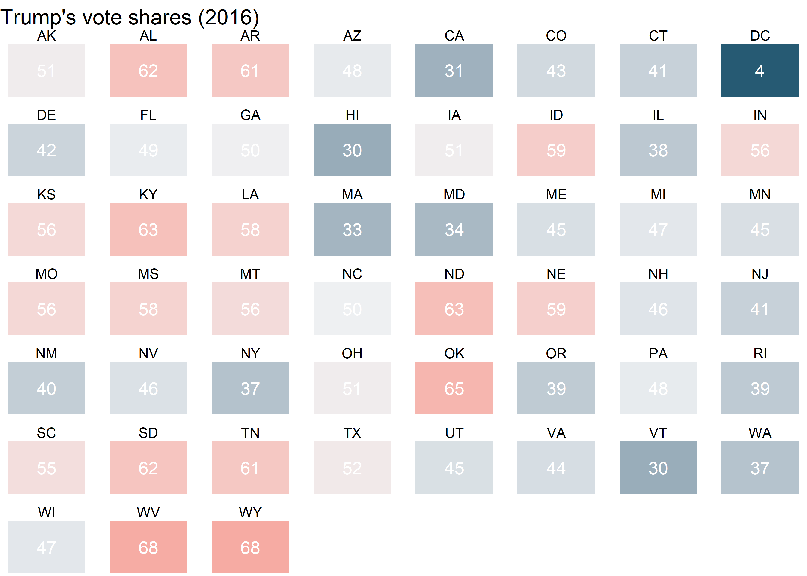

Drawing maps
================

## Goals

-   Learn how to draw maps to show distributions.
-   Get the details and scaling right.
-   Make small multiples with maps.
-   Introduce `{geofacet}`

## Maps 101

You may think maps are a unique kind of data viz. In reality, they have
a lot in common with histograms and density plots. They’re just another
way of showing distributions.

Consider the election dataset from the `{socviz}` package. If we want to
check out the distribution of something like Donald Trump’s vote margin
in 2016, we could make a histogram. This returns information about
common and less common margins observed across states.

``` r
library(tidyverse)
library(socviz)

ggplot(election) +
  aes(x = r_points) +
  geom_histogram(
    color = "black",
    fill = "gray"
  ) +
  labs(
    x = "Republican Margin",
    y = "Count",
    title = "Distribution of the Republican vote margin in states, 2016",
    caption = "Data: {socviz}"
  )
```


We alternatively could make a bar or column plot to connect specific
vote margins to states.

``` r
ggplot(election) +
  aes(x = reorder(st, r_points),
      y = r_points) +
  geom_col() +
  labs(
    x = NULL,
    y = "Republican Margin",
    title = "Distribution of the Republican vote margin in states, 2016",
    caption = "Data: {socviz}"
  ) +
  theme(
    axis.text.x = element_text(
      angle = 45, hjust = 1
    )
  )
```


Or, if you like, we could make a dot plot, and add some color:

``` r
ggplot(election) +
  aes(
    x = r_points,
    y = reorder(st, r_points),
    color = r_points > 0
  ) +
  geom_point(
    size = 3,
    show.legend = F
  ) +
  facet_wrap(
    ~ census,
    scales = "free_y"
  ) +
  labs(
    x = "Republican Margin",
    y = NULL,
    title = "Distribution of the Republican vote margin in states, 2016",
    caption = "Data: {socviz}"
  )
```


This approach helps us to see specifically how geography relates to the
distribution of Trump’s vote margin.

We can do the same thing, and do it even better, with a map. We first
need to open the `{maps}` package which contains a number of datasets
that have the coordinates necessary to draw various country maps.

``` r
library(maps)
us_states <- map_data("state")
head(us_states)
```

    ##        long      lat group order  region subregion
    ## 1 -87.46201 30.38968     1     1 alabama      <NA>
    ## 2 -87.48493 30.37249     1     2 alabama      <NA>
    ## 3 -87.52503 30.37249     1     3 alabama      <NA>
    ## 4 -87.53076 30.33239     1     4 alabama      <NA>
    ## 5 -87.57087 30.32665     1     5 alabama      <NA>
    ## 6 -87.58806 30.32665     1     6 alabama      <NA>

The `us_states` data frame contains the longitude and latitude of state
boundaries. To get ggplot to draw a map based on these values, we don’t
really need to do anything too special. We give ggplot the data, we tell
it map x and y values to longitude and latitude, and then we use a geom.
The only additional step we need to do is make sure we map the group
aesthetic to the `group` column in the data.

``` r
ggplot(us_states) +
  aes(x = long, y = lat, group = group) +
  geom_polygon(
    color = "white"
  )
```


So there’s our map of the continental US! It looks a little wonky
though. We need to update some settings so that we get the proportions
right. We do that with the `coord_map()` function. We can also make the
state boundaries thinner to improve the look of the figure.

``` r
ggplot(us_states) +
  aes(x = long, y = lat, group = group) +
  geom_polygon(
    color = "white",
    size = 0.05
  ) +
  coord_map(
    projection = "albers",
    lat0 = 39,
    lat1 = 45
  )
```


So we can draw a map…how do we connect values in the `election` data to
our `us_state` data?

We need to **cross-walk** the datasets and then use a `*_join()`
function to combine them together. There are a number of join functions.
In our case, we’re going to use `left_join()`. We’ll talk more about
joining later on. If you’re curious about what it’s doing, just run
`?left_join` in the console.

``` r
# cross-walk the data
election$region <- tolower(election$state)
  # we need a region column in election to match the column in us_states

# join the data
us_states_elec <- left_join(us_states, election)
```

Now we can make our map to show election outcomes.

``` r
ggplot(us_states_elec) +
  aes(
    x = long,
    y = lat,
    group = group,
    fill = party
  ) +
  geom_polygon(
    color = "white",
    size = 0.05
  ) +
  coord_map(
    projection = "albers",
    lat0 = 39,
    lat1 = 45
  )
```


The colors are off, of course. We’ll talk more about advanced
customization options in a few weeks. As a preview, I’ve made some of
those updates below:

``` r
library(coolorrr)
set_palette(
  binary = c("blue", "red"),
  from_coolors = F
)

ggplot(us_states_elec) +
  aes(
    x = long,
    y = lat,
    group = group,
    fill = party
  ) +
  geom_polygon(
    color = "white",
    size = 0.1
  ) +
  coord_map(
    projection = "albers",
    lat0 = 39,
    lat1 = 45
  ) +
  ggpal(
    aes = "fill",
    type = "binary"
  ) +
  labs(
    title = "Election Results (2016)",
    fill = NULL
  ) +
  theme_void() +
  theme(
    legend.position = c(0.1, 0.1),
    plot.title = element_text(hjust = 0.5)
  )
```


We can also map fill to the Republican vote margin:

``` r
ggplot(us_states_elec) +
  aes(
    x = long,
    y = lat,
    group = group,
    fill = r_points
  ) +
  geom_polygon(
    color = "white",
    size = 0.05
  ) +
  coord_map(
    projection = "albers",
    lat0 = 39,
    lat1 = 45
  )
```


Here’s a cleaned up version:

``` r
ggplot(us_states_elec) +
  aes(
    x = long,
    y = lat,
    group = group,
    fill = r_points
  ) +
  geom_polygon(
    color = "white",
    size = 0.1
  ) +
  coord_map(
    projection = "albers",
    lat0 = 39,
    lat1 = 45
  ) +
  ggpal(
    type = "diverging",
    aes = "fill",
    breaks = c(-60, -30, 0, 30, 60)
  ) +
  labs(
    title = "Election Results (2016)",
    fill = "Percent Rep. Margin"
  ) +
  theme_void() +
  theme(
    legend.position = c(0.1, 0.1),
    plot.title = element_text(hjust = 0.5)
  )
```


## Mapping US counties

We can get even more granular with our visualizations. Let’s merge
`county_map` and `county_data` from the `{socviz}` package. Using this
data we draw a map to show the distribution of county-level varaibles.

``` r
county_map_data <- left_join(county_map, county_data, "id")
```

Let’s try looking at population density. Notice that we don’t have to
use `coord_map()` to fix the proportions this time. The `county_map`
data comes to us with already pre-adjusted coordinates to draw the lines
of the map.

``` r
ggplot(county_map_data) +
  aes(x = long, y = lat, group = group,
      fill = pop / land_area) +
  geom_polygon(
    color = "white",
    size = 0.1
  )
```


Hmmm, not so great. That’s probably because population density is pretty
skewed. We can confirm that by making a histogram:

``` r
ggplot(county_data) +
  aes(x = pop / land_area) +
  geom_histogram()
```


This is a case where finding a way to make the data discrete or changing
its scale would be nice. Thankfully, we already have a column in the
data that has a discrete version of population density. We can use that
instead.

``` r
ggplot(county_map_data) +
  aes(
    x = long,
    y = lat,
    group = group,
    fill = pop_dens
  ) +
  geom_polygon(
    color = "white",
    size = 0.1
  ) 
```


Again, this is a case where we would want to make some updates to the
color palette. Here’s an example with some of those more advanced
updates.

``` r
ggplot(county_map_data) +
  aes(
    x = long,
    y = lat,
    group = group,
    fill = as.numeric(pop_dens)
  ) +
  geom_polygon(
    color = "white",
    size = 0.1
  ) +
  ggpal(
    type = "sequential",
    aes = "fill",
    labels = c("0-10", "10-50", "50-100", "100-500", "500-1K", "1K-5K", "5K+")
  ) +
  labs(
    title = "Population Density",
    fill = "Population per\nsquare mile"
  ) +
  theme_void() +
  theme(
    plot.title = element_text(hjust = 0.5)
  )
```


## Using geofacets

Maps are great, but sometimes the detail they provide is unnecessary or
even distracting. At the same time, giving a sense for how things are
organized spatially can help to communicate effectively with data.

There’s a great package called `{geofacet}` that lets us find a happy
medium.

Let’s open the package and use the `election` data to make a small
multiple with `facet_geo()`:

``` r
library(geofacet)

ggplot(election) +
  aes(
    x = st,
    y = 1,
    fill = pct_trump,
    label = round(pct_trump)
  ) +
  geom_tile(
    show.legend = F
  ) +
  geom_text(
    color = "white"
  ) +
  facet_geo(
    ~ st,
    scales = "free"
  ) +
  ggpal(
    type = "diverging",
    aes = "fill",
    midpoint = 50
  ) +
  labs(
    title = "Trump's vote shares (2016)"
  ) +
  theme_void() 
```


In the above, I used a geometry layer called `geom_tile()`. This
function tells ggplot to draw tiles (hence the name). If we didn’t facet
the plot, here’s what it would look like:

``` r
ggplot(election) +
  aes(
    x = st,
    y = 1,
    fill = pct_trump,
    label = round(pct_trump)
  ) +
  geom_tile(
    show.legend = F
  ) +
  geom_text(
    color = "white"
  ) +
  ggpal(
    type = "diverging",
    aes = "fill",
    midpoint = 50
  ) +
  labs(
    title = "Trump's vote shares (2016)"
  ) +
  theme_void()
```


Woof!

Here’s what it would look like if we just used a normal facet.

``` r
ggplot(election) +
  aes(
    x = st,
    y = 1,
    fill = pct_trump,
    label = round(pct_trump)
  ) +
  geom_tile(
    show.legend = F
  ) +
  geom_text(
    color = "white"
  ) +
  facet_wrap(
    ~ st,
    scales = "free"
  ) +
  ggpal(
    type = "diverging",
    aes = "fill",
    midpoint = 50
  ) +
  labs(
    title = "Trump's vote shares (2016)"
  ) +
  theme_void()
```



Geo-faceting is clearly the way to go for this data. You can think of
`facet_geo()` as a way to update a faceted grid based on the
geographical location of observations.

## Use small-multiples to show change over time

Above, we used small-multiples with a geographically informed
arrangement to make something like a map. We can also use
small-multiples with actual maps to show how trends evolve over time.

Here’s an example using FiveThirtyEight 2020 US Presidential election
forecasts by state. The data contains a few different columns. The unit
of observation is at the state-day level, and key outcomes of interest
include Joe Biden’s predicted vote share on a given day in a given state
and his predicted probability of winning a majority of votes in that
state. The data has been filtered down to only include predictions for
the first day of the month for September, October, and November.

``` r
url <- "https://raw.githubusercontent.com/milesdwilliams15/Teaching/main/DPR%20101/Data/538_prez_forecast_small_2020.csv"
forecast_data <- read_csv(url)
```

With the data read in, we just need to merge it with `us_state` data
which we read into R earlier.

``` r
# cross-walk the data
forecast_data$region <- tolower(usdata::abbr2state(forecast_data$state))
  # we need a region column in election to match the column in us_states

# join the data
map_forecast_data <- left_join(us_states, forecast_data)
```

We now have what we need to draw three different maps, one for the first
of September, the first of October, and the first of November. All we
need to do is make our ggplot and facet by the variable `forecast_date`.

``` r
ggplot(map_forecast_data) +
  aes(
    x = long,
    y = lat,
    group = group,
    fill = probwin
  ) +
  geom_polygon(
    color = "white",
    size = 0.1
  ) +
  facet_wrap(
    ~ forecast_date,
    ncol = 2
  ) +
   coord_map(
    projection = "albers",
    lat0 = 39,
    lat1 = 45
  ) +
  # Adding some special sauce...
  ggpal(
    type = "sequential",
    aes = "fill",
    labels = scales::percent
  ) +
  labs(
    caption = "Biden's Probability of Victory (2020)",
    fill = "% Probability"
  ) +
  theme_void() +
  theme(
    legend.position = c(0.7, 0.3),
    legend.direction = "horizontal",
    legend.title = element_text(hjust = 0.5)
  ) +
  guides(
    fill = guide_legend(title.position = "top")
  )
```


The figure shows three versions of the US map. The hue of states
corresponds with the probability that Biden wins the popular vote. Is
there much movement in FiveThirtyEight’s forecast over these three
months?
