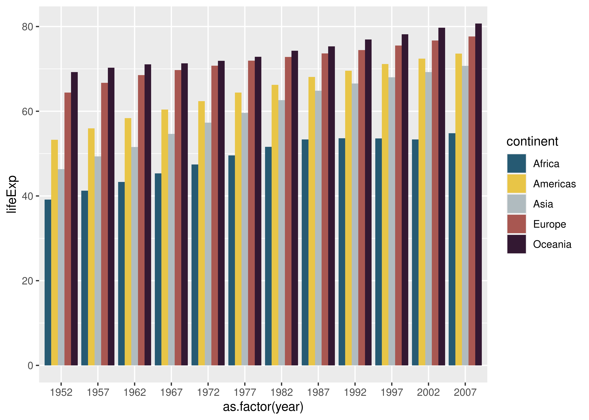

Working with {ggplot}
================

## Goals

-   Understand the logic of ggplot.
-   Think about good layering choices.
-   Know the difference between mapping and setting aesthetics.
-   Use `{coolorrr}` to map colors.
-   Use tools in `{dplyr}` to prep data for visualization.

## {ggplot}

R already comes pre-packaged with tools for data visualization. But the
`{ggplot2}` package reflects the state-of-the-art for data
visualization. Other languages wish they had this package.

At the core of the package is the `ggplot()` function. The “gg” stands
for *grammar of graphics* because it is centered around a particular
grammar or set of linguistic rules for giving R instructions about how
to build a data visualization.

This grammar has a simple logic.

1.  Tell ggplot the data you want to use.
2.  Tell it what relationships or distributions you want to see.
3.  Tell it how to show those relationships or distributions.

Each step involves its own unique set of functions.

### Step 1: Tell ggplot your data

This step generally involves using the core ggplot function, `ggplot()`.

To demonstrate, let’s use the `gapminder` dataset from the `{gapminder}`
package. If you don’t already have the package, you can install it by
writing in the R console:

    install.packages("gapminder")

Now, let’s get the data into our environment in R and open the
`{ggplot2}` package.

``` r
library(gapminder)
library(ggplot2)
```

Remember, you can use functions like `View()` or `str()` to look at the
data.

``` r
str(gapminder)
```

    ## tibble [1,704 × 6] (S3: tbl_df/tbl/data.frame)
    ##  $ country  : Factor w/ 142 levels "Afghanistan",..: 1 1 1 1 1 1 1 1 1 1 ...
    ##  $ continent: Factor w/ 5 levels "Africa","Americas",..: 3 3 3 3 3 3 3 3 3 3 ...
    ##  $ year     : int [1:1704] 1952 1957 1962 1967 1972 1977 1982 1987 1992 1997 ...
    ##  $ lifeExp  : num [1:1704] 28.8 30.3 32 34 36.1 ...
    ##  $ pop      : int [1:1704] 8425333 9240934 10267083 11537966 13079460 14880372 12881816 13867957 16317921 22227415 ...
    ##  $ gdpPercap: num [1:1704] 779 821 853 836 740 ...

The data has 1,704 country-year observations and 6 variables. Since the
data come to us from an R package, it has an associated helpfile which
provides metadata about what the dataset contains. To learn more about
it, you could write `?gapminder`.

Okay, so we have the data. Let’s give it to `ggplot()`. This is our
first step in the grammar of graphics.

``` r
ggplot(gapminder)
```


What’s going on with the output? Why is it just gray and nothing else?

We have to give ggplot more instructions. This takes us to the second
step in the ggplot workflow…

### Step 2: Tell ggplot what relationships to show

After giving ggplot data, we need to tell it what variables we want to
look at. This process is called **aesthetic mapping**. It involves
mapping (or connecting) variables to certain graphical parameters, like
x-y axes, color, shape, size, etc.

Let’s just map an x and y value with the gapminder data:

``` r
ggplot(gapminder) +
  aes(x = gdpPercap, y = lifeExp)
```


Okay, this is more than we had before. We now see some new details in
our data viz. The x-axis has a label and some tickmarks with values, so
does the y-axis, and there’s a grid layered on top of the gray
background.

But wait. What’s missing? We still haven’t told ggplot **how** to show
the relationship between the x and y variables.

### Step 3: Tell ggplot how to show relationships

The third step in the grammar of graphics is to give ggplot instructions
about the kind of geometry to draw to represent the data. To do these,
we use `geom_*()` functions—the `*` is just a place holder for the
specific geom function you might want to use. There are lots to choose
from.

For our running example, `geom_point()` is a good choice. This tells
ggplot to produce a scatter plot.

``` r
ggplot(gapminder) +
  aes(x = gdpPercap, y = lifeExp) +
  geom_point()
```


Now we’re cooking!

## Layering complexity

The three-step logic of ggplot is really simple, and you can go a long
way with data viz if these steps were all you knew. But the reason why
`{ggplot2}` has become *the* data visualization package of choice is
that it lets you do so much more. Much, much more!

You’ve already learned this from previous labs. For example, you can add
multiple geom layers and update scales:

``` r
ggplot(gapminder) +
  aes(x = gdpPercap, y = lifeExp) +
  geom_point() +
  geom_smooth() +
  scale_x_log10()
```


You can update layer settings and add custom labels.

``` r
ggplot(gapminder) +
  aes(x = gdpPercap, y = lifeExp) +
  geom_point(
    color = "gray"
  ) +
  geom_smooth(
    method = lm,
    formula = y ~ poly(x, 2)
  ) +
  scale_x_log10() +
  labs(
    x = "GDP per Capita",
    y = "Average Life Expectancy",
    title = "The relationship between wealth and longevity",
    caption = "Data: {gapminder}"
  )
```


You can get even more detailed by customizing axis tick labels and
updating the overall plot theme.

``` r
ggplot(gapminder) +
  aes(x = gdpPercap, y = lifeExp) +
  geom_point(
    color = "gray"
  ) +
  geom_smooth(
    method = lm,
    formula = y ~ poly(x, 2)
  ) +
  scale_x_log10(
    labels = scales::dollar
  ) +
  labs(
    x = "GDP per Capita",
    y = "Average Life Expectancy",
    title = "The relationship between wealth and longevity",
    caption = "Data: {gapminder}"
  ) +
  theme_light()
```


## Mapping vs setting aesthetics

A common mistake when using ggplot is to confuse mapping and setting
aesthetics. What’s the difference?

-   Mapping aesthetics is done with the `aes()` function. It entails
    connecting some plotting aesthetic like size, color, or shape with a
    variable in your data.
-   Setting aesthetics is done within other ggplot functions. It entails
    explicitly telling ggplot what size, color, or shape to use for some
    plotting element.

Say I wanted to set the color of points in a scatter plot to blue. This
works:

``` r
ggplot(gapminder) +
  aes(x = gdpPercap, y = lifeExp) +
  geom_point(
    color = "blue"
  )
```


This doesn’t:

``` r
ggplot(gapminder) +
  aes(x = gdpPercap, y = lifeExp, color = "blue") +
  geom_point()
```


Do you see what happened? By setting `color = "blue"` inside `aes()`
what I effectively did was tell ggplot to map a new categorical variable
where each value is “blue” to the color aesthetic. Ggplot then made the
executive decision to map the category “blue” to the color red. It then
included a legend that faithfully reports how ggplot did the aesthetic
mapping.

## Updating default aesthetic mappings

You’ll have noticed by now that when you map variables to aesthetics,
ggplot decides for you what colors, shapes, or sizes to use. You don’t
have to use these defaults if you’d rather use something else.

Say I want to map fill to continent when showing life expectancy over
time:

``` r
ggplot(gapminder) +
  aes(x = as.factor(year), y = lifeExp, fill = continent) +
  geom_bar(
    position = "dodge", # put the bars side-by-side
    stat = "summary",   # summarize the data
    fun.y = mean        # use mean() to summarize
  )
```


I can update the color palette manually by using the `scale_fill_manual`
function:

``` r
ggplot(gapminder) +
  aes(x = as.factor(year), y = lifeExp, fill = continent) +
  geom_bar(
    position = "dodge", # put the bars side-by-side
    stat = "summary",   # summarize the data
    fun.y = mean        # use mean() to summarize
  ) +
  scale_fill_manual(
    values = c(
      "blue",
      "gray",
      "red",
      "gold",
      "brown"
    )
  )
```


I admit, I could have picked a better palette. But it’s clear,
nonetheless, how it’s done.

Depending on the aesthetic you’re dealing with, you’ll need to use the
appropriate `scale_*()` function. You can read more about the best
strategies here:
[http://www.sthda.com/english/wiki/ggplot2-colors-how-to-change-colors-automatically-and-manually](ggplot2%20Colors:%20How%20to%20Change%20Colors%20Automatically%20and%20Manually).

## Using {coolorrr} for color and fill mapping

When it comes to mapping color and fill aesthetics, I personally dislike
most of the existing options. That’s why I created the
[`{coolorrr}`](https://github.com/milesdwilliams15/coolorrr) package.
This package lets you globally set four different kinds of palettes
based on your needs using palettes you either set on your own or that
you create at the free-to-use generator at
[coolors.co](https://coolors.co/).

Here’s how to install the package:

    install.packages("devtools")
    devtools::install_github("milesdwilliams15/coolorrr")

After you run that, you can open the `{coolorrr}` package like any other
R package using `library()`.

Here’s an example of how to use it to update a discrete (or qualitative)
palette to use with the gapminder data.

First, with `{ggplot2}` already open, open the `{coolorrr}` package:

``` r
library(coolorrr)
```

Then, go to coolors.co and pick a five color palette. When you find one
you like, copy the url and give it to the function `set_palette()`:

``` r
set_palette(
  qualitative = "https://coolors.co/2e4057-66a182-caffb9-aef78e-c0d461"
)
```

You now have an object in R’s environment called `qual` which is your
five color palette you selected at coolors.co. If you call it, you can
see that it’s just a vector of the color codes unique to the palette you
picked:

``` r
qual
```

    ## [1] "#2e4057" "#66a182" "#caffb9" "#aef78e" "#c0d461"

To use it with ggplot, all you need to do is call it using the `ggpal()`
function like so:

``` r
ggplot(gapminder) +
  aes(x = as.factor(year), y = lifeExp, fill = continent) +
  geom_bar(
    position = "dodge",
    stat = "summary",
    fun.y = mean
  ) +
  ggpal(
    type = "qualitative",
    aes = "fill"
  )
```


There are four kinds of palettes you can create with `{coolorrr}`.

-   Qualitative: For discrete, unordered categories.
-   Sequential: For ordered categories or numerical data.
-   Diverging: For numerical data that has a mid-point.
-   Binary: For discrete categories with just two unique values.

For each one, you can set it like I did with the qualitative palette
above. If you don’t set them, `set_theme()` uses defaults. For example,
if I run the function again and don’t use the theme I got from
coolors.co, the qualitative palette will revert back to the default:

``` r
set_palette()
ggplot(gapminder) +
  aes(x = as.factor(year), y = lifeExp, fill = continent) +
  geom_bar(
    position = "dodge",
    stat = "summary",
    fun.y = mean
  ) +
  ggpal(
    type = "qualitative",
    aes = "fill"
  ) 
```



Here’s an example setting two palettes, but where one comes from
coolors.co and the other I’ve just picked manually:

``` r
set_palette(
  qualitative = c("royalblue", "firebrick", "forestgreen", "gold", "orange"),
  binary = coolors("https://coolors.co/ee6352-08b2e3"),
  from_coolors = FALSE
)
```

When using “mixed” palettes, you set `from_coolors = FALSE` and then you
use the `coolors()` function on a coolors.co url.

A final feature of the `{coolorrr}` package is that it comes with its
own ggplot theme. You can set this globally using the `set_theme()`
function. After you run this once, each subsequent plot you make with
ggplot will use this theme rather than the default:

``` r
set_theme()
  # set the theme

# the plot conforms to the new theme
ggplot(gapminder) +
  aes(x = as.factor(year), y = lifeExp, fill = continent) +
  geom_bar(
    position = "dodge",
    stat = "summary",
    fun.y = mean
  ) +
  ggpal(
    type = "qualitative",
    aes = "fill"
  ) 
```


Now this plot will match the new theme, too:

``` r
ggplot(gapminder) +
  aes(x = gdpPercap, y = lifeExp) +
  geom_point(
    color = "gray",
    alpha = 0.5
  ) +
  geom_smooth(
    method = "gam",
    se = F,
    aes(color = continent)
  ) +
  scale_x_log10(
    labels = scales::dollar
  ) +
  ggpal(
    type = "qualitative",
    aes = "color"
  ) +
  labs(
    x = "GDP per capita",
    y = "Average life expectancy",
    title = "Relationship between wealth and life expectancy",
    caption = "Data: {gapminder}",
    color = NULL
  )
```


## Prep data before plotting with {dplyr}

In some of the examples above, we used the `geom_bar()` function to show
mean life expectancy per region by year. Under the hood, this function
transformed the data and summarized it by mean for us.

It’s great to know that some ggplot functions will do this for us, but I
find it makes more sense to get familiar with doing these kinds of
transformations *before* giving the data the ggplot.

``` r
library(dplyr)
smry_dt <- gapminder %>%
  group_by(year, continent) %>%
  summarize(
    lifeExp = mean(lifeExp)
  )

ggplot(smry_dt) +
  aes(x = year, y = lifeExp, color = continent) +
  geom_line(
    size = 0.75
  ) +
  ggpal(
    type = "qualitative",
    aes = "color"
  ) +
  labs(
    x = NULL,
    y = "Average life expectancy",
    title = "Life expectancy over time",
    caption = "Data: {gapminder}"
  )
```


The advantage of this approach is that you can use a wide variety of
geoms without the need to figure out which functions you would otherwise
have to use to make the transformations for you “under the hood.”
