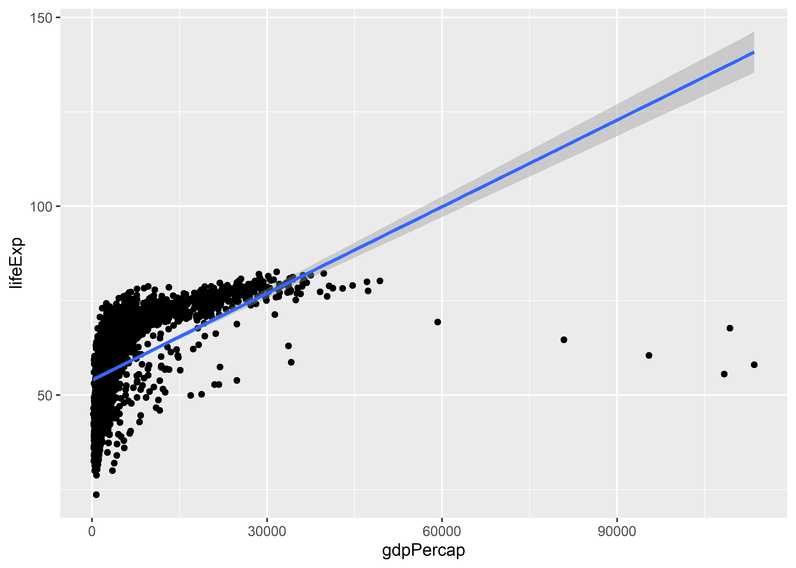

Linear Regression and Prediction, Part 1
================

-   [Goals](#goals)
-   [Linear Regression](#linear-regression)
-   [Estimating the Parameters of a Regression
    Model](#estimating-the-parameters-of-a-regression-model)

## Goals

-   Provide intuition for linear regression
-   Differentiate a *model* from an *estimator*
-   Use a linear model to summarize the relationship between variables
-   Use a linear model to make predictions

## Linear Regression

A linear regression model is a way of representing a data-generating
process or DGP. A linear regression model in particular represents the
relationship between an outcome variable and one or more explanatory
variables as a linear function.

If you have taken linear algebra, you’ll be familiar with the equation:

*y = mx + b*

-   *y* and *x*: These are variables.
-   *m*: This is the slope. It tells us how the value of *y* changes per
    a unit change in *x*.
-   *b*: This is the intercept. It tells us the value of *y* when *x =
    0*.

A linear regression model has a similar form. The main difference is the
inclusion of an *error term*:

.

The parameters and variables have slightly different interpretations
now.

-   
    and
    :
    The variables where
    
    is a subscript that alters us to the fact that there are different
    values of the variables for individual observations in our data.
-   :
    This is the slope. It tells us the average change in
    
    per a unit change in
    .
-   :
    This is the intercept. It tells us the average of
    
    when
    .
-   :
    Variation in
    
    not explained as a linear function of
    .

## Estimating the Parameters of a Regression Model

A linear model has known and unknown parameters. The values of the
variables are known (except for the error term), while the values of the
slope and intercept are unknown.

The process of *identifying* the unknown parameters is called model
fitting. This is where we try to find the slope and intercept values
that make the most sense given the data.

The default way we do this in R is with a method called ordinary least
squares or OLS. OLS is an *estimator*, a rule or criterion that defines
what the best values of the unknown parameters are. In the case of OLS,
the rule is that the values must minimize the following:

![\\sum_i\[y_i - (\\alpha + \\beta x_i)\]^2](https://latex.codecogs.com/png.image?%5Cdpi%7B110%7D&space;%5Cbg_white&space;%5Csum_i%5By_i%20-%20%28%5Calpha%20%2B%20%5Cbeta%20x_i%29%5D%5E2 "\sum_i[y_i - (\alpha + \beta x_i)]^2")

The values of

are the observed values of the outcome variable. The part in
(parentheses) is our linear prediction for the values of

which we get by selecting values for the slope and intercept.

The set of differences between the observed outcome and its prediction
is called the *residual*. We usually denote that by writing something
like this:

.

The

notation is used to tell us that a value is a fitted value. Before a
model is fit, we don’t use this notation to indicate that the unknown
quantities are still theoretical.

Here’s the original model:

.

Here’s the fitted model:

.

OLS is used to identify the best values for the slope and intercept.
When you produce a scatter plot with ggplot and add a linear regression
line to it, this is what ggplot is doing under the hood.

Let’s take the `gapminder` dataset from the `{gapminder}` package and do
just that:

``` r
library(ggplot2)
library(gapminder)

ggplot(gapminder) +
  aes(x = gdpPercap, y = lifeExp) +
  geom_point() +
  geom_smooth(method = lm)
```



Looking at this, do you think a linear model is a good fit for the data?

Whether you do or not, R is as obedient as ever. If we want to see the
values behind the plot, we can use the `lm()` function like so:

``` r
lm(lifeExp ~ gdpPercap, data = gapminder)
```

    ## 
    ## Call:
    ## lm(formula = lifeExp ~ gdpPercap, data = gapminder)
    ## 
    ## Coefficients:
    ## (Intercept)    gdpPercap  
    ##   5.396e+01    7.649e-04

The output tells us a few things. It gives us some information about the
model we fit. It then gives us the estimated *coefficients* for the
model. These are the intercept and slope respectively.

If we want to get some more detailed information about the model, we can
save it as an object and then use the `summary()` function to get some
more details:

``` r
fit1 <- lm(lifeExp ~ gdpPercap, data = gapminder)
summary(fit1)
```

    ## 
    ## Call:
    ## lm(formula = lifeExp ~ gdpPercap, data = gapminder)
    ## 
    ## Residuals:
    ##     Min      1Q  Median      3Q     Max 
    ## -82.754  -7.758   2.176   8.225  18.426 
    ## 
    ## Coefficients:
    ##              Estimate Std. Error t value Pr(>|t|)    
    ## (Intercept) 5.396e+01  3.150e-01  171.29   <2e-16 ***
    ## gdpPercap   7.649e-04  2.579e-05   29.66   <2e-16 ***
    ## ---
    ## Signif. codes:  0 '***' 0.001 '**' 0.01 '*' 0.05 '.' 0.1 ' ' 1
    ## 
    ## Residual standard error: 10.49 on 1702 degrees of freedom
    ## Multiple R-squared:  0.3407, Adjusted R-squared:  0.3403 
    ## F-statistic: 879.6 on 1 and 1702 DF,  p-value: < 2.2e-16

There’s a lot more going on now. The `summary()` function reports
numerous test statistics for the linear model. Importantly, it
summarizes for us whether there is a statistically detectible linear
relationship between the outcome and the explanatory variable. It also
gives us information at the bottom about the overall quality of the fit.

The F-statistic at the bottom, for example, is used to tell us whether
the linear model with `gdpPercap` as a predictor does better than a
“null” model that has no predictors whatsoever. It’s testing the null
hypothesis that our model does no better than random chance would
suggest. In this case, we can reject the null.

It also reports an R^2 value. This has direct correspondence with
correlation. It tells us the share of the variation in the outcome that
is explained by the regression model. We usually look at the adjusted
version of the R^2 because this takes into acount the number of
variables we use to predict an outcome.
