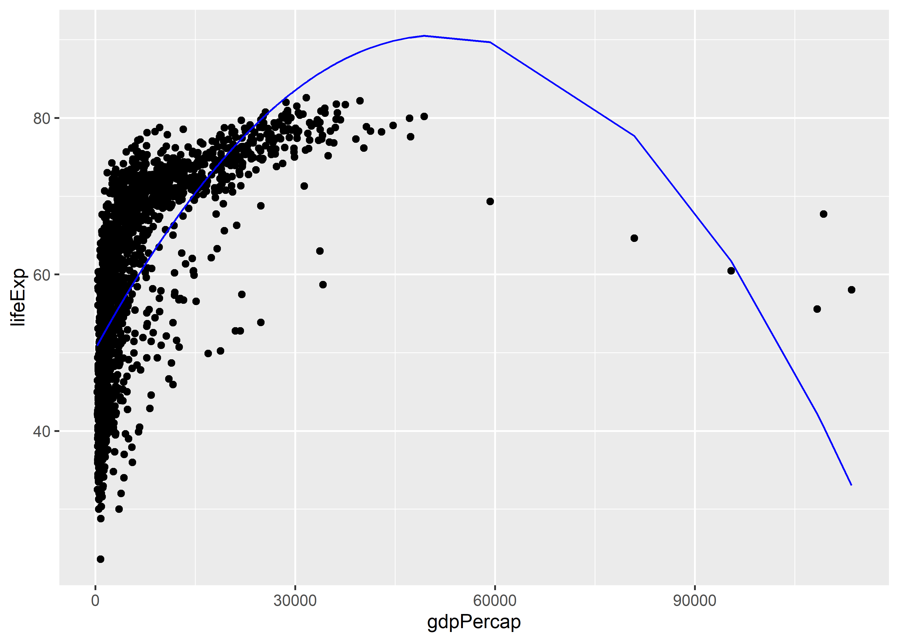
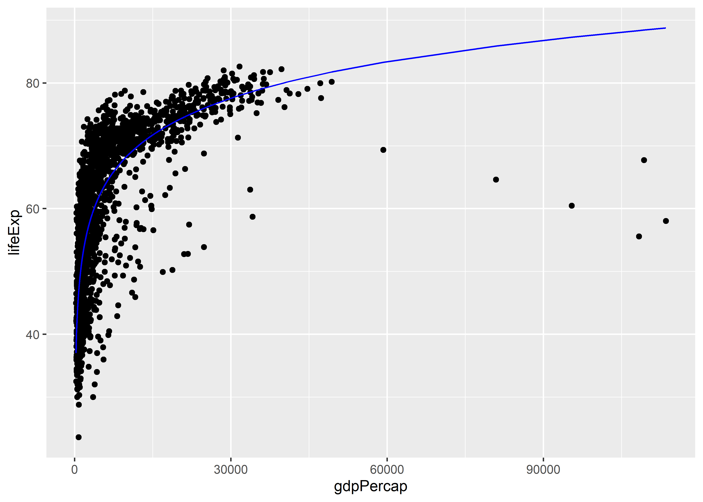
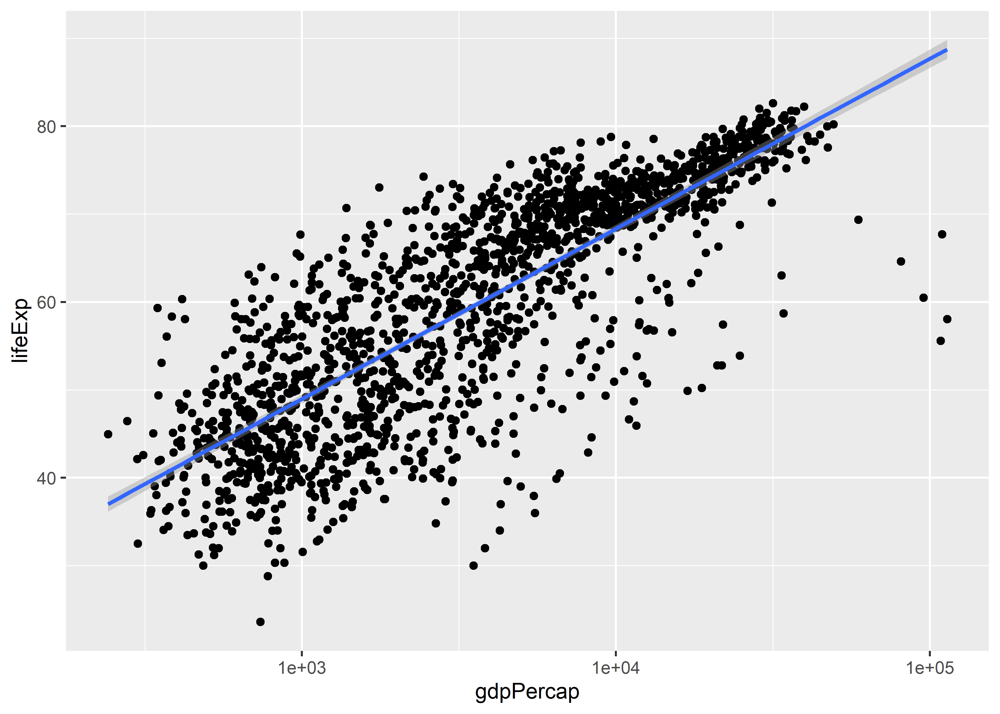
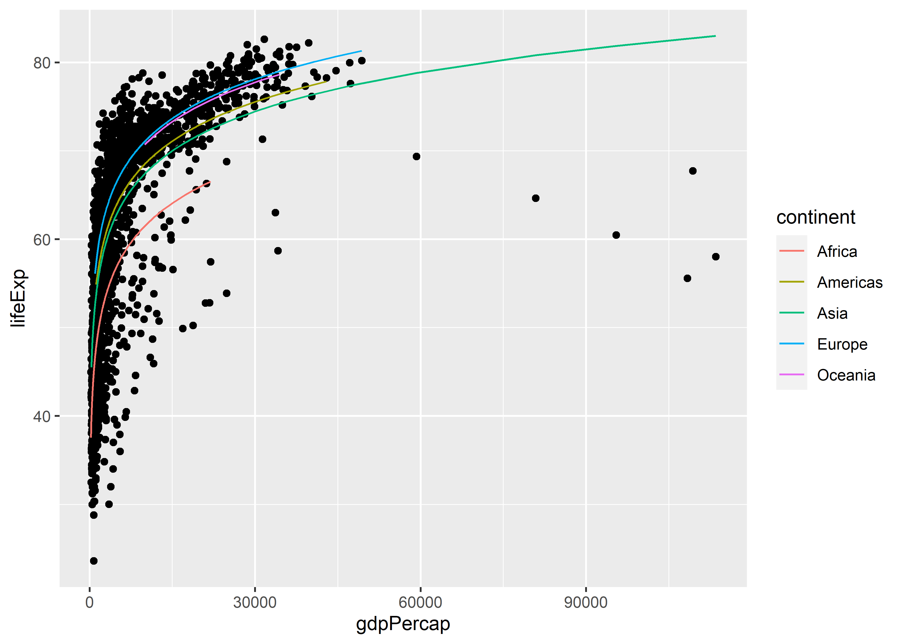
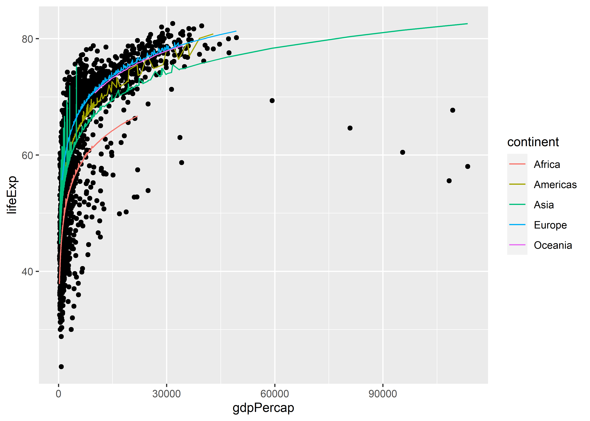

Multiple Regression and Model Selection
================

-   [Goals](#goals)
-   [Multiple Regression](#multiple-regression)
-   [How to describe relationships?](#how-to-describe-relationships)
-   [Making predictions with multiple
    regression](#making-predictions-with-multiple-regression)
-   [Occam’s Razor and avoiding
    over-fitting](#occams-razor-and-avoiding-over-fitting)
-   [Other model evaulation tools](#other-model-evaulation-tools)
    -   [Stepwise regression](#stepwise-regression)
    -   [Linear hypothesis testing](#linear-hypothesis-testing)

## Goals

-   Introduce *multiple* regression models for description, prediction,
    and causal inference.
-   Talk about methods for comparing models.

## Multiple Regression

Last time we talked about simple linear regression models. Multiple
regression models are similar except that they include multiple
explanatory variables.

Instead of a model that looks like this:

.

We have a model that looks like this:

.

We can easily build on the simple linear model we talked about last time
with some additional columns in the gapminder data:

``` r
library(gapminder)
fit1 <- lm(lifeExp ~ gdpPercap, data = gapminder)
```

The above object is a fitted linear model of life expectancy as a
function of GDP per capita. If we take the summary of it, we can check
the overall model performance:

``` r
summary(fit1)
```

    ## 
    ## Call:
    ## lm(formula = lifeExp ~ gdpPercap, data = gapminder)
    ## 
    ## Residuals:
    ##     Min      1Q  Median      3Q     Max 
    ## -82.754  -7.758   2.176   8.225  18.426 
    ## 
    ## Coefficients:
    ##              Estimate Std. Error t value Pr(>|t|)    
    ## (Intercept) 5.396e+01  3.150e-01  171.29   <2e-16 ***
    ## gdpPercap   7.649e-04  2.579e-05   29.66   <2e-16 ***
    ## ---
    ## Signif. codes:  0 '***' 0.001 '**' 0.01 '*' 0.05 '.' 0.1 ' ' 1
    ## 
    ## Residual standard error: 10.49 on 1702 degrees of freedom
    ## Multiple R-squared:  0.3407, Adjusted R-squared:  0.3403 
    ## F-statistic: 879.6 on 1 and 1702 DF,  p-value: < 2.2e-16

We can look at the output and see that the model captures about 34% of
the variation in life expectancy across countries over time. Could we do
better by including more variables?

We could first riff on our original model by adding polynomial terms
with the `poly()` function:

``` r
fit2 <- lm(lifeExp ~ poly(gdpPercap, 2), data = gapminder)
summary(fit2)
```

    ## 
    ## Call:
    ## lm(formula = lifeExp ~ poly(gdpPercap, 2), data = gapminder)
    ## 
    ## Residuals:
    ##      Min       1Q   Median       3Q      Max 
    ## -28.0600  -6.4253   0.2611   7.0889  27.1752 
    ## 
    ## Coefficients:
    ##                      Estimate Std. Error t value Pr(>|t|)    
    ## (Intercept)           59.4744     0.2152  276.31   <2e-16 ***
    ## poly(gdpPercap, 2)1  311.1479     8.8852   35.02   <2e-16 ***
    ## poly(gdpPercap, 2)2 -230.3180     8.8852  -25.92   <2e-16 ***
    ## ---
    ## Signif. codes:  0 '***' 0.001 '**' 0.01 '*' 0.05 '.' 0.1 ' ' 1
    ## 
    ## Residual standard error: 8.885 on 1701 degrees of freedom
    ## Multiple R-squared:  0.5274, Adjusted R-squared:  0.5268 
    ## F-statistic: 949.1 on 2 and 1701 DF,  p-value: < 2.2e-16

This model has two slope coefficients. One for GDP per capita, and one
for GDP per capita squared. Just like a simple linear regression model
is like the simple equation for a like:

*y = mx + b*

this new regression model has a form more like:

*y = mx + dx^2 + b*

This is a quadratic equation.

If we look at the summary of the model, we can see a big improvement in
the R^2! A quadratic equation appears to do a much better job of fitting
the data than a simple linear equation. We can check this by looking at
the model predictions relative to the observed data:

``` r
library(ggplot2)
ggplot(gapminder) +
  aes(x = gdpPercap, y = lifeExp) +
  geom_point() +
  geom_line(
    aes(y = predict(fit2)),
    color = "blue"
  )
```



This example shows just how flixible linear models can be. They can be
adapted to accomodate all kinds of *nonlinear* relationships.

Here’s another example:

``` r
fit3 <- lm(lifeExp ~ log(gdpPercap), data = gapminder)
summary(fit3)
```

    ## 
    ## Call:
    ## lm(formula = lifeExp ~ log(gdpPercap), data = gapminder)
    ## 
    ## Residuals:
    ##     Min      1Q  Median      3Q     Max 
    ## -32.778  -4.204   1.212   4.658  19.285 
    ## 
    ## Coefficients:
    ##                Estimate Std. Error t value Pr(>|t|)    
    ## (Intercept)     -9.1009     1.2277  -7.413 1.93e-13 ***
    ## log(gdpPercap)   8.4051     0.1488  56.500  < 2e-16 ***
    ## ---
    ## Signif. codes:  0 '***' 0.001 '**' 0.01 '*' 0.05 '.' 0.1 ' ' 1
    ## 
    ## Residual standard error: 7.62 on 1702 degrees of freedom
    ## Multiple R-squared:  0.6522, Adjusted R-squared:  0.652 
    ## F-statistic:  3192 on 1 and 1702 DF,  p-value: < 2.2e-16

Wow! This one does even better than the quadratic equation. This one
specifies a very special form of the relationship between life
expectancy and GDP per capita:

.

This is a non-linear equation. Specifically, it indicates an exponential
relationship. But as a testament to the adaptability of linear
regression, by simply taking the natural log of GDP per capita, the
model can be specified as a linear equation:

 = \log(\alpha) + \beta \log(\text{gdpPercap}_i) + \log(\epsilon_i)").

We can check how well this fits to the data, too:

``` r
ggplot(gapminder) +
  aes(x = gdpPercap, y = lifeExp) +
  geom_point() +
  geom_line(
    aes(y = predict(fit3)),
    color = "blue"
  )
```



FYI, this would be equivalent to producing a plot where the x-axis has
been log-transformed and we produce a linear regression line with the
updated scaling for the data:

``` r
ggplot(gapminder) +
  aes(x = gdpPercap, y = lifeExp) +
  geom_point() +
  geom_smooth(
    method = lm
  ) +
  scale_x_log10()
```



We aren’t limited to variations on functional form using a single
predictor variable. We can add multiple predictor variables as well
using the `+` operator in our formula object:

``` r
fit4 <- lm(lifeExp ~ log(gdpPercap) + continent, data = gapminder)
summary(fit4)
```

    ## 
    ## Call:
    ## lm(formula = lifeExp ~ log(gdpPercap) + continent, data = gapminder)
    ## 
    ## Residuals:
    ##      Min       1Q   Median       3Q      Max 
    ## -27.1163  -3.4739   0.4336   4.3519  18.5632 
    ## 
    ## Coefficients:
    ##                   Estimate Std. Error t value Pr(>|t|)    
    ## (Intercept)         2.3170     1.3594   1.704   0.0885 .  
    ## log(gdpPercap)      6.4220     0.1835  35.003  < 2e-16 ***
    ## continentAmericas   7.0147     0.5544  12.652  < 2e-16 ***
    ## continentAsia       5.9117     0.4768  12.400  < 2e-16 ***
    ## continentEurope     9.5771     0.6041  15.855  < 2e-16 ***
    ## continentOceania    9.2135     1.5359   5.999 2.42e-09 ***
    ## ---
    ## Signif. codes:  0 '***' 0.001 '**' 0.01 '*' 0.05 '.' 0.1 ' ' 1
    ## 
    ## Residual standard error: 7.038 on 1698 degrees of freedom
    ## Multiple R-squared:  0.704,  Adjusted R-squared:  0.7031 
    ## F-statistic: 807.6 on 5 and 1698 DF,  p-value: < 2.2e-16

That R^2 is getting pretty darn high. This model explains more than 70%
of the variation in life expectancy. The above model in particular
includes multiple coefficients estimated by all but one of the values
for the `continent` variable in the data. When we give `lm` a variable
that is a category, by default it drops one of the categories and treats
it as a referent category. That is, it gets absorbed in the model’s
intercept term. Each of the coefficients on the remaining categories
then tells us how the intercept changes depending on the category the
observations fall into.

Observe:

``` r
ggplot(gapminder) +
  aes(x = gdpPercap, y = lifeExp) +
  geom_point() +
  geom_line(
    aes(y = predict(fit4),
        color = continent)
  )
```



For each region, we now have a separate line produced for each group.
The slope on GDP per capita is the same, but there is now a different
intercept per region.

Plotting our results like this starts to become trickier the more
variables we add. For example check out what happens if we add a
continuous variable like population into the mix:

``` r
fit5 <- lm(lifeExp ~ log(gdpPercap) + pop + continent, data = gapminder)
summary(fit5)
```

    ## 
    ## Call:
    ## lm(formula = lifeExp ~ log(gdpPercap) + pop + continent, data = gapminder)
    ## 
    ## Residuals:
    ##      Min       1Q   Median       3Q      Max 
    ## -26.7090  -3.4832   0.4396   4.4062  18.6914 
    ## 
    ## Coefficients:
    ##                    Estimate Std. Error t value Pr(>|t|)    
    ## (Intercept)       1.476e+00  1.352e+00   1.091    0.275    
    ## log(gdpPercap)    6.524e+00  1.824e-01  35.778  < 2e-16 ***
    ## pop               9.990e-09  1.650e-09   6.056 1.72e-09 ***
    ## continentAmericas 6.729e+00  5.507e-01  12.218  < 2e-16 ***
    ## continentAsia     5.157e+00  4.880e-01  10.567  < 2e-16 ***
    ## continentEurope   9.290e+00  5.997e-01  15.491  < 2e-16 ***
    ## continentOceania  8.965e+00  1.521e+00   5.896 4.49e-09 ***
    ## ---
    ## Signif. codes:  0 '***' 0.001 '**' 0.01 '*' 0.05 '.' 0.1 ' ' 1
    ## 
    ## Residual standard error: 6.965 on 1697 degrees of freedom
    ## Multiple R-squared:  0.7102, Adjusted R-squared:  0.7092 
    ## F-statistic: 693.3 on 6 and 1697 DF,  p-value: < 2.2e-16

``` r
ggplot(gapminder) +
  aes(x = gdpPercap, y = lifeExp) +
  geom_point() +
  geom_line(
    aes(y = predict(fit5),
        color = continent)
  )
```



The fact that our regression is fit using population as well makes it
much harder show the lines of best fit with simple x-y coordinates.

Under the hood, the lines of best fit are actually hyperplanes of best
fit. To show these, we actually need to plot the data in 3 dimensions
rather than just 2.

## How to describe relationships?

With multiple regression, interpretation of coefficients becomes more
conditional or *marginal*. Rather than each telling us the simple linear
relationship between an outcome and a predictor, each tells us the
marginal relationship between an outcome and a predictor after
subtracting out the linear relationship between any other predictors in
the model with the outcome and the predictor of interest.

This is probably the most unintuitive part of multiple regression, so
we’ll walk through a simple example. This is easiest to do using the
continent variable.

First, we’re going to group the data by continent and then make
continent specific versions of GDP per capita and life expectancy that
are *mean centered*. That means that we’re centering the variables
around their continent-specific averages:

``` r
library(dplyr)
gapminder <- gapminder %>%
  group_by(continent) %>%
  mutate(
    gdpPercap_cen = gdpPercap - mean(gdpPercap),
    lifeExp_cen = lifeExp - mean(lifeExp)
  ) %>%
  ungroup()
```

Next, we’ll estimate two regression models. The first is a multiple
regression model where we estimate the relationship between life
expectancy and GDP per capita while *adjusting* for continent/regional
membership:

``` r
mult_reg <- lm(lifeExp ~ gdpPercap + continent, data = gapminder)
```

The second will be a simple regression model where the already
mean-centered life expectancy is regressed on the already mean-centered
GDP per capita:

``` r
simp_reg <- lm(lifeExp_cen ~ gdpPercap_cen, data = gapminder)
```

Check out the slopes estimated for GDP per capita for each model:

``` r
coef(mult_reg)[2]
```

    ##    gdpPercap 
    ## 0.0004452704

``` r
coef(simp_reg)[2]
```

    ## gdpPercap_cen 
    ##  0.0004452704

They’re identical. Note that these slopes are not the same as what we’d
estimate from the following model:

``` r
lm(lifeExp ~ gdpPercap, data = gapminder) %>%
  coef() %>%
  .[2]
```

    ##    gdpPercap 
    ## 0.0007648826

This is where the *multiple* regression part of multiple regression
comes in. We essentially are estimating multiple linear regression
models within linear regression models.

Here’s another example controlling for population. First, here’s the
multiple regression specification:

``` r
mult_reg <- lm(lifeExp ~ gdpPercap + pop, data = gapminder)
```

And here’s how we get to the same place using multiple simple linear
regressions:

``` r
simp_reg1 <- lm(lifeExp ~ pop, data = gapminder)
simp_reg2 <- lm(gdpPercap ~ pop, data = gapminder)
simp_reg3 <- lm(resid(simp_reg1) ~ resid(simp_reg2))
```

Now check the slopes for GDP per capita:

``` r
coef(mult_reg)[2]
```

    ##    gdpPercap 
    ## 0.0007675646

``` r
coef(simp_reg3)[2]
```

    ## resid(simp_reg2) 
    ##     0.0007675646

These are identical. When we use multiple regression to get the marginal
slope estimate for a variable while controlling for other variables in
the model, it’s mathematically equivalent to estimate three simple
regression models. We first estimate a model where life expectancy is
just a simple linear function of population. We then estimate a model
where GDP per capita is a simple linear function of population. And then
we estimate a model where the *residual* variation in life expectancy
from the first model is a linear function of the residual variation in
GDP per capita from the second model.

We get that residual variation using the `resid()` function. The
residuals are just the unexplained variation in an outcome variable
after fitting a linear regression model.

## Making predictions with multiple regression

Just like with simple regression models, we can make predictions using
multiple regression models. The process of making predictions can
actually be a useful way to benchmark the performance of different
models. For instance, let’s compare the following three models:

``` r
pre_2007 <- gapminder %>% filter(year < 2007)
for_2007 <- gapminder %>% filter(year == 2007)

fit1 <- lm(lifeExp ~ gdpPercap, data = pre_2007)
fit2 <- lm(lifeExp ~ poly(gdpPercap, 2), data = pre_2007)
fit3 <- lm(lifeExp ~ log(gdpPercap), data = pre_2007)
```

And now, let’s get the predictions from each model:

``` r
pred1 <- predict(fit1, for_2007)
pred2 <- predict(fit2, for_2007)
pred3 <- predict(fit3, for_2007)
```

And then let’s check the prediction accuracy of each:

``` r
for_2007 %>%
  summarize(
    fit1_R2 = cor(lifeExp, pred1)^2,
    fit2_R2 = cor(lifeExp, pred2)^2,
    fit3_R2 = cor(lifeExp, pred3)^2
  )
```

    ## # A tibble: 1 × 3
    ##   fit1_R2 fit2_R2 fit3_R2
    ##     <dbl>   <dbl>   <dbl>
    ## 1   0.461   0.528   0.654

Remember that these diagnostics are not the end-all be-all for model
evaluation. But we can at minimum use these to compare relative model
performance. In this case, are comparing three alternative functional
forms for the data and how predictive models based on those forms
translate to new predictions. Based on the above, a linear-log model
does better than a quadratic model, and a quadratic model does better
than a linear model.

Say on the basis of this we decide that we will build on the linear-log
model, but we want to keep improving our predictions. We’ll do three
additional models. We’ll try a model that controls for the log of
population, of continents, and of the log of population and continents
together:

``` r
fit4 <- lm(lifeExp ~ log(gdpPercap) + log(pop), data = pre_2007)
fit5 <- lm(lifeExp ~ log(gdpPercap) + continent, data = pre_2007)
fit6 <- lm(lifeExp ~ log(gdpPercap) + log(pop) + continent,
           data = pre_2007)
```

Let’s check out the predictive performance of these models:

``` r
pred4 <- predict(fit4, for_2007)
pred5 <- predict(fit5, for_2007)
pred6 <- predict(fit6, for_2007)

for_2007 %>%
  summarize(
    fit3_R2 = cor(lifeExp, pred3)^2,
    fit4_R2 = cor(lifeExp, pred4)^2,
    fit5_R2 = cor(lifeExp, pred5)^2,
    fit6_R2 = cor(lifeExp, pred6)^2
  )
```

    ## # A tibble: 1 × 4
    ##   fit3_R2 fit4_R2 fit5_R2 fit6_R2
    ##     <dbl>   <dbl>   <dbl>   <dbl>
    ## 1   0.654   0.664   0.736   0.731

Amazingly, this example shows that more does not always equal better.
Adding the log of population as a predictor actually makes the model’s
predictions slightly *worse*.

This is surprising, because if we just look at the original fits we can
see that the log of population has a significant relationship with life
expectancy in the pre-2007 data and that these models have *better* R^2
values:

``` r
summary(fit3)
```

    ## 
    ## Call:
    ## lm(formula = lifeExp ~ log(gdpPercap), data = pre_2007)
    ## 
    ## Residuals:
    ##     Min      1Q  Median      3Q     Max 
    ## -32.517  -4.095   1.143   4.697  19.641 
    ## 
    ## Coefficients:
    ##                Estimate Std. Error t value Pr(>|t|)    
    ## (Intercept)     -9.6117     1.2856  -7.476 1.27e-13 ***
    ## log(gdpPercap)   8.4267     0.1566  53.805  < 2e-16 ***
    ## ---
    ## Signif. codes:  0 '***' 0.001 '**' 0.01 '*' 0.05 '.' 0.1 ' ' 1
    ## 
    ## Residual standard error: 7.563 on 1560 degrees of freedom
    ## Multiple R-squared:  0.6498, Adjusted R-squared:  0.6496 
    ## F-statistic:  2895 on 1 and 1560 DF,  p-value: < 2.2e-16

``` r
summary(fit4)
```

    ## 
    ## Call:
    ## lm(formula = lifeExp ~ log(gdpPercap) + log(pop), data = pre_2007)
    ## 
    ## Residuals:
    ##      Min       1Q   Median       3Q      Max 
    ## -28.6079  -4.2101   0.7284   4.6562  17.7439 
    ## 
    ## Coefficients:
    ##                Estimate Std. Error t value Pr(>|t|)    
    ## (Intercept)    -28.8585     2.1603  -13.36   <2e-16 ***
    ## log(gdpPercap)   8.3718     0.1511   55.40   <2e-16 ***
    ## log(pop)         1.2527     0.1151   10.88   <2e-16 ***
    ## ---
    ## Signif. codes:  0 '***' 0.001 '**' 0.01 '*' 0.05 '.' 0.1 ' ' 1
    ## 
    ## Residual standard error: 7.293 on 1559 degrees of freedom
    ## Multiple R-squared:  0.6745, Adjusted R-squared:  0.6741 
    ## F-statistic:  1616 on 2 and 1559 DF,  p-value: < 2.2e-16

``` r
summary(fit5)
```

    ## 
    ## Call:
    ## lm(formula = lifeExp ~ log(gdpPercap) + continent, data = pre_2007)
    ## 
    ## Residuals:
    ##      Min       1Q   Median       3Q      Max 
    ## -26.2788  -3.4825   0.4501   4.3589  18.2597 
    ## 
    ## Coefficients:
    ##                   Estimate Std. Error t value Pr(>|t|)    
    ## (Intercept)         2.4379     1.4191   1.718    0.086 .  
    ## log(gdpPercap)      6.3497     0.1922  33.036  < 2e-16 ***
    ## continentAmericas   6.9368     0.5723  12.120  < 2e-16 ***
    ## continentAsia       5.7905     0.4901  11.815  < 2e-16 ***
    ## continentEurope     9.9791     0.6225  16.031  < 2e-16 ***
    ## continentOceania    9.5132     1.5848   6.003 2.41e-09 ***
    ## ---
    ## Signif. codes:  0 '***' 0.001 '**' 0.01 '*' 0.05 '.' 0.1 ' ' 1
    ## 
    ## Residual standard error: 6.95 on 1556 degrees of freedom
    ## Multiple R-squared:  0.7051, Adjusted R-squared:  0.7041 
    ## F-statistic: 743.9 on 5 and 1556 DF,  p-value: < 2.2e-16

``` r
summary(fit6)
```

    ## 
    ## Call:
    ## lm(formula = lifeExp ~ log(gdpPercap) + log(pop) + continent, 
    ##     data = pre_2007)
    ## 
    ## Residuals:
    ##      Min       1Q   Median       3Q      Max 
    ## -24.5591  -3.5224   0.2796   4.3563  18.7684 
    ## 
    ## Coefficients:
    ##                   Estimate Std. Error t value Pr(>|t|)    
    ## (Intercept)       -11.0768     2.3657  -4.682 3.08e-06 ***
    ## log(gdpPercap)      6.5228     0.1908  34.184  < 2e-16 ***
    ## log(pop)            0.8116     0.1146   7.080 2.18e-12 ***
    ## continentAmericas   6.1068     0.5756  10.610  < 2e-16 ***
    ## continentAsia       4.6170     0.5102   9.049  < 2e-16 ***
    ## continentEurope     8.9547     0.6297  14.220  < 2e-16 ***
    ## continentOceania    8.6310     1.5653   5.514 4.11e-08 ***
    ## ---
    ## Signif. codes:  0 '***' 0.001 '**' 0.01 '*' 0.05 '.' 0.1 ' ' 1
    ## 
    ## Residual standard error: 6.843 on 1555 degrees of freedom
    ## Multiple R-squared:  0.7143, Adjusted R-squared:  0.7132 
    ## F-statistic: 647.9 on 6 and 1555 DF,  p-value: < 2.2e-16

## Occam’s Razor and avoiding over-fitting

The above is an excellent example of the problem of over-fitting.
Over-fitting describes a scenario where, counter-intuitively, a fitted
regression model is too specific to the sample of data. This makes it
poorly suited to generalizing beyond that specific sample to a broader
population.

William of Occam (1287-1347) was a philosopher and theologian who said
that among competing hypotheses, the one with the fewest assumptions
should be selected. So in data analysis, we can think of each of our
models as a separate hypothesis for how the world works, and we can use
Occam’s razor as a guide, or “aid to thought” - where we can prefer the
simplest model that “works” and is more likely to be testable, than the
most complex model.

Complexity should never and can never substitute for careful, theory
driven model creation. Fancy is not necessarily better, because fancier
models can increase the risk of over-fitting.

Here’s an example using a machine learning approach called Random
Forests:

``` r
library(ranger)
rf_fit <- ranger(lifeExp ~ lgdpPercap + lpop + continent,
                 data = pre_2007 %>%
                   mutate(lgdpPercap = log(gdpPercap),
                          lpop = log(pop)))
rf_pred <- predict(rf_fit, for_2007 %>%
                     mutate(
                       lgdpPercap = log(gdpPercap),
                       lpop = log(pop)
                     ))
for_2007 %>%
  summarize(
    fit3_R2 = cor(lifeExp, pred3)^2,
    fit4_R2 = cor(lifeExp, pred4)^2,
    fit5_R2 = cor(lifeExp, pred5)^2,
    fit6_R2 = cor(lifeExp, pred6)^2,
    rf_R2 = cor(lifeExp, rf_pred$predictions)^2
  )
```

    ## # A tibble: 1 × 5
    ##   fit3_R2 fit4_R2 fit5_R2 fit6_R2 rf_R2
    ##     <dbl>   <dbl>   <dbl>   <dbl> <dbl>
    ## 1   0.654   0.664   0.736   0.731 0.754

For all the extra computing power we used with a Random Forest machine
learner, we got a measly 2% point increase in predictive performance.
Extra fancy comes with only marginal benefit in some cases.

## Other model evaulation tools

I generally would recommend making predictions to evaluate model
performance. But there are tools for evaulating how well models fit your
sample as well. You can use these to compare models, too.

### Stepwise regression

Stepwise regression is probably one of the most misused tools by
researchers. So why am I teaching it to you?? Because you need to know
what it is and why it can be problematic when you see others use it:

``` r
library(MASS)

step <- stepAIC(fit6, direction = "both")
```

    ## Start:  AIC=6014.93
    ## lifeExp ~ log(gdpPercap) + log(pop) + continent
    ## 
    ##                  Df Sum of Sq    RSS    AIC
    ## <none>                         72806 6014.9
    ## - log(pop)        1      2347  75152 6062.5
    ## - continent       4     10123  82928 6210.3
    ## - log(gdpPercap)  1     54712 127517 6888.4

``` r
step$anova
```

    ## Stepwise Model Path 
    ## Analysis of Deviance Table
    ## 
    ## Initial Model:
    ## lifeExp ~ log(gdpPercap) + log(pop) + continent
    ## 
    ## Final Model:
    ## lifeExp ~ log(gdpPercap) + log(pop) + continent
    ## 
    ## 
    ##   Step Df Deviance Resid. Df Resid. Dev      AIC
    ## 1                       1555   72805.64 6014.933

`stepAIC()` shows you the AIC value of each model, as you take away
predictor variables. But it can be a lot to look at. To run it, you
might choose to put your more complex model inside, and see what happens
at it starts to remove predictors.

The anova output of step will show you the model that you started with
(Initial Model, below), the model that it chose (Final Model, below),
and the difference in AIC among the model chosen and the others. You can
feel more confident in using the model that it says you should choose.
If the Initial and the Final model are the same, it is telling you that
all the predictors you provided give useful information and should stay.
If the Final model does not include some of the predictors, it is
telling you that those predictors did not provide useful information,
and you would be OK leaving them out (in the example below, x1 was not
useful). Usually if there is a difference in AIC \> 2 (but this is not a
hard rule), then you have some evidence to distinguish among the models.

### Linear hypothesis testing

You can also use functions like `anova()` to perform linear hypothesis
tests for nested models: models where one model is just a more complex
version of another. It tests the null hypothesis that a more complex
model can be reduced to a simpler one:

``` r
anova(fit6, fit3)
```

    ## Analysis of Variance Table
    ## 
    ## Model 1: lifeExp ~ log(gdpPercap) + log(pop) + continent
    ## Model 2: lifeExp ~ log(gdpPercap)
    ##   Res.Df   RSS Df Sum of Sq      F    Pr(>F)    
    ## 1   1555 72806                                  
    ## 2   1560 89225 -5    -16419 70.136 < 2.2e-16 ***
    ## ---
    ## Signif. codes:  0 '***' 0.001 '**' 0.01 '*' 0.05 '.' 0.1 ' ' 1

In this case, we can reject the null that a model of life expectancy can
be reduced to a linear-log function of GDP per capita from a linear-log
function of GDP per capita and population with continent intercepts.
