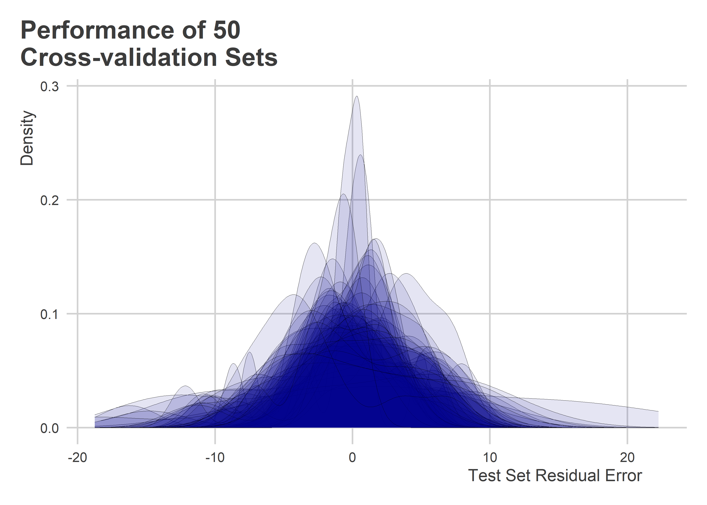
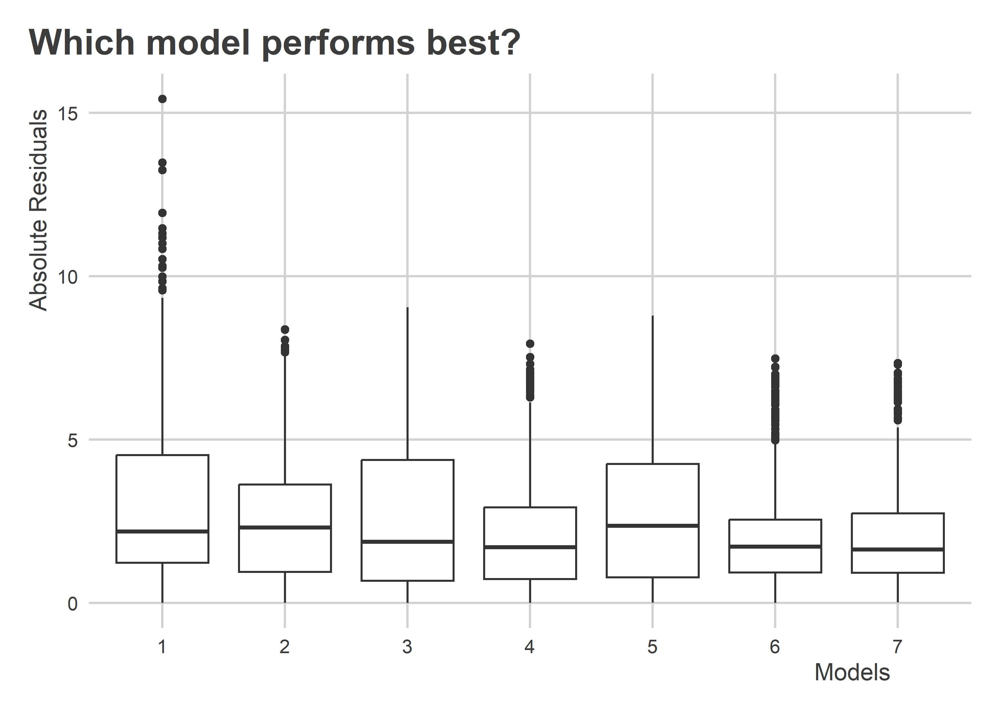
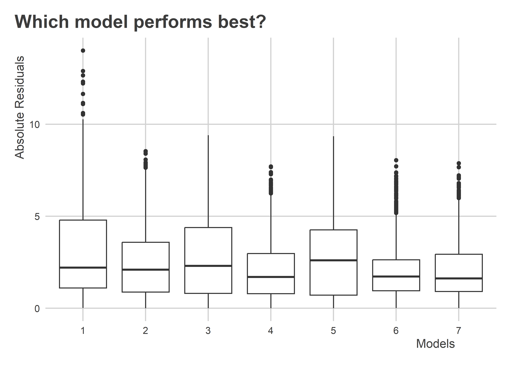
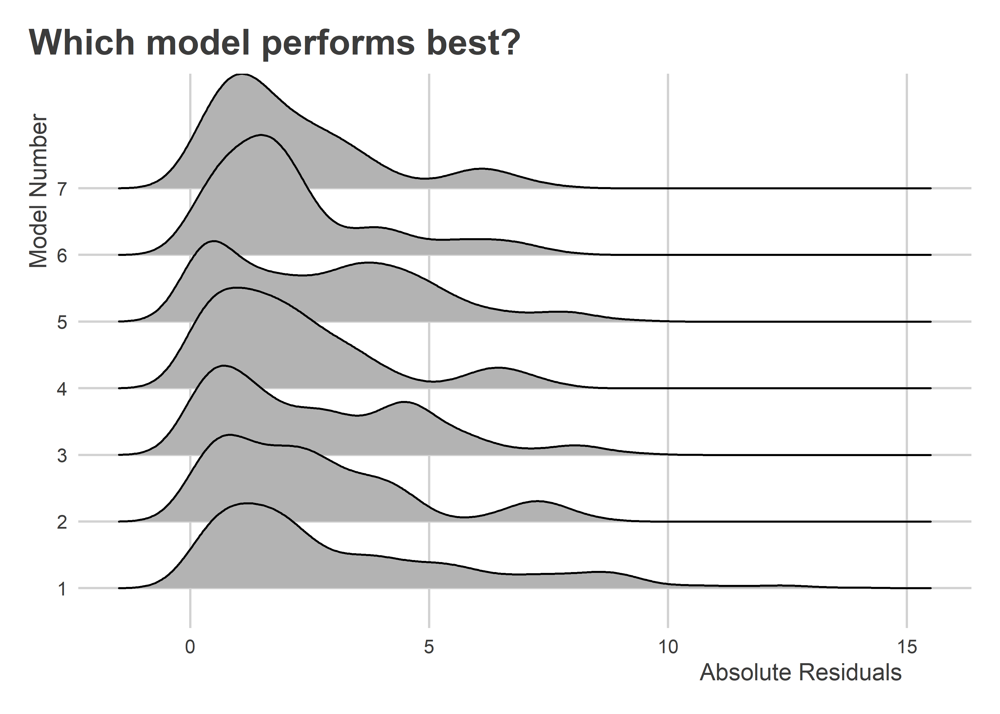

Model Selection with Cross-Validation
================

-   [Goals](#goals)
-   [Getting Started](#getting-started)
-   [One Model](#one-model)
-   [Comparing Models](#comparing-models)
-   [Challenge](#challenge)

## Goals

-   We’ve talked a bit about model selection, but today we’ll dig deeper
    by talking about cross-validation.
-   Cross-validation is one of my favorite approaches to model
    selection, because compared to alternatives (like stepwise
    regression) it does a better job helping us to avoid overfitting.
-   We’ll use tools in the `{purrr}` package to make it happen.

## Getting Started

We’ll need to use tools in the following packages:

``` r
library(tidyverse)
library(modelr)
coolorrr::set_theme()
```

First, let’s use some simple data. How about `mtcars`?

``` r
glimpse(mtcars)
```

    ## Rows: 32
    ## Columns: 11
    ## $ mpg  <dbl> 21.0, 21.0, 22.8, 21.4, 18.7, 18.1, 14.3, 24.4, 22.8, 19.2, 17.8,…
    ## $ cyl  <dbl> 6, 6, 4, 6, 8, 6, 8, 4, 4, 6, 6, 8, 8, 8, 8, 8, 8, 4, 4, 4, 4, 8,…
    ## $ disp <dbl> 160.0, 160.0, 108.0, 258.0, 360.0, 225.0, 360.0, 146.7, 140.8, 16…
    ## $ hp   <dbl> 110, 110, 93, 110, 175, 105, 245, 62, 95, 123, 123, 180, 180, 180…
    ## $ drat <dbl> 3.90, 3.90, 3.85, 3.08, 3.15, 2.76, 3.21, 3.69, 3.92, 3.92, 3.92,…
    ## $ wt   <dbl> 2.620, 2.875, 2.320, 3.215, 3.440, 3.460, 3.570, 3.190, 3.150, 3.…
    ## $ qsec <dbl> 16.46, 17.02, 18.61, 19.44, 17.02, 20.22, 15.84, 20.00, 22.90, 18…
    ## $ vs   <dbl> 0, 0, 1, 1, 0, 1, 0, 1, 1, 1, 1, 0, 0, 0, 0, 0, 0, 1, 1, 1, 1, 0,…
    ## $ am   <dbl> 1, 1, 1, 0, 0, 0, 0, 0, 0, 0, 0, 0, 0, 0, 0, 0, 0, 1, 1, 1, 0, 0,…
    ## $ gear <dbl> 4, 4, 4, 3, 3, 3, 3, 4, 4, 4, 4, 3, 3, 3, 3, 3, 3, 4, 4, 4, 3, 3,…
    ## $ carb <dbl> 4, 4, 1, 1, 2, 1, 4, 2, 2, 4, 4, 3, 3, 3, 4, 4, 4, 1, 2, 1, 1, 2,…

A good goal with this data might be to come up with a good model of
vehicle MPG or miles per gallon.

To do this with cross validation, we first need to split the data into
training and test sets. We can do that with the function `crossv_mc()`
from `{modelr}`:

``` r
mtcars_split <- mtcars %>%
  crossv_mc(n = 50, test = 0.3)
glimpse(mtcars_split)
```

    ## Rows: 50
    ## Columns: 3
    ## $ train <list> [<resample[22 x 11]>], [<resample[22 x 11]>], [<resample[22 x 1…
    ## $ test  <list> [<resample[10 x 11]>], [<resample[10 x 11]>], [<resample[10 x 1…
    ## $ .id   <chr> "01", "02", "03", "04", "05", "06", "07", "08", "09", "10", "11"…

## One Model

With the object `mtcars_split`, we can train a single model using each
of the training sets and validate their performance on each of the test
sets. We do that by writing:

``` r
mtcars_split %>%
  mutate(
    model = map(train, ~ lm(mpg ~ ., data = .x))
  ) -> mtcars_split
```

We now have a model column in the object:

``` r
glimpse(mtcars_split)
```

    ## Rows: 50
    ## Columns: 4
    ## $ train <list> [<resample[22 x 11]>], [<resample[22 x 11]>], [<resample[22 x 1…
    ## $ test  <list> [<resample[10 x 11]>], [<resample[10 x 11]>], [<resample[10 x 1…
    ## $ .id   <chr> "01", "02", "03", "04", "05", "06", "07", "08", "09", "10", "11"…
    ## $ model <list> [10.314027987, 0.752722665, 0.007125579, -0.026207312, 0.846167…

We can then get model errors by checking performance in the test set:

``` r
mtcars_split %>%
  mutate(
    prediction = map2(test, model, ~ predict(.y, newdata = .x)),
    outcome = map(test, ~ as.data.frame(.x)$mpg),
    residual = map2(outcome, prediction, ~ .x - .y),
    rmse = map(residual, ~ sqrt(mean(.x^2)))
  ) -> mtcars_split
```

We can check out the model performance with each iteration. To start,
we’ll collect the columns we want to keep and use `unnest()` to return a
data frame:

``` r
mtcars_split %>%
  select(.id, prediction, outcome, residual, rmse) %>%
  unnest() -> cv_out
```

For each test dataset, we have predictions, the observed outcomes, the
residual error and root mean squared error or RMSE:

``` r
glimpse(cv_out)
```

    ## Rows: 500
    ## Columns: 5
    ## $ .id        <chr> "01", "01", "01", "01", "01", "01", "01", "01", "01", "01",…
    ## $ prediction <dbl> 21.678315, 22.101806, 19.407365, 15.979170, 9.200299, 31.02…
    ## $ outcome    <dbl> 18.1, 24.4, 17.8, 15.2, 14.7, 30.4, 27.3, 19.7, 15.0, 21.4,…
    ## $ residual   <dbl> -3.5783151, 2.2981942, -1.6073651, -0.7791704, 5.4997011, -…
    ## $ rmse       <dbl> 2.861132, 2.861132, 2.861132, 2.861132, 2.861132, 2.861132,…

One useful thing to do is check out the prediction residuals:

``` r
ggplot(cv_out) +
  aes(x = residual,
      group = .id) +
  geom_density(fill = "darkblue",
               alpha = 0.1,
               size = 0) +
  labs(x = "Test Set Residual Error",
       y = "Density",
       title = "Performance of 50\nCross-validation Sets")
```



## Comparing Models

Okay, all that’s great, but when it comes to model selection, we
generally have multiple models to compare. Above, we only used
cross-validation with one model. Here, well use corss-validation to
compare several.

To keep things simple, let’s just compare 3 possible predictors: hp, wt,
and cyl. With just three variables, we can create at least 7 different
models. We can make a list of them like so:

``` r
form_list <- list(
  "1" = mpg ~ hp,
  "2" = mpg ~ wt,
  "3" = mpg ~ cyl,
  "4" = mpg ~ hp + wt,
  "5" = mpg ~ hp + cyl,
  "6" = mpg ~ wt + cyl,
  "7" = mpg ~ hp + wt + cyl
)
```

To start fresh, we’ll run the cross-validation generator again:

``` r
mtcars_split <- mtcars %>%
  crossv_mc(n = 50, test = 0.3)
```

And now, for each training set, we’ll also estimate each of the 7
possible model specifications:

``` r
mtcars_split %>%
  expand_grid(., 
              forms = form_list) %>%
  mutate(
    model_num = rep(1:7, len = n()),
    models = map2(train, forms, ~ lm(.y, data = .x))
  ) -> mtcars_split

## Check it:
mtcars_split
```

    ## # A tibble: 350 × 6
    ##    train                test                 .id   forms        model_num models
    ##    <list>               <list>               <chr> <named list>     <int> <list>
    ##  1 <resample [22 x 11]> <resample [10 x 11]> 01    <formula>            1 <lm>  
    ##  2 <resample [22 x 11]> <resample [10 x 11]> 01    <formula>            2 <lm>  
    ##  3 <resample [22 x 11]> <resample [10 x 11]> 01    <formula>            3 <lm>  
    ##  4 <resample [22 x 11]> <resample [10 x 11]> 01    <formula>            4 <lm>  
    ##  5 <resample [22 x 11]> <resample [10 x 11]> 01    <formula>            5 <lm>  
    ##  6 <resample [22 x 11]> <resample [10 x 11]> 01    <formula>            6 <lm>  
    ##  7 <resample [22 x 11]> <resample [10 x 11]> 01    <formula>            7 <lm>  
    ##  8 <resample [22 x 11]> <resample [10 x 11]> 02    <formula>            1 <lm>  
    ##  9 <resample [22 x 11]> <resample [10 x 11]> 02    <formula>            2 <lm>  
    ## 10 <resample [22 x 11]> <resample [10 x 11]> 02    <formula>            3 <lm>  
    ## # … with 340 more rows
    ## # ℹ Use `print(n = ...)` to see more rows

And then, for each of those, we’ll get predictions and compare with
outcomes in the test data:

``` r
mtcars_split %>%
  mutate(
    prediction = map2(test, models, ~ predict(.y, newdata = .x)),
    outcome = map(test, ~ as_data_frame(.x)$mpg),
    residual = map2(outcome, prediction, ~ .x - .y)
  ) -> mtcars_split
```

Now, for each model, we can pull out the residual prediction error:

``` r
mtcars_split %>%
  select(.id, model_num, residual) %>%
  unnest() -> cv_out
```

And then we can use ggplot to visualize:

``` r
ggplot(cv_out) +
  aes(x = as.factor(model_num),
      y = abs(residual)) +
  geom_boxplot() +
  labs(x = "Models",
       y = "Absolute Residuals",
       title = "Which model performs best?")
```



We could also use a kind of plot called a ridge

``` r
library(ggridges)
ggplot(cv_out) +
  aes(x = abs(residual),
      y = as.factor(model_num)) +
  geom_density_ridges() +
  labs(x = "Absolute Residuals",
       y = "Model Number",
       title = "Which model performs best?")
```



We can also use a dot-whisker plot:

``` r
cv_out %>%
  group_by(model_num) %>%
  summarize(
    median = median(abs(residual)),
    lo = quantile(abs(residual), 0.25),
    hi = quantile(abs(residual), 0.75)
  ) %>%
  ggplot() +
  aes(x = median,
      xmin = lo,
      xmax = hi,
      y = as.factor(model_num)) +
  geom_pointrange() +
  labs(x = "Median Absolute Residual",
       y = "Model",
       title = "Which model performs best?",
       caption = "(interval from 25th and 75th percentiles shown)")
```



## Challenge

Use the methods above to find a model that does better than the best
performing one above.
