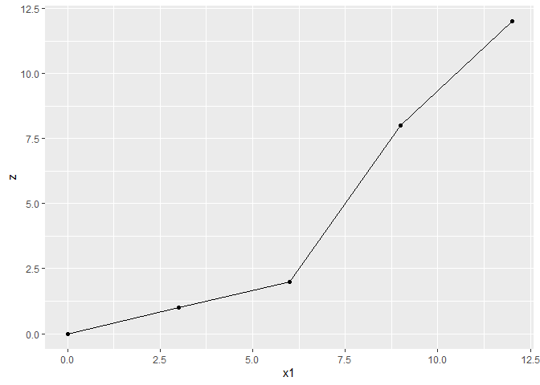
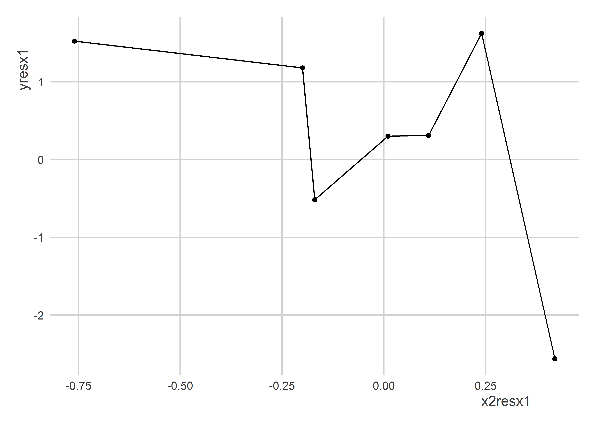
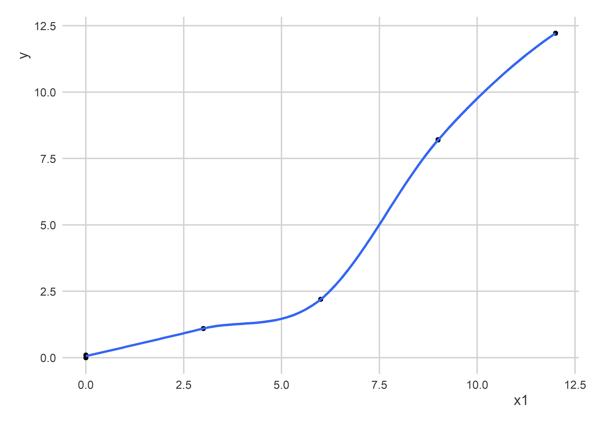

Multiple Regression Part 2
================

## Goals

-   We’ve talked about multiple regression in the context of prediction.
-   But just like we need to be careful about overfitting when making
    prediction models, we need to be careful about introducing bias in
    descriptive and causal models.

Note: Data examples and pseudo-theorems come from [Achen
(2005)](https://www.jstor.org/stable/pdf/26273558.pdf?refreqid=excelsior%3A4b4477da4a574e29d3538df16b0a42bd&ab_segments=&origin=&initiator=&acceptTC=1)

## Some Baised Data

``` r
library(tidyverse)
```

    ## ── Attaching packages ─────────────────────────────────────── tidyverse 1.3.2 ──
    ## ✔ ggplot2 3.4.0     ✔ purrr   0.3.4
    ## ✔ tibble  3.1.8     ✔ dplyr   1.0.9
    ## ✔ tidyr   1.2.0     ✔ stringr 1.4.0
    ## ✔ readr   2.1.2     ✔ forcats 0.5.1

    ## Warning: package 'ggplot2' was built under R version 4.2.2

    ## ── Conflicts ────────────────────────────────────────── tidyverse_conflicts() ──
    ## ✖ dplyr::filter() masks stats::filter()
    ## ✖ dplyr::lag()    masks stats::lag()

``` r
library(estimatr)
library(xtable)
```

``` r
Data <- tibble(
  z = rep(c(0, 1, 2, 8, 12), each = 3),
  x1 = rep(c(0, 3, 6, 9, 12), each = 3),
  x2 = c(0,rep(c(1, 2), each = 5),
         2.1, rep(2.2, len = 3)),
  y = z + 0.1 * x2
)
```

Look at the data:

``` r
Data
```

    ## # A tibble: 15 × 4
    ##        z    x1    x2     y
    ##    <dbl> <dbl> <dbl> <dbl>
    ##  1     0     0   0    0   
    ##  2     0     0   1    0.1 
    ##  3     0     0   1    0.1 
    ##  4     1     3   1    1.1 
    ##  5     1     3   1    1.1 
    ##  6     1     3   1    1.1 
    ##  7     2     6   2    2.2 
    ##  8     2     6   2    2.2 
    ##  9     2     6   2    2.2 
    ## 10     8     9   2    8.2 
    ## 11     8     9   2    8.2 
    ## 12     8     9   2.1  8.21
    ## 13    12    12   2.2 12.2 
    ## 14    12    12   2.2 12.2 
    ## 15    12    12   2.2 12.2

Look at the relationship between z and x1:

``` r
ggplot(Data) +
  aes(x = x1, y = z) +
  geom_point() +
  geom_line()
```

<!-- -->

Since the outcome is directly predicted by the variables z and x1, when
we estimate a linear model, we should recover exactly the correct model
parameters:

``` r
fit <- lm(y ~ z + x2, Data)
fit
```

    ## 
    ## Call:
    ## lm(formula = y ~ z + x2, data = Data)
    ## 
    ## Coefficients:
    ## (Intercept)            z           x2  
    ##         0.0          1.0          0.1

Now

But say instead of observing z, we only observe x1. If we just do some
simple regressions, we can see that z and x1 give us the same direction
of relationship:

``` r
lm(y ~ z, Data)
```

    ## 
    ## Call:
    ## lm(formula = y ~ z, data = Data)
    ## 
    ## Coefficients:
    ## (Intercept)            z  
    ##      0.1094       1.0106

``` r
lm(y ~ x1, Data)
```

    ## 
    ## Call:
    ## lm(formula = y ~ x1, data = Data)
    ## 
    ## Coefficients:
    ## (Intercept)           x1  
    ##      -1.524        1.047

If we used summary of these, we’d see that both are statistically
significant and well-fit models.

We can see too that if we regress y on x2 alone, we also get the right
relationship (albeit an exagerated one):

``` r
lm(y ~ x2, Data)
```

    ## 
    ## Call:
    ## lm(formula = y ~ x2, data = Data)
    ## 
    ## Coefficients:
    ## (Intercept)           x2  
    ##      -3.680        5.341

It would be reasonable to expect that if we estimate a multiple
regression model with both x1 and x2, even if the results aren’t
identical to those shown with z and x2, they should be close. Right?

``` r
fit2 <- lm(y ~ x1 + x2, Data)
fit2
```

    ## 
    ## Call:
    ## lm(formula = y ~ x1 + x2, data = Data)
    ## 
    ## Coefficients:
    ## (Intercept)           x1           x2  
    ##      0.5888       1.4269      -2.7799

Oh wait, that’s not right at all!

If we look at their summaries side-by-side, we’ll see that these
estimates are statisticall significant, too:

``` r
summary(fit)
```

    ## Warning in summary.lm(fit): essentially perfect fit: summary may be unreliable

    ## 
    ## Call:
    ## lm(formula = y ~ z + x2, data = Data)
    ## 
    ## Residuals:
    ##        Min         1Q     Median         3Q        Max 
    ## -1.502e-15 -2.047e-16  3.782e-16  4.292e-16  5.939e-16 
    ## 
    ## Coefficients:
    ##              Estimate Std. Error   t value Pr(>|t|)    
    ## (Intercept) 0.000e+00  5.497e-16 0.000e+00        1    
    ## z           1.000e+00  6.209e-17 1.611e+16   <2e-16 ***
    ## x2          1.000e-01  4.373e-16 2.287e+14   <2e-16 ***
    ## ---
    ## Signif. codes:  0 '***' 0.001 '**' 0.01 '*' 0.05 '.' 0.1 ' ' 1
    ## 
    ## Residual standard error: 7.438e-16 on 12 degrees of freedom
    ## Multiple R-squared:      1,  Adjusted R-squared:      1 
    ## F-statistic: 2.968e+32 on 2 and 12 DF,  p-value: < 2.2e-16

``` r
summary(fit2)
```

    ## 
    ## Call:
    ## lm(formula = y ~ x1 + x2, data = Data)
    ## 
    ## Residuals:
    ##     Min      1Q  Median      3Q     Max 
    ## -1.3904 -0.9896  0.3288  0.6240  2.2912 
    ## 
    ## Coefficients:
    ##             Estimate Std. Error t value Pr(>|t|)    
    ## (Intercept)   0.5888     1.0339   0.569   0.5795    
    ## x1            1.4269     0.1722   8.287 2.62e-06 ***
    ## x2           -2.7799     1.1111  -2.502   0.0278 *  
    ## ---
    ## Signif. codes:  0 '***' 0.001 '**' 0.01 '*' 0.05 '.' 0.1 ' ' 1
    ## 
    ## Residual standard error: 1.334 on 12 degrees of freedom
    ## Multiple R-squared:  0.935,  Adjusted R-squared:  0.9242 
    ## F-statistic: 86.32 on 2 and 12 DF,  p-value: 7.538e-08

## Pseudo-Theorems

**Theorem 1:** “Dropping a list of conditionally monotonic control
variables into a linear link function controls for their effects, so
that the other variables of interest will take on appropriate
coefficients” (Achen 2005, 330).

**Theorem 2:** “Dropping a list of conditionally monotonic variables
into a linear link function assigns each of them theor appropriate
explanatory impact, so that the power of each hypothesis can be assessed
from its coefficient and standard error” (Achen 2005, 330).

## When We Control…

``` r
x2resx1 <- resid(lm(x2 ~ x1, Data))
x2resz  <- resid(lm(x2 ~ z, Data))
yresx1  <- resid(lm(y ~ x1, Data))
yresz   <- resid(lm(y ~ z, Data))
```

``` r
ggplot() +
  aes(x = x2resz,
      y = yresz) +
  geom_point() +
  geom_line()
```

<!-- -->

``` r
ggplot() +
  aes(x = x2resx1,
      y = yresx1) +
  geom_point() +
  geom_line()
```

<!-- -->
