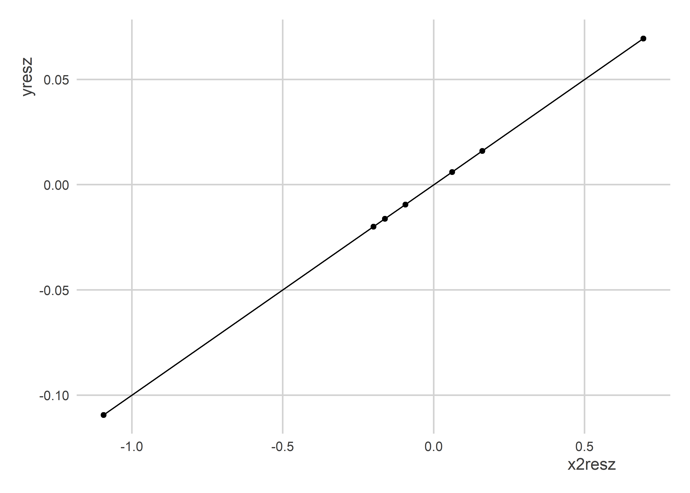

Multiple Regression Part 2
================

-   [Goals](#goals)
-   [Some Baised Data](#some-baised-data)
-   [Estimating regression models](#estimating-regression-models)
-   [Pseudo-Theorems](#pseudo-theorems)
-   [When We Control…](#when-we-control)
-   [Three Questions](#three-questions)
-   [The Main Point](#the-main-point)

## Goals

-   We’ve talked about multiple regression in the context of prediction.
-   But just like we need to be careful about overfitting when making
    prediction models, we need to be careful about introducing bias in
    descriptive and causal models.

Note: Data examples and pseudo-theorems come from [Achen
(2005)](https://www.jstor.org/stable/pdf/26273558.pdf?refreqid=excelsior%3A4b4477da4a574e29d3538df16b0a42bd&ab_segments=&origin=&initiator=&acceptTC=1)

## Some Baised Data

We’re going to simulate some data. This data is copied directly from
Table 1 in Achen 2005 (see page 331).

``` r
library(tidyverse)
Data <- tibble(
  z = rep(c(0, 1, 2, 8, 12), each = 3),
  x1 = rep(c(0, 3, 6, 9, 12), each = 3),
  x2 = c(0,rep(c(1, 2), each = 5),
         2.1, rep(2.2, len = 3)),
  y = z + 0.1 * x2
)
```

If we take a look at the data, on its surface it doesn’t look like
anything special:

``` r
xtable::xtable(Data) %>%
  print(type = "html")
```

    ## <!-- html table generated in R 4.2.1 by xtable 1.8-4 package -->
    ## <!-- Mon Mar 20 13:16:09 2023 -->
    ## <table border=1>
    ## <tr> <th>  </th> <th> z </th> <th> x1 </th> <th> x2 </th> <th> y </th>  </tr>
    ##   <tr> <td align="right"> 1 </td> <td align="right"> 0.00 </td> <td align="right"> 0.00 </td> <td align="right"> 0.00 </td> <td align="right"> 0.00 </td> </tr>
    ##   <tr> <td align="right"> 2 </td> <td align="right"> 0.00 </td> <td align="right"> 0.00 </td> <td align="right"> 1.00 </td> <td align="right"> 0.10 </td> </tr>
    ##   <tr> <td align="right"> 3 </td> <td align="right"> 0.00 </td> <td align="right"> 0.00 </td> <td align="right"> 1.00 </td> <td align="right"> 0.10 </td> </tr>
    ##   <tr> <td align="right"> 4 </td> <td align="right"> 1.00 </td> <td align="right"> 3.00 </td> <td align="right"> 1.00 </td> <td align="right"> 1.10 </td> </tr>
    ##   <tr> <td align="right"> 5 </td> <td align="right"> 1.00 </td> <td align="right"> 3.00 </td> <td align="right"> 1.00 </td> <td align="right"> 1.10 </td> </tr>
    ##   <tr> <td align="right"> 6 </td> <td align="right"> 1.00 </td> <td align="right"> 3.00 </td> <td align="right"> 1.00 </td> <td align="right"> 1.10 </td> </tr>
    ##   <tr> <td align="right"> 7 </td> <td align="right"> 2.00 </td> <td align="right"> 6.00 </td> <td align="right"> 2.00 </td> <td align="right"> 2.20 </td> </tr>
    ##   <tr> <td align="right"> 8 </td> <td align="right"> 2.00 </td> <td align="right"> 6.00 </td> <td align="right"> 2.00 </td> <td align="right"> 2.20 </td> </tr>
    ##   <tr> <td align="right"> 9 </td> <td align="right"> 2.00 </td> <td align="right"> 6.00 </td> <td align="right"> 2.00 </td> <td align="right"> 2.20 </td> </tr>
    ##   <tr> <td align="right"> 10 </td> <td align="right"> 8.00 </td> <td align="right"> 9.00 </td> <td align="right"> 2.00 </td> <td align="right"> 8.20 </td> </tr>
    ##   <tr> <td align="right"> 11 </td> <td align="right"> 8.00 </td> <td align="right"> 9.00 </td> <td align="right"> 2.00 </td> <td align="right"> 8.20 </td> </tr>
    ##   <tr> <td align="right"> 12 </td> <td align="right"> 8.00 </td> <td align="right"> 9.00 </td> <td align="right"> 2.10 </td> <td align="right"> 8.21 </td> </tr>
    ##   <tr> <td align="right"> 13 </td> <td align="right"> 12.00 </td> <td align="right"> 12.00 </td> <td align="right"> 2.20 </td> <td align="right"> 12.22 </td> </tr>
    ##   <tr> <td align="right"> 14 </td> <td align="right"> 12.00 </td> <td align="right"> 12.00 </td> <td align="right"> 2.20 </td> <td align="right"> 12.22 </td> </tr>
    ##   <tr> <td align="right"> 15 </td> <td align="right"> 12.00 </td> <td align="right"> 12.00 </td> <td align="right"> 2.20 </td> <td align="right"> 12.22 </td> </tr>
    ##    </table>

We have an outcome “y” that is a simple linear function of “z” and “x2”:

*y = z + 0.1x2*

But, we also have a column for a variable called “x1.” There’s something
special about this variable.

First, look at the relationship between z and x1:

``` r
ggplot(Data) +
  aes(x = x1, y = z) +
  geom_point() +
  geom_line() +
  labs(title = "The function z = f(x1)")
```


As it turns, z and x1 have a positive *monotonic* relationship—just not
a linear one. Even more, the nature of this relationship is unknown. All
we know is that

*z = f(x1)*

The second special thing about x1 is that we are asked to imagine a
world where we cannot observe z directly. Instead we only observe x1.

## Estimating regression models

Since the outcome is directly predicted by the variables z and x1, when
we estimate a linear model, we should recover exactly the correct model
parameters:

``` r
fit <- lm(y ~ z + x2, Data)
fit
```

    ## 
    ## Call:
    ## lm(formula = y ~ z + x2, data = Data)
    ## 
    ## Coefficients:
    ## (Intercept)            z           x2  
    ##         0.0          1.0          0.1

That’s just what we do. But remember, we’re supposed to pretend like we
don’t observe z. If we just do some simple regressions, we can see that
z and x1 give us the same direction of relationship and with almost the
same magnitude:

``` r
lm(y ~ z, Data)
```

    ## 
    ## Call:
    ## lm(formula = y ~ z, data = Data)
    ## 
    ## Coefficients:
    ## (Intercept)            z  
    ##      0.1094       1.0106

``` r
lm(y ~ x1, Data)
```

    ## 
    ## Call:
    ## lm(formula = y ~ x1, data = Data)
    ## 
    ## Coefficients:
    ## (Intercept)           x1  
    ##      -1.524        1.047

If we used summary of these, we’d see that both are statistically
significant and well-fit models.

We can see too that if we regress y on x2 alone, we also get the right
relationship (albeit an exaggerated one):

``` r
lm(y ~ x2, Data)
```

    ## 
    ## Call:
    ## lm(formula = y ~ x2, data = Data)
    ## 
    ## Coefficients:
    ## (Intercept)           x2  
    ##      -3.680        5.341

It would be reasonable to expect that if we estimate a multiple
regression model with both x1 and x2 (rather than z and x2), even if the
results aren’t identical to those shown with z and x2, they should be
close. Right?

``` r
fit2 <- lm(y ~ x1 + x2, Data)
fit2
```

    ## 
    ## Call:
    ## lm(formula = y ~ x1 + x2, data = Data)
    ## 
    ## Coefficients:
    ## (Intercept)           x1           x2  
    ##      0.5888       1.4269      -2.7799

Oh wait, that’s not right at all!

If we look at their summaries side-by-side, we’ll see that these
estimates are statistically significant, too:

``` r
summary(fit)
```

    ## 
    ## Call:
    ## lm(formula = y ~ z + x2, data = Data)
    ## 
    ## Residuals:
    ##        Min         1Q     Median         3Q        Max 
    ## -1.502e-15 -2.047e-16  3.782e-16  4.292e-16  5.939e-16 
    ## 
    ## Coefficients:
    ##              Estimate Std. Error   t value Pr(>|t|)    
    ## (Intercept) 0.000e+00  5.497e-16 0.000e+00        1    
    ## z           1.000e+00  6.209e-17 1.611e+16   <2e-16 ***
    ## x2          1.000e-01  4.373e-16 2.287e+14   <2e-16 ***
    ## ---
    ## Signif. codes:  0 '***' 0.001 '**' 0.01 '*' 0.05 '.' 0.1 ' ' 1
    ## 
    ## Residual standard error: 7.438e-16 on 12 degrees of freedom
    ## Multiple R-squared:      1,  Adjusted R-squared:      1 
    ## F-statistic: 2.968e+32 on 2 and 12 DF,  p-value: < 2.2e-16

``` r
summary(fit2)
```

    ## 
    ## Call:
    ## lm(formula = y ~ x1 + x2, data = Data)
    ## 
    ## Residuals:
    ##     Min      1Q  Median      3Q     Max 
    ## -1.3904 -0.9896  0.3288  0.6240  2.2912 
    ## 
    ## Coefficients:
    ##             Estimate Std. Error t value Pr(>|t|)    
    ## (Intercept)   0.5888     1.0339   0.569   0.5795    
    ## x1            1.4269     0.1722   8.287 2.62e-06 ***
    ## x2           -2.7799     1.1111  -2.502   0.0278 *  
    ## ---
    ## Signif. codes:  0 '***' 0.001 '**' 0.01 '*' 0.05 '.' 0.1 ' ' 1
    ## 
    ## Residual standard error: 1.334 on 12 degrees of freedom
    ## Multiple R-squared:  0.935,  Adjusted R-squared:  0.9242 
    ## F-statistic: 86.32 on 2 and 12 DF,  p-value: 7.538e-08

Why would having a close approximation for in our model rather than z
itself so radically change our regression estimates?

## Pseudo-Theorems

Quantitative researchers often implicitly operate as if two
*pseudo-theorems* are true. We call them “pseudo” because they aren’t
based on any formal mathematical proofs. But, they do have some
intuitive appeal—e.g., they sound like they should be right.

-   **Theorem 1:** “Dropping a list of conditionally monotonic control
    variables into a linear link function controls for their effects, so
    that the other variables of interest will take on appropriate
    coefficients” (Achen 2005, 330).
-   **Theorem 2:** “Dropping a list of conditionally monotonic variables
    into a linear link function assigns each of them theoretically
    appropriate explanatory impact, so that the power of each hypothesis
    can be assessed from its coefficient and standard error” (Achen
    2005, 330).

If these theorems are mostly true, all is good with our regression
analyses. But as the previous example shows, we can easily find a case
that violates these theorems.

## When We Control…

When we control for a list of covariates, it’s as if we are subtracting
out all the variation in our outcome variable and explanatory variable
of interest that is a linear function of these other covariates. And
then, we use the left-over variation to estimate the relationship of
interest.

The below code makes this explicit:

``` r
x2resx1 <- resid(lm(x2 ~ x1, Data))
x2resz  <- resid(lm(x2 ~ z, Data))
yresx1  <- resid(lm(y ~ x1, Data))
yresz   <- resid(lm(y ~ z, Data))
```

I’ve created four vectors:

-   `x2resx1`: What’s leftover of x2 that’s *not* explained as a linear
    function of `x1`
-   `x2resz`: What’s leftover of x2 that’s *not* explained as a linear
    function of `z`
-   `yresx1`: What’s leftover of y that’s *not* explained as a linear
    function of `x1`
-   `yresz`: What’s leftover of y that’s *not* explained as a linear
    function of `z`

If we look at the relationship between `x2resz` and `yresz`, we should
see a perfect linear relationship between the variation leftover in each
not explained by z:

``` r
ggplot() +
  aes(x = x2resz,
      y = yresz) +
  geom_point() +
  geom_line()
```



If the pseudo-theorems are right, then even if we replace z with x1, the
variation leftover in y and x2 should be close enough to the truth to
give us the correct relationship. As it turns out, this isn’t what
happens:

``` r
ggplot() +
  aes(x = x2resx1,
      y = yresx1) +
  geom_point() +
  geom_line()
```


As it turns out, x1 doesn’t quite explain the variation in both y and x2
correctly. As a result, the variation leftover that it’s explained by x1
isn’t the correct variation.

## Three Questions

With this data can you…

1.  find a way to transform x1 to recover better estimates?
2.  if you can’t find a transformation, how do you think you would
    proceed?
3.  answer whether this is a problem for prediction?

## The Main Point

As tempting as it is to throw every variable in your data at a problem,
I cannot stress enough the need to slow down and think clearly about
your data before you proceed.

Sometimes it helps to just look at the data. For instance, we can
clearly see that there isn’t a linear relationship between x1 and y:

``` r
ggplot(Data) +
  aes(x = x1,
      y = y) +
  geom_point()+
  geom_smooth(se = F)
```


But maybe a simple transformation can make a difference:

``` r
ggplot(Data) +
  aes(x = x1^2,
      y = y) +
  geom_point()+
  geom_smooth(se = F)
```


But even then, not enough:

``` r
lm(y ~ I(x1^2) + x2, Data) %>%
  summary()
```

    ## 
    ## Call:
    ## lm(formula = y ~ I(x1^2) + x2, data = Data)
    ## 
    ## Residuals:
    ##      Min       1Q   Median       3Q      Max 
    ## -0.77703 -0.47187  0.02807  0.21255  1.19107 
    ## 
    ## Coefficients:
    ##              Estimate Std. Error t value Pr(>|t|)    
    ## (Intercept)  0.428901   0.572713   0.749    0.468    
    ## I(x1^2)      0.090613   0.005853  15.482 2.71e-09 ***
    ## x2          -0.356971   0.472626  -0.755    0.465    
    ## ---
    ## Signif. codes:  0 '***' 0.001 '**' 0.01 '*' 0.05 '.' 0.1 ' ' 1
    ## 
    ## Residual standard error: 0.7551 on 12 degrees of freedom
    ## Multiple R-squared:  0.9792, Adjusted R-squared:  0.9757 
    ## F-statistic:   282 on 2 and 12 DF,  p-value: 8.175e-11
