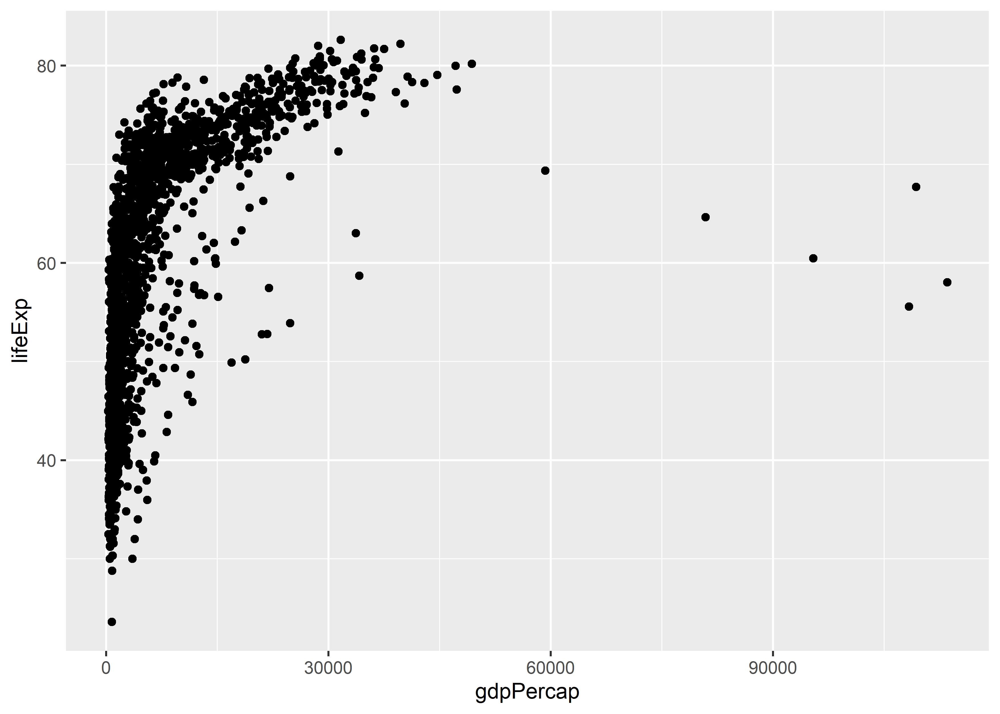
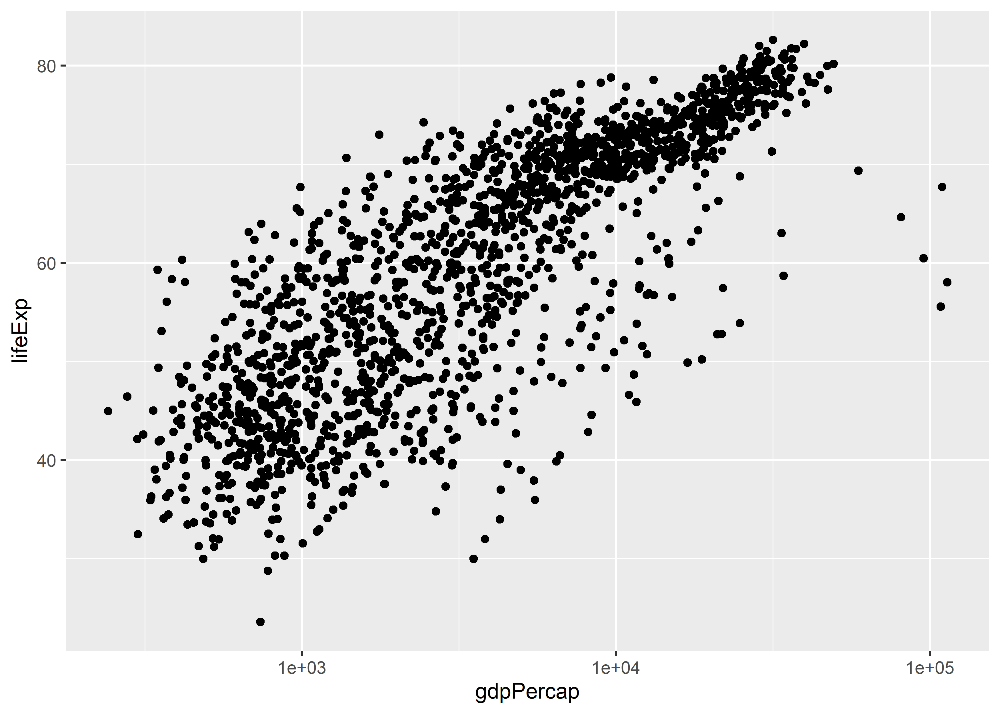

Getting Started (Continued)
================

This is part 2 of our “getting started” notes for DPR 101. \[[Check out
part
1](https://github.com/milesdwilliams15/Teaching/blob/main/DPR%20101/Notes/01_getting_started.md)\]

Last time we focused on some basics of working in RStudio and using .Rmd
files to write your code, make notes, and save your work.

In these notes, we’ll cover:

1.  Getting data into R
2.  Making your first data viz
3.  Some helpful resources if you want to go deeper into the details of
    using R

## Goals

-   Be able to read a dataset into R
-   Take a first pass at making a data viz using `ggplot()`

## Reading data into R

Data viz is impossible without data. The only way we can use data for
data viz is to get it into R.

A lot of packages (including base R) provide tools for reading data into
R. In this class, we’ll primarily use the `read_csv()` function from the
`{readr}` package. This is one of the many packages in the `{tidyverse}`
ecosystem of packages.

There are three main ways that I will have you access data in this
class. The first is via .csv files I have stored on my GitHub (the place
that you’re reading these notes!). The second is on Google Drive. The
third is using R packages that have been developed to specifically pull
data from different online databases.

Let’s go over these different approaches.

### Way 1: From my GitHub

Let’s start with the first way. I put together a dataset that
cross-references instances of conflict onset for countries over time
with their quality of governance score from the [Worldwide Governance
Indicators](https://datacatalog.worldbank.org/search/dataset/0038026)
database. Here’s the url to the raw .csv file on my GitHub:
<https://raw.githubusercontent.com/milesdwilliams15/Teaching/main/DPR%20101/Data/onset_and_wgi.csv>

To read the data into R, we can use the `read_csv()` function like so:

``` r
library(tidyverse)
```

    ## ── Attaching packages ─────────────────────────────────────── tidyverse 1.3.2 ──
    ## ✔ ggplot2 3.4.0     ✔ purrr   0.3.4
    ## ✔ tibble  3.1.8     ✔ dplyr   1.0.9
    ## ✔ tidyr   1.2.0     ✔ stringr 1.4.0
    ## ✔ readr   2.1.2     ✔ forcats 0.5.1

    ## Warning: package 'ggplot2' was built under R version 4.2.2

    ## ── Conflicts ────────────────────────────────────────── tidyverse_conflicts() ──
    ## ✖ dplyr::filter() masks stats::filter()
    ## ✖ dplyr::lag()    masks stats::lag()

``` r
Data <- read_csv(
  "https://raw.githubusercontent.com/milesdwilliams15/Teaching/main/DPR%20101/Data/onset_and_wgi.csv"
)
```

    ## Rows: 10160 Columns: 4
    ## ── Column specification ────────────────────────────────────────────────────────
    ## Delimiter: ","
    ## chr (1): country
    ## dbl (3): year, sumonset1, wgi
    ## 
    ## ℹ Use `spec()` to retrieve the full column specification for this data.
    ## ℹ Specify the column types or set `show_col_types = FALSE` to quiet this message.

Notice that I used quotation marks (`""`) around the url. Some things in
R require the use of quotation marks (like data files or character
strings) and other things don’t (like the names of objects or
functions).

You can give `read_csv()` a url like I did above, or the location of
something in your local files. For example, I’m writing this note on my
laptop, and the same dataset I have on my GitHub also lives in my files
on my computer. To access it locally, I could use the `here()` function
from the `{here}` package to tell R where to pull the data from:

``` r
file_location <- here::here(
  "DPR 101", "Data", "onset_and_wgi.csv"
)
Data <- read_csv(file_location)
```

    ## Rows: 3047 Columns: 4
    ## ── Column specification ────────────────────────────────────────────────────────
    ## Delimiter: ","
    ## chr (1): country
    ## dbl (3): year, sumonset1, wgi
    ## 
    ## ℹ Use `spec()` to retrieve the full column specification for this data.
    ## ℹ Specify the column types or set `show_col_types = FALSE` to quiet this message.

You don’t have to use `here()`, but I like using it because it
automatically adds all the pesky backtics I’d need to add to tell R
where a file lives. If we look at the `file_location` object, we can see
that `here()` added this for me and then some:

``` r
file_location
```

    ## [1] "C:/Users/Miles/Documents/Denison University/Teaching/teaching-r-proj/Teaching/DPR 101/Data/onset_and_wgi.csv"

Obviously, the above is unique to my computer. The input I gave `here()`
and the output would look different for you.

Okay, back to the data. When `read_csv()` reads the data into R, it will
spit out a few messages when it’s done. These provide details about how
`read_csv()` assigned variable classes to each of the columns in the
data. In this case, it tells us that it assigned `country` to the
character class (that means it’s a non-ordered category) and it assigned
`year`, `sumonset1`, and `wgi` the class double, which is R’s way of
saying real numbers.

### Way 2: From Google Drive

Some datasets for this class will come from Google Drive. Here’s an
example pulling from a Google Sheets document that has voter turnout
data from a field experiment done in New Haven, CT in 1998:

``` r
url <- "https://docs.google.com/spreadsheets/d/19RaIaVoJMChVsNGO45OrqZcSE3to-EwQ-vywngHLbks/edit#gid=817523709"
library(googlesheets4)
gs4_deauth()
turnout_data <- range_speedread(url)
```

    ## ✔ Reading from "turnout_data".

    ## ℹ Export URL:
    ##   <https://docs.google.com/spreadsheets/d/19RaIaVoJMChVsNGO45OrqZcSE3to-EwQ-vywngHLbks/export?format=csv>

    ## Rows: 10829 Columns: 7
    ## ── Column specification ────────────────────────────────────────────────────────
    ## Delimiter: ","
    ## chr (2): phone_call, voter_type
    ## dbl (5): household_size, ward_id, age, rep_or_dem, voted
    ## 
    ## ℹ Use `spec()` to retrieve the full column specification for this data.
    ## ℹ Specify the column types or set `show_col_types = FALSE` to quiet this message.

To access Google Sheet files you need to open the `{googlesheets4}`
package. It has a few functions for reading in data, but the best and
fastest is `range_speedread()`.

The workflow for reading in data this way is very similar to the
approach I took for reading in .csv files from GitHub. The main
differences are:

1.  You need to load the `{googlesheets4}` package.
2.  You need to run the function `gs4_deauth()` before you try reading
    in the data.

The `gs4_deauth()` function removes the need to enter in some additional
permissions for accessing files from Drive.

### Way 3: R Packages

Some datasets come pre-installed in R, and some are accessible with
different R packages. For example, when you open the `socviz` package
that Healy created to go along with our textbook you immediately have
access to a number of datasets used in examples in the text.

There are tons of other packages that have been created to make it
possible to access all kinds of political data directly in R. Some of
these, like `{DemocracyData}` and `{peacesciencer}` we’ll use later in
this class.

## Making a figure

Speaking of accessing data using R packages, the first example of a data
viz we see in Chapter 2 of Healy uses the Gapminder dataset from the
`{gapminder}` package.

To make the data accessible in R, all we need to do is write:

``` r
library(gapminder)
```

We now have an object called `gapminder` in R. This is a dataset that
contains information for a bunch of countries over time about wealth and
life expectancy. Below, I’m using the `sample_n()` function to look at
10 random rows from the data:

``` r
gapminder %>%
  sample_n(10)
```

    ## # A tibble: 10 × 6
    ##    country    continent  year lifeExp      pop gdpPercap
    ##    <fct>      <fct>     <int>   <dbl>    <int>     <dbl>
    ##  1 Mauritania Africa     1992    58.3  2119465     1361.
    ##  2 Reunion    Africa     1992    73.6   622191     6101.
    ##  3 Mauritius  Africa     1972    62.9   851334     2575.
    ##  4 Chad       Africa     1997    51.6  7562011     1005.
    ##  5 Slovenia   Europe     1992    73.6  1999210    14215.
    ##  6 Finland    Europe     1982    74.6  4826933    18533.
    ##  7 Germany    Europe     1992    76.1 80597764    26505.
    ##  8 Turkey     Europe     1992    66.1 58179144     5678.
    ##  9 Jordan     Asia       1967    51.6  1255058     2742.
    ## 10 Lesotho    Africa     1977    52.2  1251524      745.

Using this data, we can make a simple scatter plot showing how per
capita GDP predicts life expectancy:

``` r
ggplot(gapminder) + 
  aes(x = gdpPercap, y = lifeExp) +
  geom_point()
```

<!-- -->

You can notice a few things about ggplot from the code used to produce
the above figure. First, ggplot works by building figures in steps. We
call these **layers**. Second, we **add** layers (literally) by using
the `+` operator. While normally we use this for addition (i.e.,
`2 + 2`) when we use ggplot `+` acts a lot like this thing called a pipe
operator (`%>%`), which we’ll talk about more later. Basically, the `+`
in ggplot just tells R that we want to add a new set of commands or
instructions for creating a data viz.

More formally, the ggplot workflow looks like:

1.  Feed ggplot data.
2.  Map aesthetics (tell ggplot what relationships to show).
3.  Draw geometry (tell ggplot how to show these relationships).

There technically is a fourth step—customization—but we’ll save that for
another day.

Back to the figure we made, as a first pass this isn’t too bad. We could
obviously add a few more flourishes to make our data viz publication
ready, but this is enough to get a sense for the data. Take a look at
the figure. What does it tell us about life expectancy and GDP per
capita?

A cool thing to note about making figures with `ggplot()` is that we can
save them as objects in R. Check it out:

``` r
p <- ggplot(gapminder) +
  aes(x = gdpPercap, y = lifeExp) + 
  geom_point()
```

The object `p` is our ggplot data viz. Now, every time we write `p`, it
tells R to produce the figure:

``` r
p
```

<!-- -->

This feature of working with ggplot is great for reasons that will
become more obvious later in the course. The biggest benefit is that it
lets us build up a solid foundation for a data viz and then add new
details later.

For example, say we want to compare the above figure to a version where
the scale for GDP per capita is different (say using the log10 scale).
All we need to do is add a new layer to `p` like so:

``` r
p + scale_x_log10()
```

<!-- -->

Because I saved the first plot as the object `p`, I didn’t have to
re-write the code to produce the old plot before adding a new layer.

Speaking of this new layer, does the log10 scale change any conclusions
you previously drew about the relationship between per capita GDP and
life expectancy?

## Helpful Resources for Learning More

This class is not about how to use R in its entirety. But, you may find
it helpful to get more familiar with it. Here are some resources for you
to check out on your own time:

-   [swirlstats.com](https://swirlstats.com/)
-   [Datacamp](https://www.datacamp.com/data-courses/r-courses)
-   [Posit cheatsheets](https://posit.co/resources/cheatsheets/)

My personal favorite is swirlstats.com, because it lets you work at your
own pace directly in R, and **for free**.

## Wrapping up

Working with code is hard, and I promise you that you **will** run into
problems. When you do, just remember that everyone has problems with
their code. It’s normal, and it would be weird if you didn’t have *any*
issues.

We’ll get more into the details of working with ggplot in the coming
weeks. But for now, you should have at minimum some helpful examples for
how to:

-   Read data into R
-   Make a scatter plot using ggplot
-   Access other resources for working in R
