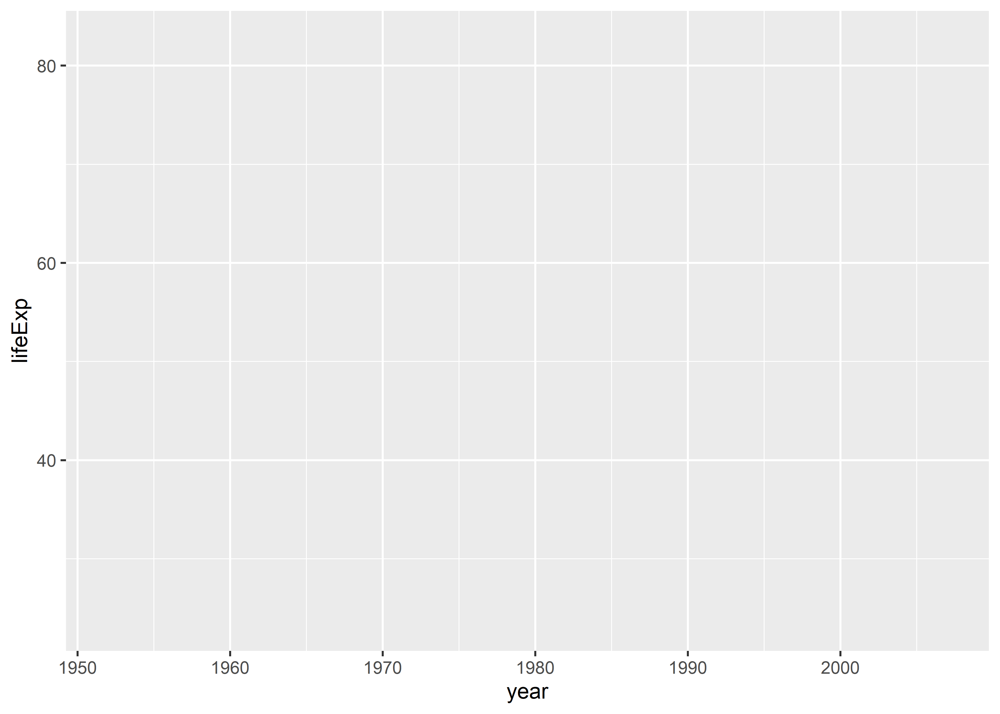
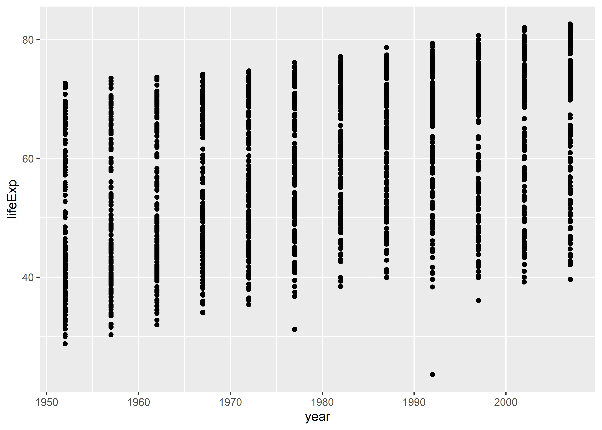
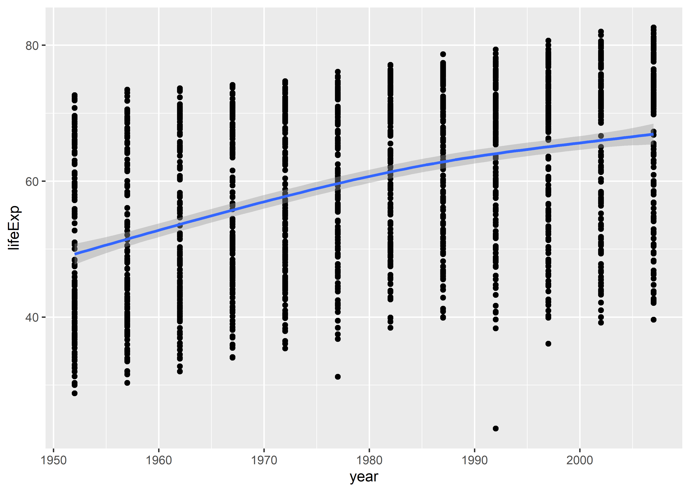

Making ggplots
================

## Goals

-   Understand the ggplot workflow.
-   Know how to distinguish tidy data from untidy data, and why tidy
    data are important for doing data viz with ggplot.
-   Understand mapping.
-   Understand adding layers.

## How ggplot works

As noted in our *Data Visualization* text, when we work with ggplot we
use **aesthetic mappings** or just **aesthetics** to provide logical
instructions for how we want to connect data with colors, shapes, text,
or points on the screen. This workflow has three basic components:

1.  Feed data to the `ggplot()` function.
2.  Tell `ggplot()` what variables you want to map to different
    aesthetics by giving variables to `aes()`.
3.  Tell `ggplot()` about the geometry (shapes, colors, points, etc.)
    that you want it to use when showing the variables you’ve selected.

With each additional step, you add new instructions by using the `+`
symbol followed by a new function that does some new operation.

The echosystem of functions that work with ggplot is vast and
ever-growing. It will take a while to learn them. The best way to do
this is to practice. Practice the examples in our textbook and practice
examples in class.

## We first need “tidy” data

First things first. Before we work with ggplot, some basic data
management skills are necessary. In this class, you’ll learn some
helpful tools in the `{tidyverse}` family of packages for **wrangling**
data. Data wrangling just refers to the process of cleaning and
reshaping data to make it ready for visualization or analysis.

For most data viz or analysis purposes (no matter what tools or software
you use), the goal is usually to have **tidy data**. Tidy data does not
just mean clean data. Tidy data refers to a specific set of
characteristics about a dataset—its shape and its contents.

Tidy data have three key characteristics:

1.  Each **row** is an **observation**.
2.  Each **column** is a **variable**.
3.  Each **cell** is a **single value**.

Tidy data are always **rectangular** in shape. Specifically, they are
**long-format** data as opposed to **wide-format**.

Here’s an example of data in wide-format. Can you tell why it’s wide?

<table>
<caption>
Wide Data
</caption>
<thead>
<tr>
<th style="text-align:left;">
country
</th>
<th style="text-align:right;">
1952
</th>
<th style="text-align:right;">
1957
</th>
<th style="text-align:right;">
1962
</th>
<th style="text-align:right;">
1967
</th>
<th style="text-align:right;">
1972
</th>
<th style="text-align:right;">
1977
</th>
<th style="text-align:right;">
1982
</th>
<th style="text-align:right;">
1987
</th>
<th style="text-align:right;">
1992
</th>
<th style="text-align:right;">
1997
</th>
<th style="text-align:right;">
2002
</th>
<th style="text-align:right;">
2007
</th>
</tr>
</thead>
<tbody>
<tr>
<td style="text-align:left;">
Afghanistan
</td>
<td style="text-align:right;">
29
</td>
<td style="text-align:right;">
30
</td>
<td style="text-align:right;">
32
</td>
<td style="text-align:right;">
34
</td>
<td style="text-align:right;">
36
</td>
<td style="text-align:right;">
38
</td>
<td style="text-align:right;">
40
</td>
<td style="text-align:right;">
41
</td>
<td style="text-align:right;">
42
</td>
<td style="text-align:right;">
42
</td>
<td style="text-align:right;">
42
</td>
<td style="text-align:right;">
44
</td>
</tr>
<tr>
<td style="text-align:left;">
Albania
</td>
<td style="text-align:right;">
55
</td>
<td style="text-align:right;">
59
</td>
<td style="text-align:right;">
65
</td>
<td style="text-align:right;">
66
</td>
<td style="text-align:right;">
68
</td>
<td style="text-align:right;">
69
</td>
<td style="text-align:right;">
70
</td>
<td style="text-align:right;">
72
</td>
<td style="text-align:right;">
72
</td>
<td style="text-align:right;">
73
</td>
<td style="text-align:right;">
76
</td>
<td style="text-align:right;">
76
</td>
</tr>
<tr>
<td style="text-align:left;">
Algeria
</td>
<td style="text-align:right;">
43
</td>
<td style="text-align:right;">
46
</td>
<td style="text-align:right;">
48
</td>
<td style="text-align:right;">
51
</td>
<td style="text-align:right;">
55
</td>
<td style="text-align:right;">
58
</td>
<td style="text-align:right;">
61
</td>
<td style="text-align:right;">
66
</td>
<td style="text-align:right;">
68
</td>
<td style="text-align:right;">
69
</td>
<td style="text-align:right;">
71
</td>
<td style="text-align:right;">
72
</td>
</tr>
<tr>
<td style="text-align:left;">
Angola
</td>
<td style="text-align:right;">
30
</td>
<td style="text-align:right;">
32
</td>
<td style="text-align:right;">
34
</td>
<td style="text-align:right;">
36
</td>
<td style="text-align:right;">
38
</td>
<td style="text-align:right;">
39
</td>
<td style="text-align:right;">
40
</td>
<td style="text-align:right;">
40
</td>
<td style="text-align:right;">
41
</td>
<td style="text-align:right;">
41
</td>
<td style="text-align:right;">
41
</td>
<td style="text-align:right;">
43
</td>
</tr>
<tr>
<td style="text-align:left;">
Argentina
</td>
<td style="text-align:right;">
62
</td>
<td style="text-align:right;">
64
</td>
<td style="text-align:right;">
65
</td>
<td style="text-align:right;">
66
</td>
<td style="text-align:right;">
67
</td>
<td style="text-align:right;">
68
</td>
<td style="text-align:right;">
70
</td>
<td style="text-align:right;">
71
</td>
<td style="text-align:right;">
72
</td>
<td style="text-align:right;">
73
</td>
<td style="text-align:right;">
74
</td>
<td style="text-align:right;">
75
</td>
</tr>
</tbody>
</table>

This format is really inefficient for making a data viz with ggplot.
Alternatively, long-format, or tidy data is much better. Here’s that
same data, but in tidy format:

<table>
<caption>
Long Data
</caption>
<thead>
<tr>
<th style="text-align:left;">
country
</th>
<th style="text-align:right;">
year
</th>
<th style="text-align:right;">
lifeExp
</th>
</tr>
</thead>
<tbody>
<tr>
<td style="text-align:left;">
Afghanistan
</td>
<td style="text-align:right;">
1952
</td>
<td style="text-align:right;">
29
</td>
</tr>
<tr>
<td style="text-align:left;">
Afghanistan
</td>
<td style="text-align:right;">
1957
</td>
<td style="text-align:right;">
30
</td>
</tr>
<tr>
<td style="text-align:left;">
Afghanistan
</td>
<td style="text-align:right;">
1962
</td>
<td style="text-align:right;">
32
</td>
</tr>
<tr>
<td style="text-align:left;">
Afghanistan
</td>
<td style="text-align:right;">
1967
</td>
<td style="text-align:right;">
34
</td>
</tr>
<tr>
<td style="text-align:left;">
Afghanistan
</td>
<td style="text-align:right;">
1972
</td>
<td style="text-align:right;">
36
</td>
</tr>
</tbody>
</table>

## Draw me a map!

When we use ggplot, we first feed the core `ggplot()` function some
data. This is how we tell ggplot what our data is.

However, just giving ggplot our data isn’t enough. Look at what happens
when we run `ggplot()` on its own with just the `gapminder` data:

``` r
ggplot(gapminder)
```


Ggplot gave us a lot of nothing! Instead, we just have a blank canvas.
To actually see something, we need to give ggplot some additional
details. For instance we need to tell it what variables we want to see a
relationship for. We do this with the `aes()` function. This is short
for aesthetics.

``` r
ggplot(gapminder) +
  aes(x = year, y = lifeExp)
```



The `aes()` function accepts a lot of different commands. In the above,
I told it `x = year` to say I want the year column in the data to appear
along the x-axis, and I told it `y = lifeExp` to tell it I want life
expectancy to appear along the y-axis. I could also tell it to give some
things different colors based on categories of the data (e.g.,
`color = continent`).

You can use `aes()` after you use the core `ggplot()` function using
`+`, or you can add it directly inside of `ggplot()` like so:

    ggplot(gapminder, mapping = aes(x = year, y = lifeExp))

Using it this way makes it more explicit that `aes()` is part of the
mapping process with ggplot. However, mapping aesthetics isn’t enough.
Just look at the last figure produced above. It has axes and the names
of variables, but the plot itself is empty. We still need to give ggplot
instructions about how to draw the aesthetics!

To do this, we use “geoms” (short for geometry). There are a number of
geom functions, like `geom_point()`, `geom_col()`, `geom_boxplot()`, and
so on. Some geoms will make more sense than others, and it’s up to you
to make good judgments about which to use. Each provides a specific set
of default instructions for how to connect aesthetics to different
shapes, colors, and sizes in the data viz.

In the case of looking at life expectancy over time, `geom_point()`
would be a sensible option.

``` r
ggplot(gapminder) + 
  aes(x = year, y = lifeExp) +
  geom_point()
```



What do you think this would look like if you tried `geom_smooth()`,
`geom_line()`, or `geom_boxplot()`?

## Adding layers

A nice thing about working with ggplot is that we can add to it, layer
upon layer. You aren’t restricted to only one geom. Let’s try a combo
using `geom_point()` and `geom_smooth()`:

``` r
ggplot(gapminder) +
  aes(x = year, y = lifeExp) +
  geom_point() +
  geom_smooth()
```



An interesting detail about working with geom layers is that we can
specify aesthetics directly inside them. In fact, ggplot is super
flexible about where you give it information about your data, too. Each
of the below ways of writing the code will give you an identical figure
to the one produced above. Try them out to see for yourself.

    ggplot(gapminder, aes(x = year, y = lifeExp)) +
      geom_point() +
      geom_smooth()

    ggplot(gapminder) +
      geom_point(aes(x = year, y = lifeExp)) +
      geom_smooth(aes(x = year, y = lifeExp))

    ggplot() +
      geom_point(
        data = gapminder,
        aes(x = year, y = lifeExp)
      ) +
      geom_smooth(
        data = gapminder,
        aes(x = year, y = lifeExp)
      )

## Wrapping up

Ggplot follows a simple logic. Using this logic, you can produce a near
infinite variety of visualizations. And we haven’t even covered the
myriad ways you can customize the theme and overall look of your data
viz. Before we get there, however, we first need to talk a little bit
more about mapping aesthetics, which we’ll save for next time.

## Try it out yourself

Explore the `gss_lon` data from the `{socviz}` package. Use ggplot to
check out the relationships of different variables and try to find the
best geom for showing the relationship. [Here’s a
link](http://r-statistics.co/Top50-Ggplot2-Visualizations-MasterList-R-Code.html)
that provides 50 different examples of data visualizations along with
ggplot code for making them.

To access the data just write:

    library(socviz)

The data frame is called `gss_lon`. To see details about the data, just
write the following in the R console.

    ?gss_lon
