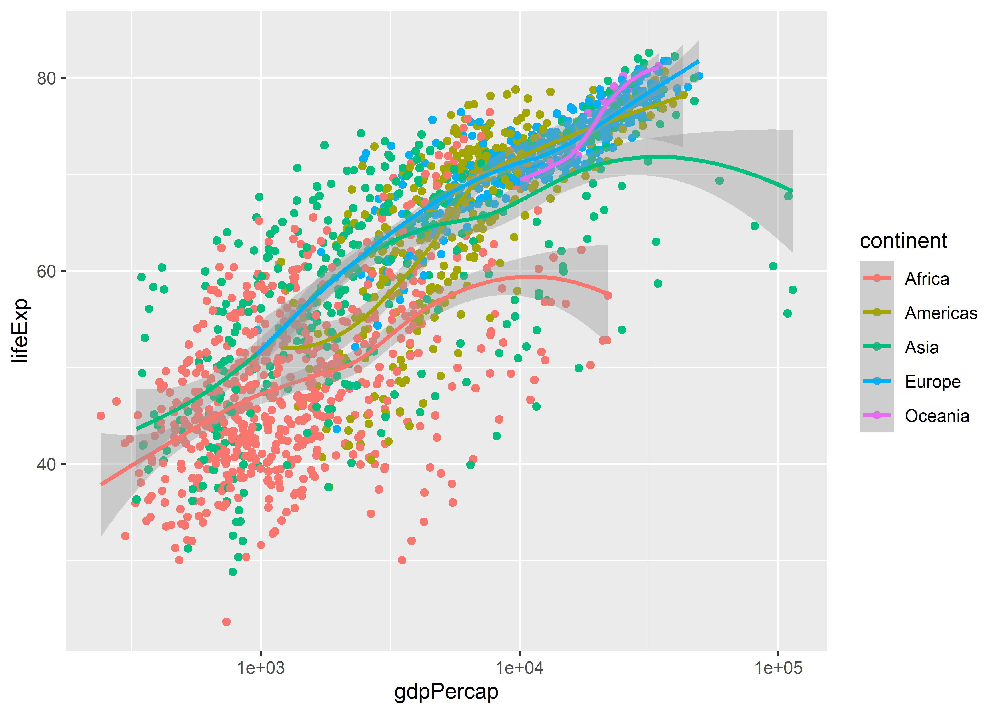
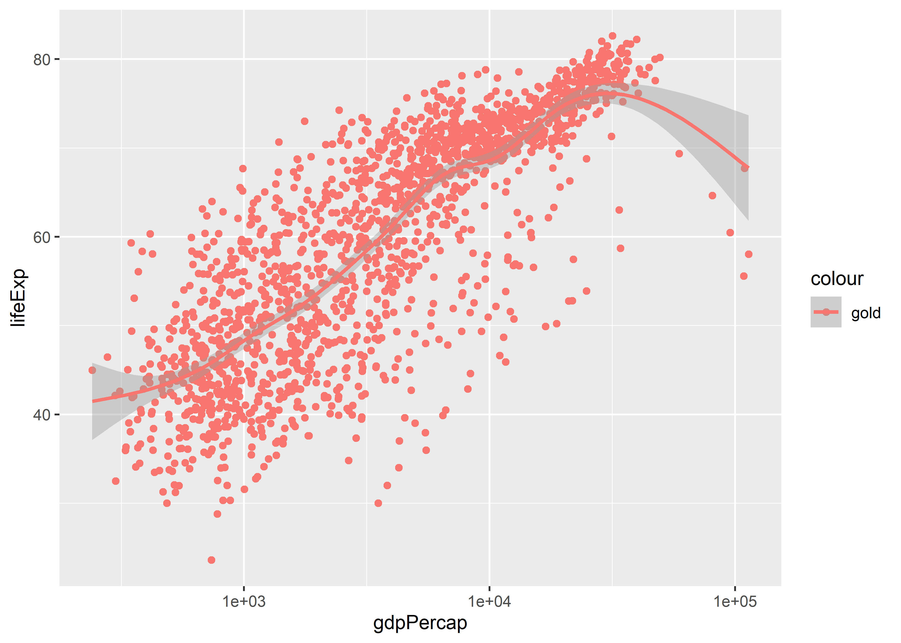
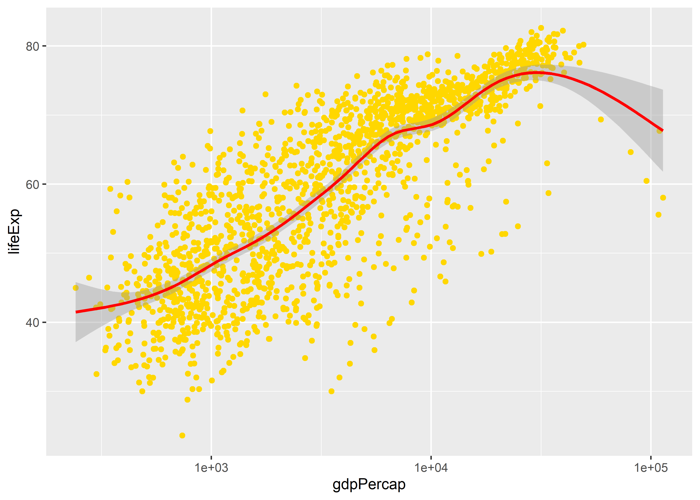
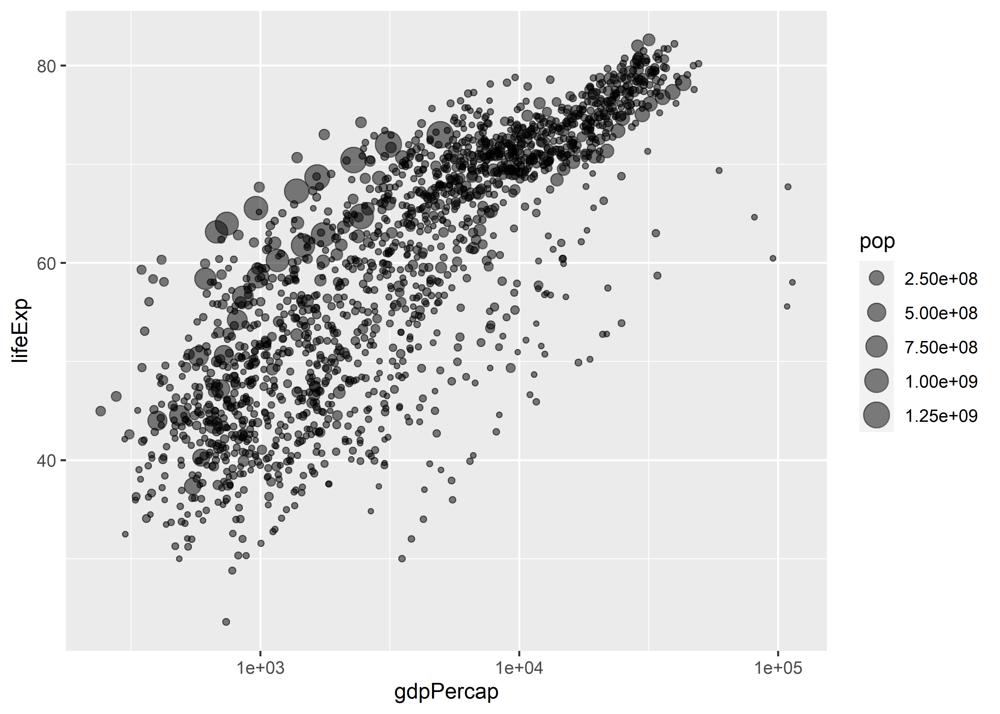
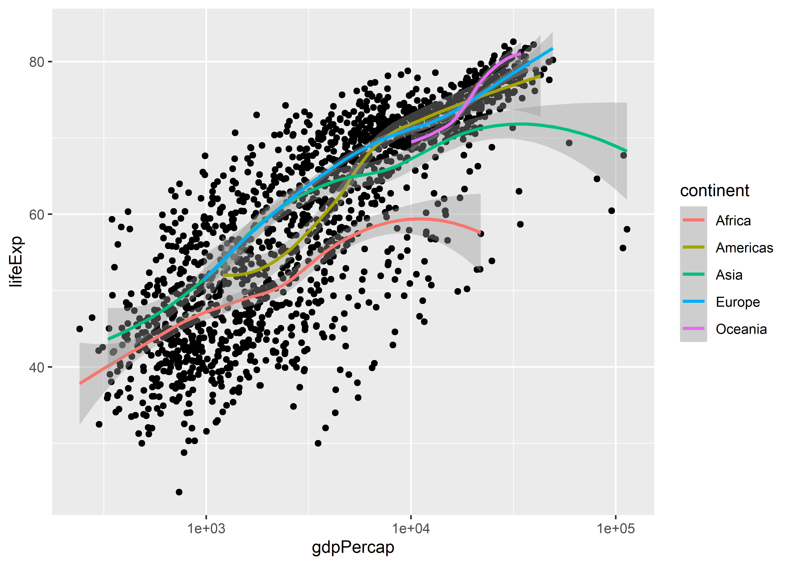
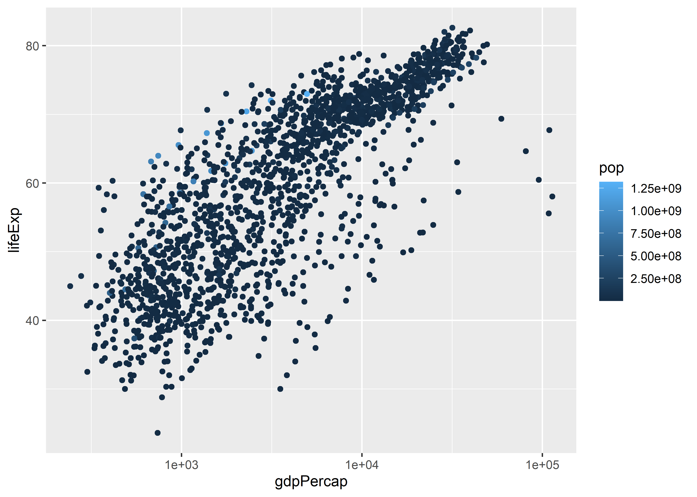
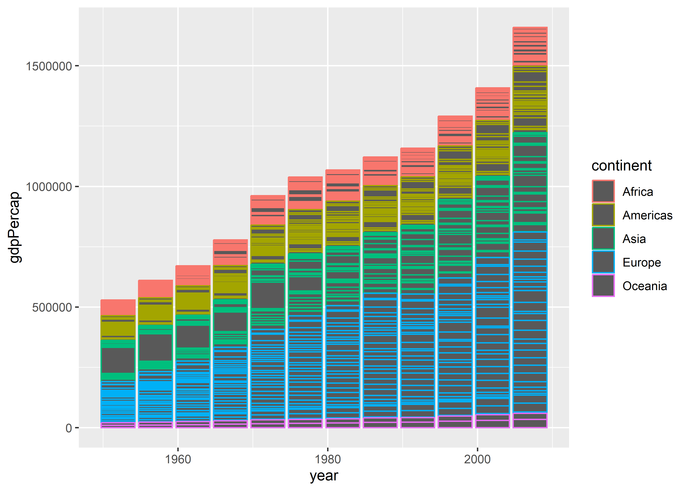
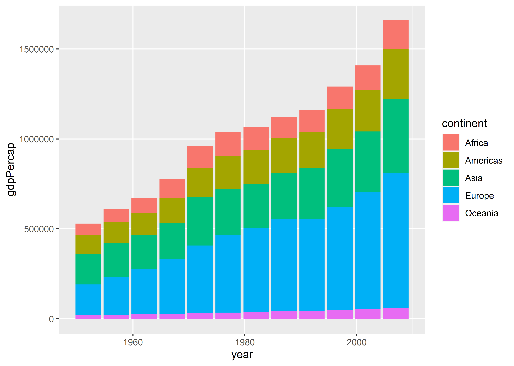

`ggplot()` Basics, Part II
================

- [Goals](#goals)
- [When to map or set aesthetics](#when-to-map-or-set-aesthetics)
- [You can map aesthetics per geom layer or
  globally](#you-can-map-aesthetics-per-geom-layer-or-globally)
- [Pick and choose your aesthetics
  wisely](#pick-and-choose-your-aesthetics-wisely)
- [How to save your plots](#how-to-save-your-plots)
- [Things to try](#things-to-try)
- [Where to next?](#where-to-next)

<center>

[\<– `ggplot()` Basics, Part
I](https://github.com/milesdwilliams15/Teaching/blob/main/DPR%20101/Notes/03_ggplot_pt1.md)
\| [Back to Notes
Homepage](https://github.com/milesdwilliams15/Teaching/blob/main/DPR%20101/Notes/README.md)
\| [Showing the Right Numbers, Part I
–\>](https://github.com/milesdwilliams15/Teaching/blob/main/DPR%20101/Notes/05_show_the_right_numbers_pt1.md)

</center>

## Goals

- Understand the difference between mapping and setting aesthetics.
- Set aesthetics globally vs. by geom.
- Know how to save your data viz.

## When to map or set aesthetics

In the previous notes, we covered some of the basics of working with
ggplot. \[[Check them out
here.](https://github.com/milesdwilliams15/Teaching/blob/main/DPR%20101/Notes/03_ggplot_pt1.md)\]

Now we’re going to go a little deeper. Remember the three-step ggplot
workflow?

1.  Feed `ggplot()` data.
2.  Tell ggplot what relationships to show using `aes()`.
3.  Tell ggplot how to show those relationships using `geom_*()`
    functions.

There are some important things to keep in mind when doing steps 2 and
3. In particular, it’s really easy to confuse when you want to *map an
aesthetic* for when you want to *set an aesthetic*.

What’s the difference?

- You map aesthetics inside the `aes()` function.
- You set aesthetics inside `geom_*()` functions.

Here’s an example. Let’s load the `gapminder` data and the `{tidyverse}`
and make a plot with ggplot where we map the color aesthetic to
continent names.

``` r
library(tidyverse)
# open the tidyverse of packages

library(gapminder)
# access the gapminder data frame

ggplot(gapminder) + 
  aes(
    x = gdpPercap, 
    y = lifeExp,
    color = continent
  ) +
  geom_point() +
  geom_smooth() + 
  scale_x_log10()
```



``` r
# produces a plot where line and point colors
# correspond with continent names
```

The above code contains a command in the `aes()` function that specifies
`color = continent`. This option tells ggplot that it should use
different colors to map to continent names.

To do this, ggplot uses a default color palette for the mapping process
(we’ll talk about how to customize this later). What it doesn’t do (at
least using `aes()`) is let you set a specific color. Look at what
happens if you try seeting `color = "gold"` inside `aes()`:

``` r
ggplot(gapminder) + 
  aes(x = gdpPercap, y = lifeExp, color = "gold") +
  geom_point() +
  geom_smooth() +
  scale_x_log10()
```



Does the output look “gold” to you? It sure doesn’t. Instead, it’s red.

This is a classic example of *mapping* an aesthetic when what we
actually need to do is *set* an aesthetic. To set the color of points
and lines, we don’t specify them inside `aes()`. Doing so leads ggplot
to mistakenly conclude that we are adding a new column to our data where
each cell entry of that column is a category called “gold.” It then
picks a color to map to that category. Since there’s only one category,
it only maps one color. The default is red.

To avoid this, we instead *set* aesthetics inside a `geom_*()` function
like so:

``` r
ggplot(gapminder) +
  aes(x = gdpPercap, y = lifeExp) +
  geom_point(
    color = "gold"
  ) +
  geom_smooth(
    color = "red"
  ) +
  scale_x_log10()
```



This terrible looking, McDonald’s colored data viz looks just like it
should. Instead of specifying color in `aes()` we specified it in the
geom layers. On top of that, we gave each layer different instructions
about the color to use. We told ggplot to color the points gold and the
smoothed regression line red.

There are lots of different aesthetics that you can either map or set
with ggplot, such as size, color, alpha (which indicates transparency),
fill, and on and on.

For example, say we wanted to map point size to population in a scatter
plot and set the transparency of points using alpha:

``` r
ggplot(gapminder) +
  aes(x = gdpPercap, y = lifeExp, size = pop) +
  geom_point(alpha = 0.5) +
  scale_x_log10()
```



The above code maps point size to the `pop` variable in the `gapminder`
data so that `geom_point()` draws larger points for observations that
have a larger population. The command `alpha = 0.5` in `geom_point()`
sets the transparency of points to 50%.

## You can map aesthetics per geom layer or globally

Not only can we map and set different aesthetics at the same time, we
can also tell ggplot just to map an aesthetic for one geom layer rather
than all of them. Look at the difference between the plot this code
produces:

``` r
ggplot(gapminder) +
  aes(x = gdpPercap, y = lifeExp, color = continent) +
  geom_point() +
  geom_smooth() +
  scale_x_log10()
```


And compare it to what this code produces:

``` r
ggplot(gapminder) +
  aes(x = gdpPercap, y = lifeExp) +
  geom_point() +
  geom_smooth(aes(color = continent)) +
  scale_x_log10()
```



The first code maps color to continent name **globally**. That means
that for each geom layer that we add, color will be mapped to
continents. Conversely, the second code chunk maps color to continents
only for the `geom_smooth()` layer. This is done by adding a new call to
`aes()` inside the geom function.

Remember in the [previous
notes](https://github.com/milesdwilliams15/Teaching/blob/main/DPR%20101/Notes/03_ggplot_pt1.md)
when I mentioned you could map variables using `aes()` in a few
different places? This is why you can do that, and this in particular is
a case where the location in your code that you include variables using
`aes()` matters for your output.

Notice, too, the difference in the legends ggplot produces for these
figures. Ggplot legends will always faithfully reflect the aesthetic
mappings you add to your plots. You can also change the location and
appearance of legends, but this is a topic we’ll cover later.

## Pick and choose your aesthetics wisely

Ggplot will dutifully map all kinds of aesthetics that you tell it to
map. That doesn’t mean that every possible mapping is a good idea.

Take the example from above where we mapped point size to population.
This was a sensible choice because people have an easy time intuiting
that point size corresponds with the ***size*** of the observation. We
could have used color instead. Would this choice have been as effective?

``` r
ggplot(gapminder) +
  aes(x = gdpPercap, y = lifeExp, color = pop) +
  geom_point() +
  scale_x_log10()
```



The answer is **no**. Here’s another example, this time for a column
plot where we’ve mapped the color of columns to continents:

``` r
ggplot(gapminder) +
  aes(x = year, y = gdpPercap, color = continent) +
  geom_col()
```



There are a lot of empty dark grey spaces in the figure. That’s because
when you produce a column plot, the color aesthetic colors the borders
of the columns; not inside. We instead need to use the fill aesthetic:

``` r
ggplot(gapminder) +
  aes(x = year, y = gdpPercap, fill = continent) +
  geom_col()
```



If you get confused about color versus fill, try to remember that you
“fill” empty spaces.

## How to save your plots

After you’ve produced your data viz, you probably will want to save it
for later use for writing a report or to share on social media or some
other outlet.

You have a lot of different options for saving your figures.

#### Copy and paste

You can copy and paste the data viz you produce directly from RStudio.
Just right click on the figure that your code chunk produce and select
copy and/or save to save it somewhere in your files.

#### Save using `ggsave()`

You can save your plots using the `ggsave()` function to save a plot
directly to somewhere in your files.

Say you created a folder in your project called `Figures`. Here’s how
you would use a combo of `here()` and `ggsave()` to save your work:

    my_plot <- ggplot(gapminder) +
      aes(x = gdpPercap, y = lifeExp, size = pop) +
      geom_point(alpha = 0.5) +
      scale_x_log10()
    # save your ggplot as an object

    library(here)
    # open the here package

    ggsave(here("Figures", "my_first_figure.png"), 
           plot = my_plot)
    # save it to the Figures folder and name it
    # "my_first_figure.png" to save it as a .png file

This is my favorite and preferred way of saving a figure. The biggest
pros of using this approach are:

1.  The ability to control dimensions.
2.  The ability to control the sharpness of the figure.

You can check out these options and a lot more by writing `?ggsave()` in
the console.

## Things to try

Play around with the `gapminder` data and try out some different
aesthetics to see what happens.

You can also try out some different plot scales. I used
`scale_x_log10()` to put the x-axis on the log-10 scale in the above
figures. There are [lots of other scaling
options](https://ggplot2.tidyverse.org/reference/scale_continuous.html),
too.

Try to save some of you figures and play around with `ggsave()` options
to see what happens.

## Where to next?

<center>

[\<– `ggplot()` Basics, Part
I](https://github.com/milesdwilliams15/Teaching/blob/main/DPR%20101/Notes/03_ggplot_pt1.md)
\| [Back to Notes
Homepage](https://github.com/milesdwilliams15/Teaching/blob/main/DPR%20101/Notes/README.md)
\| [Showing the Right Numbers, Part I
–\>](https://github.com/milesdwilliams15/Teaching/blob/main/DPR%20101/Notes/05_show_the_right_numbers_pt1.md)

</center>
