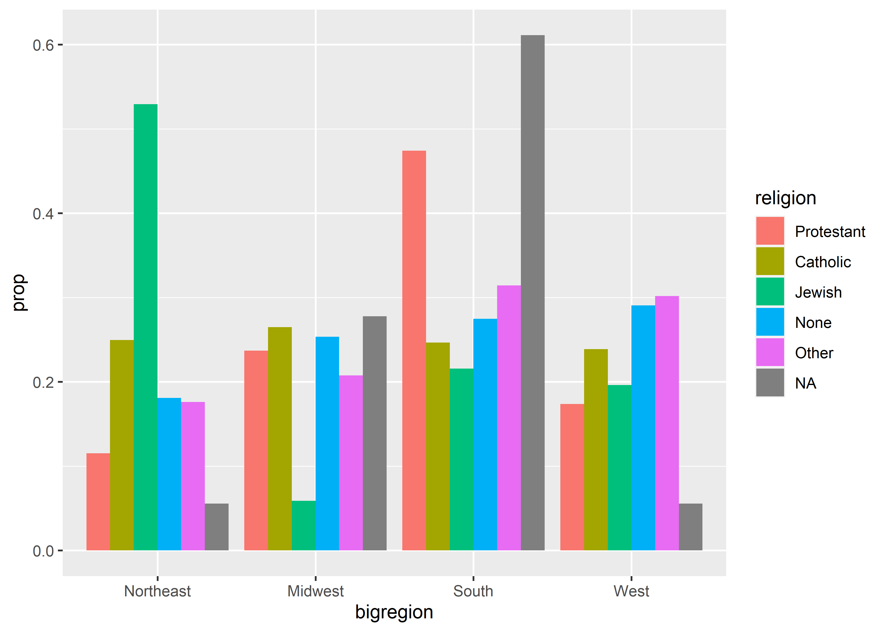
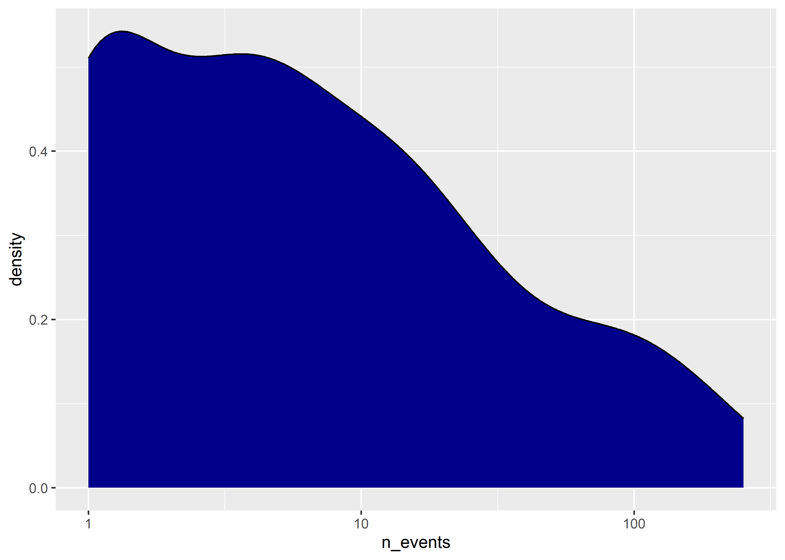

Showing the right numbers, part 2
================

- [Goals](#goals)
- [Frequency plots for showing
  summaries](#frequency-plots-for-showing-summaries)
- [Show distributions](#show-distributions)
- [Don’t transform if you don’t have
  to](#dont-transform-if-you-dont-have-to)
- [Where to next?](#where-to-next)

<center>

[\<– Show the Right Numbers, Part
I](https://github.com/milesdwilliams15/Teaching/blob/main/DPR%20101/Notes/05_show_the_right_numbers_pt1.md)
\| [Back to Notes
Homepage](https://github.com/milesdwilliams15/Teaching/blob/main/DPR%20101/Notes/README.md)
\| [Drawing Maps, Part I
–\>](https://github.com/milesdwilliams15/Teaching/blob/main/DPR%20101/Notes/07_drawing_maps_pt1.md)

</center>

## Goals

- Use ggplot to summarize data.
- Use ggplot to show distributions.
- Show why transforming data *before* plotting is more efficient.

## Frequency plots for showing summaries

Some geoms transform or summarize the data for us when we plot it. We
talked about using `geom_bar()` to do this before. This function really
shines when we want to break the data down by multiple categories at
once—imagine the data viz equivalent of a cross-tab.

``` r
library(tidyverse)
```

    ## ── Attaching packages ─────────────────────────────────────── tidyverse 1.3.2 ──
    ## ✔ ggplot2 3.4.0     ✔ purrr   0.3.4
    ## ✔ tibble  3.2.1     ✔ dplyr   1.1.2
    ## ✔ tidyr   1.2.0     ✔ stringr 1.4.0
    ## ✔ readr   2.1.2     ✔ forcats 0.5.1

    ## Warning: package 'ggplot2' was built under R version 4.2.2

    ## Warning: package 'tibble' was built under R version 4.2.3

    ## Warning: package 'dplyr' was built under R version 4.2.3

    ## ── Conflicts ────────────────────────────────────────── tidyverse_conflicts() ──
    ## ✖ dplyr::filter() masks stats::filter()
    ## ✖ dplyr::lag()    masks stats::lag()

``` r
library(socviz)

ggplot(gss_sm) + 
  aes(x = bigregion, fill = religion) +
  geom_bar()
```


The above summarizes the number of observations by census region in the
GSS 2016 dataset from the `{socviz}` package. By mapping fit to
religion, it further breaks down the count by self-identified region
among survey respondents.

By updating just one option we can convert this output from a raw count
to a proportion.

``` r
ggplot(gss_sm) +
  aes(x = bigregion, fill = religion) +
  geom_bar(position = "fill")
```


By setting `position = "fill"` the output now shows proportions by our x
variable. We can now see the share of respondents by region that
self-identify with a particular religion. We also could show the
proportions side-by-side to make comparisons even clearer, but we have
to take a few more steps than you might think. For example, say we tried
using `position = "dodge"`:

``` r
ggplot(gss_sm) +
  aes(x = bigregion, fill = religion) +
  geom_bar(position = "dodge")
```


The bars appear side-by-side, but we’re back to showing counts. Maybe we
should try mapping `y` to `..prop..`?

``` r
ggplot(gss_sm) +
  aes(x = bigregion, y = ..prop.., fill = religion) +
  geom_bar(
    position = "dodge"
  )
```

    ## Warning: The dot-dot notation (`..prop..`) was deprecated in ggplot2 3.4.0.
    ## ℹ Please use `after_stat(prop)` instead.
    ## This warning is displayed once every 8 hours.
    ## Call `lifecycle::last_lifecycle_warnings()` to see where this warning was
    ## generated.


Shoot! That didn’t work either. The final step we need to take is to map
groups to `religion`, too.

``` r
ggplot(gss_sm) +
  aes(x = bigregion, 
      y = ..prop.., 
      fill = religion,
      group = religion) +
  geom_bar(
    position = "dodge"
  )
```



If we don’t like having to do two mappings for a single variable, we
instead could facet by region to avoid the need to map the fill
aesthetic.

``` r
ggplot(gss_sm) +
  aes(
    x = religion,
    y = ..prop..,
    group = bigregion
  ) +
  geom_bar(
    position = "dodge"
  ) +
  facet_wrap(
    ~ bigregion
  )
```


The above is, in some ways, much better than using fill. The above
provides a nice summary of the distribution of religious affiliations
across different regions in the U.S. It also makes it clear that
proportions are based on region.

## Show distributions

Speaking of *distributions*, bar plots provide a useful way to show the
distribution of observations across discrete categories. We can use
other geoms to summarize numerical variables, too.

Here’s some data on fatalities from “militarized interstate events” from
2001 to 2014. Each row in the data is a country that was part of some
kind of a militarized event involving another country. These events fall
below the level of full-scale war. For each country, the data contains
the number of recorded events from 2001 to 2014 and estimates of the
minimum and maximum number of total fatalities associated with these
events for the country involved.

``` r
path <- "https://raw.githubusercontent.com/milesdwilliams15/Teaching/main/DPR%20101/Data/MIE_2000-2014.csv"
mie_data <- read_csv(path)
```

    ## Rows: 121 Columns: 5
    ## ── Column specification ────────────────────────────────────────────────────────
    ## Delimiter: ","
    ## chr (1): country
    ## dbl (4): ccode1, n_events, fatalmin, fatalmax
    ## 
    ## ℹ Use `spec()` to retrieve the full column specification for this data.
    ## ℹ Specify the column types or set `show_col_types = FALSE` to quiet this message.

``` r
glimpse(mie_data)
```

    ## Rows: 121
    ## Columns: 5
    ## $ ccode1   <dbl> 2, 20, 42, 51, 80, 90, 91, 93, 94, 95, 100, 101, 110, 115, 13…
    ## $ n_events <dbl> 159, 14, 3, 1, 4, 2, 9, 1, 1, 1, 12, 11, 2, 4, 6, 3, 1, 73, 7…
    ## $ fatalmin <dbl> 76, 0, 0, 0, 0, 0, 0, 0, 0, 0, 0, 0, 0, 0, 0, 0, 0, 24, 0, 0,…
    ## $ fatalmax <dbl> 102, 0, 0, 0, 0, 0, 0, 0, 0, 0, 0, 0, 0, 0, 0, 0, 0, 71, 0, 0…
    ## $ country  <chr> "United States", "Canada", "Dominican Republic", "Jamaica", "…

Just like `geom_bar()` summarizes discrete data, `geom_histogram()`
summarizes continuous data. For example, we can use it to summarize the
distribution of event counts:

``` r
ggplot(mie_data) +
  aes(x = n_events) +
  geom_histogram()
```

    ## `stat_bin()` using `bins = 30`. Pick better value with `binwidth`.


Histograms work by putting continuous variables into “bins” and then
counting up the number of observations that fall into those bins. If we
want, we can directly adjust the number of bins in a ggplot histogram.
The below code sets `bins = 10`.

``` r
ggplot(mie_data) +
  aes(x = n_events) +
  geom_histogram(
    bins = 10
  )
```


We can also group data to show its distribution by different categories.
For example, we can show counts by world regions. Our data don’t have a
column for regions, but we can add one with some help from the
`mutate()` function and the `countrycode()` function from the
`{countrycode}` package (write `install.packages("countrycode")` to
install it).

``` r
## add new column called "region" to the data
mie_data <- mutate(
  mie_data,
  region = countrycode::countrycode(
    country, "country.name", "region"
  )
)

## draw histogram with fill mapped to region
ggplot(mie_data) +
  aes(x = n_events, fill = region) +
  geom_histogram()
```

    ## `stat_bin()` using `bins = 30`. Pick better value with `binwidth`.


Notice that when we map fill to region that the counts are stacked on
top of each other. If we don’t want them stacked we can tell ggplot to
instead plot by “identity”.

``` r
ggplot(mie_data) +
  aes(x = n_events, fill = region) +
  geom_histogram(
    position = "identity",
    alpha = 0.5
  )
```

    ## `stat_bin()` using `bins = 30`. Pick better value with `binwidth`.


We also have enough regions that a small multiple plot might be better.

``` r
ggplot(mie_data) +
  aes(x = n_events) +
  geom_histogram() +
  facet_wrap(~ region)
```

    ## `stat_bin()` using `bins = 30`. Pick better value with `binwidth`.


An alternative to binning with a histogram is a density plot. This uses
a smooth function to represent the distribution of a continuous
variable:

``` r
ggplot(mie_data) +
  aes(x = n_events) +
  geom_density()
```


An annoying thing about density plots is that ggplot only shows us a
line representing the density function. I personally prefer to have the
area under the density function shaded in. Do do this, we can just set
the fill aesthetic inside `geom_density()` to a color of our choice:

``` r
ggplot(mie_data) +
  aes(x = n_events) +
  geom_density(
    fill = "darkblue"
  )
```


We can also modify the scales when showing continuous distributions. For
example, the distribution of the number of events is pretty skewed.
Log-transforming the data might make the data look a little more
[normal](https://en.wikipedia.org/wiki/Normal_distribution).

``` r
ggplot(mie_data) +
  aes(x = n_events) +
  geom_density(
    fill = "darkblue"
  ) +
  scale_x_log10()
```



How does it look to you now?

## Don’t transform if you don’t have to

You often can and should transform data before you give it to ggplot. I
don’t recommend this in the case of showing histograms or density plots,
but I do if you want to summarize data by certain categories like we’ve
done previously with `geom_bar()`.

Say for example I wanted to show the proportion of events by world
regions. I could us `geom_bar()` and add `y = ..prop..` and `group = 1`
in the `aes()` function. Or, I could use some other functions to
summarize the data *before* I give it to ggplot. Check it out:

``` r
## make a new summary data object
mie_props <- mie_data |>
  group_by(region) |>
  summarize(
    events = sum(n_events),
    .groups = "drop"
  ) |>
  mutate(
    prop = events / sum(events)
  )

## make a column plot using it
ggplot(mie_props) +
  aes(x = prop, y = reorder(region, prop)) +
  geom_col()
```


The above code introduces some new functions and syntax. For example, I
used three new functions: `group_by()`, `summarize()`, and `mutate()`. I
also used a pipe operator: `|>`. We’ll talk about these things in more
detail later, so keep these functions and syntax in your back pocket.

At this point you may be asking why it’s necessary to transform the data
before giving it to ggplot? In the case of this simple example, the
value add is less clear. This will change when we introduce more complex
data transformations and summaries into the mix. You can only go so far
with “under the hood” transformations using geom functions. Knowing how
to transform you data before you plot it is a necessary skill, and one
that will up your data visualization game many times over once you get
the hang of it.

## Where to next?

<center>

[\<– Show the Right Numbers, Part
I](https://github.com/milesdwilliams15/Teaching/blob/main/DPR%20101/Notes/05_show_the_right_numbers_pt1.md)
\| [Back to Notes
Homepage](https://github.com/milesdwilliams15/Teaching/blob/main/DPR%20101/Notes/README.md)
\| [Drawing Maps, Part I
–\>](https://github.com/milesdwilliams15/Teaching/blob/main/DPR%20101/Notes/07_drawing_maps_pt1.md)

</center>
