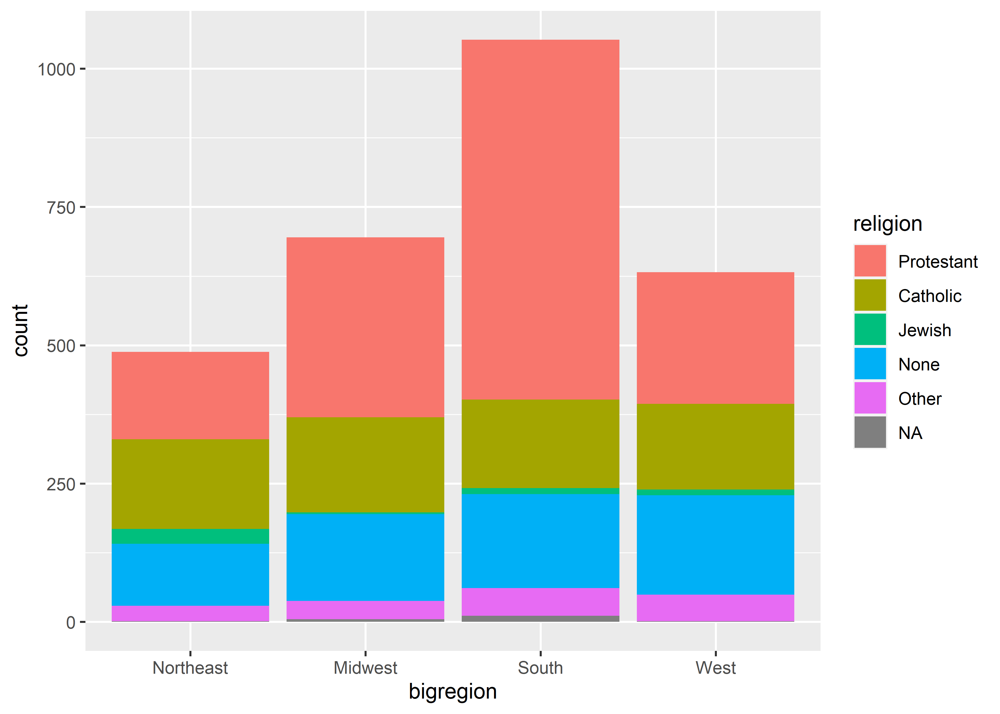
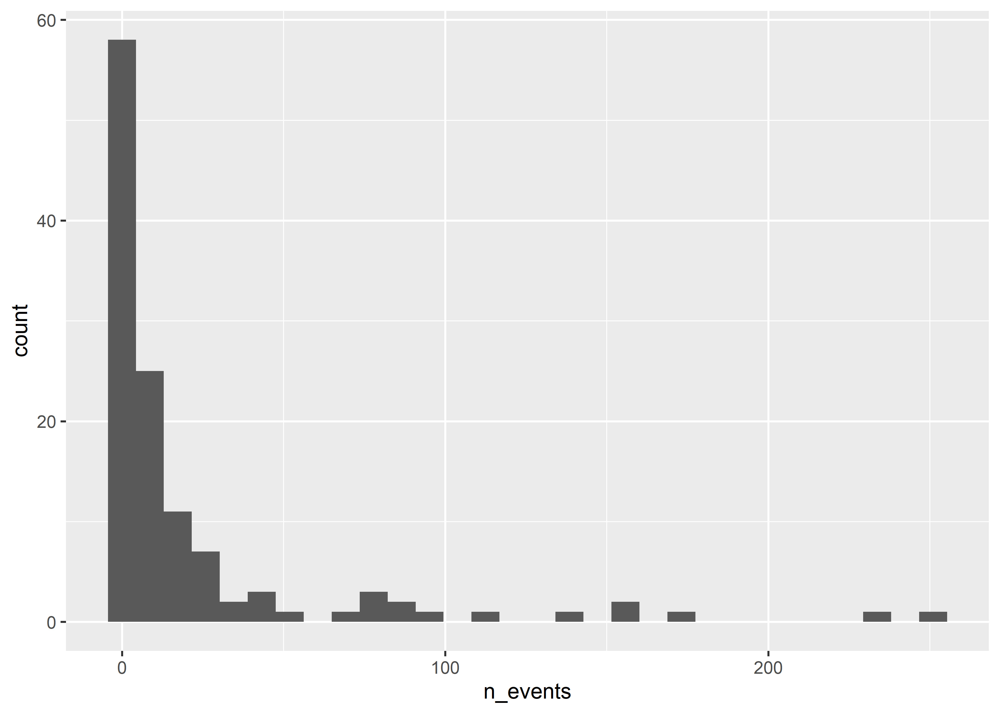
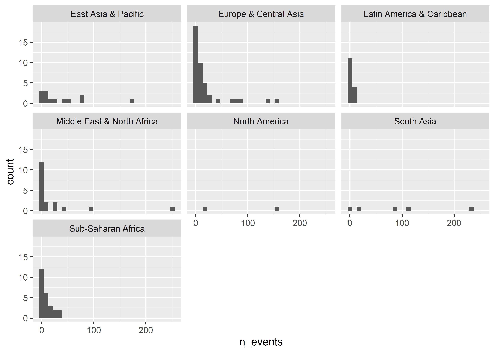

Showing the right numbers, part 2
================

## Goals

-   Use ggplot to summarize data.
-   Use ggplot to show distributions.
-   Show why transforming data *before* plotting is more efficient.

## Frequency plots for showing summaries

Some geoms transform or summarize the data for us when we plot it. We
talked about using `geom_bar()` last time. This function really shines
when we want to break the data down by multiple categories at
once—imagine the data viz equivalent of a cross-tab.

``` r
library(tidyverse)
```

    ## Warning in system("timedatectl", intern = TRUE): running command 'timedatectl'
    ## had status 1

    ## ── Attaching packages ─────────────────────────────────────── tidyverse 1.3.2 ──
    ## ✔ ggplot2 3.4.0     ✔ purrr   0.3.4
    ## ✔ tibble  3.1.8     ✔ dplyr   1.0.9
    ## ✔ tidyr   1.2.0     ✔ stringr 1.4.0
    ## ✔ readr   2.1.2     ✔ forcats 0.5.1
    ## ── Conflicts ────────────────────────────────────────── tidyverse_conflicts() ──
    ## ✖ dplyr::filter() masks stats::filter()
    ## ✖ dplyr::lag()    masks stats::lag()

``` r
library(socviz)

ggplot(gss_sm) + 
  aes(x = bigregion, fill = religion) +
  geom_bar()
```

<!-- -->

The above summarizes the number of observations by census region in the
GSS 2016 dataset from the `{socviz}` package. By mapping fit to
religion, it further breakds down the count by self-identified region
among survey respondents.

By updating just one option we can convert this output from a raw count
to a proportion.

``` r
ggplot(gss_sm) +
  aes(x = bigregion, fill = religion) +
  geom_bar(position = "fill")
```

<!-- -->

By setting `position = "fill"` the output now shows proportions by our x
variable. We can now see the share of respondents by region that
self-identy with a particular religion.

We could show the proportions side-by-side to make comparisons even
clearer. But we have to take a few more steps than you might think. For
example, say we tried using `position = "dodge`:

``` r
ggplot(gss_sm) +
  aes(x = bigregion, fill = religion) +
  geom_bar(position = "dodge")
```

<!-- -->

The bars appear side-by-side, but we’re back to showing counts. Maybe we
should try mapping `y` to `..prop..`?

``` r
ggplot(gss_sm) +
  aes(x = bigregion, y = ..prop.., fill = religion) +
  geom_bar(
    position = "dodge"
  )
```

    ## Warning: The dot-dot notation (`..prop..`) was deprecated in ggplot2 3.4.0.
    ## ℹ Please use `after_stat(prop)` instead.

<!-- -->

Shoot! That didn’t work either. The final step we need to take is to map
groups to `religion`, too.

``` r
ggplot(gss_sm) +
  aes(x = bigregion, 
      y = ..prop.., 
      fill = religion,
      group = religion) +
  geom_bar(
    position = "dodge"
  )
```

<!-- -->

Instead of mapping fill to religion, we could facet by region to avoid
the need to map fill.

``` r
ggplot(gss_sm) +
  aes(
    x = religion,
    y = ..prop..,
    group = bigregion
  ) +
  geom_bar(
    position = "dodge"
  ) +
  facet_wrap(
    ~ bigregion
  )
```

<!-- -->

## Show distributions

Bar plots provide a useful way to show the distribution of observations
across discrete categories. We can use other geoms to summarize
numerical variables.

Here’s some data on fatalities from political violence events, including
battles, protests, etc., in Ukraine. The data is at the month level from
2018 to 2022.

``` r
path <- here::here("DPR 101", "Data", "ukraine_political_violence.csv")
ukraine_data <- read_csv(path)
```

    ## Rows: 61 Columns: 5
    ## ── Column specification ────────────────────────────────────────────────────────
    ## Delimiter: ","
    ## chr (2): Country, Month
    ## dbl (3): Year, Events, Fatalities
    ## 
    ## ℹ Use `spec()` to retrieve the full column specification for this data.
    ## ℹ Specify the column types or set `show_col_types = FALSE` to quiet this message.

``` r
str(ukraine_data)
```

    ## spc_tbl_ [61 × 5] (S3: spec_tbl_df/tbl_df/tbl/data.frame)
    ##  $ Country   : chr [1:61] "Ukraine" "Ukraine" "Ukraine" "Ukraine" ...
    ##  $ Year      : num [1:61] 2018 2018 2018 2018 2018 ...
    ##  $ Month     : chr [1:61] "January" "February" "March" "April" ...
    ##  $ Events    : num [1:61] 716 1058 797 1103 1297 ...
    ##  $ Fatalities: num [1:61] 53 26 35 39 179 118 51 89 85 72 ...
    ##  - attr(*, "spec")=
    ##   .. cols(
    ##   ..   Country = col_character(),
    ##   ..   Year = col_double(),
    ##   ..   Month = col_character(),
    ##   ..   Events = col_double(),
    ##   ..   Fatalities = col_double()
    ##   .. )
    ##  - attr(*, "problems")=<externalptr>

Just like `geom_bar()` summarizes discrete data, `geom_histogram()`
summarizes continuous data. For example, we can use it to summarize the
distribution of fatalities in political violence events in a given
month:

``` r
ggplot(ukraine_data) +
  aes(x = Fatalities) +
  geom_histogram()
```

    ## `stat_bin()` using `bins = 30`. Pick better value with `binwidth`.

<!-- -->

Histograms work by putting continuous variables into “bins” and then
counting up the number of observations that fall into those bins. We can
directly adjust the number of bins in a ggplot histogram. The below code
sets `bins = 10`.

``` r
ggplot(ukraine_data) +
  aes(x = Fatalities) +
  geom_histogram(
    bins = 10
  )
```

<!-- -->
We can also group data to show its distribution by different categories.
For example, by year:

``` r
ggplot(ukraine_data) +
  aes(x = Fatalities, fill = as.factor(Year)) +
  geom_histogram(
    position = "identity",
    alpha = 0.5
  ) 
```

    ## `stat_bin()` using `bins = 30`. Pick better value with `binwidth`.

<!-- -->

An alternative to binning with a histogram is a density plot. This uses
a smooth function to represent the distribution of a continuous
variable:

``` r
ggplot(ukraine_data) +
  aes(x = Fatalities) +
  geom_density()
```

<!-- -->

We can also group by different categories in the data:

``` r
ggplot(ukraine_data) +
  aes(x = Fatalities, color = as.factor(Year)) +
  geom_density()
```

    ## Warning: Groups with fewer than two data points have been dropped.

    ## Warning in max(ids, na.rm = TRUE): no non-missing arguments to max; returning
    ## -Inf

<!-- -->

We can also modify the scales when showing continuous distributions. For
example, when showing fatality data from political conflicts, applying
log scales to both the x and y axis might be a good idea. Conflict
fatalities are thought to follow a
[power-law](https://en.wikipedia.org/wiki/Power_law) distribution which
has the distinct characteristic of being linear in log-log space.

``` r
ggplot(ukraine_data) +
  aes(x = Fatalities) +
  geom_density() +
  scale_x_log10() +
  scale_y_log10() 
```

<!-- -->

Kinda’ bumpy, but could be close to linear.

## Don’t transform if you don’t have to

You often can and should transform data before you give it to ggplot.
This can help you avoid some of the weird quirks with using functions
like `geom_bar()`

Say for example I wanted to summarize the distribution of fatalities
with the Ukraine data using a method often used with power-law
distributed variables.

Rather than use a histogram, I can add a new variable to `ukraine_data`
that gives me the probability of a violence event deadlier than a given
recorded value. I then can make a log-log plot mapping observed
fatalities to x and the probability of higher fatality events to y:

``` r
ukraine_data <- ukraine_data %>%
  mutate(prob = rank(-Fatalities) / max(rank(-Fatalities)))

ggplot(ukraine_data) +
  aes(x = Fatalities, y = prob) +
  geom_point() +
  geom_smooth(
    method = "lm",
    se = F
  ) +
  scale_x_log10() +
  scale_y_log10()
```

    ## `geom_smooth()` using formula = 'y ~ x'

<!-- -->

The data has the characteristic linear relationship in log-log space
typical of power-law distributed outcomes.

Using already transformed data, we can also use a geom similar to
`geom_bar()` called `geom_col()`. Following our text, we can replicate
the column plot showing how life expectancy in the US compares to other
OECD countries over time.

``` r
ggplot(oecd_sum) +
  aes(x = year, y = diff, fill = hi_lo) +
  geom_col() +
  guides(
    fill = F
  ) +
  labs(
    x = NULL,
    y = "Difference in Years",
    title = "The US Life Expectancy Gap",
    subtitle = "Difference between US and OECD average life expectancies, 1960-2015",
    caption = "Data: OECD"
  )
```

    ## Warning: The `<scale>` argument of `guides()` cannot be `FALSE`. Use "none" instead as
    ## of ggplot2 3.3.4.

    ## Warning: Removed 1 rows containing missing values (`position_stack()`).

<!-- -->

The data `oecd_sum` already is summarized in the appropriate way to make
mapping the data to aesthetics straightforward.
