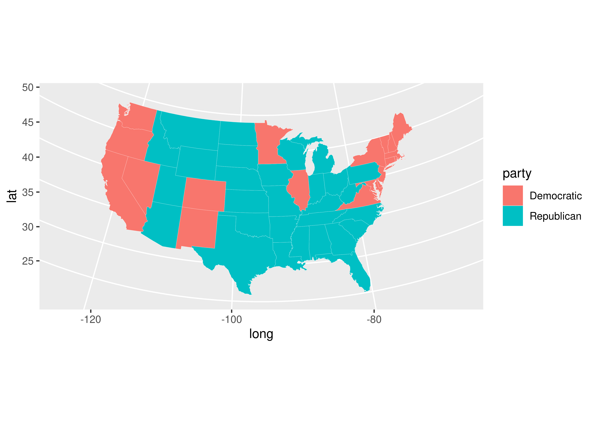

Drawing maps, part 1
================

## Goals

-   Learn how to draw maps to show distributions.
-   Get the details and scaling right.
-   Make small multiples with maps.
-   Introduce “geo facets.”

## Maps 101

You may think of maps as a unique kind of data viz. In reality, they
have a lot in common with histograms and density plots.

Consider the election dataset from the `{socviz}` package. If we want to
check out the distribution of something like Donald Trump’s vote margin
in 2016, we could make a histogram. This returns information about
common and less common margins observed across states.

``` r
library(tidyverse)
library(socviz)

ggplot(election) +
  aes(x = r_points) +
  geom_histogram(
    color = "black",
    fill = "gray"
  ) +
  labs(
    x = "Republican Margin",
    y = "Count",
    title = "Distribution of the Republican vote margin in states, 2016",
    caption = "Data: {socviz}"
  )
```


We alternatively could make a bar or column plot to connect specific
vote margins to states.

``` r
ggplot(election) +
  aes(x = reorder(st, r_points),
      y = r_points) +
  geom_col() +
  labs(
    x = NULL,
    y = "Republican Margin",
    title = "Distribution of the Republican vote margin in states, 2016",
    caption = "Data: {socviz}"
  ) +
  theme(
    axis.text.x = element_text(
      angle = 45, hjust = 1
    )
  )
```


Or, if you like, we could make a dot plot, and add some color:

``` r
ggplot(election) +
  aes(
    x = r_points,
    y = reorder(st, r_points),
    color = r_points > 0
  ) +
  geom_point(
    size = 3,
    show.legend = F
  ) +
  facet_wrap(
    ~ census,
    scales = "free_y"
  ) +
  labs(
    x = "Republican Margin",
    y = NULL,
    title = "Distribution of the Republican vote margin in states, 2016",
    caption = "Data: {socviz}"
  )
```


By faceting by region as well, we can get a sense of how Trump’s
performance in 2016 varied by geography.

We can do the same thing, and do it even better, with a map. We first
need to open the `{maps}` package which contains a number of datasets
that have the coordinates necessary to draw various country maps.

``` r
library(maps)
us_states <- map_data("state")
head(us_states)
```

    ##        long      lat group order  region subregion
    ## 1 -87.46201 30.38968     1     1 alabama      <NA>
    ## 2 -87.48493 30.37249     1     2 alabama      <NA>
    ## 3 -87.52503 30.37249     1     3 alabama      <NA>
    ## 4 -87.53076 30.33239     1     4 alabama      <NA>
    ## 5 -87.57087 30.32665     1     5 alabama      <NA>
    ## 6 -87.58806 30.32665     1     6 alabama      <NA>

The `us_states` data frame contains the longitude and latitude of state
boundaries. To get ggplot to draw a map based on these values, we don’t
really need to do anything too special. We give ggplot the data, we tell
it map x and y values to longitude and latitude, and then we use a geom:

``` r
ggplot(us_states) +
  aes(x = long, y = lat, group = group) +
  geom_polygon(
    color = "white"
  )
```


So there’s our map of the continental US! It looks a little wonky
though. We need to update some settings so that we get the proportions
right. We do that with the `coord_map()` function. We can also make the
state boundaries thinner to improve the look of the figure.

``` r
ggplot(us_states) +
  aes(x = long, y = lat, group = group) +
  geom_polygon(
    color = "white",
    size = 0.05
  ) +
  coord_map(
    projection = "albers",
    lat0 = 39,
    lat1 = 45
  )
```


So we can draw a map…how do we connect values in the `election` data to
our `us_state` data?

We need to “cross-walk” the datasets and then use a `*_join()` function
to combine them together. There are a number of join functions. In our
case, we’re going to use `left_join()`.

``` r
# cross-walk the data
election$region <- tolower(election$state)
  # we need a region column in election to match the column in us_states

# join the data
us_states_elec <- left_join(us_states, election)
```

Now we can make our map with the election data.

``` r
ggplot(us_states_elec) +
  aes(
    x = long,
    y = lat,
    group = group,
    fill = party
  ) +
  geom_polygon(
    color = "white",
    size = 0.05
  ) +
  coord_map(
    projection = "albers",
    lat0 = 39,
    lat1 = 45
  )
```



The colors are off, of course. We’ll talk more about advanced
customization options in a few weeks. As a preview, I’ve made some of
those updates below:

``` r
library(coolorrr)
set_palette(
  binary = c("blue", "red"),
  from_coolors = F
)

ggplot(us_states_elec) +
  aes(
    x = long,
    y = lat,
    group = group,
    fill = party
  ) +
  geom_polygon(
    color = "white",
    size = 0.1
  ) +
  coord_map(
    projection = "albers",
    lat0 = 39,
    lat1 = 45
  ) +
  ggpal(
    aes = "fill",
    type = "binary"
  ) +
  labs(
    title = "Election Results (2016)",
    fill = NULL
  ) +
  theme_void() +
  theme(
    legend.position = c(0.1, 0.1),
    plot.title = element_text(hjust = 0.5)
  )
```


We can also map fill to the Republican vote margin:

``` r
ggplot(us_states_elec) +
  aes(
    x = long,
    y = lat,
    group = group,
    fill = r_points
  ) +
  geom_polygon(
    color = "white",
    size = 0.05
  ) +
  coord_map(
    projection = "albers",
    lat0 = 39,
    lat1 = 45
  )
```


Here’s a cleaned up version:

``` r
ggplot(us_states_elec) +
  aes(
    x = long,
    y = lat,
    group = group,
    fill = r_points
  ) +
  geom_polygon(
    color = "white",
    size = 0.1
  ) +
  coord_map(
    projection = "albers",
    lat0 = 39,
    lat1 = 45
  ) +
  ggpal(
    type = "diverging",
    aes = "fill",
    breaks = c(-60, -30, 0, 30, 60)
  ) +
  labs(
    title = "Election Results (2016)",
    fill = "Percent Rep. Margin"
  ) +
  theme_void() +
  theme(
    legend.position = c(0.1, 0.1),
    plot.title = element_text(hjust = 0.5)
  )
```


## Mapping US counties
