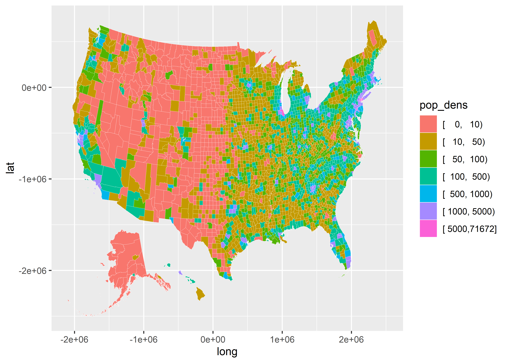

Drawing maps, part 1
================

- [Goals](#goals)
- [Maps are just ways to show
  distributions](#maps-are-just-ways-to-show-distributions)
- [Mapping US counties](#mapping-us-counties)
- [Using geofacets](#using-geofacets)
- [Use small-multiples to show change over
  time](#use-small-multiples-to-show-change-over-time)

<center>

[\<– Show the Right Numbers, Part
II](https://github.com/milesdwilliams15/Teaching/blob/main/DPR%20101/Notes/06_show_the_right_numbers_pt2.md)
\| [Back to Notes
Homepage](https://github.com/milesdwilliams15/Teaching/blob/main/DPR%20101/Notes/README.md)
\| [Drawing Maps, Part II
–\>](https://github.com/milesdwilliams15/Teaching/blob/main/DPR%20101/Notes/08_drawing_maps_pt2.md)

</center>

## Goals

- Learn how to draw maps to show distributions.
- Get the details and scaling right.
- Make small multiples with maps.
- Introduce `{geofacet}`

## Maps are just ways to show distributions

You may think maps are a unique kind of data viz. In reality, they have
a lot in common with histograms and density plots in that they’re just
another way of showing distributions.

Consider the `election` dataset from the `{socviz}` package. If we want
to check out the distribution of something like Donald Trump’s vote
margin (`r_points`) in 2016, we could make a histogram. This returns
information about common and less common margins observed across states.

``` r
library(tidyverse)
library(socviz)

ggplot(election) +
  aes(x = r_points) +
  geom_histogram(
    color = "black",
    fill = "gray"
  ) +
  labs(
    x = "Republican Margin",
    y = "Count",
    title = "Distribution of the Republican vote margin in states, 2016",
    caption = "Data: {socviz}"
  )
```


Notice in the above code I’m using a new function called `labs()`. This
is short for “labels.” As the name implies, this function lets us update
the labels of our figure like the x-axis title, the y-axis title, and
the overall title of the plot. We can also add captions (as I did
above). We can even include subtitles, too.

Okay, back to the data…

Instead of a histogram, we could make a bar or column plot to connect
specific vote margins to states.

``` r
ggplot(election) +
  aes(x = reorder(st, r_points),
      y = r_points) +
  geom_col() +
  labs(
    x = NULL,
    y = "Republican Margin",
    title = "Distribution of the Republican vote margin in states, 2016",
    caption = "Data: {socviz}"
  ) +
  theme(
    axis.text.x = element_text(
      angle = 45, hjust = 1
    )
  )
```


There I go again, adding a new function. In the above code, after I used
`labs()` I used a function called `theme()`. This function lets you
customize different features of your plot. In the above code, I updated
the `axis.text.x` option so that the text on the tick marks on the
x-axis appear at a 45 degree angle. I also adjusted the labels to be
flush with the tick marks.

For data like this we aren’t restricted to using a column plot. We could
also use points. We might even add a splash of color just for fun, and
try breaking the data down by reasons using `facet_wrap()`.

``` r
ggplot(election) +
  aes(
    x = r_points,
    y = reorder(st, r_points),
    color = r_points > 0
  ) +
  geom_point(
    size = 3,
    show.legend = F
  ) +
  facet_wrap(
    ~ census,
    scales = "free_y"
  ) +
  labs(
    x = "Republican Margin",
    y = NULL,
    title = "Distribution of the Republican vote margin in states, 2016",
    caption = "Data: {socviz}"
  )
```


This approach helps us to see specifically how geography relates to the
distribution of Trump’s vote margin.

Because the data specifically deal with the distribution of some
variable across space (U.S. states), we can also show the data using a
map. To get us set up to plot a map we can use the `map_data()` function
which comes from a package called `{maps}`. This package automatically
gets installed and opened when you open the `{tidyverse}`. We can use
this function to tell R to make a dataset that has all the latitude and
longitude coordinates we need to draw the boundaries of U.S. states:

``` r
us_states <- map_data("state")
head(us_states)
```

    ##        long      lat group order  region subregion
    ## 1 -87.46201 30.38968     1     1 alabama      <NA>
    ## 2 -87.48493 30.37249     1     2 alabama      <NA>
    ## 3 -87.52503 30.37249     1     3 alabama      <NA>
    ## 4 -87.53076 30.33239     1     4 alabama      <NA>
    ## 5 -87.57087 30.32665     1     5 alabama      <NA>
    ## 6 -87.58806 30.32665     1     6 alabama      <NA>

As you can see, the `us_states` data frame contains the longitude and
latitude of state boundaries. To get ggplot to draw a map based on these
values, we don’t really need to do anything too special. We can just
give ggplot the data, tell it to map x and y values to longitude and
latitude, and then we use a geom. The only additional step we need to do
is make sure we map the group aesthetic to the `group` column in the
data.

``` r
ggplot(us_states) +
  aes(x = long, y = lat, group = group) +
  geom_polygon(
    color = "white"
  )
```


And now we have a map of the continental US! It looks a little wonky
though. We need to update some settings so that we get the proportions
right. We can do that with the `coord_map()` function. We can also make
the state boundaries thinner to improve the look of the figure.

``` r
ggplot(us_states) +
  aes(x = long, y = lat, group = group) +
  geom_polygon(
    color = "white",
    size = 0.05
  ) +
  coord_map(
    projection = "albers",
    lat0 = 39,
    lat1 = 45
  )
```


So we can draw a map. But how do we connect values in the `election`
data to our `us_state` data?

We need to **cross-walk** the datasets and then use a `*_join()`
function to combine them together. There are a number of join functions.
In our case, we’re going to use `left_join()`. We’ll talk more about
joining later on. If you’re curious about what it’s doing, just run
`?left_join` in the console.

The main thing we need to do to merge or join the datasets together is
to ensure that they have a common column with consistent identifiers for
states. The below code adds the necessary column to the election data
and then merges the datasets together.

``` r
# cross-walk the data
election$region <- tolower(election$state)
  # we need a region column in election to match the column in us_states

# join the data
us_states_elec <- left_join(us_states, election)
```

If we look at the new dataset, `us_states_elec`, we can see that it
includes all the variables in the `election` data alongside the data
necessary to draw state boundaries from `us_states`:

``` r
glimpse(us_states_elec)
```

    ## Rows: 15,537
    ## Columns: 28
    ## $ long         <dbl> -87.46201, -87.48493, -87.52503, -87.53076, -87.57087, -8…
    ## $ lat          <dbl> 30.38968, 30.37249, 30.37249, 30.33239, 30.32665, 30.3266…
    ## $ group        <dbl> 1, 1, 1, 1, 1, 1, 1, 1, 1, 1, 1, 1, 1, 1, 1, 1, 1, 1, 1, …
    ## $ order        <int> 1, 2, 3, 4, 5, 6, 7, 8, 9, 10, 11, 12, 13, 14, 15, 16, 17…
    ## $ region       <chr> "alabama", "alabama", "alabama", "alabama", "alabama", "a…
    ## $ subregion    <chr> NA, NA, NA, NA, NA, NA, NA, NA, NA, NA, NA, NA, NA, NA, N…
    ## $ state        <chr> "Alabama", "Alabama", "Alabama", "Alabama", "Alabama", "A…
    ## $ st           <chr> "AL", "AL", "AL", "AL", "AL", "AL", "AL", "AL", "AL", "AL…
    ## $ fips         <dbl> 1, 1, 1, 1, 1, 1, 1, 1, 1, 1, 1, 1, 1, 1, 1, 1, 1, 1, 1, …
    ## $ total_vote   <dbl> 2123372, 2123372, 2123372, 2123372, 2123372, 2123372, 212…
    ## $ vote_margin  <dbl> 588708, 588708, 588708, 588708, 588708, 588708, 588708, 5…
    ## $ winner       <chr> "Trump", "Trump", "Trump", "Trump", "Trump", "Trump", "Tr…
    ## $ party        <chr> "Republican", "Republican", "Republican", "Republican", "…
    ## $ pct_margin   <dbl> 0.2773, 0.2773, 0.2773, 0.2773, 0.2773, 0.2773, 0.2773, 0…
    ## $ r_points     <dbl> 27.72, 27.72, 27.72, 27.72, 27.72, 27.72, 27.72, 27.72, 2…
    ## $ d_points     <dbl> -27.72, -27.72, -27.72, -27.72, -27.72, -27.72, -27.72, -…
    ## $ pct_clinton  <dbl> 34.36, 34.36, 34.36, 34.36, 34.36, 34.36, 34.36, 34.36, 3…
    ## $ pct_trump    <dbl> 62.08, 62.08, 62.08, 62.08, 62.08, 62.08, 62.08, 62.08, 6…
    ## $ pct_johnson  <dbl> 2.09, 2.09, 2.09, 2.09, 2.09, 2.09, 2.09, 2.09, 2.09, 2.0…
    ## $ pct_other    <dbl> 1.46, 1.46, 1.46, 1.46, 1.46, 1.46, 1.46, 1.46, 1.46, 1.4…
    ## $ clinton_vote <dbl> 729547, 729547, 729547, 729547, 729547, 729547, 729547, 7…
    ## $ trump_vote   <dbl> 1318255, 1318255, 1318255, 1318255, 1318255, 1318255, 131…
    ## $ johnson_vote <dbl> 44467, 44467, 44467, 44467, 44467, 44467, 44467, 44467, 4…
    ## $ other_vote   <dbl> 31103, 31103, 31103, 31103, 31103, 31103, 31103, 31103, 3…
    ## $ ev_dem       <dbl> 0, 0, 0, 0, 0, 0, 0, 0, 0, 0, 0, 0, 0, 0, 0, 0, 0, 0, 0, …
    ## $ ev_rep       <dbl> 9, 9, 9, 9, 9, 9, 9, 9, 9, 9, 9, 9, 9, 9, 9, 9, 9, 9, 9, …
    ## $ ev_oth       <dbl> 0, 0, 0, 0, 0, 0, 0, 0, 0, 0, 0, 0, 0, 0, 0, 0, 0, 0, 0, …
    ## $ census       <chr> "South", "South", "South", "South", "South", "South", "So…

Now we can make our map to show election outcomes. All we need to do is
make a map like before, but this time map fill to `party`, which is a
column that tells us whether the Republicans or Democrats won the
Presidential election in a given state.

``` r
ggplot(us_states_elec) +
  aes(
    x = long,
    y = lat,
    group = group,
    fill = party
  ) +
  geom_polygon(
    color = "white",
    size = 0.05
  ) +
  coord_map(
    projection = "albers",
    lat0 = 39,
    lat1 = 45
  )
```


The colors are off, of course. We’ll talk more about advanced
customization options for color palettes in a few weeks. As a preview,
I’ve made some of those updates below using the `{coolorrr}` package
which you can install by writing
`devtools::install_github("milesdwilliams15/coolorrr")`

``` r
library(coolorrr)
set_palette(
  binary = c("blue", "red"),
  from_coolors = F
)

ggplot(us_states_elec) +
  aes(
    x = long,
    y = lat,
    group = group,
    fill = party
  ) +
  geom_polygon(
    color = "white",
    size = 0.1
  ) +
  coord_map(
    projection = "albers",
    lat0 = 39,
    lat1 = 45
  ) +
  ggpal(
    aes = "fill",
    type = "binary"
  ) +
  labs(
    title = "Election Results (2016)",
    fill = NULL
  ) +
  theme_void() +
  theme(
    legend.position = c(0.1, 0.1),
    plot.title = element_text(hjust = 0.5)
  )
```


We can also map fill to the Republican vote margin:

``` r
ggplot(us_states_elec) +
  aes(
    x = long,
    y = lat,
    group = group,
    fill = r_points
  ) +
  geom_polygon(
    color = "white",
    size = 0.05
  ) +
  coord_map(
    projection = "albers",
    lat0 = 39,
    lat1 = 45
  )
```


Here’s a cleaned up version:

``` r
ggplot(us_states_elec) +
  aes(
    x = long,
    y = lat,
    group = group,
    fill = r_points
  ) +
  geom_polygon(
    color = "gray",
    size = 0.1
  ) +
  coord_map(
    projection = "albers",
    lat0 = 39,
    lat1 = 45
  ) +
  ggpal(
    type = "diverging",
    aes = "fill",
    breaks = c(-60, -30, 0, 30, 60)
  ) +
  labs(
    title = "Election Results (2016)",
    fill = "Percent Rep. Margin"
  ) +
  theme_void() +
  theme(
    legend.position = c(0.1, 0.1),
    plot.title = element_text(hjust = 0.5)
  )
```


## Mapping US counties

We can get even more granular with our visualizations. Let’s merge
`county_map` and `county_data` from the `{socviz}` package. Using this
data we draw a map to show the distribution of county-level variables.

``` r
county_map_data <- left_join(county_map, county_data, "id")
```

Let’s try looking at population density. Notice that we don’t have to
use `coord_map()` to fix the proportions this time. The `county_map`
data comes to us with already pre-adjusted coordinates to draw the lines
of the map.

``` r
ggplot(county_map_data) +
  aes(x = long, y = lat, group = group,
      fill = pop / land_area) +
  geom_polygon(
    color = "white",
    size = 0.1
  )
```


Hmmm, not so great. That’s probably because population density is pretty
skewed. We can confirm that by making a histogram:

``` r
ggplot(county_data) +
  aes(x = pop / land_area) +
  geom_histogram()
```


This is a case where finding a way to make the data discrete or changing
its scale would be nice. Thankfully, we already have a column in the
data that has a discrete version of population density. We can use that
instead.

``` r
ggplot(county_map_data) +
  aes(
    x = long,
    y = lat,
    group = group,
    fill = pop_dens
  ) +
  geom_polygon(
    color = "white",
    size = 0.1
  ) 
```



Again, this is a case where we would want to make some updates to the
color palette. Here’s an example with some of those more advanced tools
I used earlier.

``` r
ggplot(county_map_data) +
  aes(
    x = long,
    y = lat,
    group = group,
    fill = as.numeric(pop_dens)
  ) +
  geom_polygon(
    color = "black",
    size = 0.1
  ) +
  ggpal(
    type = "sequential",
    aes = "fill",
    labels = c("0-10", "10-50", "50-100", "100-500", "500-1K", "1K-5K", "5K+")
  ) +
  labs(
    title = "Population Density",
    fill = "Population per\nsquare mile"
  ) +
  theme_void() +
  theme(
    plot.title = element_text(hjust = 0.5)
  )
```


## Using geofacets

Maps are great, but sometimes the detail they provide is unnecessary or
even distracting. At the same time, giving a sense for how things are
organized spatially can help to communicate effectively with data.

There’s a great package called `{geofacet}` that lets us find a happy
medium.

Let’s open the package and use the `election` data to make a small
multiple with `facet_geo()`:

``` r
library(geofacet)

ggplot(election) +
  aes(
    x = st,
    y = 1,
    fill = pct_trump,
    label = round(pct_trump)
  ) +
  geom_tile(
    show.legend = F
  ) +
  geom_text(
    color = "white"
  ) +
  facet_geo(
    ~ st,
    scales = "free"
  ) +
  ggpal(
    type = "diverging",
    aes = "fill",
    midpoint = 50
  ) +
  labs(
    title = "Trump's vote shares (2016)"
  ) +
  theme_void() 
```


In the above, I used a geometry layer called `geom_tile()`. This
function tells ggplot to draw tiles (hence the name). If we didn’t facet
the plot, here’s what it would look like:

``` r
ggplot(election) +
  aes(
    x = st,
    y = 1,
    fill = pct_trump,
    label = round(pct_trump)
  ) +
  geom_tile(
    show.legend = F
  ) +
  geom_text(
    color = "white"
  ) +
  ggpal(
    type = "diverging",
    aes = "fill",
    midpoint = 50
  ) +
  labs(
    title = "Trump's vote shares (2016)"
  ) +
  theme_void()
```


Woof!

Here’s what it would look like if we just used a normal facet.

``` r
ggplot(election) +
  aes(
    x = st,
    y = 1,
    fill = pct_trump,
    label = round(pct_trump)
  ) +
  geom_tile(
    show.legend = F
  ) +
  geom_text(
    color = "white"
  ) +
  facet_wrap(
    ~ st,
    scales = "free"
  ) +
  ggpal(
    type = "diverging",
    aes = "fill",
    midpoint = 50
  ) +
  labs(
    title = "Trump's vote shares (2016)"
  ) +
  theme_void()
```


Geo-faceting is clearly the way to go for this data. You can think of
`facet_geo()` as a way to update a faceted grid based on the
geographical location of observations.

## Use small-multiples to show change over time

Above, we used small-multiples with a geographically informed
arrangement to make something like a map. We can also use
small-multiples with actual maps to show how trends evolve over time.

Here’s an example using the gapminder dataset. Let’s access the data and
look at the year column.

``` r
library(gapminder)
unique(gapminder$year)
```

    ##  [1] 1952 1957 1962 1967 1972 1977 1982 1987 1992 1997 2002 2007

We have a bunch of years in the data. To keeps things simple, let’s just
pick three years:

``` r
years_to_keep <- c(1957, 1982, 2007)
gapminder_sm <- gapminder |>
  filter(year %in% years_to_keep)
```

Remember, this dataset is for countries, so instead of a map of only the
U.S. we need a map of the world. The below code uses the `map_data()`
function to get the coordinates to draw a world map. It then joins this
data with the gapminder dataset:

``` r
world_map <- map_data("world")

## cross-walk the data
gapminder_sm <- gapminder_sm |>
  mutate(
    country = countrycode::countrycode(
      country, "country.name", "country.name"
    )
  )
world_map <- world_map |>
  mutate(
    country = countrycode::countrycode(
      region, "country.name", "country.name"
    )
  )

## merge
world_data <- left_join(
  world_map, gapminder_sm, by = "country"
) 
```

We now have what we need to draw three different maps, one for 1957, one
for 1982, and one for 2007. Let’s show how life expectancy has changed
across countries over time:

``` r
ggplot(drop_na(world_data, year)) +
  aes(
    x = long,
    y = lat,
    group = group
  ) +
  geom_polygon(
    data = world_map,
    color = "black",
    size = 0.1,
    fill = "lightgray"
  ) +
  geom_polygon(
    aes(fill = lifeExp),
    color = "black",
    size = 0.1
  ) +
  facet_wrap(
    ~ year,
    ncol = 2
  ) +
  coord_fixed() +
  # Adding some special sauce...
  ggpal(
    type = "sequential",
    aes = "fill"
  ) +
  labs(
    caption = "Life Expectancy over Time",
    fill = "Avg. Life Expectancy"
  ) +
  theme_void() +
  theme(
    legend.position = c(0.7, 0.3),
    legend.direction = "horizontal",
    legend.title = element_text(hjust = 0.5)
  ) +
  guides(
    fill = guide_legend(title.position = "top")
  )
```


And there we go!

<center>

[\<– Show the Right Numbers, Part
II](https://github.com/milesdwilliams15/Teaching/blob/main/DPR%20101/Notes/06_show_the_right_numbers_pt2.md)
\| [Back to Notes
Homepage](https://github.com/milesdwilliams15/Teaching/blob/main/DPR%20101/Notes/README.md)
\| [Drawing Maps, Part II
–\>](https://github.com/milesdwilliams15/Teaching/blob/main/DPR%20101/Notes/08_drawing_maps_pt2.md)

</center>
