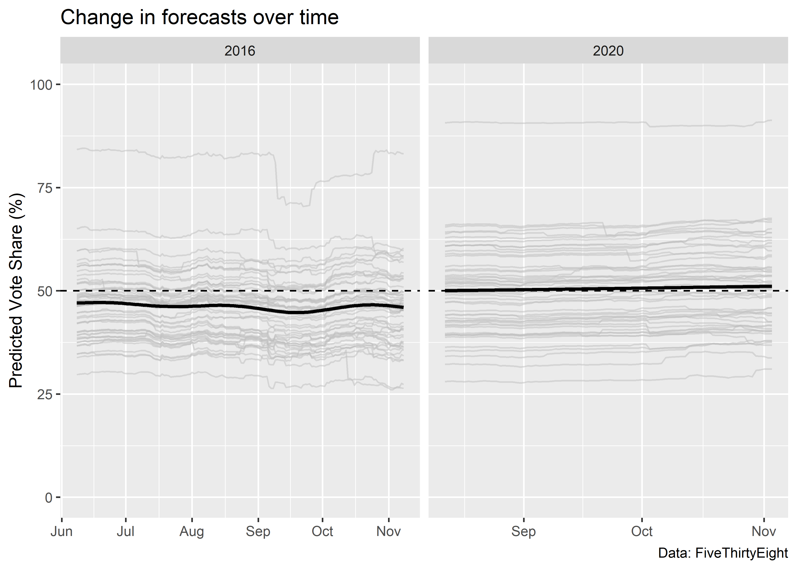
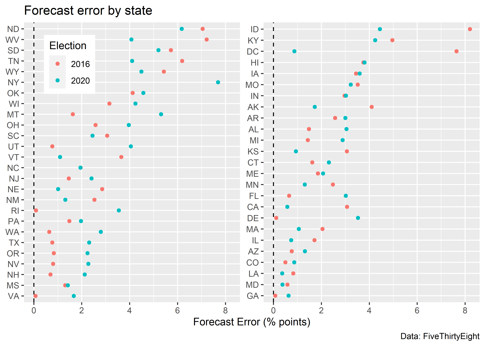
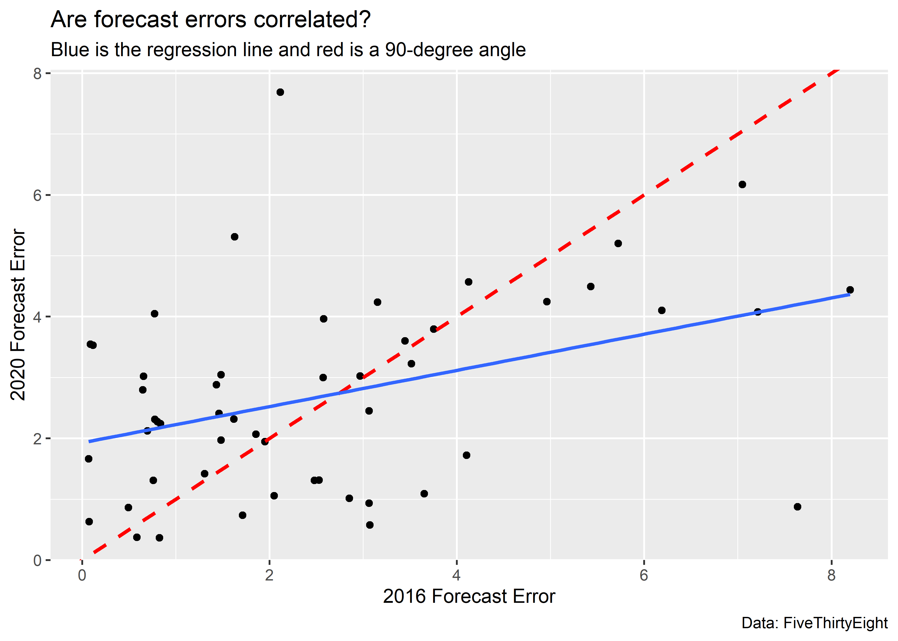
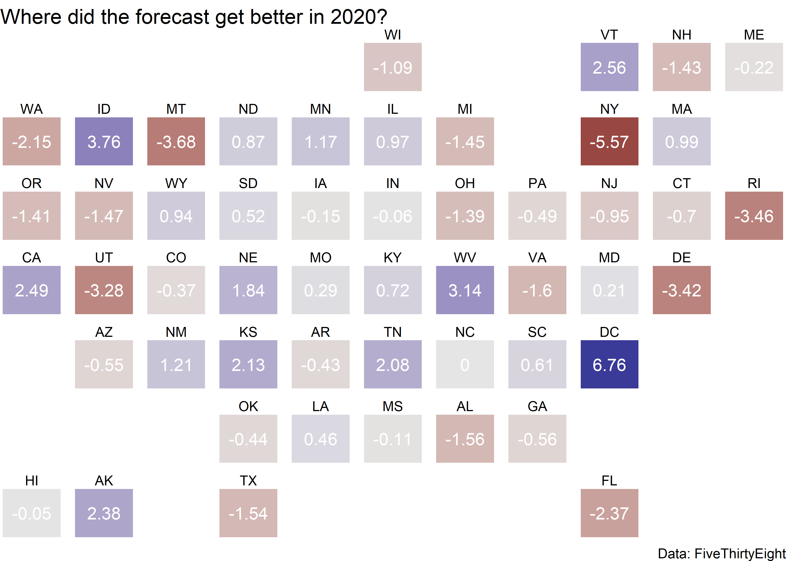

Drawing maps, Part II
================

- [Goals](#goals)
- [When NOT to draw a map](#when-not-to-draw-a-map)
- [You can use maps to complement other
  visualizations](#you-can-use-maps-to-complement-other-visualizations)
- [Where to next?](#where-to-next)

<center>

[\<– Drawing Maps, Part
I](https://github.com/milesdwilliams15/Teaching/blob/main/DPR%20101/Notes/07_drawing_maps_pt1.md)
\| [Back to Notes
Homepage](https://github.com/milesdwilliams15/Teaching/blob/main/DPR%20101/Notes/README.md)
\| [Modifying Data, Labels, and Notes, Part I
–\>](https://github.com/milesdwilliams15/Teaching/blob/main/DPR%20101/Notes/09_modifying_data_lables_and_notes_pt1.md)

</center>

## Goals

- Understand when a map is and isn’t an appropriate visualization
  choice.
- Talk about how to incorporate maps into a broader project.

## When NOT to draw a map

The first question you should ask yourself when making a data
visualization is: *what do I want to show?*

If you want to show the *spatial distribution* of a variable (how some
quantity differs across geographical locations) a map may be a good
visualization choice. But, if you want to show other kinds of
distributions, like how opinions on issues differ between Republicans
and Democrats or how support for democratic institutions has changed
over time, a map may be a poor choice.

Let’s look at some FiveThirtyEight forecast data from the 2016 and 2020
US Presidential elections. This data gives us information about all of
the state-level predictions for Biden in 2020 and for Clinton in 2016
across the range of dates for which FiveThirtyEight created forecasts
for the respective election years.

``` r
url <- "https://raw.githubusercontent.com/milesdwilliams15/Teaching/main/DPR%20101/Data/538_prez_forecast.csv"
library(tidyverse)
forecast_data <- read_csv(url)
```

If we look at the data with the `glimpse()` function from `{dplyr}`, we
can see it has six columns.

``` r
glimpse(forecast_data)
```

    ## Rows: 12,138
    ## Columns: 6
    ## $ forecast_date       <date> 2020-11-03, 2020-11-03, 2020-11-03, 2020-11-03, 2…
    ## $ state               <chr> "WY", "WI", "WV", "WA", "VA", "VT", "UT", "TX", "T…
    ## $ projected_voteshare <dbl> 31.04658, 53.68898, 33.77089, 60.76666, 55.77469, …
    ## $ actual_voteshare    <dbl> 26.55357, 49.44954, 29.69510, 57.97030, 54.10952, …
    ## $ probwin             <dbl> 0.001625, 0.943575, 0.007175, 0.991550, 0.990225, …
    ## $ probwin_outcome     <dbl> 0, 1, 0, 1, 1, 1, 0, 0, 0, 0, 0, 1, 1, 1, 0, 0, 0,…

By using `glimpse()` we can see a number of features about the data. For
example, the variable `forecast_date` is a “date” class variable. This
is a special kind of class in R reserved especially for dates.

We can also see that `state` is a character vector. That means that R
treats it like an unordered categorical variable.

It also has four variables of class “double” which is R-speak for
non-integer real numbers.

If we look at the range of dates we can see that the forecast data is
not just for 2020 but also for 2016. The `range()` function tells us the
minimum and maximum values of numerical or ordered data. In this case,
it can tell us the earliest and latest date in the dataset.

``` r
range(forecast_data$forecast_date)
```

    ## [1] "2016-06-08" "2020-11-03"

Let’s add a column to the data that tells us which predictions are for
2020 and which are for 2016. We’ll do this using the `ifelse()`
function, which for a given logical condition, will do one of two things
that we tell it to do. In this case, if a row in the dataset has a date
before 2020, we’ll tell `ifelse()` to return 2016. Otherwise, it will
return 2020.

``` r
forecast_data |> # give the data to mutate()
  mutate( # tell mutate to add a new column called election
    election = ifelse(
      forecast_date < "2020-01-01",
      2016, # use ifelse() to return "2016" for dates before 2020
      2020  # and to return "2020" otherwise
    ) 
  ) -> forecast_data
```

Using this data, we can plot the trends in Biden’s and Clinton’s
projected vote shares in 2020 and 2016, respectively.

``` r
ggplot(forecast_data) +
  aes(x = forecast_date, y = projected_voteshare,
      group = state) +
  geom_line(color = "grey", alpha = 0.5) +
  facet_wrap(~ election, scales = "free_x") +
  labs(
    x = NULL,
    y = "Predicted Vote Share",
    title = "Change in forecasts over time",
    caption = "Data: FiveThirtyEight"
  )
```


We can include an overall trend line and a horizontal line at 50% on the
y-axis, and change the range of values shown on the y-axis to encompass
all values between 0 and 100, too.

``` r
ggplot(forecast_data) +
  aes(x = forecast_date, y = projected_voteshare) +
  geom_line(
    aes(group = state),
    color = "grey", alpha = 0.5
  ) +
  facet_wrap(~ election, scales = "free_x") +
  labs(
    x = NULL,
    y = "Predicted Vote Share (%)",
    title = "Change in forecasts over time",
    caption = "Data: FiveThirtyEight"
  ) +
  geom_hline(
    yintercept = 50,
    linetype = 2
  ) +
  geom_smooth(
    color = "black"
  ) +
  ylim(c(0, 100))
```



From this figure a few things are apparent. First, predictions in 2020
were much more stable compared to 2016. Second, Biden’s average
predicted performance across states was above 50% for nearly the entire
period FiveThirtyEight made their predictions in 2020. The average
prediction across states for Clinton never exceeded the 50% threshold.

From a visualization standpoint, something else is clear: it would be
really hard to show this information using a map. There are too many
dates. Even though the data is for states (geographical units),
incorporating information about the spatial distribution of these
forecasts is unwise.

## You can use maps to complement other visualizations

Just because maps aren’t always an appropriate choice for showing some
distributions or relationships, that doesn’t mean you have to avoid them
entirely. In fact, when writing a report, using many kinds of
visualizations can be a helpful way to show an audience data from
multiple angles. A map could be one among many elements that help you
tell a story with data.

Let’s try out an example by filtering the forecast data down to the
election nights in 2016 and 2020. Our goal will be to summarize
variation in election night forecast errors and draw comparisons between
2016 and 2020.

``` r
## filter the data:
elect_night <- forecast_data |>
  ## group by the election year
  group_by(election) |>
  ## keep the latest date per election year
  slice_max(forecast_date, n = 1)

## add a measure of prediction error:
elect_night <- elect_night |>
  mutate(
    error = abs(projected_voteshare - actual_voteshare)
  )
```

With our data in hand we might start simple, say with a bar plot
summarizing the errors in each election on election night:

``` r
elect_night |>
  group_by(election) %>%
  summarize(
    mean_error = mean(error)
  ) |>
  ggplot() +
  aes(x = as.factor(election), y = mean_error) +
  geom_col(width = 0.5) +
  labs(
    x = "Election",
    y = "Average Forecast Error (% points)",
    title = "Did FiveThirtyEight's forecasts get worse in 2020?",
    caption = "Data: FiveThirtyEight"
  )
```


It looks like, on average, FiveThirtyEight’s prediction errors on
election night in 2020 weren’t much different compared with 2016. But is
this consistent across states? The next visualization breaks this down
by individual states:

``` r
elect_night |>
  mutate(
    first25 = state %in% sort(unique(state))[1:25]
  ) %>%
  ggplot() +
  aes(x = error, 
      y = reorder(state, error), 
      color = as.factor(election)) +
  geom_vline(
    xintercept = 0,
    linetype = 2
  ) +
  geom_point() +
  labs(
    x = "Forecast Error (% points)",
    y = NULL,
    title = "Forecast error by state",
    caption = "Data: FiveThirtyEight",
    color = "Election"
  ) +
  facet_wrap(
    ~ first25,
    scales = "free_y",
    ncol = 2
  ) +
  theme(
    strip.text = element_blank(),
    legend.position = c(0.1, 0.85)
  )
```



Errors definitely were worse in some states relative to others. And
while prediction error was better in some cases in 2020, it was even
worse in others. Is this just pure noise, or are the errors made in 2016
correlated with errors made in 2020? We can put together a scatter plot
with a trend line and a line at a 90-degree angle to see.

``` r
elect_night |>
  select(
    election, state, error
  ) |>
  pivot_wider(
    values_from = error,
    names_from = election
  ) |>
  ggplot() +
  aes(x = `2016`, y = `2020`) +
  geom_point() +
  geom_abline(
    slope = 1,
    intercept = 0,
    linetype = 2,
    color = "red",
    size = 1
  ) +
  geom_smooth(
    method = "lm",
    se = F
  ) +
  labs(
    x = "2016 Forecast Error",
    y = "2020 Forecast Error",
    title = "Are forecast errors correlated?",
    subtitle = "Blue is the regression line and red is a 90-degree angle",
    caption = "Data: FiveThirtyEight"
  )
```



There is a clear positive relationship, which suggests that there may be
some systematic biases in FiveThirtyEight’s prediction model. However,
the errors are not 1-to-1 correlated. Notice how the regression line has
a shallower slope than the 90-degree angle? This is a classic example of
a phenomenon called *reversion* or *regression to the mean*. Places
where FiveThirtyEight’s forecast did exceptionally well (better than
average) in 2016 tended to see an increase in prediction error in 2020,
while places where the forecast error was exceptionally bad (worse than
average) in 2016 tended to see an improvement in prediction error in
2020.

As a final step in telling a story about FiveThirtyEight’s forecast
errors, we might conclude by summarizing where prediction errors
worsened or improved in 2020 relative to 2016. This is an ideal task for
a map, but instead of making a full blown map, we can just use a
geofaceted small multiple. The below figure shows the percentage point
improvement in FiveThirtyEight’s forecast in different states in 2020
relative to 2016. Positive values mean that the forecast was more
accurate, and negative values mean it was less accurate. We can see that
across states the forecast seemed to generally get worse in 2020; though
there were some pockets of improvement.

``` r
library(geofacet)
elect_night |>
  group_by(state) |>
  summarize(
    improvement = -diff(error)
  ) |>
  ggplot() +
  aes(
    x = 1,
    y = 1,
    label = round(improvement, 2),
    fill = improvement
  ) +
  geom_tile(
    show.legend = F
  ) +
  geom_text(
    color = "white"
  ) +
  labs(
    title = "Where did the forecast get better in 2020?",
    caption = "Data: FiveThirtyEight"
  ) +
  facet_geo(~ state, scales = "free") +
  scale_fill_gradient2(mid = "gray90") +
  theme_void()
```



This is all just hypothetical, and the order in which I did this
analysis is not the order you should use every time. As always, think
about your audience, your data, and what story you want to tell, and
base your data visualization choices around that.

## Where to next?

<center>

[\<– Drawing Maps, Part
I](https://github.com/milesdwilliams15/Teaching/blob/main/DPR%20101/Notes/07_drawing_maps_pt1.md)
\| [Back to Notes
Homepage](https://github.com/milesdwilliams15/Teaching/blob/main/DPR%20101/Notes/README.md)
\| [Modifying Data, Labels, and Notes, Part I
–\>](https://github.com/milesdwilliams15/Teaching/blob/main/DPR%20101/Notes/09_modifying_data_lables_and_notes_pt1.md)

</center>
