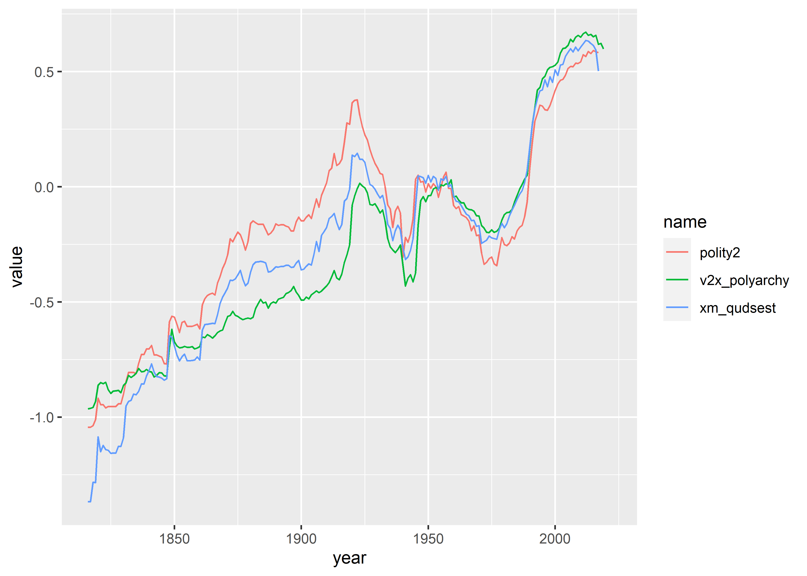

Modifying data with `{dplyr}` and `{tidyr}`
================

- [Goals](#goals)
- [Using `{dplyr}` for data mutation and
  summaries](#using-dplyr-for-data-mutation-and-summaries)
  - [filter()](#filter)
  - [arrange()](#arrange)
  - [select()](#select)
  - [mutate()](#mutate)
  - [summarize() and group_by()](#summarize-and-group_by)
- [From summarizing to plotting](#from-summarizing-to-plotting)
- [Pivoting data with `{tidyr}`](#pivoting-data-with-tidyr)
- [Where to next?](#where-to-next)

<center>

[\<– Drawing Maps, Part
II](https://github.com/milesdwilliams15/Teaching/blob/main/DPR%20101/Notes/08_drawing_maps_pt2.md)
\| [Back to Notes
Homepage](https://github.com/milesdwilliams15/Teaching/blob/main/DPR%20101/Notes/README.md)
\| [Layer Complexity and Adding Labels and Text
–\>](https://github.com/milesdwilliams15/Teaching/blob/main/DPR%20101/Notes/10_modifying_data_labels_and_notes_pt2.md)

</center>

## Goals

- Apply the main `{dplyr}` functions to mutate and summarize a dataset.
- Layer complexity by chaining together multiple `{dplyr}` functions.
- Use `{tidyr}` functions to reshape datasets.

## Using `{dplyr}` for data mutation and summaries

The `{dplyr}` package is a powerful tool for letting us transform a
dataframe into what we need for analysis and data visualization. This
package is part of the `{tidyverse}` and is automatically opened when
you use `library(tidyverse)`.

There are 6 key `{dplyr}` functions that you need to know about:

- `filter()`: Choose observations based on their values (==, !=, \>, \<,
  \>=, \<=)
- `arrange()`: Reorder the rows of a dataset based on the values of a
  variable
- `select()`: Choose variables (columns) based on their names
- `mutate()`: Create new variables or modify existing ones
- `summarize()`: Collapse many variables into a single summary
- `group_by()`: Specify the scope of the function that you want to
  perform (for example, calculate the average votes cast for a candidate
  by education level). ORDERING MATTERS!

We’ll start by opening the tidyverse as always:

``` r
library(tidyverse)
```

While the functions available with `{dplyr}` are functions, sometimes we
call them “verbs”, and they all take input in a similar structure.

`filter(data, colname == "value" & colname >= 1000)`

We can chain together multiple dplyr “layers”, like with ggplot, but to
do this we use the `|>` pipe instead of `+`. We’ve already seen this in
action in some previous code. Once upon a time, to pipe we need to use
the slightly more verbose `|>`. You can still use this version of the
pipe, but the most up-to-date version of R provides `|>` as a new
alternative. There are just a few minor differences in how they work,
but these differences usually don’t matter, except for one. A nice
feature of `|>` is that it is computationally faster than `|>` (in
addition to being slightly quicker to write). If you have a lot of code
to run and lots of computations to deal with, any small efficiency gain
is a win.

Here’s how the workflow generally works:

1.  First, we start with data object.
2.  Then, we add arguments that describe what to do with the data, using
    the column (variable) names. Note that we don’t need to put the
    column names in quotes. Because we’ve already specified the data
    object that they are contained in, R will be able to find them as a
    “known” object.
3.  The output is a new data frame, which we can save as a new object.

For example, say we wanted to create a smaller version of our dataset
that only contains certain observations. We would write:

    filtered_data <- data |>
        filter(column_name == "some text")

To filter data correctly, we need to know how to use the comparison
operators:

- Greater than `>`
- Less than `<`
- Greater than or equal to `>=`
- Less than or equal to `<=`
- Equal to `==`
- Not equal to `!=`
- In `%in%`
- Is NA? `is.na()`

Aside: Recall some common mathematical operators (should follow order of
operations).

- addition `+`
- subtraction `-`
- multiplication `*`
- division `/`
- square `^2`

We also need to know the logical operators

- and `&`
- or `|`
- not `!`

Let’s try using filter with some data from the `{peacesciencer}`
package.

You may need to install the package first:

    install.packages("peacesciencer")

Then you can open it:

``` r
library(peacesciencer)
```

This package has a lot of useful data for studying conflict, which is a
core subject of study in the political science field called
international relations or IR.

We can call the data we want and customize it using a variety of
functions (and we can do this all using the `|>` operator!).

``` r
## start with function that creates state-year data
create_stateyears() |>
  ## then use this function to add major power indicators
  add_cow_majors() |>
  ## add indicators for whether countries experience civil war
  add_cow_wars(type = "intra") |>
  ## add information about the quality of democracy in countries
  add_democracy() |>
  ## add economic info
  add_sdp_gdp() -> Data
```

In the above, we made a dataset where the unit of observation is a
country-year and for each observation we have information about:

1.  Whether the country is classified as a “major power.”
2.  Whether the country experienced a intra-state war or civil war.
3.  Information about the quality of democracy.
4.  Information about economic well being.

We can use the `dim()` function to check out the size of the data.

``` r
dim(Data)
```

    ## [1] 17121    21

With this data, we’ll walk through the different `{dplyr}` “verbs” for
manipulating data.

### filter()

Let’s just practice filter first, which we’ve already seen in action.
Let’s say we only want data for major powers. When an observation is a
major power, the data codes it as 1. So if we write the following, we’ll
only keep the rows in the data where a country is a major power:

``` r
Data |>
  filter(cowmaj == 1)
```

    ## # A tibble: 2,365 × 21
    ##    ccode statenme               year cowmaj warnum warname wartype cowintraonset
    ##    <dbl> <chr>                 <dbl>  <dbl>  <dbl> <chr>   <chr>           <dbl>
    ##  1     2 United States of Ame…  1898      1     NA <NA>    <NA>                0
    ##  2     2 United States of Ame…  1899      1     NA <NA>    <NA>                0
    ##  3     2 United States of Ame…  1900      1     NA <NA>    <NA>                0
    ##  4     2 United States of Ame…  1901      1     NA <NA>    <NA>                0
    ##  5     2 United States of Ame…  1902      1     NA <NA>    <NA>                0
    ##  6     2 United States of Ame…  1903      1     NA <NA>    <NA>                0
    ##  7     2 United States of Ame…  1904      1     NA <NA>    <NA>                0
    ##  8     2 United States of Ame…  1905      1     NA <NA>    <NA>                0
    ##  9     2 United States of Ame…  1906      1     NA <NA>    <NA>                0
    ## 10     2 United States of Ame…  1907      1     NA <NA>    <NA>                0
    ## # ℹ 2,355 more rows
    ## # ℹ 13 more variables: cowintraongoing <dbl>, intnl <dbl>, outcome <dbl>,
    ## #   sideadeaths <dbl>, sidebdeaths <dbl>, intrawarnums <chr>,
    ## #   v2x_polyarchy <dbl>, polity2 <dbl>, xm_qudsest <dbl>, wbgdp2011est <dbl>,
    ## #   wbpopest <dbl>, sdpest <dbl>, wbgdppc2011est <dbl>

OK but what if we want to filter on two variables. Say we wanted major
powers that also are experiencing civil wars? We just include the and
operator `&` and include a new logical condition:

``` r
Data |>
  filter(cowmaj == 1 & cowintraongoing == 1)
```

    ## # A tibble: 61 × 21
    ##    ccode statenme         year cowmaj warnum warname       wartype cowintraonset
    ##    <dbl> <chr>           <dbl>  <dbl>  <dbl> <chr>         <chr>           <dbl>
    ##  1   220 France           1830      1    513 First French… centra…             1
    ##  2   220 France           1848      1    552 Second Frenc… centra…             1
    ##  3   220 France           1871      1    596 Paris Commune centra…             1
    ##  4   300 Austria-Hungary  1848      1    554 Hungarian     local …             1
    ##  5   300 Austria-Hungary  1849      1    554 Hungarian     local …             0
    ##  6   365 Russia           1818      1    500 First Caucas… local …             1
    ##  7   365 Russia           1819      1    500 First Caucas… local …             0
    ##  8   365 Russia           1820      1    500 First Caucas… local …             0
    ##  9   365 Russia           1821      1    500 First Caucas… local …             0
    ## 10   365 Russia           1822      1    500 First Caucas… local …             0
    ## # ℹ 51 more rows
    ## # ℹ 13 more variables: cowintraongoing <dbl>, intnl <dbl>, outcome <dbl>,
    ## #   sideadeaths <dbl>, sidebdeaths <dbl>, intrawarnums <chr>,
    ## #   v2x_polyarchy <dbl>, polity2 <dbl>, xm_qudsest <dbl>, wbgdp2011est <dbl>,
    ## #   wbpopest <dbl>, sdpest <dbl>, wbgdppc2011est <dbl>

OK but what if we want to filter on two variables but make it either-or?
We just use the or operator `|` instead:

``` r
Data |>
  filter(cowmaj == 1 | cowintraongoing == 1)
```

    ## # A tibble: 3,235 × 21
    ##    ccode statenme               year cowmaj warnum warname wartype cowintraonset
    ##    <dbl> <chr>                 <dbl>  <dbl>  <dbl> <chr>   <chr>           <dbl>
    ##  1     2 United States of Ame…  1861      0    572 U.S. C… local …             1
    ##  2     2 United States of Ame…  1862      0    572 U.S. C… local …             0
    ##  3     2 United States of Ame…  1863      0    572 U.S. C… local …             0
    ##  4     2 United States of Ame…  1864      0    572 U.S. C… local …             0
    ##  5     2 United States of Ame…  1865      0    572 U.S. C… local …             0
    ##  6     2 United States of Ame…  1898      1     NA <NA>    <NA>                0
    ##  7     2 United States of Ame…  1899      1     NA <NA>    <NA>                0
    ##  8     2 United States of Ame…  1900      1     NA <NA>    <NA>                0
    ##  9     2 United States of Ame…  1901      1     NA <NA>    <NA>                0
    ## 10     2 United States of Ame…  1902      1     NA <NA>    <NA>                0
    ## # ℹ 3,225 more rows
    ## # ℹ 13 more variables: cowintraongoing <dbl>, intnl <dbl>, outcome <dbl>,
    ## #   sideadeaths <dbl>, sidebdeaths <dbl>, intrawarnums <chr>,
    ## #   v2x_polyarchy <dbl>, polity2 <dbl>, xm_qudsest <dbl>, wbgdp2011est <dbl>,
    ## #   wbpopest <dbl>, sdpest <dbl>, wbgdppc2011est <dbl>

Note: `filter()` only includes rows where the condition is `TRUE`. So if
we want to keep in NA (missing) values, then we need to ask for them
explicitly, for example:

What would we do if we wanted only rows where values in a column were
blank (indicated by NA on the computer). Would this work?

    Data |>
      filter(warnum == NA)

Nope! Since NA is a special value that indicates missing data, it cannot
be equal to anything, or not equal to anything. This means we can only
include or exclude NA using functions designed to do that. For example,
is.na() or na.rm=TRUE. The example below would work:

``` r
Data |>
  filter(is.na(warnum))
```

    ## # A tibble: 16,190 × 21
    ##    ccode statenme               year cowmaj warnum warname wartype cowintraonset
    ##    <dbl> <chr>                 <dbl>  <dbl>  <dbl> <chr>   <chr>           <dbl>
    ##  1     2 United States of Ame…  1816      0     NA <NA>    <NA>                0
    ##  2     2 United States of Ame…  1817      0     NA <NA>    <NA>                0
    ##  3     2 United States of Ame…  1818      0     NA <NA>    <NA>                0
    ##  4     2 United States of Ame…  1819      0     NA <NA>    <NA>                0
    ##  5     2 United States of Ame…  1820      0     NA <NA>    <NA>                0
    ##  6     2 United States of Ame…  1821      0     NA <NA>    <NA>                0
    ##  7     2 United States of Ame…  1822      0     NA <NA>    <NA>                0
    ##  8     2 United States of Ame…  1823      0     NA <NA>    <NA>                0
    ##  9     2 United States of Ame…  1824      0     NA <NA>    <NA>                0
    ## 10     2 United States of Ame…  1825      0     NA <NA>    <NA>                0
    ## # ℹ 16,180 more rows
    ## # ℹ 13 more variables: cowintraongoing <dbl>, intnl <dbl>, outcome <dbl>,
    ## #   sideadeaths <dbl>, sidebdeaths <dbl>, intrawarnums <chr>,
    ## #   v2x_polyarchy <dbl>, polity2 <dbl>, xm_qudsest <dbl>, wbgdp2011est <dbl>,
    ## #   wbpopest <dbl>, sdpest <dbl>, wbgdppc2011est <dbl>

### arrange()

We haven’t seen this yet, but it works similarly to `filter()`, except
instead of selecting rows, it changes their order - Kind of like using
“sort” in Excel, except you know that you won’t accidentally sort just
the one row and scramble all your data.

Let’s sort the dataset by year:

``` r
Data |>
  arrange(year)
```

    ## # A tibble: 17,121 × 21
    ##    ccode statenme               year cowmaj warnum warname wartype cowintraonset
    ##    <dbl> <chr>                 <dbl>  <dbl>  <dbl> <chr>   <chr>           <dbl>
    ##  1     2 United States of Ame…  1816      0     NA <NA>    <NA>                0
    ##  2   200 United Kingdom         1816      1     NA <NA>    <NA>                0
    ##  3   210 Netherlands            1816      0     NA <NA>    <NA>                0
    ##  4   220 France                 1816      1     NA <NA>    <NA>                0
    ##  5   225 Switzerland            1816      0     NA <NA>    <NA>                0
    ##  6   230 Spain                  1816      0     NA <NA>    <NA>                0
    ##  7   235 Portugal               1816      0     NA <NA>    <NA>                0
    ##  8   245 Bavaria                1816      0     NA <NA>    <NA>                0
    ##  9   255 Germany                1816      1     NA <NA>    <NA>                0
    ## 10   267 Baden                  1816      0     NA <NA>    <NA>                0
    ## # ℹ 17,111 more rows
    ## # ℹ 13 more variables: cowintraongoing <dbl>, intnl <dbl>, outcome <dbl>,
    ## #   sideadeaths <dbl>, sidebdeaths <dbl>, intrawarnums <chr>,
    ## #   v2x_polyarchy <dbl>, polity2 <dbl>, xm_qudsest <dbl>, wbgdp2011est <dbl>,
    ## #   wbpopest <dbl>, sdpest <dbl>, wbgdppc2011est <dbl>

OK, cool, but what if we want to see the most recent years first? We can
specify the order, and change the default:

``` r
Data |>
  arrange(desc(year))
```

    ## # A tibble: 17,121 × 21
    ##    ccode statenme               year cowmaj warnum warname wartype cowintraonset
    ##    <dbl> <chr>                 <dbl>  <dbl>  <dbl> <chr>   <chr>           <dbl>
    ##  1     2 United States of Ame…  2022      1     NA <NA>    <NA>               NA
    ##  2    20 Canada                 2022      1     NA <NA>    <NA>               NA
    ##  3    31 Bahamas                2022      1     NA <NA>    <NA>               NA
    ##  4    40 Cuba                   2022      1     NA <NA>    <NA>               NA
    ##  5    41 Haiti                  2022      1     NA <NA>    <NA>               NA
    ##  6    42 Dominican Republic     2022      1     NA <NA>    <NA>               NA
    ##  7    51 Jamaica                2022      1     NA <NA>    <NA>               NA
    ##  8    52 Trinidad and Tobago    2022      1     NA <NA>    <NA>               NA
    ##  9    53 Barbados               2022      1     NA <NA>    <NA>               NA
    ## 10    54 Dominica               2022      1     NA <NA>    <NA>               NA
    ## # ℹ 17,111 more rows
    ## # ℹ 13 more variables: cowintraongoing <dbl>, intnl <dbl>, outcome <dbl>,
    ## #   sideadeaths <dbl>, sidebdeaths <dbl>, intrawarnums <chr>,
    ## #   v2x_polyarchy <dbl>, polity2 <dbl>, xm_qudsest <dbl>, wbgdp2011est <dbl>,
    ## #   wbpopest <dbl>, sdpest <dbl>, wbgdppc2011est <dbl>

This would work, too:

    Data |>
      arrange(-year)

But what if we want to use the warname category? Do you think we can
sort on a factor or character? Let’s try! We can try anything in R…

``` r
Data |>
  arrange(warname)
```

    ## # A tibble: 17,121 × 21
    ##    ccode statenme               year cowmaj warnum warname wartype cowintraonset
    ##    <dbl> <chr>                 <dbl>  <dbl>  <dbl> <chr>   <chr>           <dbl>
    ##  1   372 Georgia                1993      0    882 Abkhaz… local …             1
    ##  2   372 Georgia                1994      0    882 Abkhaz… local …             0
    ##  3   490 Democratic Republic …  1998      0    905 Africa… centra…             0
    ##  4   490 Democratic Republic …  1999      0    905 Africa… centra…             0
    ##  5   490 Democratic Republic …  2000      0    905 Africa… centra…             0
    ##  6   490 Democratic Republic …  2001      0    905 Africa… centra…             0
    ##  7   490 Democratic Republic …  2002      0    905 Africa… centra…             0
    ##  8   355 Bulgaria               1923      0    693 Agrari… centra…             1
    ##  9   615 Algeria                1992      0    875 Algeri… centra…             1
    ## 10   615 Algeria                1993      0    875 Algeri… centra…             0
    ## # ℹ 17,111 more rows
    ## # ℹ 13 more variables: cowintraongoing <dbl>, intnl <dbl>, outcome <dbl>,
    ## #   sideadeaths <dbl>, sidebdeaths <dbl>, intrawarnums <chr>,
    ## #   v2x_polyarchy <dbl>, polity2 <dbl>, xm_qudsest <dbl>, wbgdp2011est <dbl>,
    ## #   wbpopest <dbl>, sdpest <dbl>, wbgdppc2011est <dbl>

Awesome. Now all the data is sorted using warname in alphabetical order.
Where do you think the NAs went? NAs are always sorted to the end,
whether you use ascending or descending order.

### select()

Here’s another one. `select()` is another way to slice our dataframe.
Usually, we don’t need ALL the variables for a given data analysis, so
it is more efficient to just look at the ones that we need.

How many columns does the data have? Use `ncol()`

``` r
ncol(Data)
```

    ## [1] 21

Let’s just get the ones we want.

``` r
Data |>
  select(statenme, year, cowintraongoing, sideadeaths, sidebdeaths)
```

    ## # A tibble: 17,121 × 5
    ##    statenme                  year cowintraongoing sideadeaths sidebdeaths
    ##    <chr>                    <dbl>           <dbl>       <dbl>       <dbl>
    ##  1 United States of America  1816               0          NA          NA
    ##  2 United States of America  1817               0          NA          NA
    ##  3 United States of America  1818               0          NA          NA
    ##  4 United States of America  1819               0          NA          NA
    ##  5 United States of America  1820               0          NA          NA
    ##  6 United States of America  1821               0          NA          NA
    ##  7 United States of America  1822               0          NA          NA
    ##  8 United States of America  1823               0          NA          NA
    ##  9 United States of America  1824               0          NA          NA
    ## 10 United States of America  1825               0          NA          NA
    ## # ℹ 17,111 more rows

What if we wanted most of the columns, but just not surplus domestic
product? Do we have to name all the other columns? Thankfully, no!

``` r
Data |>
  select(-sdpest)
```

    ## # A tibble: 17,121 × 20
    ##    ccode statenme               year cowmaj warnum warname wartype cowintraonset
    ##    <dbl> <chr>                 <dbl>  <dbl>  <dbl> <chr>   <chr>           <dbl>
    ##  1     2 United States of Ame…  1816      0     NA <NA>    <NA>                0
    ##  2     2 United States of Ame…  1817      0     NA <NA>    <NA>                0
    ##  3     2 United States of Ame…  1818      0     NA <NA>    <NA>                0
    ##  4     2 United States of Ame…  1819      0     NA <NA>    <NA>                0
    ##  5     2 United States of Ame…  1820      0     NA <NA>    <NA>                0
    ##  6     2 United States of Ame…  1821      0     NA <NA>    <NA>                0
    ##  7     2 United States of Ame…  1822      0     NA <NA>    <NA>                0
    ##  8     2 United States of Ame…  1823      0     NA <NA>    <NA>                0
    ##  9     2 United States of Ame…  1824      0     NA <NA>    <NA>                0
    ## 10     2 United States of Ame…  1825      0     NA <NA>    <NA>                0
    ## # ℹ 17,111 more rows
    ## # ℹ 12 more variables: cowintraongoing <dbl>, intnl <dbl>, outcome <dbl>,
    ## #   sideadeaths <dbl>, sidebdeaths <dbl>, intrawarnums <chr>,
    ## #   v2x_polyarchy <dbl>, polity2 <dbl>, xm_qudsest <dbl>, wbgdp2011est <dbl>,
    ## #   wbpopest <dbl>, wbgdppc2011est <dbl>

We can even use some helper functions inside of select() to get even
more specific. A few examples are:

- `starts_with("")`
- `end_with("")`
- `contains("ijk")`

For example, we have a couple columns that contain “war”. We can only
select those by writing:

``` r
Data |>
  select(contains("war"))
```

    ## # A tibble: 17,121 × 4
    ##    warnum warname wartype intrawarnums
    ##     <dbl> <chr>   <chr>   <chr>       
    ##  1     NA <NA>    <NA>    <NA>        
    ##  2     NA <NA>    <NA>    <NA>        
    ##  3     NA <NA>    <NA>    <NA>        
    ##  4     NA <NA>    <NA>    <NA>        
    ##  5     NA <NA>    <NA>    <NA>        
    ##  6     NA <NA>    <NA>    <NA>        
    ##  7     NA <NA>    <NA>    <NA>        
    ##  8     NA <NA>    <NA>    <NA>        
    ##  9     NA <NA>    <NA>    <NA>        
    ## 10     NA <NA>    <NA>    <NA>        
    ## # ℹ 17,111 more rows

### mutate()

Sometimes we need to create new variables. We can do that using
`mutate()`.

Since this is our fourth `{dplyr}` function, let’s start chaining some
of these together to see how they work! Here’s one that we did before,
to select just 5 columns:

    Data |>
      select(statenme, year, cowintraongoing, sideadeaths, sidebdeaths)

To chain on another command, we use the pipe `|>`, just like in ggplot
where we added layers to our graphic using `+`. Let’s make our own
calculation of total war deaths.

``` r
Data |>
  select(statenme, year, cowintraongoing, 
         sideadeaths, sidebdeaths) |>
  mutate(
    total_deaths = sideadeaths + sidebdeaths
  )
```

    ## # A tibble: 17,121 × 6
    ##    statenme            year cowintraongoing sideadeaths sidebdeaths total_deaths
    ##    <chr>              <dbl>           <dbl>       <dbl>       <dbl>        <dbl>
    ##  1 United States of …  1816               0          NA          NA           NA
    ##  2 United States of …  1817               0          NA          NA           NA
    ##  3 United States of …  1818               0          NA          NA           NA
    ##  4 United States of …  1819               0          NA          NA           NA
    ##  5 United States of …  1820               0          NA          NA           NA
    ##  6 United States of …  1821               0          NA          NA           NA
    ##  7 United States of …  1822               0          NA          NA           NA
    ##  8 United States of …  1823               0          NA          NA           NA
    ##  9 United States of …  1824               0          NA          NA           NA
    ## 10 United States of …  1825               0          NA          NA           NA
    ## # ℹ 17,111 more rows

Here’s one showing how you can build on new columns you make in
`mutate()` within the same call to the function:

``` r
Data |>
  select(statenme, year, cowintraongoing, 
         sideadeaths, sidebdeaths, wbpopest) |>
  mutate(
    total_deaths = sideadeaths + sidebdeaths,
    deaths_pc = total_deaths / exp(wbpopest)
  )
```

    ## # A tibble: 17,121 × 8
    ##    statenme   year cowintraongoing sideadeaths sidebdeaths wbpopest total_deaths
    ##    <chr>     <dbl>           <dbl>       <dbl>       <dbl>    <dbl>        <dbl>
    ##  1 United S…  1816               0          NA          NA     15.9           NA
    ##  2 United S…  1817               0          NA          NA     16.0           NA
    ##  3 United S…  1818               0          NA          NA     16.0           NA
    ##  4 United S…  1819               0          NA          NA     16.0           NA
    ##  5 United S…  1820               0          NA          NA     16.1           NA
    ##  6 United S…  1821               0          NA          NA     16.1           NA
    ##  7 United S…  1822               0          NA          NA     16.1           NA
    ##  8 United S…  1823               0          NA          NA     16.1           NA
    ##  9 United S…  1824               0          NA          NA     16.2           NA
    ## 10 United S…  1825               0          NA          NA     16.2           NA
    ## # ℹ 17,111 more rows
    ## # ℹ 1 more variable: deaths_pc <dbl>

See above we can even do this all at once, by referring to columns that
we have just created!

We could also just make a deaths per capita column without the extra
step:

``` r
Data |>
  select(statenme, year, cowintraongoing, 
         sideadeaths, sidebdeaths, wbpopest) |>
  mutate(
    deaths_pc = (sideadeaths + sidebdeaths) / exp(wbpopest)
  )
```

    ## # A tibble: 17,121 × 7
    ##    statenme      year cowintraongoing sideadeaths sidebdeaths wbpopest deaths_pc
    ##    <chr>        <dbl>           <dbl>       <dbl>       <dbl>    <dbl>     <dbl>
    ##  1 United Stat…  1816               0          NA          NA     15.9        NA
    ##  2 United Stat…  1817               0          NA          NA     16.0        NA
    ##  3 United Stat…  1818               0          NA          NA     16.0        NA
    ##  4 United Stat…  1819               0          NA          NA     16.0        NA
    ##  5 United Stat…  1820               0          NA          NA     16.1        NA
    ##  6 United Stat…  1821               0          NA          NA     16.1        NA
    ##  7 United Stat…  1822               0          NA          NA     16.1        NA
    ##  8 United Stat…  1823               0          NA          NA     16.1        NA
    ##  9 United Stat…  1824               0          NA          NA     16.2        NA
    ## 10 United Stat…  1825               0          NA          NA     16.2        NA
    ## # ℹ 17,111 more rows

Note that as things are getting more complex, it’s helpful to do things
one step at a time rather than all at once. This is a good recipe for
success, and will help cut down on frustration.

You could use many mathematical operators to create new columns,
including `sum(x)`, `y - mean(y)`, `log()`, `log2()`, `log10()`,
`lead()`

### summarize() and group_by()

These can be used to collapse a dataframe to a single row, or a set of
rows (if we use group_by()). For example, here’s the mean number of
civil wars in the data:

``` r
Data |>
  summarize(
    mean_wars = mean(cowintraongoing, na.rm=T)
  )
```

    ## # A tibble: 1 × 1
    ##   mean_wars
    ##       <dbl>
    ## 1    0.0656

And here’s that grouped by year:

``` r
Data |>
  group_by(year) |>
  summarize(
    mean_wars = mean(cowintraongoing, na.rm=T)
  )
```

    ## # A tibble: 207 × 2
    ##     year mean_wars
    ##    <dbl>     <dbl>
    ##  1  1816    0     
    ##  2  1817    0     
    ##  3  1818    0.0435
    ##  4  1819    0.0435
    ##  5  1820    0.0870
    ##  6  1821    0.217 
    ##  7  1822    0.125 
    ##  8  1823    0.0833
    ##  9  1824    0.0417
    ## 10  1825    0.04  
    ## # ℹ 197 more rows

We could also filter this down so it’s not just the total mean per year.
Say we only want to look at major powers. And say we want to look at
yearly deaths per capita:

``` r
Data |>
  filter(cowmaj==1) |>
  mutate(
    deaths_pc = (sideadeaths + sidebdeaths) / exp(wbpopest)
  ) |>
  group_by(year) |>
  summarize(
    mean_deaths = mean(deaths_pc, na.rm=T)
  )
```

    ## # A tibble: 207 × 2
    ##     year mean_deaths
    ##    <dbl>       <dbl>
    ##  1  1816  NaN       
    ##  2  1817  NaN       
    ##  3  1818    0.000237
    ##  4  1819    0.000234
    ##  5  1820    0.000229
    ##  6  1821    0.000228
    ##  7  1822    0.000227
    ##  8  1823  NaN       
    ##  9  1824  NaN       
    ## 10  1825  NaN       
    ## # ℹ 197 more rows

Finally, we also have data on democracy. What if we only look at those
that scored a 0.5 or higher on the polyarchy index?

``` r
Data |>
  filter(cowmaj==1 & v2x_polyarchy > 0.5) |>
  mutate(
    deaths_pc = (sideadeaths + sidebdeaths) / exp(wbpopest)
  ) |>
  group_by(year) |>
  summarize(
    mean_deaths = mean(deaths_pc, na.rm=T)
  )
```

    ## # A tibble: 144 × 2
    ##     year mean_deaths
    ##    <dbl>       <dbl>
    ##  1  1876         NaN
    ##  2  1877         NaN
    ##  3  1878         NaN
    ##  4  1879         NaN
    ##  5  1880         NaN
    ##  6  1881         NaN
    ##  7  1882         NaN
    ##  8  1883         NaN
    ##  9  1884         NaN
    ## 10  1885         NaN
    ## # ℹ 134 more rows

Adding a column for count to go along with your summary can also be
helpful, because it can help you see how many things were averaged (or
whatever). You don’t want to draw conclusions from a very small number
of samples!

Note: We can also calculate median (midpoint of the data), which tells
us a little different information from mean (average)

``` r
Data |>
  filter(cowmaj==1, v2x_polyarchy > 0.5) |>
  mutate(
    pop = exp(wbpopest),
    gdp = exp(wbgdp2011est),
    gdp_pc = gdp / pop
  ) |>
  group_by(year) |>
  summarize(
    gdp_pc = median(gdp_pc),
    N_obs = n()
  )
```

    ## # A tibble: 144 × 3
    ##     year gdp_pc N_obs
    ##    <dbl>  <dbl> <int>
    ##  1  1876  3498.     1
    ##  2  1877  3523.     1
    ##  3  1878  3526.     1
    ##  4  1879  3519.     1
    ##  5  1880  3619.     1
    ##  6  1881  3722.     1
    ##  7  1882  3805.     1
    ##  8  1883  3801.     1
    ##  9  1884  3778.     1
    ## 10  1885  3767.     1
    ## # ℹ 134 more rows

There a lot of different functions you can use:

- `mean()`: average
- `median()`: midpoint
- `sd()`: standard deviation
- `IQR()`: interquartile range
- `mad()`: median absolute deviation
- `min()`: minimum
- `max()`: maximum
- `quantile(x, 0.25)`: value in the data that is \> 25% of the values
  and \< 75% of the values
- `n()`: count
- `sum(!is.na(x))`: count all non-missing values (don’t count NAs)
- `n_distinct()`: count all distinct (unique) values

## From summarizing to plotting

Sometimes it will make sense to do a combination of `summarize()` and
`group_by()` with your data before using `ggplot()` to plot
relationships.

``` r
Data |>
  group_by(year) |>
  summarize(
    conflict_rate = mean(cowintraonset)
  ) |>
  ggplot() +
  aes(x = year, y = conflict_rate) +
  geom_area() +
  labs(
    x = NULL,
    y = "Rate of Initiation",
    title = "Conflict initiation over time, 1816-2007",
    caption = "Data: {peacesciencer}"
  )
```


## Pivoting data with `{tidyr}`

There are some instances where we may want to pivot our data to make it
longer or wider prior to plotting as well. Our dataset contains three
different measures of democracy. Let’s compare how average quality of
democracy looks over time based on the measure we use. The code below
creates an object called `dem_per_year` which has a row for each year in
the dataset. For each year, it gives in three separate columns the
average democracy score for countries in the world based on each of the
three different measures of democracy.

Important to note, it does not create a yearly average for the raw
scores. The reason is that each of the democracy measures is on
different scales. One goes from -10 to 10, another from 0 to 1. To fix
that, the below code uses the `scale` function, which transforms data to
“standard deviation units” and sets them to have a mean of 0.

Since we want to apply the same transformation to multiple columns, we
can use a handy function called `across()` inside `mutate()`. Note the
syntax below. After the transformations have been applied, we can then
group by year and then summarize to get the mean of the transformed
democracy scores per year. Notice that we can also use `across()` inside
`summarize()`. However, I do something slightly different here than when
I used `scale` to transform the data in `mutate()`. There I just had to
write `across(v2x_polyarchy:xm_qudsest, scale)`. In `summarize()` I need
to write `across(v2x_polyarchy:xm_qudsest, ~ mean(.x, na.rm = T))`.

Why couldn’t I just write `across(v2x_polyarchy:xm_qudsest, mean)`? The
reason is that there are missing or `NA` values in some of the democracy
scores for some countries. By default, `mean()` handles these by just
returning a mean of `NA`. Since we want to update how `mean()` deals
with missing values, we need to create what’s called a “local function.”
This is like the same thing as making a new mean function like so:

``` r
my_mean <- function(x) {
  mean(x, na.rm = T)
}
```

Instead of needing to create a new function like this, we can do so
*locally* inside `across()` using slightly different syntax:

    ~ mean(.x, na.rm = T)

That’s much shorter. The `~` tells `across()` that you’re making a new
function, and `.x` is the placeholder for what ever you want to give to
the new function to perform an operation on.

Okay, here’s all the code put together:

``` r
dem_per_year <- Data |>
  ## first we need to put these measures on the same scale:
  mutate(
    across(v2x_polyarchy:xm_qudsest, scale)
  ) |>
  ## then group by year
  group_by(
    year
  ) |>
  ## then take the average of each per year
  summarize(
    across(v2x_polyarchy:xm_qudsest, ~  mean(.x, na.rm=T))
  ) 
```

If we look at the data we can see that it gives us a summary of the
average democracy score per year in standard deviation units:

``` r
dem_per_year
```

    ## # A tibble: 207 × 4
    ##     year v2x_polyarchy polity2 xm_qudsest
    ##    <dbl>         <dbl>   <dbl>      <dbl>
    ##  1  1816        -0.964  -1.04       -1.37
    ##  2  1817        -0.962  -1.04       -1.37
    ##  3  1818        -0.958  -1.04       -1.28
    ##  4  1819        -0.932  -1.01       -1.28
    ##  5  1820        -0.862  -0.918      -1.09
    ##  6  1821        -0.850  -0.946      -1.15
    ##  7  1822        -0.855  -0.946      -1.12
    ##  8  1823        -0.849  -0.960      -1.14
    ##  9  1824        -0.881  -0.954      -1.14
    ## 10  1825        -0.897  -0.954      -1.16
    ## # ℹ 197 more rows

Now, without performing any other transformations of the data, we can
give it directly to `ggplot()` for plotting. Since we want to see all
three democracy measures side-by-side, we can just add a `geom_line()`
layer for each:

``` r
ggplot(dem_per_year) +
  aes(x = year) +
  geom_line(
    aes(y = v2x_polyarchy),
    color = "navy"
  ) +
  geom_line(
    aes(y = polity2),
    color = "gray"
  ) +
  geom_line(
    aes(y = xm_qudsest),
    color = "red"
  )
```


That’s pretty simple, and it doesn’t look too bad. But, one problem with
this approach is that we don’t have a legend to indicate which line
corresponds to which democracy measure. We can do this using a few
hacks, but as a rule I like to avoid relying on too many of these. An
alternative solution is to reshape our data.

Enter the pivot functions. These live in the `{tidyr}` package, which,
like `{dplyr}`, is part of the tidyverse and is opened automatically
when you run `library(tidyverse)`.

To help with plotting democracy trends using each of the measures we
have in our dataset, the function we need to use is `pivot_longer()`:

``` r
dem_per_year |>
  pivot_longer(
    cols = v2x_polyarchy:xm_qudsest
  )
```

    ## # A tibble: 621 × 3
    ##     year name           value
    ##    <dbl> <chr>          <dbl>
    ##  1  1816 v2x_polyarchy -0.964
    ##  2  1816 polity2       -1.04 
    ##  3  1816 xm_qudsest    -1.37 
    ##  4  1817 v2x_polyarchy -0.962
    ##  5  1817 polity2       -1.04 
    ##  6  1817 xm_qudsest    -1.37 
    ##  7  1818 v2x_polyarchy -0.958
    ##  8  1818 polity2       -1.04 
    ##  9  1818 xm_qudsest    -1.28 
    ## 10  1819 v2x_polyarchy -0.932
    ## # ℹ 611 more rows

As you can see above, I used `pivot_longer()` to reshape the dataset. In
the process of doing this, I made it *un*tidy. As a general rule of
thumb, we like tidy data, which, if you remember, has three
characteristics:

1.  Each row is an observation.
2.  Each column is a variable.
3.  Each cell has a single entry.

By pivoting the data, it no longer has characteristics 1 and 2. Though
this is normally bad, it is actually ideal for plotting our democracy
data side-by-side with ggplot. This is because, with the data pivoted,
we can do this:

``` r
dem_per_year |>
  pivot_longer(
    v2x_polyarchy:xm_qudsest
  ) |>
  ggplot() +
  aes(
    x = year,
    y = value,
    color = name
  ) +
  geom_line()
```



By pivoting the data, we produced our plot using much less code and we
have a legend automatically produced for us with different colors
associated with each measure of democracy.

This approach also could have come in handy in one of our earlier Graph
Challenges where I asked you to show me how the proportion of
militarized interstate events across world regions was related to the
proportion of fatalities across world regions associated with these
events:

``` r
## read in the data
Data <- read_csv(
  "https://raw.githubusercontent.com/milesdwilliams15/Teaching/main/DPR%20101/Data/MIE_2000-2014.csv"
)

## add a region column
Data <- Data |>
  mutate(
    region = countrycode::countrycode(
      country, "country.name", "region"
    )
  )

## calculate the regional proportions
prop_data <- Data |> # start with the data
  # then group by region
  group_by(region) |>
  # summarize the total no. of events and deaths per region
  summarize(
    events = sum(n_events),
    fatalmax = sum(fatalmax),
    .groups = "drop" # drop the group by region
  ) |>
  # add two new columns that convert the counts to proportions
  mutate(
    prop_events = events / sum(events),
    prop_fatalmax = fatalmax / sum(fatalmax)
  )

## make the plot
prop_data |>
  pivot_longer(
    cols = prop_events:prop_fatalmax
  ) |>
  ggplot() +
  aes(y = reorder(region, value)) +
  geom_col(
    aes(x = value, fill = name),
    position = "dodge"
  ) +
  labs(
    x = "Proportion",
    y = NULL,
    title = "Proportion of MIEs versus MIE fatalities",
    fill = NULL
  )
```


## Where to next?

<center>

[\<– Drawing Maps, Part
II](https://github.com/milesdwilliams15/Teaching/blob/main/DPR%20101/Notes/08_drawing_maps_pt2.md)
\| [Back to Notes
Homepage](https://github.com/milesdwilliams15/Teaching/blob/main/DPR%20101/Notes/README.md)
\| [Layer Complexity and Adding Labels and Text
–\>](https://github.com/milesdwilliams15/Teaching/blob/main/DPR%20101/Notes/10_modifying_data_labels_and_notes_pt2.md)

</center>
