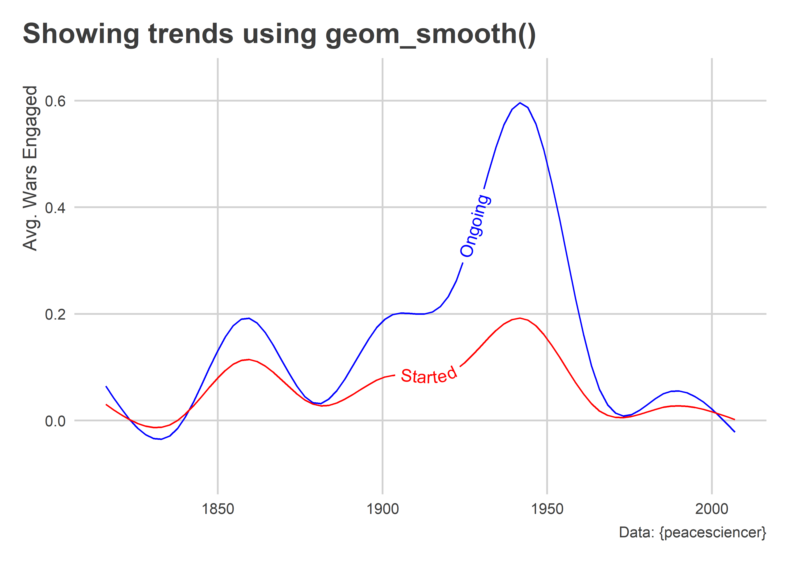

Layering Complexity and Adding Labels and Text
================

-   [Goals](#goals)
-   [Review of summarizing data](#review-of-summarizing-data)
-   [Looking at trends over time and layering
    complexity](#looking-at-trends-over-time-and-layering-complexity)
-   [Layering complexity](#layering-complexity)
-   [Adding text](#adding-text)
-   [Common scales](#common-scales)

## Goals

-   Build on our knowledge of `{dplyr}` tools.
-   Learn about adding text and labels to figures along the way.
-   Introduce the `{geomtextpath}` package.

## Review of summarizing data

Last time we talked about how to manipulate data with `{dplyr}` “verbs.”
We’re going to build on some of these skills while also honing our data
viz.

First, let’s get our data ready to use:

``` r
# Let's get ready to go...
library(tidyverse) 
library(peacesciencer)
library(countrycode)

# Read in the data...
create_dyadyears(subset_years = 1816:2007) %>%
  add_cow_majors() %>%
  add_cow_wars(type = "inter") %>%
  add_democracy() %>%
  add_sdp_gdp() -> Data
```

The data comes from the `{peacesciencer}` package, and is similar to
what we used last time. But there are a few differences. The data is at
the dyadic or country-pair-year-war level. It also provides information
about international wars instead of civil wars.

We need to do some extra work to make the data ready for analysis.
Instead of country-pair-year-war level, we just want the data to be for
countries per year. We’ll fix this below, and along the way we’re going
to use the `countrycode()` function from `{countrycode}` to convert the
COW codes for countries to their actual country names.

``` r
Data %>%
  mutate(
    country = countrycode(ccode1, "cown", "country.name")
  ) %>%
  group_by(country, year) %>%
  summarize(
    across(
      c(cowinteronset, cowinterongoing, batdeath1),
      ~ sum(.x, na.rm=T)
    ),
    across(
      contains("1"),
      ~ mean(.x, na.rm=T)
    ),
    .groups = "drop"
  ) -> cyData
```

Notice the use of `across()` in the above code. This is a relatively
recent addition to `{dplyr}`, and it’s an amazing little tool. It lets
us apply a function to multiple columns at once rather than having to
apply a function to each column individually. Using it, I can easily
apply `sum()` to a few select columns and `mean()` to others. And I can
use column names directly or use functions like `contains()` to pick
columns based on words or symbols they contain.

## Looking at trends over time and layering complexity

Today, we’re going to be looking at international conflict and
summarizing some long-term trends in its frequency and deadliness.

A natural place to start might be with a scatter plot.

``` r
ggplot(cyData) +
  aes(
    x = year, y = cowinterongoing
  ) +
  geom_point() +
  geom_smooth()
```


Each point is the number of recorded international wars in which a
country participated in or was engaged in a given year. The smoothed
line tells us the average trend over time.

This is obviously a useful but also noisy way to show the data. It would
be better if we could show a cleaner yearly trend, which we can do by
doing some prep work before we give the data to ggplot:

``` r
cyData %>%
  group_by(year) %>%
  summarize(
    mean_wars = mean(cowinterongoing)
  ) %>%
  ggplot() +
  aes(x = year,
      y = mean_wars) +
  geom_area() +
  labs(x = NULL,
       y = "Avg. Number of Engagements",
       title = "International wars over time, 1816-2007",
       caption = "Data: {peacesciencer}")
```


## Layering complexity

We can riff on the above figure by modifying our code to do a few
different things. First, let’s say we wanted to compare a couple of
countries, like the US and Russia. We can filter down to those countries
and then just give the data to ggplot.

``` r
cyData %>%
  filter(
    country %in% c("United States", "Russia")
  ) %>%
  ggplot() +
  aes(x = year,
      y = cowinterongoing) +
  geom_area(
    aes(fill = country),
    position = "identity",
    alpha = 0.5
  ) +
  labs(x = NULL,
       y = "Avg. Number of Engagements",
       title = "International wars over time, 1816-2007",
       caption = "Data: {peacesciencer}")
```


Or, say we wanted to contrast the average number of newly started wars a
country is engaged in to the average number of ongoing wars. We could
try something like this:

``` r
cyData %>%
  group_by(year) %>%
  summarize(
    mean_ongoing = mean(cowinterongoing),
    mean_started = mean(cowinteronset)
  ) %>%
  ggplot() +
  aes(x = year) +
  geom_area(
    aes(y = mean_ongoing),
    fill = "blue",
    color = "blue",
    alpha = 0.5
  ) +
  geom_area(
    aes(y = mean_started),
    fill = "red",
    color = "red",
    alpha = 0.5
  ) +
  labs(x = NULL,
       y = "Avg. Number of Engagements",
       title = "International wars over time, 1816-2007",
       caption = "Data: {peacesciencer}")
```


Notice some new things in the above code. We added two geom layers, and
we mapped different y variables in each. We also set different colors.

## Adding text

The last figure above would be better if we added some labels to
highlight which values correspond with which trend. We can do this in a
few different ways.

We can use `annotate()`:

``` r
cyData %>%
  group_by(year) %>%
  summarize(
    mean_ongoing = mean(cowinterongoing),
    mean_started = mean(cowinteronset)
  ) %>%
  ggplot() +
  aes(x = year) +
  geom_area(
    aes(y = mean_ongoing),
    fill = "blue",
    color = "blue",
    alpha = 0.5
  ) +
  geom_area(
    aes(y = mean_started),
    fill = "red",
    color = "red",
    alpha = 0.5
  ) +
  labs(x = NULL,
       y = "Avg. Number of Engagements",
       title = "International wars over time, 1816-2007",
       caption = "Data: {peacesciencer}") +
  annotate(
    "text",
    x = 1850,
    y = c(2, 2.25),
    label = c("Started", "Ongoing"),
    color = c("red", "blue"),
    hjust = 0
  )
```


We can also use tools from the `{geomtextpath}` package:

``` r
library(geomtextpath)
cyData %>%
  group_by(year) %>%
  summarize(
    mean_ongoing = mean(cowinterongoing),
    mean_started = mean(cowinteronset)
  ) %>%
  ggplot() +
  aes(x = year) +
  geom_textpath(
    aes(y = mean_ongoing),
    label = "Ongoing",
    color = "blue",
    hjust = .75,
    vjust = -1,
    text_smoothing = 50
  ) +
  geom_textpath(
    aes(y = mean_started),
    label = "Started",
    color = "red",
    hjust = .025,
    vjust = -1,
    text_smoothing = 50
  ) +
  labs(x = NULL,
       y = "Avg. Number of Engagements",
       title = "International wars over time, 1816-2007",
       caption = "Data: {peacesciencer}")
```


`{geomtextpath}` provides some nice functions for plotting text and
labels alongside lines drawn with various geoms. We could also use these
for some smoothers like so:

``` r
ggplot(cyData) +
  aes(x = year) +
  geom_textsmooth(
    aes(y = cowinterongoing),
    label = "Ongoing",
    color = "blue"
  ) +
  geom_textsmooth(
    aes(y = cowinteronset),
    label = "Started",
    color = "red"
  ) +
  labs(x = NULL,
       y = "Avg. Wars Engaged",
       title = "Showing trends using geom_smooth()",
       caption = "Data: {peacesciencer}")
```



We can also set labels to highlight certain points in time. This can be
a nice touch in time-series plots. Let’s look at war deaths per capita
and add labels for WWI and WWII:

``` r
cyData %>%
  group_by(year) %>%
  summarize(
    deaths_pc = 100000 * sum(batdeath1, na.rm=T) / 
      sum(exp(wbpopest1), na.rm=T)
  ) %>%
  ggplot() +
  aes(x = year,
      y = deaths_pc) +
  geom_area(
    fill = "gray"
  ) +
  labs(x = NULL,
       y = "Deaths per 100,000",
       title = "Deaths in international wars over time, 1816-2007",
       caption = "Data: {peacesciencer}") +
  scale_y_continuous(
    labels = scales::comma
  ) +
  geom_textvline(
    xintercept = 1914,
    label = "WWI starts",
    hjust = 0.8,
    color = "darkblue"
  ) +
  geom_textvline(
    xintercept = 1939,
    label = "WWII starts",
    hjust = 0.8,
    color = "darkblue"
  )
```


## Common scales

Speaking of layering complexity and adding labels, sometimes when we
show trends over time we may want to show two related but distinct
variables in the same figure. We did something like this with war onset
and ongoing wars. But say we wanted to look at democracy over time. The
data contains three different democracy measures.

-   `v2x_polyarchy1`: This comes from the Varieties of Democracy project
    and takes a value between 0 and 1 where 1 is the most democratic and
    0 is the least.
-   `polity21`: This comes from the Polity V project and takes values
    between -10 and 10 where 10 is the most democratic and -10 is the
    least.
-   `xm_qudsetst1`: Xavier Marquez wrote a paper in 2016 where he
    developed a method to extend the Unified Democracy Scores, a
    democracy measure created by other scholars. This is a “normalized”
    measure of democracy set to have a mean of 0 and standard deviation
    of 1.

While each of these measures are an attempt to capture the same basic
concept, they are produced not only using very different methods but
also are on very different scales. If we want to compare them, we need
to adjust for this before plotting. This is easy enough to do using
`{dplyr}` verbs:

``` r
# Make a function to put vars on a 0-1 scale:
my_stand_fun <- function(x) (x - min(x, na.rm=T)) / 
  (max(x, na.rm=T) - min(x, na.rm=T))

# Update the data and summarize:
cyData %>%
  mutate(
    across(
      c(v2x_polyarchy1, polity21, xm_qudsest1),
      my_stand_fun
    )
  ) %>%
  group_by(year) %>%
  summarize(
    across(
      c(v2x_polyarchy1, polity21, xm_qudsest1),
    ~ mean(.x, na.rm=T)
    )
  ) %>%
  ggplot() +
  aes(x = year) +
  geom_labelline(
    aes(y = v2x_polyarchy1),
    label = "V-Dem",
    color = "darkblue",
    text_smoothing = 50,
    hjust = 0.25 
  ) +
  geom_labelline(
    aes(y = xm_qudsest1),
    label = "XM-UD",
    color = "darkgreen",
    text_smoothing = 50,
    hjust = 0.35
  ) +
  geom_labelline(
    aes(y = polity21),
    label = "Polity",
    color = "darkred",
    text_smoothing = 25,
    hjust = 0.53
  ) +
  labs(x = NULL,
       y = "Quality of Democracy",
       title = "Democracy over time, 1816-2007",
       caption = "Data: {peacesciencer}")
```


