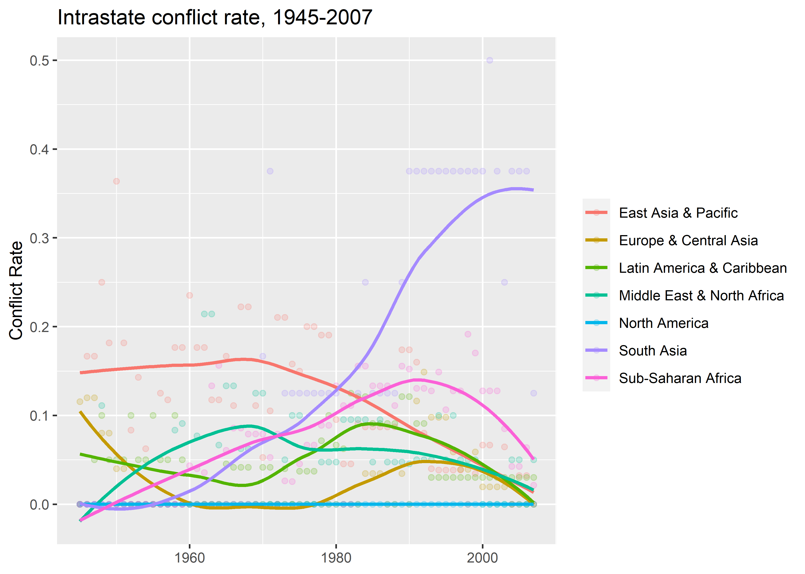
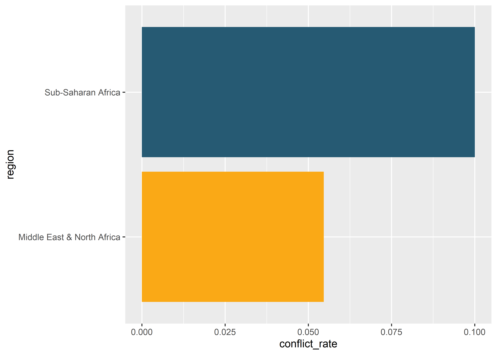

Introducing `{coolorrr}` for Updating Colors
================

-   <a href="#goals" id="toc-goals">Goals</a>
-   <a href="#cooler-colors" id="toc-cooler-colors">Cooler colors</a>
-   <a href="#thinking-clearly-about-palettes"
    id="toc-thinking-clearly-about-palettes">Thinking Clearly about
    Palettes</a>
-   <a href="#make-your-own-palette" id="toc-make-your-own-palette">Make
    Your Own Palette</a>

## Goals

-   Use tools in `{coolorrr}` to update color palettes.
-   Continue working with `{geomtextpath}`.

## Cooler colors

Up to now when we’ve mapped color or fill aesthetics to variables in our
data, we’ve relied on ggplot defaults (mostly). These can be updated
using a variety of built-in ggplot functions. I generally dislike most
of these functions—mainly because there are so many.

So I decided to create an R package that would simplify the process. I
call it `{coolorrr}`.

To install it, simply write and run the following in your console:

    devtools::install_github("milesdwilliams15/coolorrr")

This package was inspired by a free and easy to use palette-generating
site called [coolors.co](https://coolors.co/). If you go to the site, it
lets you easily pick out all kinds of different palettes, and it gives
you the hex-codes associated with individual colors. R knows how to read
these hex-codes, which means we can use them for setting or updating
colors for our ggplots.

This is where `{coolorrr}` comes in. We can easily take the palettes we
make at coolors.co and use them with ggplot using tools from
`{coolorrr}`. Here’s how.

First, open the `{tidyverse}` along with `{coolorrr}`:

``` r
library(tidyverse)
library(coolorrr)
```

`{coolorrr}` works by setting a series of different palettes *globally*
in R’s environment and then calling them in the ggplot workflow. To set
a new palette, use `set_palette()`:

``` r
set_palette(
  qualitative = "https://coolors.co/palette/264653-2a9d8f-e9c46a-f4a261-e76f51-ec8c74-f0a390"
)
```

The above sets the *qualitative* palette (we’ll talk about this in a
second) to the palette I generated at coolors.co. If you go to the link
I used in the function, you can see it.

`set_palette()` sets four different palettes. Any palettes you don’t
specify when running `set_palette()` will automatically be set using
defaults. You can update any of the four palettes at any time.

Let’s show how it works using some `{peacesciencer}` data:

``` r
library(peacesciencer)
create_stateyears(subset_years = 1945:2007) %>%
  add_cow_majors() %>%
  add_cow_wars(type = "intra") %>%
  add_democracy() %>%
  add_sdp_gdp() -> Data
```

Before we get going, we need to add a new column to the data for country
regions. We can do this with `{countrycode}`:

``` r
library(countrycode)
Data %>%
  mutate(
    region = countrycode(statenme, "country.name", "region")
  ) -> Data
```

Let’s check trends in civil wars over time by different world regions:

``` r
library(socsci)
Data %>%
  group_by(
    year, region
  ) %>%
  mean_ci(
    cowintraongoing
  ) %>%
  ggplot() +
  aes(x = year,
      y = mean,
      color = region,
      label = region) +
  geom_point(
    alpha = 0.2
  ) +
  geom_smooth(
    se = F
  ) +
  labs(
    x = NULL,
    y = "Conflict Rate",
    title = "Intrastate conflict rate, 1945-2007",
    color = NULL
  )
```


The default palette is so-so. Let’s update it:

``` r
Data %>%
  group_by(
    year, region
  ) %>%
  mean_ci(
    cowintraongoing
  ) %>%
  ggplot() +
  aes(x = year,
      y = mean,
      color = region,
      label = region) +
  geom_point(
    alpha = 0.2
  ) +
  geom_smooth(
    se = F
  ) +
  ## update the palette here:
  ggpal() +
  labs(
    x = NULL,
    y = "Conflict Rate",
    title = "Intrastate conflict rate, 1945-2007",
    color = NULL
  )
```


I don’t love this palette, but it shows how easy it is to update colors
with `{coolorrr}`. Just set whatever palette you want to use, and then
you can use `gggal()` to call it.

## Thinking Clearly about Palettes

Before we continue, we need to take some time to think clearly about our
palette choices. The key question with any palette is always “what’s
your goal?”

To help organize your thinking, there are three basic kinds of palettes
you can produce:

1.  **Qualitative**: Used for categorical data (like regions).
2.  **Sequential**: Used for ordered categories or numerical variables.
3.  **Diverging**: Used for ordered categories or numerical variables
    where there is a mid-point.

Can you think of examples in past exercises we’ve done where it would
have been appropriate to use one or the other kind of palette? What kind
of palette did we use to produce the last plot?

Remember producing maps? Let’s make a world map and plot the average
rate of civil wars across different countries:

``` r
## summarize conflict rate by country
Data %>%
  group_by(
    ccode
  ) %>%
  mean_ci(
    cowintraonset
  ) -> smry_data

## get coordinates to draw a world map
worldmap <- map_data("world")  
worldmap$ccode <- countrycode(worldmap$region,
                           "country.name",
                           "cown")

## combine the data
left_join(
  worldmap, smry_data, by = "ccode"
) -> worlddata

## make the plot
ggplot(worlddata) +
  aes(long, lat, group = group, fill = mean) +
  geom_polygon()
```



A sequential palette makes sense for this plot. We can update it with
ggpal():

``` r
ggplot(worlddata) +
  aes(long, lat, group = group, fill = mean) +
  geom_polygon(color = "black",
               size = 0.1) +
  ggpal(type = "sequential", aes = "fill") +
  theme_void() 
```


Note the use of the `type =` and `aes =` commands. Type will always be
one of:

-   `"qualitative"`
-   `"sequential"`
-   `"diverging"`
-   `"binary"`

The last one is a special qualitative palette you can set specially for
binary (two-value) categories.

The `aes` options will always be one of:

-   `"color"`
-   `"fill"`

Your option should match the aesthetic mapping you applied in the
`aes()` function.

Let’s try an example with a diverging palette:

``` r
## make a variable that gives the yearly change
## in democracy scores and filter to 2007
Data %>%
  group_by(
    ccode
  ) %>%
  mutate(
    democracy_change = c(NA, diff(v2x_polyarchy))
  ) %>%
  ungroup %>%
  filter(year == 2007) %>%
  select(
    ccode, democracy_change
  ) -> data_07

## merge with world coordinates data
worlddata <- left_join(worldmap, 
                       data_07,
                       by = "ccode")

## plot the map
ggplot(worlddata) +
  aes(x = long,
      y = lat,
      group = group,
      fill = democracy_change) +
  geom_polygon(color = "black",
               size = 0.1) +
  ggpal(type = "diverging", 
        aes = "fill", 
        midpoint = 0) +
  theme_void()
```


Just for fun, let’s use a qualitative palette for world regions:

``` r
Data %>%
  select(
    ccode, region
  ) %>%
  rename(
    world_region = region
  ) %>%
  distinct() -> region_data

## combine with world coordinates
worlddata <- left_join(worldmap,
                       region_data,
                       by = "ccode")

## make the plot
ggplot(worlddata) +
  aes(x = long,
      y = lat,
      group = group,
      fill = world_region) +
  geom_polygon(color = "black",
               size = 0.1) +
  ggpal(type = "qualitative", 
        aes = "fill") +
  theme_void()
```



## Make Your Own Palette

Go to [coolors.co](https://coolors.co) and pick out four palettes that
you like:

-   A 7+ color qualitative palette
-   A sequential palette — select two colors for the upper and lower
    bounds of the color scheme
-   A diverging palette — select three colors, each for the upper,
    middle, and lower bounds respectively
-   A binary palette — select two colors

Once you’ve done that you can set them like so. Here are my own picks:

``` r
set_palette(
  qualitative = "https://coolors.co/palette/4d86a5-cf0bf1-12e2f1-3e517a-98da1f-fc9f5b-d60b2d-c3c4e9-9cc76d-2dffdf",
  sequential = "https://coolors.co/palette/e7ecef-274c77",
  diverging = "https://coolors.co/011638-f5f5f5-c20114",
  binary = "https://coolors.co/022864-f40119"
)
```

Then, try own some examples from above or make some new figures and test
out your choices.
