Refining Plots
================

-   <a href="#goals" id="toc-goals">Goals</a>
-   <a href="#advanced-options-for-your-markdown-file"
    id="toc-advanced-options-for-your-markdown-file">Advanced Options for
    Your Markdown File</a>
-   <a href="#setting-themes" id="toc-setting-themes">Setting Themes</a>
-   <a href="#setting-your-own-theme-globally"
    id="toc-setting-your-own-theme-globally">Setting Your Own Theme
    Globally</a>
-   <a href="#going-in-depth-with-labels-and-colors"
    id="toc-going-in-depth-with-labels-and-colors">Going In-Depth with
    Labels and Colors</a>
-   <a href="#wrapping-up" id="toc-wrapping-up">Wrapping up</a>

## Goals

-   Cover some ways to customize your plots using examples.
-   Talk about setting themes globally.
-   Update settings.

## Advanced Options for Your Markdown File

For now, we’ve stuck to the basics of data viz. But there’s so much more
you can do. Not only can we update things “in-line” using “+” operators
in ggplot, we can also set some options globally.

I find it helps me to have a more productive session in R when I start
by gathering all my tools and updating my .Rmd settings in the very
first code chunk in my markdown file.

Here’s what I’m using in my current session to produce these notes:

``` r
# Set things up the way I like:
knitr::opts_chunk$set(echo = T,   
                        # I want to see my code chunks
                      message = F,
                        # I don't want messages appearing
                      warning = F,
                        # I don't wart warnings appearing
                      dpi = 500,  
                        # When I knit, I want my figures crisp
                      out.width = "75%")
                        # I want my figures to be a reasonable size

# Here are the packages I need in my session:
library(tidyverse)    # I want to use tools in the tidyverse
library(coolorrr)     # I want to update my colors
library(socsci)       # For some additional summarizing functions
library(geomtextpath) # For plotting text on lines
library(peacesciencer)# For my data

# Set my color palette and ggplot theme:
set_palette(
  qualitative = "https://coolors.co/faa916-6d676e-85ffe0-7c1022-c2bfc4-c0d47b-dc0425-79b3a7-1b1b1e"
)
set_theme()

# Here's the data I need:
create_stateyears(subset_years = 1945:2007) %>%
  add_cow_wars(type = "intra") %>%
  add_sdp_gdp() %>%
  add_democracy() -> Data
```

There’s a lot going on here. You can check the comments in the code to
see why I added certain things. Some are necessary (like the packages I
need) and others are optional (like my color palettes, plotting theme,
and data viz dpi and size).

I recommend doing this with your your own code as well. The more prep
work you do up front, the more productive your overall session is going
to be.

## Setting Themes

You’ll notice that in the above code I used the function `set_theme()`.
This comes from the `{coolorrr}` package and is my own personal ggplot
theme that I like to use in my R sessions. It’s based on
FiveThirtyEight’s theme but with a few of my own modifications. By
running `set_theme()`, it sets my personal theme *globally*. That means
that all ggplot figures I make will now use this theme rather than the
default “gray” theme.

Check it out:

``` r
ggplot(Data) +
  aes(x = year,
      y = cowintraongoing) +
  geom_smooth() +
  labs(x = NULL,
       y = "Ongoing Conflict Rate",
       title = "Civil wars post-WWII, 1945-2007")
```

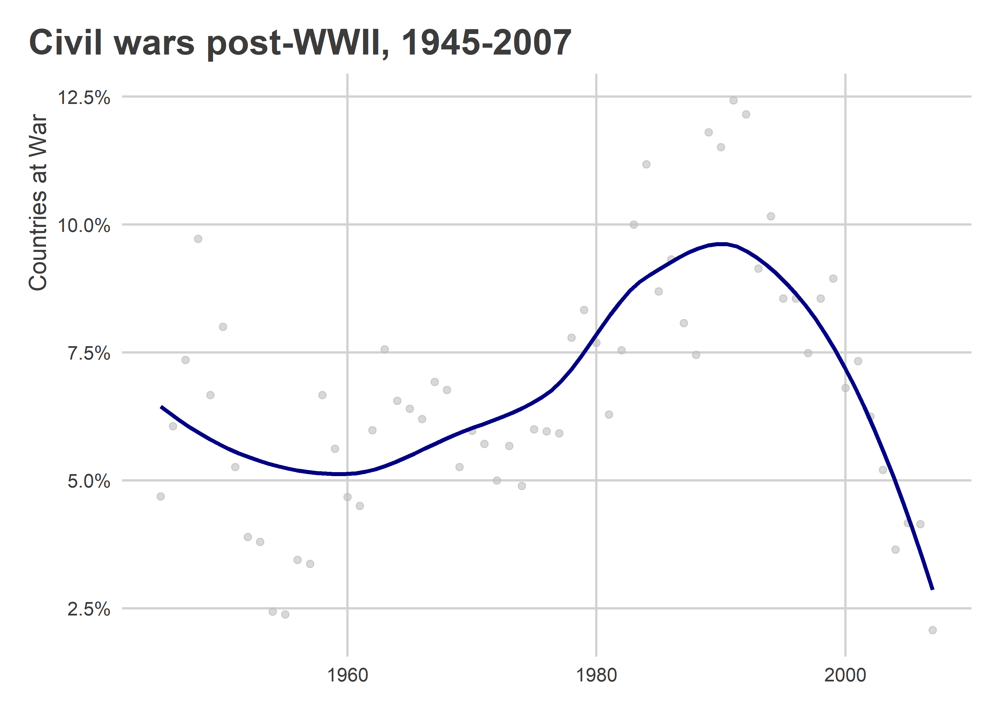

If I wanted to go back to the default, I can just use the appropriate
`theme_()` function:

``` r
ggplot(Data) +
  aes(x = year,
      y = cowintraongoing) +
  geom_smooth() +
  labs(x = NULL,
       y = "Ongoing Conflict Rate",
       title = "Civil wars post-WWII, 1945-2007") +
  theme_gray()
```

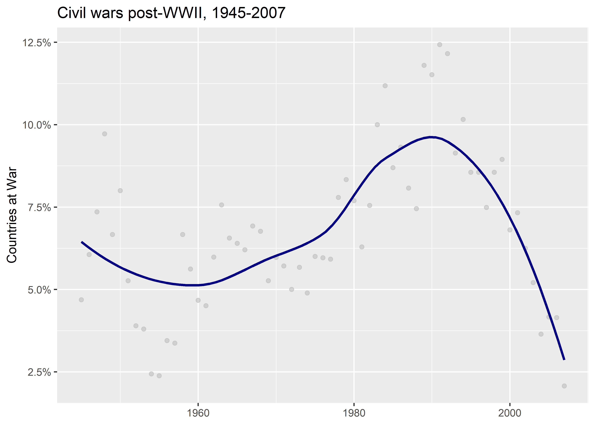

There are many different themes you can use, like:

``` r
ggplot(Data) +
  aes(x = year,
      y = cowintraongoing) +
  geom_smooth() +
  labs(x = NULL,
       y = "Ongoing Conflict Rate",
       title = "Civil wars post-WWII, 1945-2007") +
  theme_bw()
```

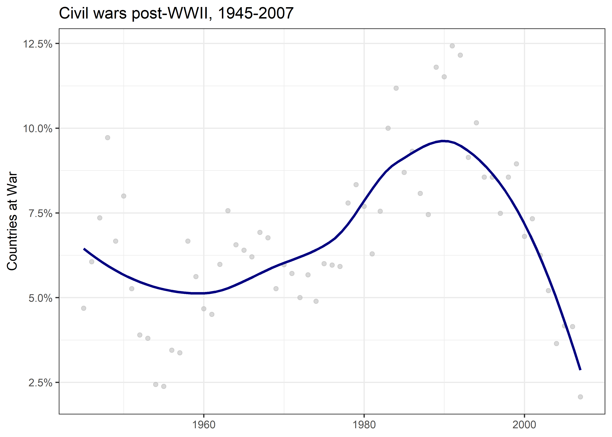

``` r
ggplot(Data) +
  aes(x = year,
      y = cowintraongoing) +
  geom_smooth() +
  labs(x = NULL,
       y = "Ongoing Conflict Rate",
       title = "Civil wars post-WWII, 1945-2007") +
  theme_classic()
```


``` r
ggplot(Data) +
  aes(x = year,
      y = cowintraongoing) +
  geom_smooth() +
  labs(x = NULL,
       y = "Ongoing Conflict Rate",
       title = "Civil wars post-WWII, 1945-2007") +
  theme_dark()
```


``` r
ggplot(Data) +
  aes(x = year,
      y = cowintraongoing) +
  geom_smooth() +
  labs(x = NULL,
       y = "Ongoing Conflict Rate",
       title = "Civil wars post-WWII, 1945-2007") +
  theme_light()
```


And on and on it goes…

You can access even more specialized themes using the `{ggthemes}`
package. Here’s the FiveThirtyEight theme:

``` r
ggplot(Data) +
  aes(x = year,
      y = cowintraongoing) +
  geom_smooth() +
  labs(x = NULL,
       y = "Ongoing Conflict Rate",
       title = "Civil wars post-WWII, 1945-2007") +
  ggthemes::theme_fivethirtyeight()
```

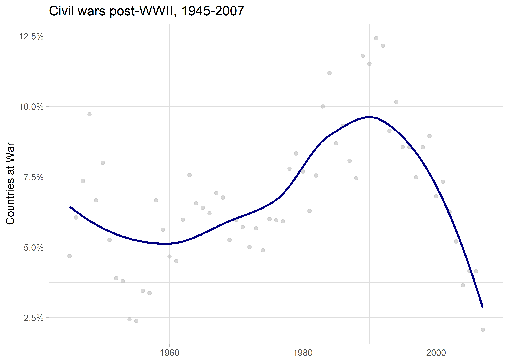

The Wallstreet Journal theme:

``` r
ggplot(Data) +
  aes(x = year,
      y = cowintraongoing) +
  geom_smooth() +
  labs(x = NULL,
       y = "Ongoing Conflict Rate",
       title = "Civil wars post-WWII\n1945-2007") +
  ggthemes::theme_wsj()
```

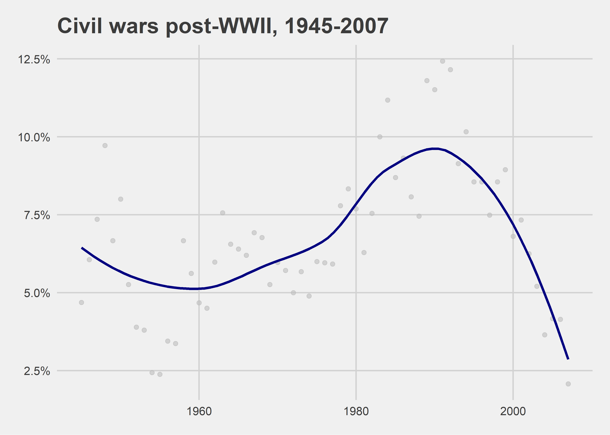

The Economist theme:

``` r
ggplot(Data) +
  aes(x = year,
      y = cowintraongoing) +
  geom_smooth() +
  labs(x = NULL,
       y = "Ongoing Conflict Rate",
       title = "Civil wars post-WWII, 1945-2007") +
  ggthemes::theme_economist()
```


There’s even a Tufte theme:

``` r
ggplot(Data) +
  aes(x = year,
      y = cowintraongoing) +
  geom_smooth() +
  labs(x = NULL,
       y = "Ongoing Conflict Rate",
       title = "Civil wars post-WWII, 1945-2007") +
  ggthemes::theme_tufte()
```

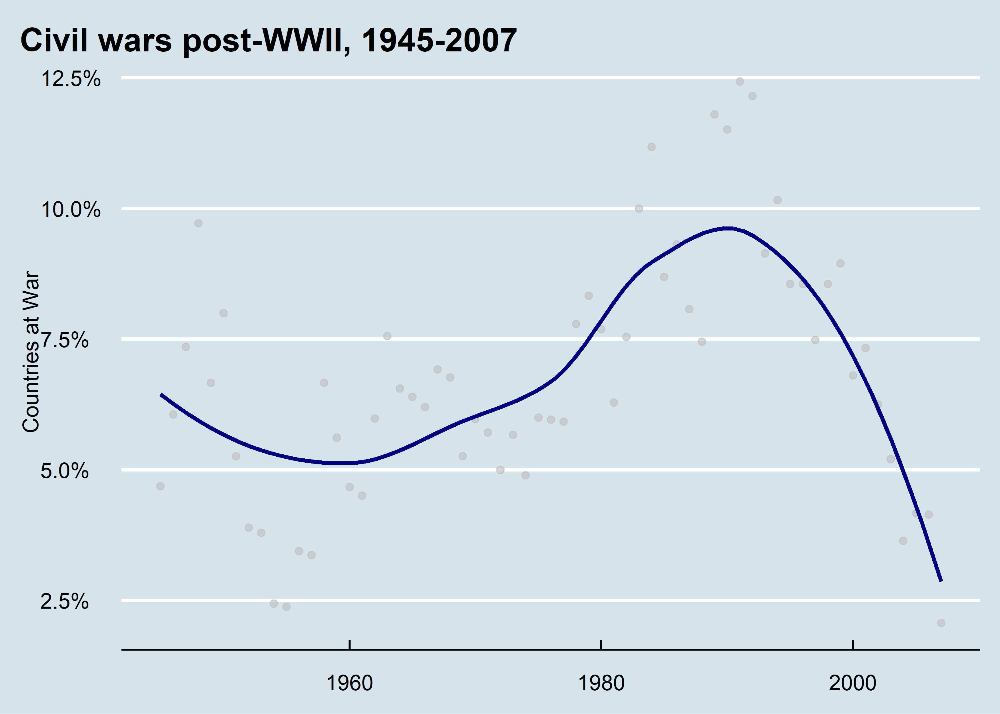

Remember that Tufte was the guy who said we should minimize our ink to
data ratio. His theme certainly does.

## Setting Your Own Theme Globally

The `set_theme()` function I used in the first code chunk set my own
person theme globally. You can set your own theme globally, too.

Say you like the clean theme from ggthemes. Just run:

``` r
theme_set(ggthemes::theme_clean())
```

Notice that this function is `theme_set()`. How confusing! But that’s
how it goes with R sometimes.

Even so, it works. Any new plots you make will follow the theme you set
with `theme_set()`:

``` r
ggplot(Data) +
  aes(x = year,
      y = cowintraongoing) +
  geom_smooth() +
  labs(x = NULL,
       y = "Ongoing Conflict Rate",
       title = "Civil wars post-WWII, 1945-2007") 
```


I’m partial to my own, so I’m going to set it back with `set_theme()`
from `{coolorrr}`:

``` r
set_theme()
```

## Going In-Depth with Labels and Colors

Once you master settings like themes and colors (like we talked about
last time), you start to think about how to build up to more complicated
visuals.

Here’s an example. Let’s start by filtering our data down to the year
1990:

``` r
Data %>%
  filter(year == 1990) -> data_90
```

Next, let’s build a base plot—a scatter plot showing GDP per capita on
the x axis and quality of democracy on the y axis:

``` r
p <- ggplot(data_90) +
  aes(x = exp(wbgdppc2011est),
      y = v2x_polyarchy) +
  geom_point(alpha = 0.5,
             color = "gray") +
  scale_x_log10(labels = scales::dollar) +
  labs(x = "GDP per capita",
       y = "Quality of Democracy",
       title = "Economic Health, Democracy, and Conflict",
       subtitle = "Data for 1990",
       caption = "Source: {peacesciencer}")
p # print
```


Note that I saved the plot as an object called `p`.

Next, let’s use color to highlight countries experiencing civil war:

``` r
p2 <- p +
  geom_point(data = filter(data_90, 
                           cowintraongoing == 1),
             color = "red")
p2
```


In the next layer, we’ll add some text to tell us which countries
experience conflict in 1990:

``` r
p3 <- p2 + 
  ggrepel::geom_text_repel(
    data = filter(data_90, cowintraongoing == 1),
    aes(label = statenme),
    size = 2
  )
p3
```


That’s not, too bad. Say we didn’t care for the theme. We can try out
some alternatives:

``` r
## This looks like the baseR plot() function theme:
p3 + ggthemes::theme_base()
```

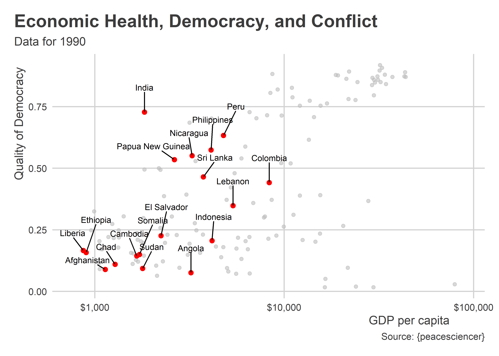

``` r
## The calc theme
p3 + ggthemes::theme_calc()
```

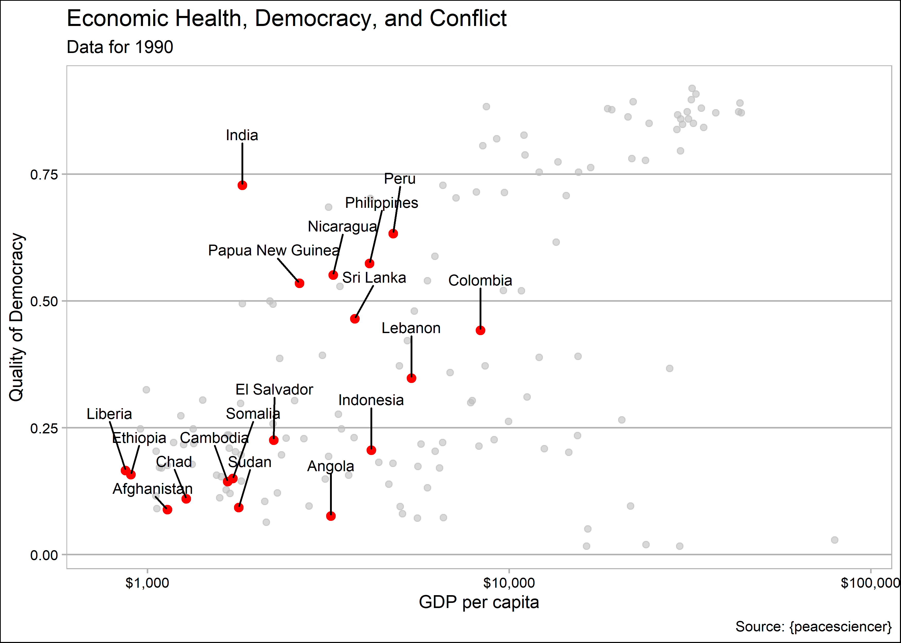

``` r
## The clean theme
p3 + ggthemes::theme_clean()
```

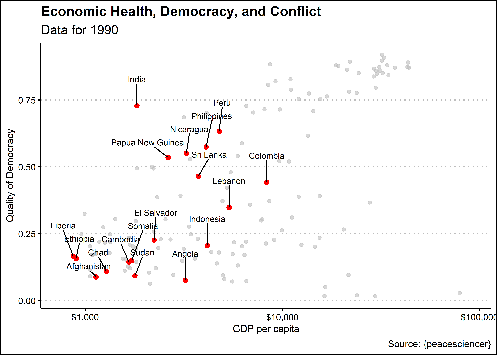

``` r
## The new excel theme (I don't hate it)
p3 + ggthemes::theme_excel_new()
```

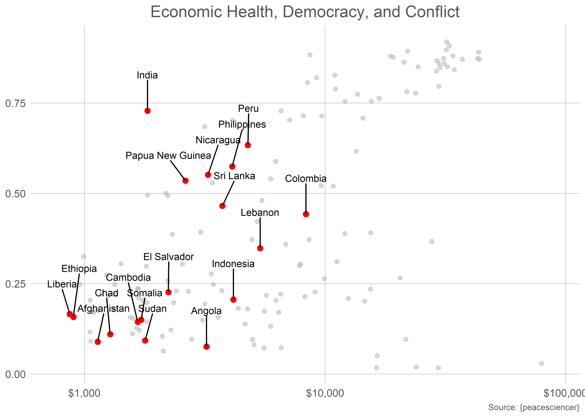

``` r
## The Few theme
p3 + ggthemes::theme_few()
```


``` r
## FiveThirtyEight (notice it drops axis titles)
p3 + ggthemes::theme_fivethirtyeight()
```

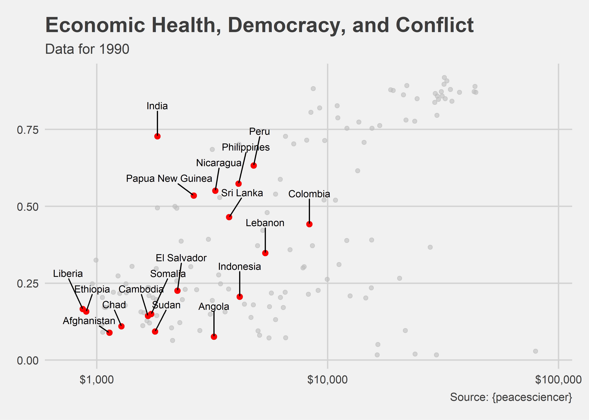

``` r
## A google doc theme
p3 + ggthemes::theme_gdocs()
```


``` r
## And more
p3 + ggthemes::theme_pander()
```


``` r
## Trick your friends into thinking you use Stata!
p3 + ggthemes::theme_stata()
```


## Wrapping up

Okay that was a lot. The point is not to cover all the ways you can
customize your plot but to give you an impression of just how many
elements can be updated. We haven’t even talked about the `theme()`
function which gives you even more control over the look of your data
viz.

You won’t master this in a single class, or a single semester for that
matter. The key with all of this is to practice.
