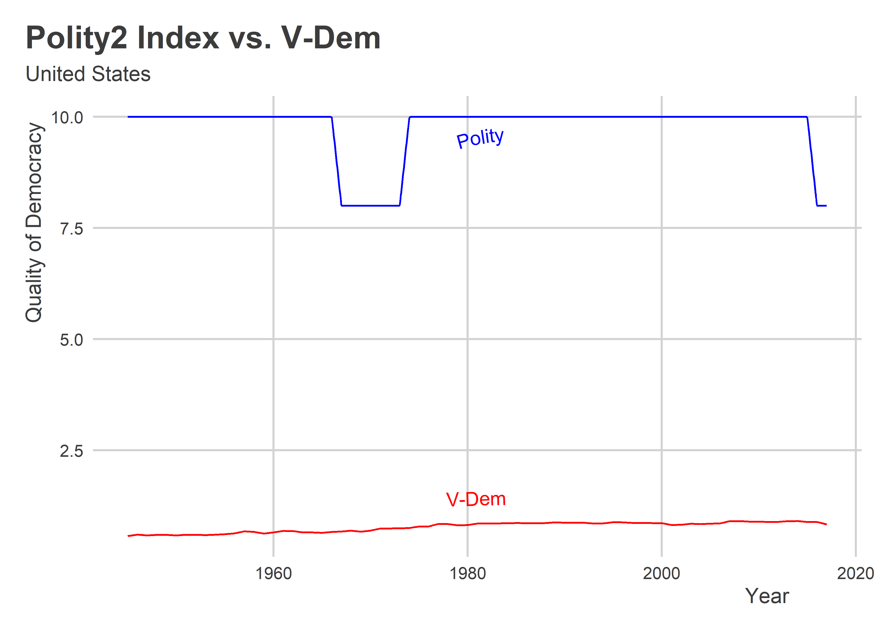
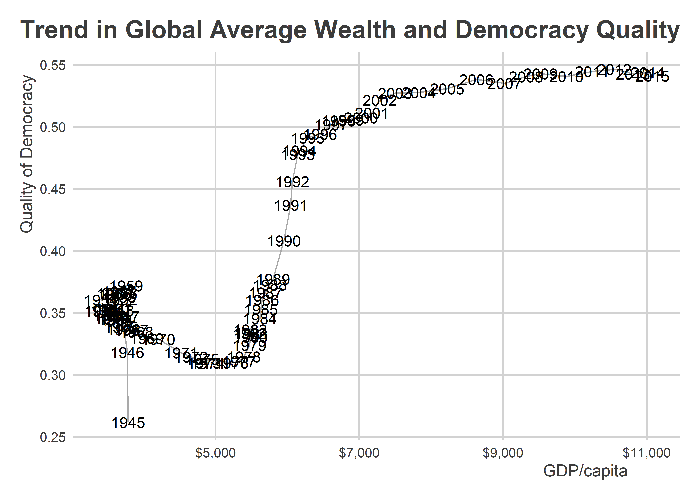
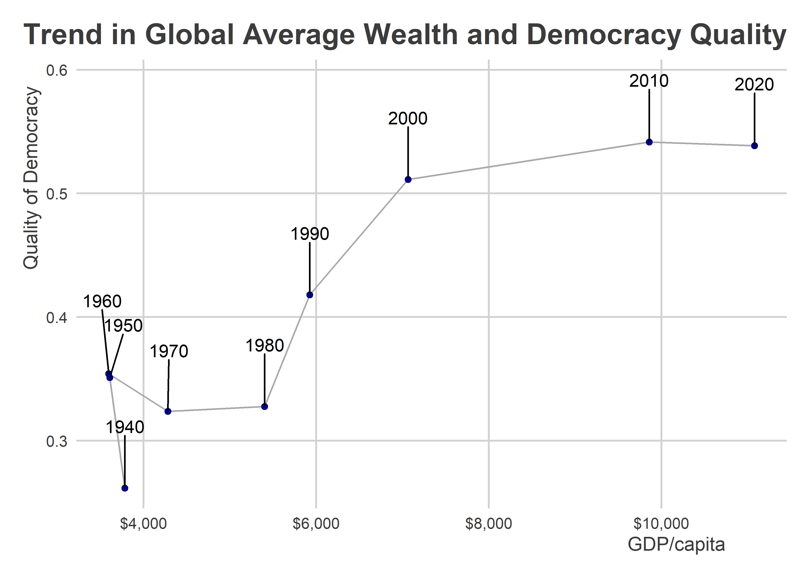
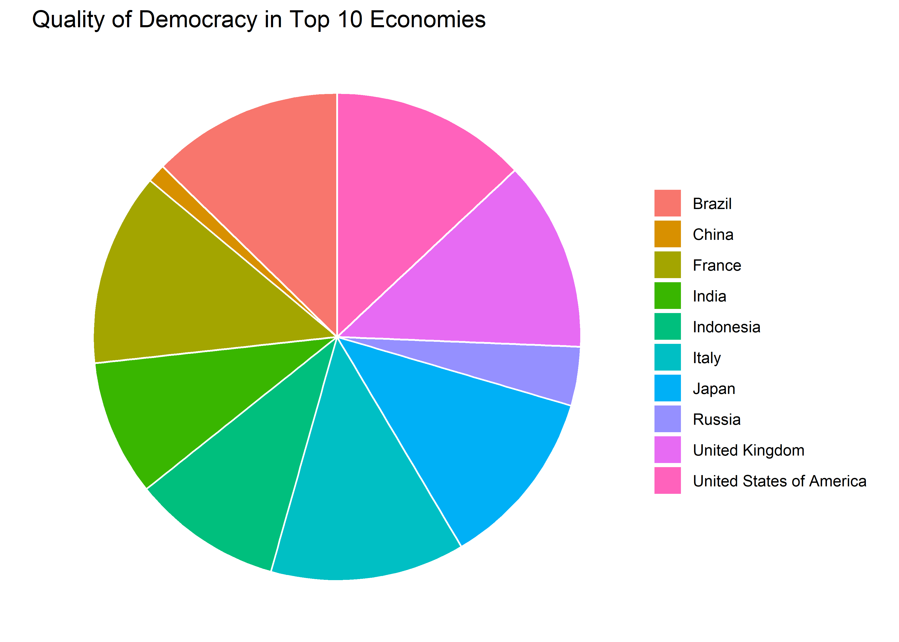

Case Studies in Improving Bad Data Viz
================

-   <a href="#goals" id="toc-goals">Goals</a>
-   <a href="#dual-axes" id="toc-dual-axes">Dual axes</a>
-   <a href="#relationships-over-time"
    id="toc-relationships-over-time">Relationships over time</a>
-   <a href="#always-always-say-no-to-pie"
    id="toc-always-always-say-no-to-pie">Always, ALWAYS say no to pie</a>

## Goals

-   For every bad figure you see in the wild, a better one is within
    reach.
-   The difference that a few simple modifications makes can go a long
    way.
-   Some of these modifications make use of some special functions.

## Dual axes

Our text walks through a number of examples or case studies. In these
notes, we’ll work through some of these examples, but also add some of
our own twists. And emphasize the use of political data.

Take a figure like the following line plot. It shows from 1945-2017 the
quality of democracy trend for the United States using two measures—the
Polity2 index and V-Dem. Clearly we can see that scaling is an issue.



A tempting solution might be to use dual y-axes and change the scaling
of the quality of democracy measures. But we don’t really need to make
dual axes at all. And, while it’s possible to do such things with
ggplot, dual axes are actually quite difficult to interpret.

Instead, we’ll follow the example from our text and procuce the
following plot instead.

First, you’ll need to read in the data:

``` r
library(peacesciencer)
create_stateyears(subset_years = 1945:2017) %>%
  add_democracy() -> Data
```

Then, you’ll need to add a new column that puts the polity2 index on the
same 0-1 scale as V-Dem:

``` r
Data %>%
  mutate(
    polity2_i = (polity2 + 10) / 20
  ) -> Data
```

We also want to create a value that’s the difference between these
measures. We can do that, too, now that they’re on the same scale:

``` r
Data %>%
  mutate(
    diff = v2x_polyarchy - polity2_i
  ) -> Data
```

Now, let’s make a plot for the U.S. Pay close attention here, because
I’m introducing a new package called `{patchwork}`

``` r
usData <- Data %>% filter(ccode == 2)
  ## Filter the data down to the US

ggplot(usData) +
  ## Start making our plot
  aes(x = year) +
  geom_textline(
    aes(y = v2x_polyarchy),
    label = "V-Dem",
    vjust = 1.5,
    text_smoothing = 50,
    color = "red"
  ) +
  geom_textline(
    aes(y = polity2_i),
    label = "Polity",
    vjust = 1.5,
    text_smoothing = 100,
    color = "blue"
  ) +
  labs(
    x = "Year",
    y = "Quality of Democracy",
    title = "Trend in Democracy for the United States, 1945-2017"
  ) -> p1

## Now I'm going to make another plot
ggplot(usData) +
  aes(x = year,
      y = diff) +
  geom_line() +
  labs(
    x = "Year",
    y = "Difference"
  ) -> p2

## Use patchwork to combine the plots into a single data viz
library(patchwork)
p1 / p2 +
  plot_layout(
    heights = c(3, 1)
  )
```


The above simultaneously shows the trends in democracy quality in the
U.S. according to Polity and V-Dem and also shows the difference between
the measures. We can clearly see that V-Dem has a much less positive
view of democracy in the U.S. relative to Polity. This difference is
especially pronounced throughout the ’50s, ’60s, and ’70s. Any guess as
to why?

Read more about `{patchwork}` here:
<https://patchwork.data-imaginist.com/index.html>

## Relationships over time

The below figure is supposed to show the relationship between the global
average of GDP per capita and quality of democracy over time. But it
relies on some odd choices. First, instead of using a scatter plot (a
more natural choice), it shows time on the x-axis and then plots both
GDP per capita and democracy quality on the y-axis. Second, it uses
different plotting geometry for each varaible—geom_col() for GDP per
capita and geom_point() for democracy.


The technical term for the above figure is “poopy” and the reason why
should be obvious. We can do better. First add some economic data to our
dataset:

    Data %>%
      add_sdp_gdp() -> Data

Then, summarize the data and give it to ggplot:

``` r
Data %>%
  group_by(year) %>%
  summarize(
    dem = mean(v2x_polyarchy, na.rm=T),
    wealth = exp(mean(wbgdppc2011est, na.rm=T))
  ) %>%
  ggplot() +
  aes(x = wealth,
      y = dem) +
  geom_path(color = "darkgray") +
  geom_text(
    aes(label = year)
  ) +
  scale_x_continuous(
    labels = scales::dollar
  ) +
  labs(x = "GDP/capita",
       y = "Quality of Democracy",
       title = "Trend in Global Average Wealth and Democracy Quality")
```



There are some years that overlap, but that’s okay. It’s still much
better than the previous. We could alternatively just use labels for
decades. It would just require a little extra modification to the code
above:

``` r
Data %>%
  mutate(
    decade = round(year / 10) * 10
  ) %>%
  group_by(decade) %>%
  summarize(
    dem = mean(v2x_polyarchy, na.rm=T),
    wealth = exp(mean(wbgdppc2011est, na.rm=T))
  ) %>%
  ggplot() +
  aes(x = wealth,
      y = dem) +
  geom_path(color = "darkgray") +
  geom_text(
    aes(label = decade)
  ) +
  scale_x_continuous(
    labels = scales::dollar
  ) +
  labs(x = "GDP/capita",
       y = "Quality of Democracy",
       title = "Trend in Global Average Wealth and Democracy Quality")
```



Note the use of `round()` and `geom_path()` instead of `geom_line()`.

## Always, ALWAYS say no to pie

Did you know that there’s no direct way to make a pie chart in ggplot?
That’s right. There’s not a `geom_pie()` layer.

This is a good thing, because it prevents people from saying “yes” to
pie. Pie charts almost never are a good idea. Actually, let me refrase
that. Pie charts NEVER are a good idea.

You can force ggplot to make a pie chart if you really want to:

``` r
Data %>%
  filter(year == 2015) %>%
  slice_max(wbgdp2011est, n = 10) %>%
  ggplot() +
  aes(x = "",
      y = v2x_polyarchy,
      fill = statenme) +
  geom_col(color = "white") +
  coord_polar("y", start=0) +
  theme_void() +
  labs(title = "Quality of Democracy in Top 10 Economies",
       fill = NULL)
```



To paraphrase a line from *Four Christmases*, it’s bad…and it sucks.

We can do better with a column plot:

``` r
Data %>%
  filter(year == 2015) %>%
  slice_max(wbgdp2011est, n = 10) %>%
  ggplot() +
  aes(x = v2x_polyarchy,
      y = reorder(statenme, wbgdp2011est)) +
  geom_col() +
  labs(x = "Quality of Democracy",
       y = NULL,
       title = "Quality of Democracy in Top 10 Economies",
       subtitle = "Ordered from Largest to Smallest Economy")
```


We also could create a segmented bar plot if we wanted to compare how
these results look with different measures of democratic quality:

``` r
library(socsci)
Data %>%
  filter(year == 2015) %>%
  slice_max(wbgdp2011est, n = 10) %>%
  select(statenme, v2x_polyarchy, polity2_i) %>%
  pivot_longer(
    -statenme
  ) %>%
  mutate(valuec = cut(value, breaks = seq(0, 1, len = 5), 
                      ordered_result = T,
                     include.lowest = T,
                     right = F)) %>%
  group_by(name) %>%
  ct(valuec) %>%
  ggplot() +
  aes(x = pct,
      y = name,
      fill = valuec) +
  geom_col(
    position = position_fill(reverse = TRUE)
  ) +
  scale_x_continuous(
    labels = scales::percent
  ) +
  scale_y_discrete(
    labels = c("Polity",
               "V-Dem")
  ) +
  labs(
    x = NULL,
    y = NULL,
    title = "Quality of Democracy in Top 10 Economies",
    subtitle = "Estimates for 2015",
    fill = "Quality of Democracy: "
  )
```


In short, there are plenty of alternatives to pie charts. You should
always say “yes” to these, and always say “no” to pie (unless it’s the
baked variety).
