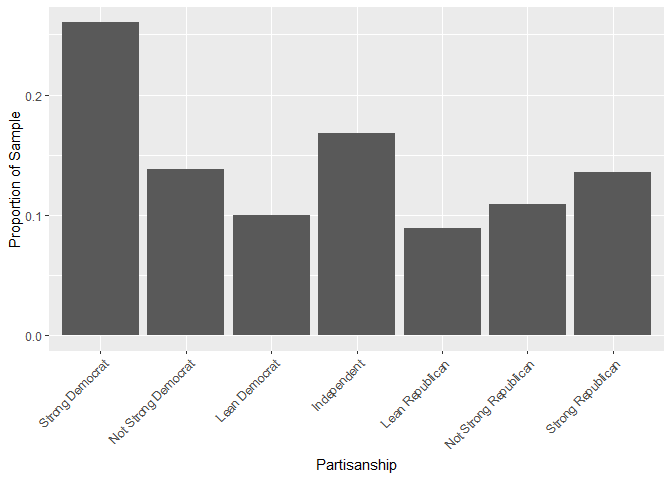
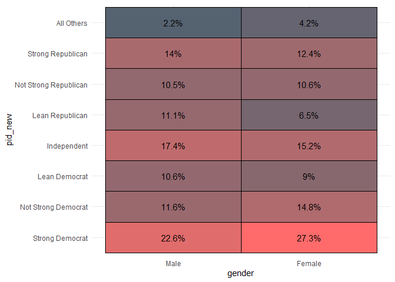

Tools for Working with Survey Data
================

-   [Goals](#goals)
-   [We use surveys to learn about
    populations](#we-use-surveys-to-learn-about-populations)
-   [What survey data usually looks
    like](#what-survey-data-usually-looks-like)
-   [Recoding Variables and Visualizing
    with](#recoding-variables-and-visualizing-with)
-   [Other useful recode tools](#other-useful-recode-tools)
    -   [ifelse()](#ifelse)

## Goals

-   We can use surveys to learn about the attitudes of a population.
-   We don’t have to ask everyone in our population what their attitudes
    are. We can just ask a small fraction.
-   Provided our small fraction of the population is a *random sample*
    of individuals, their survey responses will provide a good
    approximation for the population’s, at least in expectation.
-   When you use surveys for data analysis, you generally will need to
    dedicate some extra time to cleaning your data.
-   We’ll talk about how to use tools from `{socsci}` to make that
    cleaning process easier.

Tools we’ll use in this session:

``` r
library(tidyverse)
```

    ## ── Attaching packages ─────────────────────────────────────── tidyverse 1.3.2 ──
    ## ✔ ggplot2 3.4.0     ✔ purrr   0.3.4
    ## ✔ tibble  3.1.8     ✔ dplyr   1.0.9
    ## ✔ tidyr   1.2.0     ✔ stringr 1.4.0
    ## ✔ readr   2.1.2     ✔ forcats 0.5.1

    ## Warning: package 'ggplot2' was built under R version 4.2.2

    ## ── Conflicts ────────────────────────────────────────── tidyverse_conflicts() ──
    ## ✖ dplyr::filter() masks stats::filter()
    ## ✖ dplyr::lag()    masks stats::lag()

``` r
library(socsci)
```

    ## Loading required package: rlang

    ## Warning: package 'rlang' was built under R version 4.2.2

    ## 
    ## Attaching package: 'rlang'
    ## 
    ## The following objects are masked from 'package:purrr':
    ## 
    ##     %@%, as_function, flatten, flatten_chr, flatten_dbl, flatten_int,
    ##     flatten_lgl, flatten_raw, invoke, splice
    ## 
    ## Loading required package: scales
    ## 
    ## Attaching package: 'scales'
    ## 
    ## The following object is masked from 'package:purrr':
    ## 
    ##     discard
    ## 
    ## The following object is masked from 'package:readr':
    ## 
    ##     col_factor
    ## 
    ## Loading required package: broom
    ## Loading required package: glue

## We use surveys to learn about populations

How do we come up with an estimate for who will win the U.S.
Presidential election? How do we gauge public opinion on use of military
force or foreign aid? How do we figure out the relationship between
socioeconomic background and political attitudes?

The answer to all of these questions is that we do a survey. But not
just any survey. Sure, you could go out on the street and ask some
people their opinions about issues, but if you really want to learn
something about the attitudes of an entire, city, state, or country you
need to be more systematic than that.

Surveys of random samples from a population are the best social science
tool we have for making population inferences. But, like all social
science tools, they also have limitations and can lead to bad inferences
for two key reasons:

1.  The sample isn’t really random
2.  Social desirability bias

The first happens if the process of selecting people for a survey gives
you a biased sample. For example, many surveys are still done using
land-line phone calls. Any guesses as to how that might give you a
biased sample?

The second happens because people sometimes lie on surveys. This happens
if people try to give you the answer that they think is the “right”
answer rather than their honest opinion.

## What survey data usually looks like

Survey data usually looks like this:

``` r
cces <- read_csv("https://raw.githubusercontent.com/ryanburge/cces/master/CCES%20for%20Methods/small_cces.csv")
```

    ## New names:
    ## Rows: 64600 Columns: 33
    ## ── Column specification
    ## ──────────────────────────────────────────────────────── Delimiter: "," dbl
    ## (33): ...1, X1, id, state, birthyr, gender, educ, race, marital, natecon...
    ## ℹ Use `spec()` to retrieve the full column specification for this data. ℹ
    ## Specify the column types or set `show_col_types = FALSE` to quiet this message.
    ## • `` -> `...1`

``` r
cces
```

    ## # A tibble: 64,600 × 33
    ##     ...1    X1       id state birthyr gender  educ  race marital natecon mymoney
    ##    <dbl> <dbl>    <dbl> <dbl>   <dbl>  <dbl> <dbl> <dbl>   <dbl>   <dbl>   <dbl>
    ##  1     1     1   2.22e8    33    1969      2     2     1       1       3       2
    ##  2     2     2   2.74e8    22    1994      2     2     1       5       4       3
    ##  3     3     3   2.84e8    29    1964      2     2     2       5       5       2
    ##  4     4     4   2.88e8     1    1988      2     2     2       5       4       4
    ##  5     5     5   2.90e8     8    1982      2     5     1       1       2       2
    ##  6     6     6   2.91e8     1    1963      2     2     6       4       4       4
    ##  7     7     7   2.93e8    48    1962      1     2     1       2       3       3
    ##  8     8     8   2.95e8    42    1991      2     1     1       2       5       5
    ##  9     9     9   2.96e8    13    1963      1     2     1       1       4       4
    ## 10    10    10   2.96e8    42    1957      2     2     1       1       5       3
    ## # … with 64,590 more rows, and 22 more variables: econfuture <dbl>,
    ## #   police <dbl>, background <dbl>, registry <dbl>, assaultban <dbl>,
    ## #   conceal <dbl>, pathway <dbl>, border <dbl>, dreamer <dbl>, deport <dbl>,
    ## #   prochoice <dbl>, prolife <dbl>, gaym <dbl>, employ <dbl>, pid7 <dbl>,
    ## #   attend <dbl>, religion <dbl>, vote16 <dbl>, ideo5 <dbl>, union <dbl>,
    ## #   income <dbl>, sexuality <dbl>
    ## # ℹ Use `print(n = ...)` to see more rows, and `colnames()` to see all variable names

Any clues what the values for each of the variables are supposed to
mean? It isn’t obvious at first glance. Most survey datasets use special
numeric codes that correspond with specific responses to different
questions. The data is saved in this way because many question responses
can be long-winded, and if the data were saved using those long-winded
responses, it would eat up a lot more of your computer’s memory.

As a way to minimize memory space, either on a computer or database,
survey researchers will save the output from surveys using numerical
codes and then create a *codebook* that they or others can use to
convert the numerical codes back to their original meaning.

## Recoding Variables and Visualizing with

`{socsci}`

``` r
cces %>% 
  mutate(race2 = frcode(race == 1 ~ "White",
                        race == 2 ~ "Black", 
                        race == 3 ~ "Hispanic",
                        race == 4 ~ "Asian")) %>% 
  ct(race2)
```

    ## # A tibble: 5 × 3
    ##   race2        n   pct
    ##   <fct>    <int> <dbl>
    ## 1 White    46289 0.717
    ## 2 Black     7926 0.123
    ## 3 Hispanic  5238 0.081
    ## 4 Asian     2278 0.035
    ## 5 <NA>      2869 0.044

``` r
cces %>% 
  mutate(race2 = frcode(race == 1 ~ "White",
                        race == 2 ~ "Black", 
                        race == 3 ~ "Hispanic",
                        race == 4 ~ "Asian")) %>% 
  ct(race2, show_na = FALSE)
```

    ## # A tibble: 4 × 3
    ##   race2        n   pct
    ##   <fct>    <int> <dbl>
    ## 1 White    46289 0.75 
    ## 2 Black     7926 0.128
    ## 3 Hispanic  5238 0.085
    ## 4 Asian     2278 0.037

``` r
graph <- cces %>% 
  mutate(pid_new = frcode(pid7 == 1 ~ "Strong Democrat", 
                          pid7 == 2 ~ "Not Strong Democrat", 
                          pid7 == 3 ~ "Lean Democrat", 
                          pid7 == 4 ~ "Independent", 
                          pid7 == 5 ~ "Lean Republican", 
                          pid7 == 6 ~ "Not Strong Republican", 
                          pid7 == 7 ~ "Strong Republican")) %>% 
  ct(pid_new, show_na = FALSE)


ggplot(graph) +
  aes(x = pid_new, y = pct) +
  geom_col() +
  labs(x = "Partisanship",
       y = "Proportion of Sample") +
  theme(axis.text.x = element_text(angle = 45, hjust = 1))
```

<!-- -->

``` r
cces %>% 
  mutate(pid_new = frcode(pid7 == 1 ~ "Strong Democrat", 
                          pid7 == 2 ~ "Not Strong Democrat", 
                          pid7 == 3 ~ "Lean Democrat", 
                          pid7 == 4 ~ "Independent", 
                          pid7 == 5 ~ "Lean Republican", 
                          pid7 == 6 ~ "Not Strong Republican", 
                          pid7 == 7 ~ "Strong Republican", 
                          TRUE ~ "All Others")) %>% 
  mutate(gender = frcode(gender ==1 ~ "Male",
                         gender ==2 ~ "Female")) %>% 
  xheat(gender, pid_new) 
```

<!-- -->

## Other useful recode tools

### ifelse()
