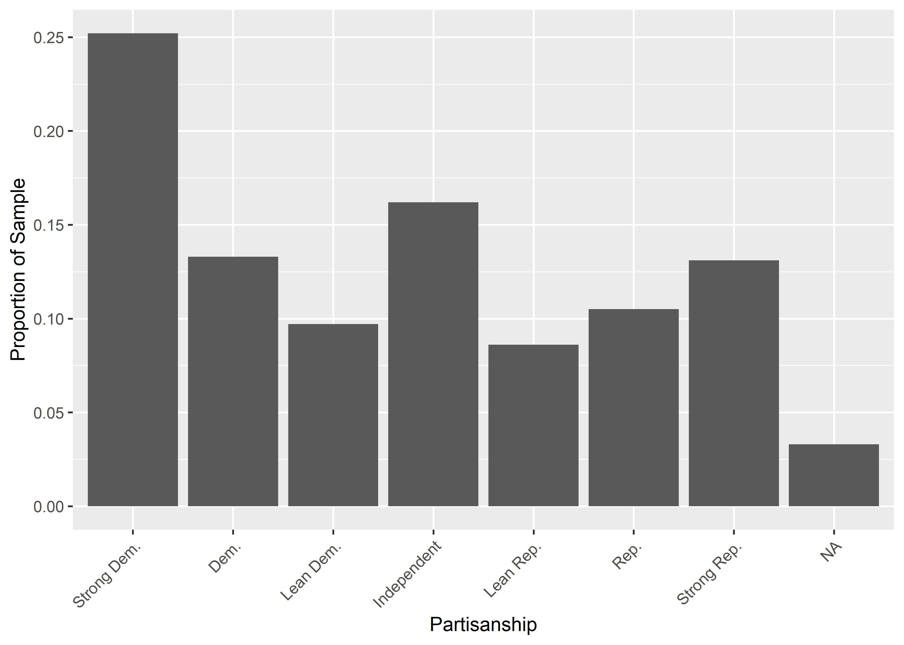
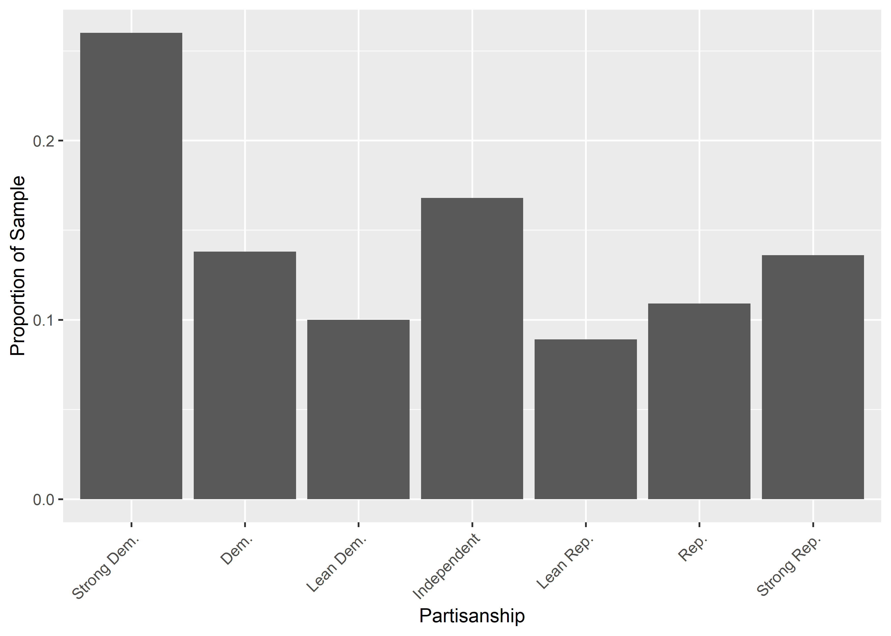
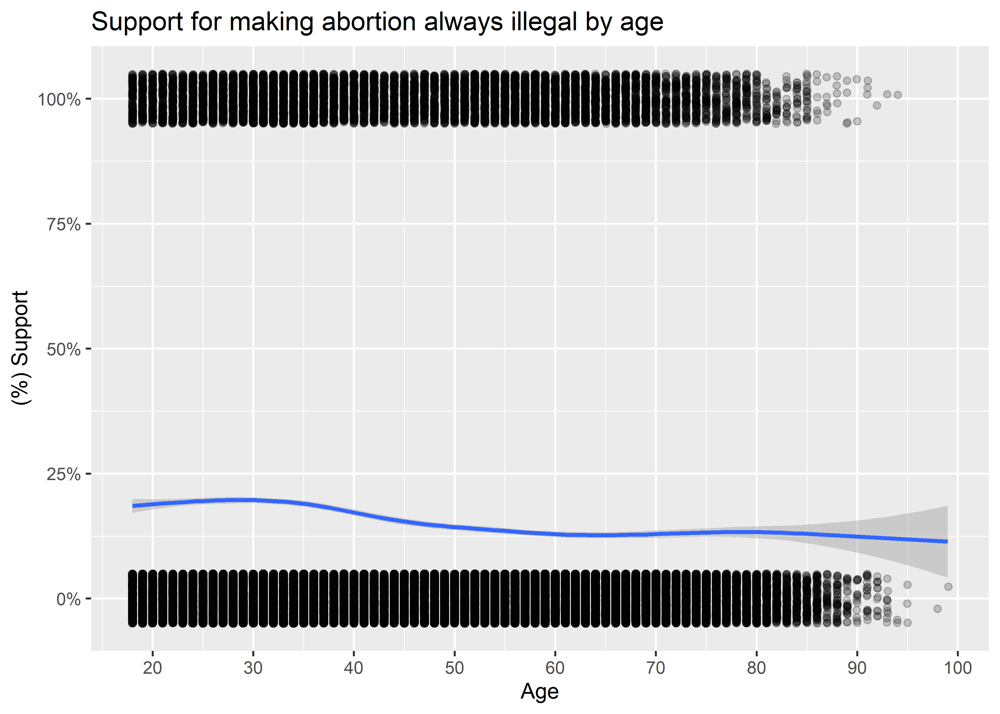
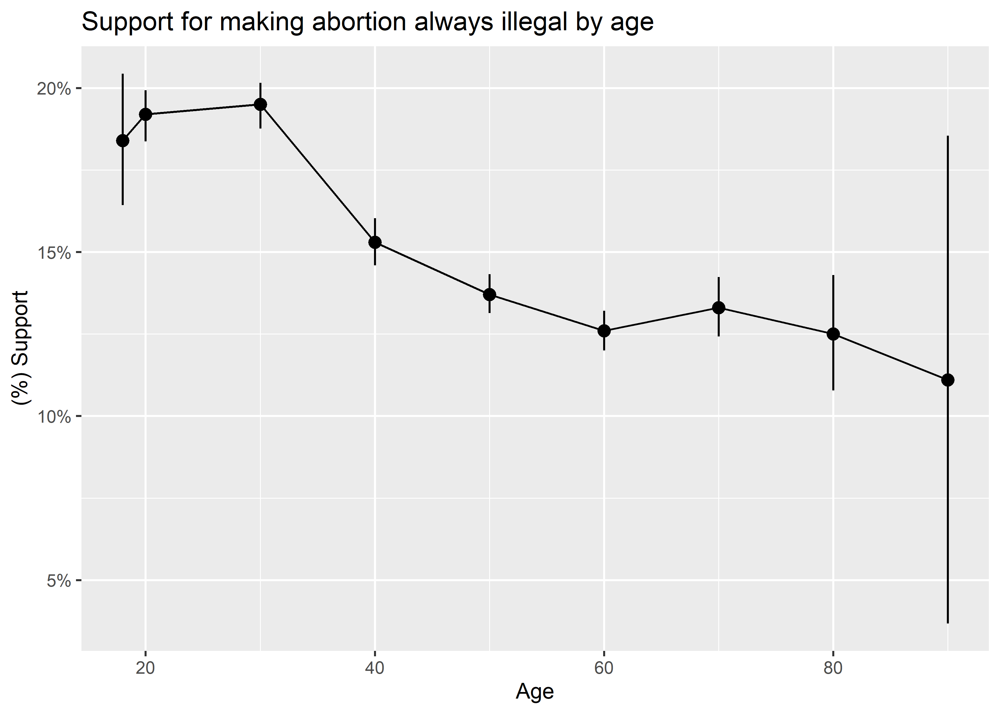
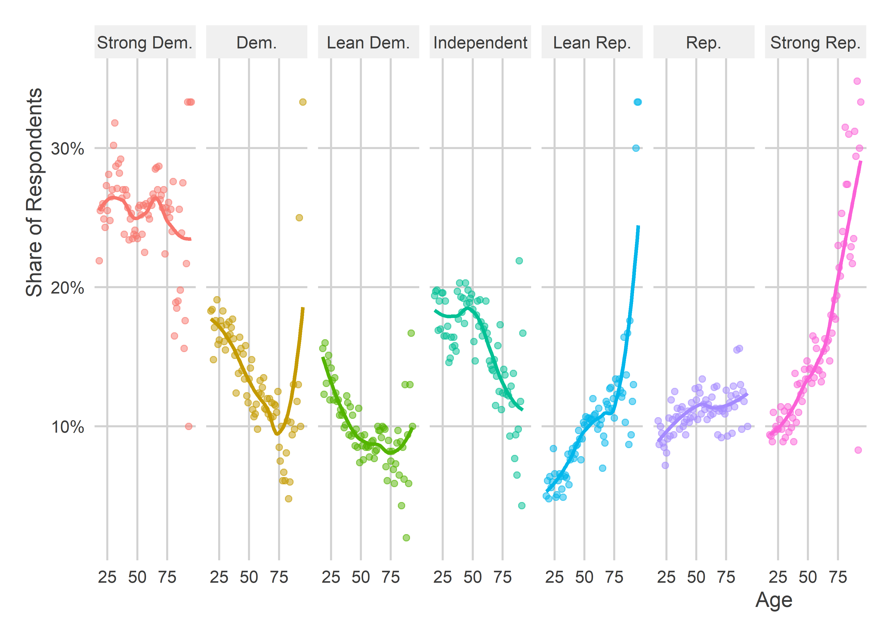

Tools for Working with Survey Data
================

-   [Goals](#goals)
-   [We use surveys to learn about
    populations](#we-use-surveys-to-learn-about-populations)
-   [What survey data usually looks
    like](#what-survey-data-usually-looks-like)
-   [Recoding Variables and Visualizing with
    `{socsci}`](#recoding-variables-and-visualizing-with-socsci)
-   [Other useful recode tools](#other-useful-recode-tools)
    -   [ifelse()](#ifelse)
    -   [Numerical operations](#numerical-operations)
-   [Recode with your visualizations in
    mind](#recode-with-your-visualizations-in-mind)

## Goals

-   We can use surveys to learn about the attitudes of a population.
-   We don’t have to ask everyone in our population what their attitudes
    are. We can just ask a small fraction.
-   Provided our small fraction of the population is a *random sample*
    of individuals, their survey responses will provide a good
    approximation for the population’s, at least in expectation.
-   When you use surveys for data analysis, you generally will need to
    dedicate some extra time to cleaning your data.
-   We’ll talk about how to use tools from `{socsci}` to make that
    cleaning process easier.
-   As you recode variables, you should always do so with the kinds of
    visualizations you want to create in mind.

Tools we’ll use in this session:

``` r
library(tidyverse)
library(socsci)
```

## We use surveys to learn about populations

How do we come up with an estimate for who will win the U.S.
Presidential election? How do we gauge public opinion on use of military
force or foreign aid? How do we figure out the relationship between
socioeconomic background and political attitudes?

The answer to all of these questions is that we do a survey. But not
just any survey. Sure, you could go out on the street and ask some
people their opinions about issues, but if you really want to learn
something about the attitudes of an entire city, state, or country you
need to be more systematic than that.

Surveys of random samples from a population are the best social science
tool we have for making population inferences. But, like all social
science tools, they have limitations and can lead to bad inferences for
two key reasons:

1.  The sample isn’t really random
2.  Social desirability bias

The first happens if the process of selecting people for a survey gives
you a biased sample. For example, many surveys are still done using
land-line phone calls. Any guesses as to how that might give you a
biased sample?

The second happens because people sometimes lie on surveys. This happens
if people try to give you the answer that they think is the “right”
answer rather than their honest opinion.

## What survey data usually looks like

Survey data usually looks like this:

``` r
cces <- read_csv("https://raw.githubusercontent.com/ryanburge/cces/master/CCES%20for%20Methods/small_cces.csv")
cces
```

    ## # A tibble: 64,600 × 33
    ##     ...1    X1       id state birthyr gender  educ  race marital natecon mymoney
    ##    <dbl> <dbl>    <dbl> <dbl>   <dbl>  <dbl> <dbl> <dbl>   <dbl>   <dbl>   <dbl>
    ##  1     1     1   2.22e8    33    1969      2     2     1       1       3       2
    ##  2     2     2   2.74e8    22    1994      2     2     1       5       4       3
    ##  3     3     3   2.84e8    29    1964      2     2     2       5       5       2
    ##  4     4     4   2.88e8     1    1988      2     2     2       5       4       4
    ##  5     5     5   2.90e8     8    1982      2     5     1       1       2       2
    ##  6     6     6   2.91e8     1    1963      2     2     6       4       4       4
    ##  7     7     7   2.93e8    48    1962      1     2     1       2       3       3
    ##  8     8     8   2.95e8    42    1991      2     1     1       2       5       5
    ##  9     9     9   2.96e8    13    1963      1     2     1       1       4       4
    ## 10    10    10   2.96e8    42    1957      2     2     1       1       5       3
    ## # … with 64,590 more rows, and 22 more variables: econfuture <dbl>,
    ## #   police <dbl>, background <dbl>, registry <dbl>, assaultban <dbl>,
    ## #   conceal <dbl>, pathway <dbl>, border <dbl>, dreamer <dbl>, deport <dbl>,
    ## #   prochoice <dbl>, prolife <dbl>, gaym <dbl>, employ <dbl>, pid7 <dbl>,
    ## #   attend <dbl>, religion <dbl>, vote16 <dbl>, ideo5 <dbl>, union <dbl>,
    ## #   income <dbl>, sexuality <dbl>
    ## # ℹ Use `print(n = ...)` to see more rows, and `colnames()` to see all variable names

Any clues what the values for each of the variables are supposed to
mean? It isn’t obvious at first glance. Most survey datasets use special
numeric codes that correspond with specific responses to different
questions. The data is saved in this way because many question responses
can be long-winded, and if the data were saved using those long-winded
responses, it would eat up a lot more of your computer’s memory.

As a way to save space, either on a computer or database, survey
researchers will save the output from surveys using numerical codes and
then create a *codebook* that they or others can use to convert the
numerical codes back to their original meaning for analysis.

The below code walks through some examples of how to implement these
recodes.

## Recoding Variables and Visualizing with `{socsci}`

The workhorse function in `{socsci}`, and my main favorite reason for
using it, is the `frcode()` function. This function let’s us easily
create new ordered categorical variables in a really intuitive fashion.
It involves some extra syntax, but once you understand the logic, it’ll
make more sense.

Consider the following code. It uses `frcode()` to convert the numerical
codes for the `race` column in the dataset to meaningful values:

``` r
cces <- cces %>% 
  mutate(race2 = frcode(race == 1 ~ "White",
                        race == 2 ~ "Black", 
                        race == 3 ~ "Hispanic",
                        race == 4 ~ "Asian")) 
```

We can use `table()` to quickly check the distribution of observations
across these newly coded categories:

``` r
table(cces$race2)
```

    ## 
    ##    White    Black Hispanic    Asian 
    ##    46289     7926     5238     2278

We can do the same thing with the `ct()` function from `{socsci}`:

``` r
cces %>%
  ct(race2)
```

    ## # A tibble: 5 × 3
    ##   race2        n   pct
    ##   <fct>    <int> <dbl>
    ## 1 White    46289 0.717
    ## 2 Black     7926 0.123
    ## 3 Hispanic  5238 0.081
    ## 4 Asian     2278 0.035
    ## 5 <NA>      2869 0.044

This function also returns the proportions.

We can see that there are four racial categories that we’ve coded in the
data, and notice that the order in which they’re summarized matches the
order in which we coded these categories in `frcode()`.

The syntax with `frcode()` goes like so:

`logical condition ~ what do do`.

In that first line in `frcode()` above, the syntax `race == 1 ~ "White"`
literally means when values in the `race` column equal 1, the category
should be “White”.

By default, `frcode()` returns a categorical variable that is ordered
based on the order in which the categories were specified. For a
variable like race, ordering isn’t really necessary. However, for a
variable like partisan leaning, ordering is extremely important.

Consider the following example:

``` r
cces <- cces %>% 
  mutate(pid_new = frcode(pid7 == 1 ~ "Strong Dem.", 
                          pid7 == 2 ~ "Dem.", 
                          pid7 == 3 ~ "Lean Dem.", 
                          pid7 == 4 ~ "Independent", 
                          pid7 == 5 ~ "Lean Rep.", 
                          pid7 == 6 ~ "Rep.", 
                          pid7 == 7 ~ "Strong Rep."))
```

The above code creates a column called `pid_new` which has 7 ordered
categories. This ordering comes in handy for data visualization. Say we
wanted to show the distribution of partisan lean. Using `pid_new` we can
create a ggplot like the following, using `ct()` along the way:

``` r
cces %>%
  ct(pid_new) %>%
  ggplot() +
  aes(x = pid_new, y = pct) +
  geom_col() +
  labs(x = "Partisanship",
       y = "Proportion of Sample") +
  theme(axis.text.x = element_text(angle = 45, hjust = 1))
```



Notice from the above that there’s an NA value shown, too. If there are
any remaining rows in the data that don’t have a relevant category,
`frcode()` automatically returns an NA for those rows.

If we want to drop those values in our visualization, we can just update
the code like so:

``` r
cces %>%
  ct(pid_new, show_na = F) %>%
  ggplot() +
  aes(x = pid_new, y = pct) +
  geom_col() +
  labs(x = "Partisanship",
       y = "Proportion of Sample") +
  theme(axis.text.x = element_text(angle = 45, hjust = 1))
```



Notice that the proportions are now different. It’s because the NA
category is now being dropped before proportions are computed.

If we wanted those values to be coded as something else, we can just use
an additional command:

``` r
cces <- cces %>% 
  mutate(pid_new = frcode(pid7 == 1 ~ "Strong Dem.", 
                          pid7 == 2 ~ "Dem.", 
                          pid7 == 3 ~ "Lean Dem.", 
                          pid7 == 4 ~ "Independent", 
                          pid7 == 5 ~ "Lean Rep.", 
                          pid7 == 6 ~ "Rep.", 
                          pid7 == 7 ~ "Strong Rep.", 
                          TRUE ~ "All Others")) 
```

The final line that reads `TRUE ~ "All Others"` literally means, for
anything else not specified, make the category “All Others”.

Now when we plot the data, it looks like this:

``` r
cces %>%
  ct(pid_new) %>%
  ggplot() +
  aes(x = pid_new, y = pct) +
  geom_col() +
  labs(x = "Partisanship",
       y = "Proportion of Sample") +
  theme(axis.text.x = element_text(angle = 45, hjust = 1))
```


## Other useful recode tools

### ifelse()

For some binary outcomes, we may not need to use `frcode()`. Gender for
example is a binary category in the CCES data. We can recode it like so:

``` r
cces <- cces %>%
  mutate(gender2 = ifelse(gender == 1, "Male", "Female"))
```

`ifelse()` is a simple function that returns one outcome if a logical
condition is met, otherwise it returns an alternative outcome. In the
above, the syntax `ifelse(gender == 1, "Male", "Female")` means if the
gender numerical code is 1, return the category “Male”, otherwise return
the category “Female”.

### Numerical operations

Not all survey variable values may correspond to non-numeric categories.
Some variables like age may just correspond to their actual numeric
amounts. In this case, we may be fine leaving them as-is. But sometimes
researchers prefer to lump these kinds of variables into larger discrete
buckets.

First, we need to create an age column. The CCES data doesn’t actually
have a column for age. Instead, it has a column for birth year. This can
be easily converted to age by simply subtracting birth year from the
year the survey was done (in this case, 2016).

``` r
cces <- cces %>%
  mutate(age = 2016 - birthyr)
```

Next, you can turn this into a more discrete outcome. Before you do
this, you need to first think about what kind or class of variable you
want to use. Sometimes, we may want the new variable to be an ordered
category rather than numerical:

``` r
cces <- cces %>%
  mutate(agecat = frcode(age < 25 ~ "18-24",
                         between(age, 25, 29) ~ "25-29",
                         between(age, 30, 39) ~ "30s",
                         between(age, 40, 49) ~ "40s",
                         between(age, 50, 59) ~ "50s",
                         between(age, 60, 69) ~ "60s",
                         age > 69 ~ "70+"))
```

Alternatively, we could make a numerical category by decade:

``` r
cces <- cces %>%
  mutate(agedecade = floor(age/10)*10)

# minor fix to ensure that we're clear that people < 20 are 18+
cces$agedecade[cces$age < 20] <- 18
```

Let’s check the age columns side-by-side to see how they turned out:

``` r
cces %>%
  select(age, agecat, agedecade)
```

    ## # A tibble: 64,600 × 3
    ##      age agecat agedecade
    ##    <dbl> <fct>      <dbl>
    ##  1    47 40s           40
    ##  2    22 18-24         20
    ##  3    52 50s           50
    ##  4    28 25-29         20
    ##  5    34 30s           30
    ##  6    53 50s           50
    ##  7    54 50s           50
    ##  8    25 25-29         20
    ##  9    53 50s           50
    ## 10    59 50s           50
    ## # … with 64,590 more rows
    ## # ℹ Use `print(n = ...)` to see more rows

## Recode with your visualizations in mind

It’s always important to think about how you want to visualize your data
as you make your recodes.

The three different age columns make it possible to do a few different
kinds of visualizations. Let’s create an outcome variable that we’ll use
age to explain. The column `prolife` is a binary outcome indicating
support (or no support) for the idea that abortions should be illegal in
all circumstances:

``` r
cces <- cces %>%
  mutate(prolife2 = case_when(
    prolife == 1 ~ 1,
    prolife == 2 ~ 0
  ))
```

In the above, I used `case_when()` which is more general than `frcode()`
since its output can be normal unordered categories or also numerical.
Like `frcode()`, anything remaining that isn’t specified gets converted
to NA. In this case, the code 1 indicates support for making abortion
always illegal and 2 indicates a respondent doesn’t support that idea.
There are also two remaining possible categories, 8 and 9, that
correspond to “don’t know” or missing responses. So that we don’t
accidentally lump these in with support or lack of support, we’ll use
`case_when()` rather than `ifelse()`.

With our our numerical age data, we can use a jittered scatter plot with
a smoother to show how age explains prolife attitudes:

``` r
ggplot(cces) +
  aes(x = age, 
      y = prolife2) +
  geom_jitter(height = 0.05,
              width = 0.05,
              alpha = 0.2) +
  geom_smooth() +
  scale_x_continuous(
    breaks = seq(20, 100, by = 10)
  ) +
  scale_y_continuous(
    labels = scales::percent
  ) +
  labs(
    x = "Age",
    y = "(%) Support",
    title = "Support for making abortion always illegal by age"
  )
```



For what it’s worth, using geom_jitter() for a binary outcome rather
than geom_point() can be a nice way to visualize the number of 0-1
observations in the data.

We could also use decades and summarize the data before giving it to
ggplot:

``` r
cces %>%
  group_by(agedecade) %>%
  mean_ci(prolife2) %>%
  ggplot() +
  aes(x = agedecade,
      y = mean,
      ymin = lower,
      ymax = upper) +
  geom_pointrange() +
  geom_line() +
  scale_y_continuous(
    labels = scales::percent
  ) +
  labs(
    x = "Age",
    y = "(%) Support",
    title = "Support for making abortion always illegal by age"
  )
```



The above code uses the `{socsci}` function `mean_ci()` which returns
the mean of some variable along with confidence intervals. Confidence
intervals are a nice thing to include with survey data. They capture the
margin of error or precision of our survey estimates. Remember that
surveys are often used to make inferences to a population. But since the
entire population didn’t take the survey, there’s some uncertainty in
our estimates. The confidence intervals quantify that uncertainty. The
wider they are, the less precision we have in making inferences about
attitudes or behaviors in the population.

Finally, we could show this relationship using a column plot:

``` r
cces %>%
  group_by(agecat) %>%
  mean_ci(prolife2) %>%
  ggplot() +
  aes(x = agecat,
      y = mean,
      ymin = lower,
      ymax = upper) +
  geom_col() +
  geom_errorbar(
    width = 0.2
  ) +
  scale_y_continuous(
    labels = scales::percent
  ) +
  labs(
    x = "Age",
    y = "(%) Support",
    title = "Support for making abortion always illegal by age"
  )
```



Again, the above uses `mean_ci` so that we can show the confidence
intervals alongside the mean.
