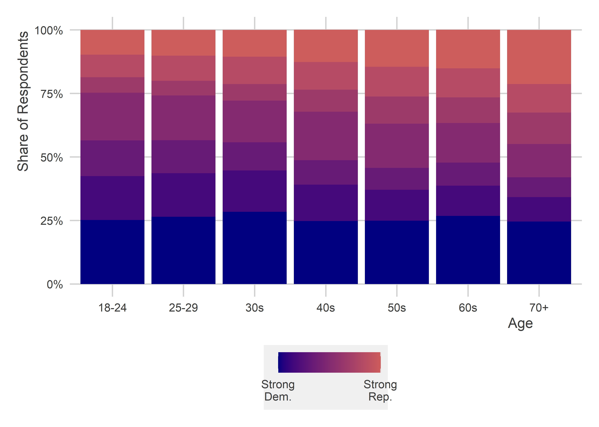

Tools for Working with Survey Data
================

- [Goals](#goals)
- [We use surveys to learn about
  populations](#we-use-surveys-to-learn-about-populations)
- [What survey data usually looks
  like](#what-survey-data-usually-looks-like)
- [Recoding Variables and Visualizing with
  `{socsci}`](#recoding-variables-and-visualizing-with-socsci)
- [Other useful recode tools](#other-useful-recode-tools)
  - [ifelse()](#ifelse)
  - [Numerical operations](#numerical-operations)
- [Recode with your visualizations in
  mind](#recode-with-your-visualizations-in-mind)
- [Where to next?](#where-to-next)

<center>

[\<– Case
Studies](https://github.com/milesdwilliams15/Teaching/blob/main/DPR%20101/Notes/13_case_studies.md)
\| [Back to Notes
Homepage](https://github.com/milesdwilliams15/Teaching/blob/main/DPR%20101/Notes/README.md)
\| [Survey Data, Part II
–\>](https://github.com/milesdwilliams15/Teaching/blob/main/DPR%20101/Notes/15_survey_data_pt2.md)

</center>

## Goals

- Understand when we can and cannot use a survey of some people in a
  population to learn about the attitudes of the entire population.
- Become familiar with some of the challenges of working with survey
  data.
- Introduce tools from `{socsci}` to make working with survey data
  easier.
- Exercise judgment in how you clean up survey data with respect to
  later data visualization choices.

Tools we’ll use in this session:

``` r
library(tidyverse)
library(socsci)
```

## We use surveys to learn about populations

How do we come up with an estimate for who will win the U.S.
Presidential election? How do we gauge public opinion on the use of
military force or foreign aid? How do we figure out the relationship
between socioeconomic background and political attitudes?

The most straightforward way to answer these questions is to conduct a
survey. The idea is that by asking a bunch of people what they think,
feel, or do, we can draw more informed conclusions about the
social/political landscape.

However, (1) we have to be careful about whom we survey, and (2) we have
to be careful to ensure we ask people questions in the right way. If we
aren’t careful about 1, we may not be able to generalize from the group
of people we surveyed to the broader population. And if we aren’t
careful about 2, we may not be able to trust the responses of the people
we surveyed.

Both of these considerations deal with two different kinds of *bias*,
respectively:

- ***sample*** bias
- ***social desirability*** bias

To understand why the first kind of bias is problematic, we need to
think in terms of probability and statistics. To make things more
concrete, let’s imagine that we have a population of 1,000 individuals
and we want to gauge their level of support/opposition to mandatory
vaccinations against COVID-19. However, suppose that due to budgetary or
logistical barriers, we can only ask 100 people about their attitudes.
How can we be sure that the 100 people we survey will give us a good
representation of what all 1,000 people in the population think?

The solution is to pick the 100 that we survey *at random*. This ensures
that the attitudes of the sample we survey are, *in expectation*, equal
to the attitudes of the population. The key thing to remember here is
the “in expectation” part of the previous sentence. While we cannot
guarantee that any one random sample’s attitudes match those of the
general population, if we were to repeatedly draw random samples of
individuals to survey from the population, the average of the sample
estimates will converge toward the true population mean.

Say out of the 1,000 people in the population, 500 support mandatory
vaccinations. That means the true population level of support is 50%. If
we draw a random sample from this population and ask them their
attitudes, on average we’d expect that a similar 50% in the sample
support mandatory vaccinations as well. Though this is not guaranteed to
be true for each and every possible random sample from the population,
if we could repeatedly draw random samples, on average attitudes would
clock in at 50%.

The below figure shows the results from a simple simulation to show this
is the case. I programmed R to give me a population of 1,000 individuals
where 500 support mandatory vaccinations and the rest don’t. Then, I had
it repeatedly draw samples of 100 individuals from the population and
tally up the share of individuals in the samples that support mandatory
vaccinations. The figure shows the distribution of estimates I got from
repeating this procedure 1,000 times. As you can see, the range of
support indicated by individual surveys varies substantially. While many
provide estimates close to the true population’s actual level of
support, some fall below 40% and some above 60%. Even so, the greatest
density of estimates cluster around the true level of support in the
population.


In sum, surveys of random samples from a population, while still subject
to error, are one of the best social science tools we have for making
population inferences. However, even with a random sample, we still have
to consider the second kind of bias: **social desirability**.

People make errors when they take surveys all the time. Maybe they’re in
a hurry or misunderstand a question or two, and so they provide an
answer that doesn’t actually align with what they think. We have a term
for this: “noise.” But sometimes when someone’s answer doesn’t align
with their actual attitudes it’s no accident; the respondent lied. This
happens if people try to give you the answer that they think is the
“right” answer rather than their honest opinion. There is a lot of
research out there on this problem. Everything from the identity of the
person giving a survey, to whether it’s done online or over the phone
can lead people to give different answers to otherwise similar
questions.

To avoid this problem, it’s important to think carefully about how you
ask people questions. This is especially true when asking people about
polarizing issues where they may feel a sense of peer pressure to answer
in a certain way. This can pose a serious challenge to inference. Say we
wanted to measure something like a person’s level of racism. You can’t
just ask in a survey, “how racist would you say you are on a scale from
0 to 10?” People won’t answer that question honestly. In cases like
this, social scientists have come up with a number of indirect ways to
measure racism without asking people directly.

Two approaches are (1) survey experiments and (2) creation of indexes.
For 1, social scientists might think of many ways of asking a question
and then randomly assign these alternative ways of asking the question
to the people surveyed. If they find systematically different kinds of
responses depending on the question wording, then this can both serve as
evidence of social desirability bias and be leveraged as a means to
identifying a more authentic estimate of how individuals really feel in
the population.

Approach 2 involves asking individuals a battery of questions that,
individually, are only indirectly related to the attitude you want to
measure. But, put together, the questions help you triangulate attitudes
(such as racism) that are otherwise impossible to measure with one
straightforward question.

We’ll talk more about index construction in bit. But first, let’s take a
look at some actual survey data.

## What survey data usually looks like

Survey data usually looks like this:

``` r
cces <- read_csv("https://raw.githubusercontent.com/ryanburge/cces/master/CCES%20for%20Methods/small_cces.csv")
cces
```

    ## # A tibble: 64,600 × 33
    ##     ...1    X1       id state birthyr gender  educ  race marital natecon mymoney
    ##    <dbl> <dbl>    <dbl> <dbl>   <dbl>  <dbl> <dbl> <dbl>   <dbl>   <dbl>   <dbl>
    ##  1     1     1   2.22e8    33    1969      2     2     1       1       3       2
    ##  2     2     2   2.74e8    22    1994      2     2     1       5       4       3
    ##  3     3     3   2.84e8    29    1964      2     2     2       5       5       2
    ##  4     4     4   2.88e8     1    1988      2     2     2       5       4       4
    ##  5     5     5   2.90e8     8    1982      2     5     1       1       2       2
    ##  6     6     6   2.91e8     1    1963      2     2     6       4       4       4
    ##  7     7     7   2.93e8    48    1962      1     2     1       2       3       3
    ##  8     8     8   2.95e8    42    1991      2     1     1       2       5       5
    ##  9     9     9   2.96e8    13    1963      1     2     1       1       4       4
    ## 10    10    10   2.96e8    42    1957      2     2     1       1       5       3
    ## # ℹ 64,590 more rows
    ## # ℹ 22 more variables: econfuture <dbl>, police <dbl>, background <dbl>,
    ## #   registry <dbl>, assaultban <dbl>, conceal <dbl>, pathway <dbl>,
    ## #   border <dbl>, dreamer <dbl>, deport <dbl>, prochoice <dbl>, prolife <dbl>,
    ## #   gaym <dbl>, employ <dbl>, pid7 <dbl>, attend <dbl>, religion <dbl>,
    ## #   vote16 <dbl>, ideo5 <dbl>, union <dbl>, income <dbl>, sexuality <dbl>

Any clues what the values for each of the variables are supposed to
mean? It isn’t obvious at first glance. Most survey datasets use special
numeric codes that correspond with specific responses to different
questions. The data is saved in this way because many question responses
can be long-winded, and if the data were saved using those long-winded
responses, it would eat up a lot more of your computer’s memory.

As a way to save space, either on a computer or database, survey
researchers will save the output from surveys using numerical codes and
then create a *codebook* that they or others can use to convert the
numerical codes back to their original meaning for analysis.

The below code walks through some examples of how to implement these
recodes.

## Recoding Variables and Visualizing with `{socsci}`

The `{socsci}` R package provides some helpful tools for cleaning and
then summarizing survey data prior to data visualization. The workhorse
function in `{socsci}`, and my main favorite reason for using it, is the
`frcode()` function. This function let’s us easily create new ordered
categorical variables in a really intuitive fashion. It involves some
extra syntax, but once you understand the logic, it’ll make more sense.
It works similarly to `case_when()`, but it’s designed specifically to
return a vector of data that is an ordered category.

Consider the following code. It uses `frcode()` to convert the numerical
codes for the `race` column in the dataset to meaningful values:

``` r
cces <- cces |> 
  mutate(race2 = frcode(race == 1 ~ "White",
                        race == 2 ~ "Black", 
                        race == 3 ~ "Hispanic",
                        race == 4 ~ "Asian")) 
```

We can use `table()` to quickly check the distribution of observations
across these newly coded categories:

``` r
table(cces$race2)
```

    ## 
    ##    White    Black Hispanic    Asian 
    ##    46289     7926     5238     2278

Notice the order that the counts appear in. Normally, R would return the
counts based on alphabetical order using `table()`, but since `race2` is
an ordered categorical variable, it returns the output based on the
ordering of the categories. This ordering is determined by the order in
which the recodes are specified in `frcode()`.

`{socsci}` has some other helpful functions, too, like `ct()`. This
function is very similar to another function from `{dplyr}` called
`count()`. The count function works a lot like `table()` but it returns
output as a data frame rather than just a vector:

``` r
cces |>
  count(race2)
```

    ## # A tibble: 5 × 2
    ##   race2        n
    ##   <fct>    <int>
    ## 1 White    46289
    ## 2 Black     7926
    ## 3 Hispanic  5238
    ## 4 Asian     2278
    ## 5 <NA>      2869

The `ct()` function from `{socsci}` goes a step further and includes a
column of proportions next to the column of counts:

``` r
cces |>
  ct(race2)
```

    ## # A tibble: 5 × 3
    ##   race2        n   pct
    ##   <fct>    <int> <dbl>
    ## 1 White    46289 0.717
    ## 2 Black     7926 0.123
    ## 3 Hispanic  5238 0.081
    ## 4 Asian     2278 0.035
    ## 5 <NA>      2869 0.044

Also, unlike `count()`, we can tell it to drop observations where we
don’t have a valid response for race:

``` r
cces |>
  ct(race2, show_na = F)
```

    ## # A tibble: 4 × 3
    ##   race2        n   pct
    ##   <fct>    <int> <dbl>
    ## 1 White    46289 0.75 
    ## 2 Black     7926 0.128
    ## 3 Hispanic  5238 0.085
    ## 4 Asian     2278 0.037

The syntax with `frcode()` goes like so:

`logical condition ~ what to do`.

In that first line in `frcode()` above, the syntax `race == 1 ~ "White"`
literally means that when values in the `race` column equal 1, the
category should be “White”.

By default, `frcode()` returns a categorical variable that is ordered
based on the order in which the categories were specified. For a
variable like race, ordering isn’t really necessary. However, for a
variable like partisan leaning, ordering is extremely important.

Consider the following example:

``` r
cces <- cces |> 
  mutate(pid_new = frcode(pid7 == 1 ~ "Strong Dem.", 
                          pid7 == 2 ~ "Dem.", 
                          pid7 == 3 ~ "Lean Dem.", 
                          pid7 == 4 ~ "Independent", 
                          pid7 == 5 ~ "Lean Rep.", 
                          pid7 == 6 ~ "Rep.", 
                          pid7 == 7 ~ "Strong Rep."))
```

The above code creates a column called `pid_new` which has 7 ordered
categories. This ordering comes in handy for data visualization. Say we
wanted to show the distribution of partisan lean. Using `pid_new` we can
create a ggplot like the following, using `ct()` along the way:

``` r
cces |>
  ct(pid_new) |>
  ggplot() +
  aes(x = pid_new, y = pct) +
  geom_col() +
  labs(x = "Partisanship",
       y = "Proportion of Sample") +
  theme(axis.text.x = element_text(angle = 45, hjust = 1))
```


Notice from the above that there’s an NA value shown, too. If there are
any remaining rows in the data that don’t have a relevant category,
`frcode()` automatically returns an NA for those rows.

If we want to drop those values in our visualization, we can just update
the code like so:

``` r
cces |>
  ct(pid_new, show_na = F) |>
  ggplot() +
  aes(x = pid_new, y = pct) +
  geom_col() +
  labs(x = "Partisanship",
       y = "Proportion of Sample") +
  theme(axis.text.x = element_text(angle = 45, hjust = 1))
```


Notice that the proportions are now different. It’s because the NA
category is now being dropped before proportions are computed.

If we wanted those values to be coded as something else, we can just use
an additional command:

``` r
cces <- cces |> 
  mutate(pid_new = frcode(pid7 == 1 ~ "Strong Dem.", 
                          pid7 == 2 ~ "Dem.", 
                          pid7 == 3 ~ "Lean Dem.", 
                          pid7 == 4 ~ "Independent", 
                          pid7 == 5 ~ "Lean Rep.", 
                          pid7 == 6 ~ "Rep.", 
                          pid7 == 7 ~ "Strong Rep.", 
                          TRUE ~ "All Others")) 
```

The final line that reads `TRUE ~ "All Others"` literally means, for
anything else not specified, make the category “All Others”.

Now when we plot the data, it looks like this:

``` r
cces |>
  ct(pid_new, show_na = F) |>
  ggplot() +
  aes(x = pid_new, y = pct) +
  geom_col() +
  labs(x = "Partisanship",
       y = "Proportion of Sample") +
  theme(axis.text.x = element_text(angle = 45, hjust = 1))
```


Without using `frcode()` (say we used `case_when()` instead), the values
on the x-axis would appear in alphabetical order rather than the order
based on political ideology. This makes plotting the data so much
easier.

## Other useful recode tools

### ifelse()

For some binary outcomes, we may not need to use `frcode()`. Gender for
example is a binary category in the CCES data. We can recode it like so:

``` r
cces <- cces |>
  mutate(gender2 = ifelse(gender == 1, "Male", "Female"))
```

`ifelse()` is a simple function that returns one outcome if a logical
condition is met, otherwise it returns an alternative outcome. In the
above, the syntax `ifelse(gender == 1, "Male", "Female")` means if the
gender numerical code is 1, return the category “Male”, otherwise return
the category “Female”.

### Numerical operations

Not all survey variable values may correspond to non-numeric categories.
Some variables like age may just correspond to their actual numeric
amounts. In this case, we may be fine leaving them as-is. But sometimes
researchers prefer to lump these kinds of variables into larger discrete
buckets.

First, we need to create an age column. The CCES data doesn’t actually
have a column for age. Instead, it has a column for birth year. This can
be easily converted to age by simply subtracting birth year from the
year the survey was done (in this case, 2016).

``` r
cces <- cces |>
  mutate(age = 2016 - birthyr)
```

Next, we can turn this numerical variable into a more discrete outcome.
Before we do this, we need to first think about what kind or class of
variable we want to use. Sometimes, we may want the new variable to be
an ordered category rather than numerical:

``` r
cces <- cces |>
  mutate(agecat = frcode(age < 25 ~ "18-24",
                         between(age, 25, 29) ~ "25-29",
                         between(age, 30, 39) ~ "30s",
                         between(age, 40, 49) ~ "40s",
                         between(age, 50, 59) ~ "50s",
                         between(age, 60, 69) ~ "60s",
                         age > 69 ~ "70+"))
```

Alternatively, we could make a numerical category by decade:

``` r
cces <- cces |>
  mutate(agedecade = floor(age/10)*10)

# minor fix to ensure that we're clear that people < 20 are 18+
cces$agedecade[cces$age < 20] <- 18
```

Let’s check the age columns side-by-side to see how they turned out:

``` r
cces |>
  select(age, agecat, agedecade)
```

    ## # A tibble: 64,600 × 3
    ##      age agecat agedecade
    ##    <dbl> <fct>      <dbl>
    ##  1    47 40s           40
    ##  2    22 18-24         20
    ##  3    52 50s           50
    ##  4    28 25-29         20
    ##  5    34 30s           30
    ##  6    53 50s           50
    ##  7    54 50s           50
    ##  8    25 25-29         20
    ##  9    53 50s           50
    ## 10    59 50s           50
    ## # ℹ 64,590 more rows

Now with any one of these variables, we can summarize differences in
attitudes (say political ideology). For example, let’s consider how age
relates to how strongly Republican individuals identify.

Using the numerical version of the data:

``` r
cces |>
  filter(age < 98, pid_new != "All Others") |>
  group_by(age) |>
  ct(pid_new, show_na = F) |>
  ggplot() +
  aes(x = age, y = pct, color = pid_new) +
  geom_point(alpha = 0.5) +
  geom_smooth(se = F) +
  facet_wrap(~ pid_new, ncol = 7) +
  scale_y_continuous(
    labels = scales::percent
  ) +
  labs(
    x = "Age",
    y = "Share of Respondents"
  ) +
  theme(
    legend.position = "none"
  )
```


Using categories:

``` r
set_palette(
  sequential = c("navy", "indianred"),
  from_coolors = F
)
cces |>
  filter(pid_new != "All Others") |>
  group_by(agecat) |>
  ct(pid_new, show_na = F) |>
  mutate(pid_new_names = pid_new,
         pid_new = as.numeric(pid_new)) |>
  ggplot() +
  aes(x = agecat, y = pct, fill = pid_new) +
  geom_col() +
  scale_y_continuous(
    labels = scales::percent
  ) +
  labs(
    x = "Age",
    y = "Share of Respondents",
    fill = NULL
  ) +
  ggpal(
    type = "sequential",
    aes = "fill",
    breaks = c(1, 7),
    labels = c("Strong\nDem.",
               "Strong\nRep."),
  )
```



## Recode with your visualizations in mind

It’s always important to think about how you want to visualize your data
as you make your recodes.

The three different age columns make it possible to do a few different
kinds of visualizations. Let’s create an outcome variable that we’ll use
age to explain. The column `prolife` is a binary outcome indicating
support (or no support) for the idea that abortions should be illegal in
all circumstances:

``` r
cces <- cces |>
  mutate(prolife2 = case_when(
    prolife == 1 ~ 1,
    prolife == 2 ~ 0
  ))
```

In the above, I used `case_when()` which is more general than `frcode()`
since its output can be normal unordered categories or also numerical.
Like `frcode()`, anything remaining that isn’t specified gets converted
to NA. In this case, the code 1 indicates support for making abortion
always illegal and 2 indicates a respondent doesn’t support that idea.
There are also two remaining possible categories, 8 and 9, that
correspond to “don’t know” or missing responses. So that we don’t
accidentally lump these in with support or lack of support, we’ll use
`case_when()` rather than `ifelse()`.

With our our numerical age data, we can use a scatter plot with a
smoother to show how age explains prolife attitudes. In creating the
figure, I’m going to use another `{socsci}` function. This one is called
`mean_ci()`. As the name implies, it returns the mean of some variable,
but what’s special about it is that it is set up to work with the
`{dplyr}` workflow. For example, I can use a `group_by()` before I give
data to `mean_ci()` as I do in the below code to show how attitudes
toward abortion vary by age:

``` r
cces |>
  group_by(age) |>
  mean_ci(prolife2) |>
  ggplot() +
  aes(x = age, 
      y = mean) +
  geom_point(alpha = 0.2) +
  geom_smooth(se = F) +
  scale_x_continuous(
    breaks = seq(20, 100, by = 10)
  ) +
  scale_y_continuous(
    labels = scales::percent
  ) +
  labs(
    x = "Age",
    y = "(%) Support",
    title = "Support for making abortion always illegal by age"
  )
```


We could also use decades. Notice something else I do in the below code,
too. `mean_ci()` doesn’t just return the mean of the variable you give
it. It also returns 95% confidence intervals. These are often important
to show with survey data if our goal is to make inferences to a
population. Remember how individual surveys (even if they are random)
can still be off from what’s true in the general population? This random
deviation means that our survey estimates are subject to a margin of
error. Confidence intervals help us to summarize how wide this margin of
error is.

``` r
cces |>
  group_by(agedecade) |>
  mean_ci(prolife2) |>
  ggplot() +
  aes(x = agedecade,
      y = mean,
      ymin = lower,
      ymax = upper) +
  geom_pointrange() +
  geom_line() +
  scale_y_continuous(
    labels = scales::percent
  ) +
  labs(
    x = "Age",
    y = "(%) Support",
    title = "Support for making abortion always illegal by age"
  )
```


In the above, we can see that the margin of error is quite larger among
the oldest individuals who took the survey. The reason is pretty simple.
Not very many people in the survey are in their 90s.

Finally, we could show this relationship using a column plot and the
categorical age variable:

``` r
set_palette()
cces |>
  group_by(agecat) |>
  mean_ci(prolife2) |>
  ggplot() +
  aes(x = agecat,
      y = mean,
      ymin = lower,
      ymax = upper) +
  geom_col(
    aes(fill = mean),
    show.legend = F
  ) +
  geom_errorbar(
    width = 0.2
  ) +
  scale_y_continuous(
    labels = scales::percent
  ) +
  labs(
    x = "Age",
    y = "(%) Support",
    title = "Support for making abortion always illegal by age"
  ) +
  ggpal(
    type = "sequential",
    aes = "fill"
  )
```


Again, the above uses `mean_ci` so that we can show the confidence
intervals alongside the mean.

## Where to next?

<center>

[\<– Case
Studies](https://github.com/milesdwilliams15/Teaching/blob/main/DPR%20101/Notes/13_case_studies.md)
\| [Back to Notes
Homepage](https://github.com/milesdwilliams15/Teaching/blob/main/DPR%20101/Notes/README.md)
\| [Survey Data, Part II
–\>](https://github.com/milesdwilliams15/Teaching/blob/main/DPR%20101/Notes/15_survey_data_pt2.md)

</center>
