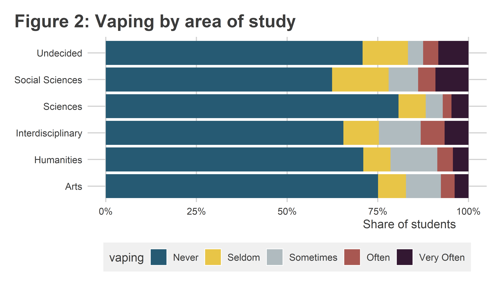

Dealing with multi-column responses
================

## Intro

Sometimes with survey data you have to deal with multi-part questions.
You may find these annoying from a recoding perspective, but they’re
essential when people can possibly fall into more than one category.
This is true for variables like major or race, for example.

Because these variables can be tricky to deal with, I thought I’d show a
quick example for how you can both recode these variables and use them
for data viz. The below example walks through recodes for DU student
declared majors in the DU Feb. 2023 survey and how these can be used to
look at variation in vaping frequency.

## Here we go!

Alright, here’s an example “setup” code chunk. Check out my recodes for
major(s):

``` r
knitr::opts_chunk$set(echo = T,
                      message = F,
                      warning = F,
                      dpi = 500,
                      out.width = "75%",
                      fig.height = 4,
                      fig.width = 7)
library(tidyverse)
```

    ## ── Attaching packages ─────────────────────────────────────── tidyverse 1.3.2 ──
    ## ✔ ggplot2 3.4.0     ✔ purrr   0.3.4
    ## ✔ tibble  3.1.8     ✔ dplyr   1.0.9
    ## ✔ tidyr   1.2.0     ✔ stringr 1.4.0
    ## ✔ readr   2.1.2     ✔ forcats 0.5.1

    ## Warning: package 'ggplot2' was built under R version 4.2.2

    ## ── Conflicts ────────────────────────────────────────── tidyverse_conflicts() ──
    ## ✖ dplyr::filter() masks stats::filter()
    ## ✖ dplyr::lag()    masks stats::lag()

``` r
library(coolorrr)
library(estimatr)
set_theme()
set_palette()
library(socsci)
```

    ## Loading required package: rlang

    ## Warning: package 'rlang' was built under R version 4.2.2

    ## 
    ## Attaching package: 'rlang'
    ## 
    ## The following objects are masked from 'package:purrr':
    ## 
    ##     %@%, as_function, flatten, flatten_chr, flatten_dbl, flatten_int,
    ##     flatten_lgl, flatten_raw, invoke, splice
    ## 
    ## Loading required package: scales
    ## 
    ## Attaching package: 'scales'
    ## 
    ## The following object is masked from 'package:purrr':
    ## 
    ##     discard
    ## 
    ## The following object is masked from 'package:readr':
    ## 
    ##     col_factor
    ## 
    ## Loading required package: broom
    ## Loading required package: glue

``` r
library(patchwork)
library(googlesheets4)
gs4_deauth()
d23 <- range_speedread("https://docs.google.com/spreadsheets/d/1tjXE5es_6kXC4HNFGlQL_xMJ80DH14nS7wNP-rd3nME/edit?usp=share_link")
```

    ## ✔ Reading from "f23_deidentified".
    ## ℹ Export URL:
    ##   <https://docs.google.com/spreadsheets/d/1tjXE5es_6kXC4HNFGlQL_xMJ80DH14nS7wNP-rd3nME/export?format=csv>
    ## Rows: 475 Columns: 203── Column specification ────────────────────────────────────────────────────────
    ## Delimiter: ","
    ## chr   (6): StartDate, EndDate, RecordedDate, Q31_14_TEXT, Q48_6_TEXT, Q54_8_...
    ## dbl (197): Status, Progress, Duration (in seconds), Finished, Q1, Q2, Q3, Q4...
    ## ℹ Use `spec()` to retrieve the full column specification for this data.
    ## ℹ Specify the column types or set `show_col_types = FALSE` to quiet this message.

``` r
## Do some recodes

d23 <- d23 %>%
  
  ## Recode columns for major(s):
  mutate(
    Q23_1 = ifelse(Q23_1 == 1, "Social Sciences", ""),
    Q23_2 = ifelse(Q23_2 == 1, "Sciences", ""),
    Q23_3 = ifelse(Q23_3 == 1, "Humanities", ""),
    Q23_4 = ifelse(Q23_4 == 1, "Arts", ""),
    Q23_5 = ifelse(Q23_5 == 1, "Interdisciplinary", ""),
    Q23_6 = ifelse(Q23_6 == 1, "Undecided", "")
  ) %>%
  
  ## Unite responses into a single column called "major"
  unite(
    major,
    Q23_1:Q23_6,
    remove = F,
    na.rm = T,
    sep = ", "
  ) %>%
  
  ## We can do the same thing with race:
  mutate(
    Q50_1 = ifelse(Q50_1 == 1, "White", ""),
    Q50_2 = ifelse(Q50_2 == 1, "Hispanic", ""),
    Q50_3 = ifelse(Q50_3 == 1, "Black", ""),
    Q50_4 = ifelse(Q50_4 == 1, "Asian", ""),
    Q50_5 = ifelse(Q50_5 == 1, "other", "")
  ) %>%
  unite(
    race,
    Q50_1:Q50_5,
    remove = F,
    na.rm = T,
    sep = ", "
  ) %>%
  
  ## Let's add some other variables:
  mutate(
    pub_sector = frcode(Q5 == 1 ~ "very unfulfilling",
                        Q5 == 2 ~ "unfulfilling",
                        Q5 == 3 ~ "neither fulfulling nor unfulfiling",
                        Q5 == 4 ~ "fulfilling",
                        Q5 == 5 ~ "very fulfilling"),
     econ_class = frcode(Q51 == 1 ~ "Lower class",
                      Q51 == 2 ~ "Lower Middle class",
                      Q51 == 3 ~ "Middle class",
                      Q51 == 4 ~ "Upper Middle class",
                      Q51 == 5 ~ "Upper class")
  ) %>%
  
  ## Let's show how to break things down by vaping:
  mutate(
    vaping = frcode(
      Q6 == 1 ~ "Never",
      Q6 == 2 ~ "Seldom",
      Q6 == 3 ~ "Sometimes",
      Q6 == 4 ~ "Often",
      Q6 == 5 ~ "Very Often"
    )
  )
```

I can use the major(s) columns to summarize vaping in a couple different
ways. Way 1 gives you a really busy but precise data viz. Way 2 gives
you a more concise but also slightly less precise data viz. 

### Way 1: By the `major` column

``` r
d23 %>%
  group_by(major) %>%
  ct(vaping, show_na = F) %>%
  drop_na() %>%
  filter(major != "") %>%
  ggplot() +
  aes(
    x = vaping,
    y = pct
  ) +
  geom_col() +
  facet_wrap(~ major) +
  theme(
    axis.text.x = element_text(angle = 45, hjust = 1)
  ) +
  labs(
    x = NULL,
    y = "Share of Students",
    title = "Figure 1: Vaping by declared major(s)"
  ) +
  scale_y_continuous(
    labels = scales::percent
  )
```


## Way 2: Being less specific

``` r
d23 %>%
  select(Q23_1:Q23_6, vaping) %>%
  pivot_longer(
    cols = - vaping
  ) %>%
  group_by(value) %>%
  ct(vaping, show_na = F) %>%
  drop_na()%>%
  ggplot() +
  aes(
    x = pct,
    y = value,
    fill = vaping
  ) +
  geom_col(
    position = position_fill(reverse = T)
  ) +
  ggpal(aes = "fill") +
  labs(
    x = "Share of students",
    y = NULL,
    title = "Figure 2: Vaping by area of study"
  ) +
  scale_x_continuous(
    labels = scales::percent
  )
```


