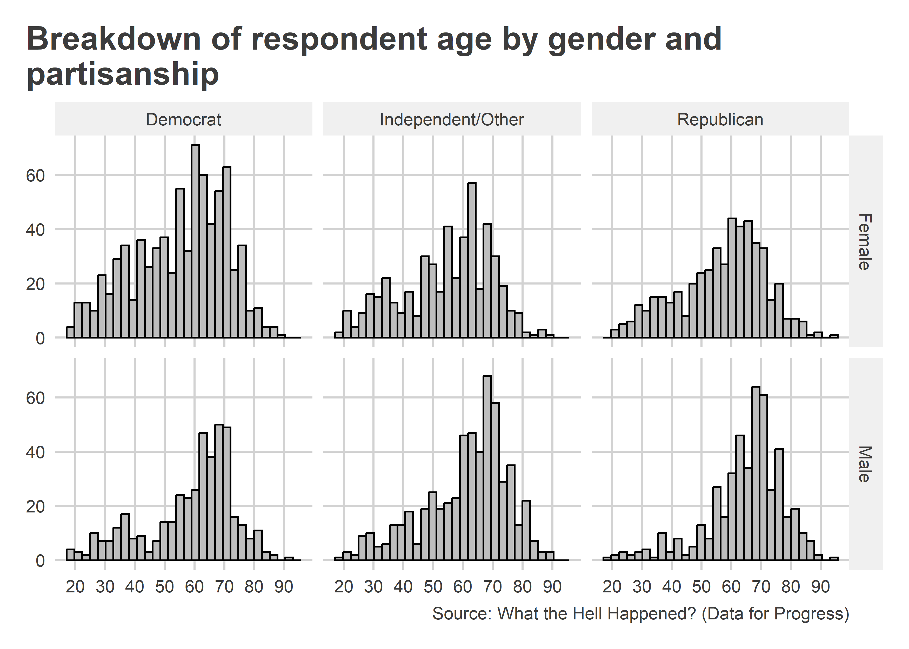
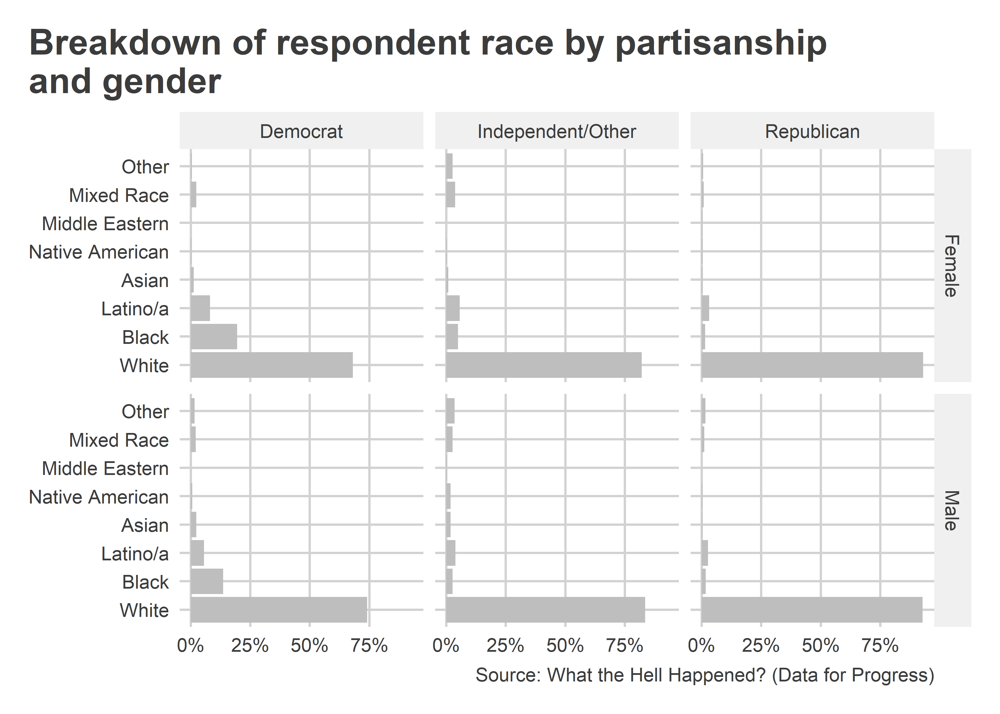

Ideas for Visualizing Survey Data
================

- [Goals](#goals)
- [Demographic Summaries](#demographic-summaries)
- [Summarizing Attitudes](#summarizing-attitudes)
- [Where to next?](#where-to-next)

<center>

[\<– Survey Data, Part
I](https://github.com/milesdwilliams15/Teaching/blob/main/DPR%20101/Notes/14_survey_data.md)
\| [Back to Notes
Homepage](https://github.com/milesdwilliams15/Teaching/blob/main/DPR%20101/Notes/README.md)

</center>

## Goals

- Provide examples for how to do demographic summaries of survey samples
- Provide examples for how to summarize attitudes in a survey

In this last set of lecture notes, my hope is to arm you with plenty of
examples to get you started in your analysis journey. I’ve tried to
include as much as possible, but I can’t show you everything. Walk
through the below examples and tweak them for your own purposes as
needed.

Here’s the packages and data (along with recodes) that you’ll need to
walk through the below examples:

``` r
## packages
library(tidyverse)
library(socsci)
library(coolorrr)

## data viz settings
set_theme()   
set_palette(
  qualitative = c("steelblue", "gray", "red3", "purple4", "gold2"),
  sequential = c("white", "steelblue"),
  diverging = c("red3", "white", "steelblue"),
  binary = c("steelblue", "red3"),
  from_coolors = F
)

## data
url <- "http://filesforprogress.org/datasets/wthh/DFP_WTHH_release.csv"
Data <- read_csv(url)

## recodes
Data <- Data |>
  mutate(
    ## education
    educ_cat = frcode(
      educ == 1 ~ "No HS",
      educ == 2 ~ "HS",
      educ == 3 ~ "Some College",
      educ == 4 ~ "2-year Degree",
      educ == 5 ~ "4-year Degree",
      educ == 6 ~ "Postgrad"
    ),
    ## race
    race_new = frcode(
      race == 1 ~ "White",
      race == 2 ~ "Black",
      race == 3 ~ "Latino/a",
      race == 4 ~ "Asian",
      race == 5 ~ "Native American",
      race == 8 ~ "Middle Eastern",
      race == 6 ~ "Mixed Race",
      TRUE ~ "Other"
    ),
    ## party id
    pid3_new = frcode(
      pid3 == 1 ~ "Democrat",
      !(pid3 %in% 1:2) ~ "Independent/Other",
      pid3 == 2 ~ "Republican"
    ),
    ## gender
    gender_id = ifelse(
      gender == 1, "Male", "Female"
    ),
    ## age
    age = 2018 - birthyr,
    ## issues
    across(
      c(ICE, BAIL_item, WELTEST, PUBLICINT, GREENJOB, POLFEE),
      ~ frcode(
        .x == 5 ~ "Strongly oppose",
        .x == 4 ~ "Oppose",
        .x == 3 ~ "Neither",
        .x == 2 ~ "Support",
        .x == 1 ~ "Strongly support"
      )
    )
  )
```

## Demographic Summaries

There are many ways you could summarize the demographic profile of a
sample. How complex these summaries are depends on how many demographic
factors you want to consider at once. If you want to just look at one at
a time, a simple barchart or histogram will do. For example, here’s a
barchart of how the sample breaks down by race:

``` r
Data |>
  ct(race_new) |>
  ggplot() +
  aes(
    x = reorder(race_new, -pct),
    y = pct
  ) +
  geom_col(
    fill = "gray"
  ) +
  labs(
    x = NULL,
    y = NULL,
    title = "Breakdown of the survey sample by race",
    caption = "Source: What the Hell Happened? (Data for Progress)"
  ) +
  scale_y_continuous(
    labels = scales::percent
  ) +
  theme(
    axis.text.x = element_text(angle = 45, hjust = 1)
  )
```


Here’s another example looking at the breakdown by respondent age:

``` r
ggplot(Data) +
  aes(x = age) +
  geom_histogram(
    fill = "gray",
    color = "black"
  ) +
  scale_x_continuous(
    n.breaks = 10
  ) +
  labs(
    x = NULL,
    y = NULL,
    title = "Distribution of survey respondents by age",
    caption = "Source: What the Hell Happened? (Data for Progress)"
  )
```


When we want to consider at least two demographic factors at once,
things can get a little more complex. There are some tools that can
help, however. One of those is `xheat()` from the `{socsci}` package. It
plots a heat map based on the distribution of observations across two
different discrete categories. Here’s an example of it in action with
race and gender:

``` r
Data |>
  xheat(gender_id, race_new) +
  ## ggpal works with xheat()
  ggpal(
    type = "sequential",
    aes = "fill"
  ) +
  labs(
    x = NULL,
    y = NULL,
    title = "Demographic breakdown of the sample by race and gender",
    caption = "Source: What the Hell Happened? (Data for Progress)"
  )
```


It’s important to note that `xheat()` shows the breakdown of what’s on
the y-axis by the categories on the x-axis. That means if we switched
around `race_new` and `gender_id` in `xheat()`, we’d get different
results. Whereas the previous figure showed the breakdown of race by
gender, the below shows the breakdown of gender by race:

``` r
Data |> # flip race and gender around:
  xheat(race_new, gender_id) +
  ggpal(
    type = "sequential",
    aes = "fill"
  ) +
  labs(
    x = NULL,
    y = NULL,
    title = "Demographic breakdown of the sample by race and gender",
    caption = "Source: What the Hell Happened? (Data for Progress)"
  ) +
  theme(
    axis.text.x = element_text(angle = 45, hjust = 1)
  )
```


If you want to instead show the distribution across all categories
rather than by the one on the x-axis, you’ll need to do a little more
work. Here’s an example using the same variables above to show the
distribution of survey respondents by race and gender *without* grouping
the summary by gender or race:

``` r
Data |>
  group_by(race_new, gender_id) |>
  count() |>
  ungroup() |>
  mutate(
    pct = n / sum(n)
  ) |>
  ggplot() +
  aes(
    x = gender_id,
    y = race_new,
    fill = pct,
    label = scales::percent(round(pct, 3))
  ) +
  geom_tile(
    color = "black"
  ) +
  geom_text() +
  theme(
    legend.position = ""
  ) +
  ggpal(
    type = "sequential",
    aes = "fill"
  ) +
  labs(
    x = NULL,
    y = NULL,
    title = "Demographic breakdown of the sample by race and gender",
    caption = "Source: What the Hell Happened? (Data for Progress)"
  )
```


Not all pairs of variables you want to consider will be discrete.
Sometimes you may want to show how a continuous variable breaks down by
a discrete category. That’s easy enough to do with a faceted histogram.
Here’s an example using age (continuous) and gender (discrete):

``` r
ggplot(Data) +
  aes(x = age) +
  geom_histogram(
    color = "black",
    fill = "gray"
  ) +
  facet_wrap(~ gender_id) +
  scale_x_continuous(
    n.breaks = 10
  ) +
  labs(
    x = NULL,
    y = NULL,
    title = "Breakdown of respondent age by gender",
    caption = "Source: What the Hell Happened? (Data for Progress)"
  )
```


If we want to move beyond two variables at once, we have options, too.
Here’s an extended version of the above figure that adds partisanship
into the mix. Instead of using `facet_wrap()` as in the above example,
note the use of `facet_grid()`.

``` r
ggplot(Data) +
  aes(x = age) +
  geom_histogram(
    color = "black",
    fill = "gray"
  ) +
  ## use facet_grid() instead of facet_wrap()
  facet_grid(gender_id ~ pid3_new) +
  scale_x_continuous(
    n.breaks = 10
  ) +
  labs(
    x = NULL,
    y = NULL,
    title = "Breakdown of respondent age by gender and\npartisanship",
    caption = "Source: What the Hell Happened? (Data for Progress)"
  )
```



We can do something similar when all three variables are discrete, too.
Let’s replace age with race and do a column plot instead:

``` r
Data |>
  group_by(gender_id, pid3_new) |>
  ct(race_new) |>
  ggplot() +
  aes(
    x = pct,
    y = race_new
  ) +
  geom_col(
    fill = "gray"
  ) +
  facet_grid(gender_id ~ pid3_new) +
  scale_x_continuous(
    labels = scales::percent
  ) +
  labs(
    x = NULL,
    y = NULL,
    title = "Breakdown of respondent race by partisanship\nand gender",
    caption = "Source: What the Hell Happened? (Data for Progress)"
  )
```



If we don’t like the above approach (it is a little hard to draw
comparisons), we instead could use a stacked barchart:

``` r
Data |>
  group_by(gender_id, pid3_new) |>
  ct(race_new, cum = T) |> # computes cumulative pct
  ggplot() +
  aes(
    x = pct,
    y = pid3_new,
    fill = race_new
  ) +
  geom_col() +
  facet_wrap(~ gender_id) +
  scale_x_continuous(
    labels = scales::percent
  ) +
  labs(
    x = NULL,
    y = NULL,
    title = "Breakdown of respondent race by partisanship\nand gender",
    caption = "Source: What the Hell Happened? (Data for Progress)",
    fill = NULL
  )
```


There’s nothing to stop you from going further and showing the breakdown
of the data using four (or more) variables. However, for each new
variable you want to throw in the mix, there are diminishing returns to
interpretability. In most cases, three variables in one data viz is more
than enough to tell a compelling story. Go beyond three at your own
risk.

## Summarizing Attitudes

We have similar data visualization choices when we want to show how an
attitude either breakdowns by different demographic factors in the data
or else is correlated with other attitudes. Just like with demographic
factors, your data visualizations can range from simple to complex.

Here’s an example showing how attitudes with respect to six different
policies breakdown. While it doesn’t show how attitudes vary by
different factors in the data, it manages to summarize attitudes for all
six at once:

``` r
Data |>
  pivot_longer(
    cols = c(ICE, BAIL_item, WELTEST, PUBLICINT, GREENJOB, POLFEE)
  ) |>
  mutate(
    name = frcode(
      name == "ICE" ~ "De-fund ICE",
      name == "BAIL_item" ~ "End Cash Bail",
      name == "WELTEST" ~ "Drug-testing for Welfare",
      name == "PUBLICINT" ~ "Public Internet Company",
      name == "GREENJOB" ~ "Green Jobs for Unemployed",
      name == "POLFEE" ~ "Polution Fees for Companies"
    )
  ) |>
  group_by(name) |>
  ct(value, show_na = F) |>
  ggplot() +
  aes(x = value, y = pct, fill = name) +
  geom_col(show.legend = F) +
  facet_wrap(~ name) +
  scale_y_continuous(
    labels = scales::percent
  ) +
  labs(
    x = NULL,
    y = NULL,
    title = "Support for different policy proposals",
    caption = "Source: What the Hell Happened? (Data for Progress)"
  ) +
  theme(
    axis.text.x = element_text(angle = 45, hjust = 1)
  )
```


We can also convert this into a stacked version to make comparisons
easier:

``` r
Data |>
  pivot_longer(
    cols = c(ICE, BAIL_item, WELTEST, PUBLICINT, GREENJOB, POLFEE)
  ) |>
  mutate(
    name = frcode(
      name == "ICE" ~ "De-fund ICE",
      name == "BAIL_item" ~ "End Cash Bail",
      name == "WELTEST" ~ "Drug-testing for Welfare",
      name == "PUBLICINT" ~ "Public Internet Company",
      name == "GREENJOB" ~ "Green Jobs for Unemployed",
      name == "POLFEE" ~ "Polution Fees for Companies"
    )
  ) |>
  group_by(name) |>
  ct(value, show_na = F, cum = T) |>
  ggplot() +
  aes(x = pct, y = name, fill = value) +
  geom_col() +
  scale_x_continuous(
    labels = scales::percent
  ) +
  labs(
    x = NULL,
    y = NULL,
    title = "Support for different policy proposals",
    caption = "Source: What the Hell Happened? (Data for Progress)",
    fill = NULL
  ) +
  ggpal(
    aes = "fill",
    guide = guide_legend(reverse = T)
  )
```


Summarizing attitudes that are measured using continuous scales can be
done similarly, for example, with a histogram, like I’ve done below
using racial resentment, hostile sexism, and fear of demographic change:

``` r
Data |>
  pivot_longer(
    cols = c(racial_resentment_scaled, hostile_sexism_scaled, fear_of_demographic_change_scaled)
  ) |>
  mutate(
    name = str_replace_all(name, "_", " ") |>
      str_remove(" scaled")
  ) |>
  ggplot() +
  aes(x = value) +
  geom_histogram(
    color = "black",
    fill = "gray"
  ) +
  facet_wrap(~ name) +
  scale_x_continuous(
    breaks = 0:1,
    labels = c("low", "high")
  ) +
  labs(
    x = NULL,
    y = NULL,
    title = "Distribution of attitudes toward different marginalized\ngroups",
    caption = "Source: What the Hell Happened? (Data for Progress)"
  ) +
  theme(
    axis.text.x = element_text(hjust = 0:1)
  )
```


You can also use a “ridge” plot, for continuous data. A ridge plot is
similar to a density plot, but it lets you show multiple distributions
at once without the need to use `facet_wrap()` or `facet_grid()`.

``` r
## open {ggridges}
library(ggridges)

## make the plot
Data |>
  pivot_longer(
    cols = c(racial_resentment_scaled, hostile_sexism_scaled, fear_of_demographic_change_scaled)
  ) |>
  mutate(
    name = str_replace_all(name, "_", " ") |>
      str_remove(" scaled")
  ) |>
  ggplot() +
  aes(x = value, y = name) +
  geom_density_ridges(
    aes(height = ..density..),
    stat = "density",
    trim = T
  ) +
  labs(
    x = NULL,
    y = NULL,
    title = "Distribution of attitudes toward different marginalized\ngroups",
    caption = "Source: What the Hell Happened? (Data for Progress)"
  )
```


We can also use a “raincloud” plot. It’s very similar to the above, but
it adds more elements. Specifically, it blends together a density plot,
a boxplot, and a dotplot/histogram, giving the appearance of rain
clouds. Check it out below. Make sure to install `{ggrain}`.

``` r
## install.packages("ggrain")
library(ggrain)

Data |>
  pivot_longer(
    cols = c(racial_resentment_scaled, hostile_sexism_scaled, fear_of_demographic_change_scaled)
  ) |>
  mutate(
    name = str_replace_all(name, "_", " ") |>
      str_remove(" scaled")
  ) |>
  ggplot() +
  aes(x = name, y = value, fill = name, color = name) +
  geom_rain(alpha = 0.6) +
  coord_flip() +
  labs(
    x = NULL,
    y = NULL,
    title = "Distribution of attitudes toward different marginalized\ngroups",
    caption = "Source: What the Hell Happened? (Data for Progress)"
  ) +
  ggpal(aes = "fill") +
  ggpal(aes = "color") +
  theme(
    legend.position = ""
  )
```


We can also summarize the degree of agreement on different issues, as is
relevant when we want to know whether a consensus or division exists
among survey respondents. While we could just look at the data and make
a judgement about the level of consensus that exists among the
individuals who took a survey, putting an exact number on it helps to
remove some subjectivity from our evaluation. We can measure agreement
in many different ways, but one simple approach is to calculate a
Herfindahl Index based on survey responses. This is just the sum of the
squared proportion of responses in each of the possible response
categories for a given question. The output from this approach gives us
a value between 0 and 1, where 1 means perfect agreement. If you’re
wondering, the number returned from this approach is an estimate of the
probability that two randomly selected respondents to the survey have
the same attitude. The higher this probability, the more general
agreement there is among the people who took the survey.

Here’s an example of how to do it using the six different policy issues
mentioned in an earlier example. The below code first creates an
`agreement()` function that calculates the probability that two randomly
selected individuals in the data had the same response to a survey
question. After pivoting the data and grouping by the six policy issue
questions, counts and proportions of responses are calculated. The
`agreement()` function is then applied to these counts to give us a
question specific measure of agreement, which we can then plot. The data
viz I produced below is quite involved, so go slowly to make sure you
understand what’s going on. Rather than produce a barchart with
`geom_col()` (that’d be easy), I made a horizontal lollipop plot and
used some extra hacks to have the relevant policy question labels appear
inline, above the relevant lollipop.

``` r
## a function to calculate "agreement":
agreement <- function(x) {
  p <- (x / sum(x, na.rm = T))^2
  sum(p, na.rm = T)
}

## start prepping the data
Data |>
 pivot_longer(
    cols = c(ICE, BAIL_item, WELTEST, PUBLICINT, GREENJOB, POLFEE)
  ) |>
  mutate(
    name = frcode(
      name == "ICE" ~ "De-fund ICE",
      name == "BAIL_item" ~ "End Cash Bail",
      name == "WELTEST" ~ "Drug-testing for Welfare",
      name == "PUBLICINT" ~ "Public Internet Company",
      name == "GREENJOB" ~ "Green Jobs for Unemployed",
      name == "POLFEE" ~ "Polution Fees for Companies"
    )
  ) |>
  group_by(name) |>
  ct(value, show_na = F) |>
  ## calculate agreement and save the top response:
  summarize(
    agreement = agreement(pct),
    attitudes = unique(value[pct == max(pct)])
  ) |>
  ungroup() |>
  ## update the name to include the top attitude and reorder:
  mutate(
    name = reorder(
      paste0(name, " (", attitudes, ")"), -agreement
    )
  ) |>
  ggplot() +
  aes(x = agreement, y = name) +
  geom_pointrange(
    aes(xmin = 0, xmax = agreement)
  ) +
  labs(
    x = "Agreement",
    y = NULL,
    title = "Which issues do respondents most agree on?"
  ) +
  facet_wrap(~ name, scales = "free_y", ncol = 1) +
  scale_y_discrete(
    breaks = NULL
  ) +
  theme(
    strip.text = element_text(hjust = 0, face = "bold.italic"),
    strip.background = element_blank(),
    panel.grid.major = element_blank()
  )
```


We can also use this approach to measure agreement on continuous policy
preferences, too. Here’s an example using the hostile sexism, racial
resentment, and fear of demographic change indexes:

``` r
Data |>
 pivot_longer(
    cols = c(racial_resentment_scaled, hostile_sexism_scaled, fear_of_demographic_change_scaled)
  ) |>
  mutate(
    name = str_replace_all(
      name, "_", " "
    ) |>
      str_remove_all(" scaled")
  ) |>
  group_by(name) |>
  count(value) |>
  drop_na() |>
  ## calculate agreement and save the top response:
  summarize(
    agreement = agreement(n),
    mean = round(sum(value * n) / sum(n), 2)
  ) |>
  ungroup() |>
  ## update the name to include the top attitude and reorder:
  mutate(
    name = reorder(
      paste0(name, " (mean = ", mean, ")"), -agreement
    )
  ) |>
  ggplot() +
  aes(x = agreement, y = name) +
  geom_pointrange(
    aes(xmin = 0, xmax = agreement)
  ) +
  labs(
    x = "Agreement",
    y = NULL,
    title = "Which issues do respondents most agree on?",
  ) +
  facet_wrap(~ name, scales = "free_y", ncol = 1) +
  scale_y_discrete(
    breaks = NULL
  ) +
  theme(
    strip.text = element_text(hjust = 0, face = "bold.italic"),
    strip.background = element_blank(),
    panel.grid.major = element_blank()
  )
```


Finally, if we’re interested in how different attitudes are correlated
in the data, we have a number of options. You already are familiar with
many, like scatter plots, so I want to introduce something new: a
correlation plot. We’ve been talking about correlations among variables
a lot so far, but we’ve really only done so in the colloquial sense. The
term “correlation” also has a technical meaning in statistical analysis,
specifically, as a formal measure of the degree to which two variables
have a linear relationship. The estimate of this measure is called the
correlation coefficient. It can take a value between -1 and 1, where 1
means the two variables in question have a perfect positive linear
relationship, -1 means the two variables have a perfect negative linear
relationship, and 0 means the two variables are completely *orthogonal*
(they have no relationship).

We can calculate correlations for multiple variables at once in R using
the `cor()` function. The below code uses this function to create a
*correlation matrix* (a matrix that contains all the bivariate
correlations for all possible combinations of variables in the data). I
have it do so only for the three continuous indexes we’ve been playing
around with so far by only selecting the relevant columns, then giving
them to `cor()`. Since there are some missing values in the data, I set
the option `use = "pairwise.complete.obs"`, which is similar to
`na.rm = T` in `mean()`.

``` r
## make the correlation matrix
corr_mat <- Data |>
  select(
    racial_resentment_scaled, hostile_sexism_scaled, fear_of_demographic_change_scaled
  ) |>
  cor(use = "pairwise.complete.obs")

## update names
colnames(corr_mat) <- str_replace_all(colnames(corr_mat), "_", " ") |>
  str_remove(" scaled") -> rownames(corr_mat)

## print
corr_mat
```

    ##                            racial resentment hostile sexism
    ## racial resentment                  1.0000000      0.5884866
    ## hostile sexism                     0.5884866      1.0000000
    ## fear of demographic change         0.5887728      0.5968202
    ##                            fear of demographic change
    ## racial resentment                           0.5887728
    ## hostile sexism                              0.5968202
    ## fear of demographic change                  1.0000000

Once I have the correlation matrix, I can use `ggcorrplot()` from the
`{ggcorrplot}` package to make a data visualization with the above
correlation matrix:

``` r
## install.packages("ggcorrplot")
library(ggcorrplot)

ggcorrplot(corr_mat, 
           type = "lower",
           lab = T) +
  theme(legend.position = "") +
  labs(
    title = "Correlation in attitudes toward marginalized groups"
  )
```


## Where to next?

<center>

[\<– Survey Data, Part
I](https://github.com/milesdwilliams15/Teaching/blob/main/DPR%20101/Notes/14_survey_data.md)
\| [Back to Notes
Homepage](https://github.com/milesdwilliams15/Teaching/blob/main/DPR%20101/Notes/README.md)

</center>
