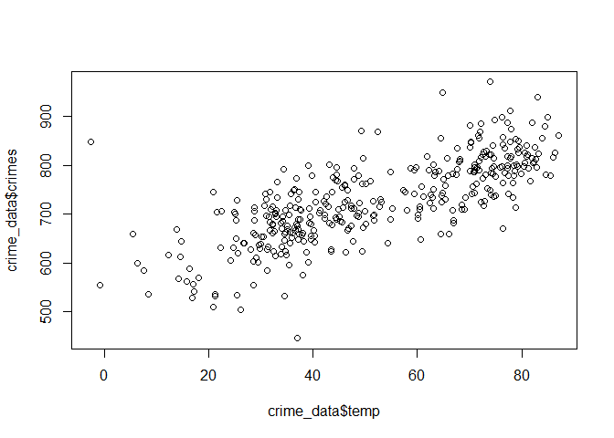
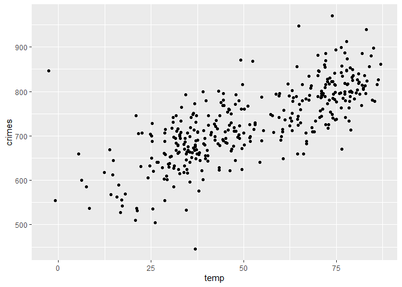
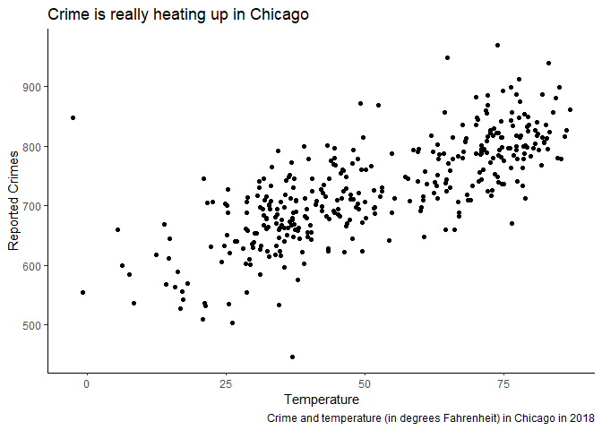
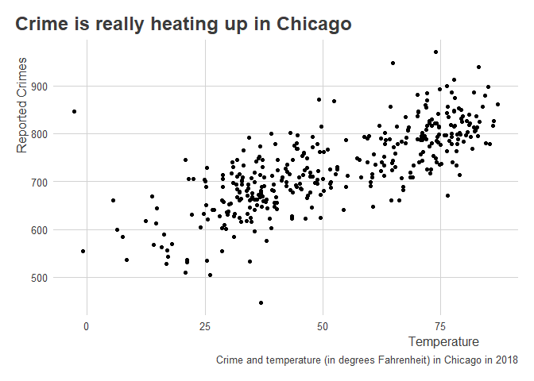
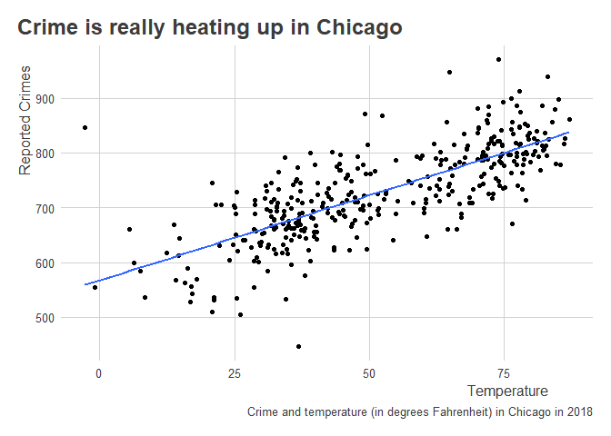
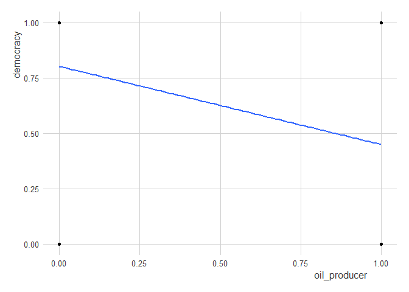
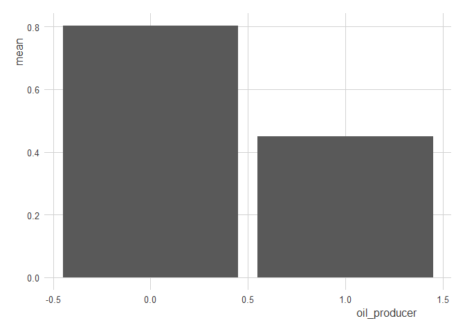
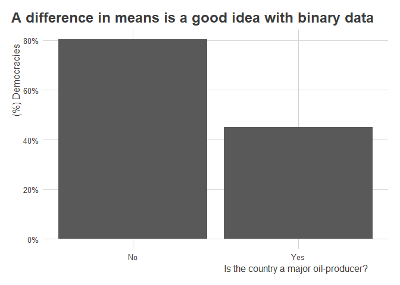

Correlation
================

## Learning objectives

-   Correlation tells us about how two features of the world occur
    together.
-   To estimate a correlation, we need variation in the factors we want
    to study.
-   Correlations can be useful for description, prediction, or
    causation, but we need to be careful and think clearly about how
    appropriate estimated correlations really are.
-   Correlations are restricted to ***linear*** relationships. That
    means they have some limitations but are generally more useful than
    you might guess.

## Ronald A. Fisher: An unlikely defender of smoking

According to [Wikipeida](https://en.wikipedia.org/wiki/Ronald_Fisher),
Ronald Fisher (1890-1962) was a “British polymath who was active as a
mathematician, statistician, biologist, geneticist, and academic.” In a
history of modern statistics, Anders Hald called him a “genius who
almost single-handedly created the foundations of modern statistical
science.”

Fisher also didn’t believe that smoking causes cancer, and he spent the
last years of his life arguing with the British medical community about
it.

This piece by
[Priceonomics](https://priceonomics.com/why-the-father-of-modern-statistics-didnt-believe/)
provides some good background on the debate.

It all started in 1957 when Fisher wrote a
[letter](https://www.york.ac.uk/depts/maths/histstat/fisher269.pdf) to
the *British Medical Journal* denouncing its recent editorial position
that smoking causes lung cancer. The journal called for a public
information campaign to spread the word about the dangers of tobacco.
Fisher bristled at this advice.

Fisher, well-known as a hothead prone to making enemies and never one to
mince words, loved to smoke pipe tobacco. This habit, coupled with a
fair dose of motivated reasoning, likely blinded the venerated and
influential “father of modern statistics” to the scientific evidence—but
whether bias or sound statistical reasoning drove this criticism remains
the subject of debate.

Though today this issue is settled (smoking does indeed cause lung
cancer!), the root of Fisher’s critique—that correlation

causation—is a point that we will return to again and again. Just
because two things co-occur does not imply that one *causes* the other.
Remember this as we start to explore the topic of **correlation**.
Knowing what an observed correlation **can** and **cannot** tell us
about the features of the world under study is one of the biggest
challenges researchers face. Clear thinking is essential.

## What is correlation?

As Bueno de Mesquita and Folwer (BDMF) note in our text,
“\[c\]orrelation is the primary tool through which quantitative analysts
describe the world, forecast future events, and answer scientific
questions” (p. 13). A **correlation** describes how much two features
(or variables) of the world co-occur.

A correlation can be **positive**, meaning as one variable occurs or
increases in value so does the other. A correlation also can be
**negative**, meaning as one variable occurs or increases in value the
other does the opposite.

As we think about variables, remember that they can come in different
types. Some variables are **binary**, meaning they can take only one of
two values. Imagine a light switch, which can either be on or off. Or
think of smoking. Someone either smokes cigarettes on the regular, or
they don’t.

**Continuous** variables can take a variety of values. These capture
features of the world like magnitude. Think of things like the number of
people killed in a terrorist attack or ballots cast for a candidate in
an election.

### Binary Features

Let’s consider the first example from the text dealing with oil
production and democracy. The code below “reverse engineers” the data
shown in Table 2.1 in the text. Using some tools from the tidyverse, I
use the tibble() function to make small data frames that have two
columns and 1 row. I then use the “pipe” operator to tell R to feed
these tables in the function sample_n() which lets me repeat the number
of rows in the data for the amount of times I set “n” equal to. The
values I select come from the table entries in the text. The final
dataset I create is called “oil_regime_data” which is just each of these
data tables stacked on top of each other.

``` r
# Use tools in the tidyverse
library(tidyverse)

# Reverse engineer datasets from Table 2.1 in BDMF
# 1. democratic oil producers
d1 <- tibble( 
  democracy = 1,
  oil_producer = 1
) %>%
  sample_n(9, T) # n = 9, and replace = TRUE
# 2. democratic non-major producers
d2 <- tibble(
  democracy = 1,
  oil_producer = 0
) %>%
  sample_n(118, T) # n = 118, and replace = TRUE
# 3. autocratic oil producers
d3 <- tibble(
  democracy = 0,
  oil_producer = 1
) %>%
  sample_n(11, T) # n = 11, and replace = TRUE
# 4. autocratic non-major producers
d4 <- tibble(
  democracy = 0,
  oil_producer = 0
) %>%
  sample_n(29, T) # n = 29, and replace = TRUE

# Merge into a single dataset:
oil_regime_data <- list(d1,d2,d3,d4) %>%
  bind_rows()
```

The final data object contains two binary variables: democracy and
oil_producer. These features can be either 0 or 1, where 1 means “on”
and 0 means “off.”

We can calculate the correlation between these two features in R in a
bunch of different ways. For example, we can use the cor() function in
base R.

``` r
cor(oil_regime_data)
```

    ##               democracy oil_producer
    ## democracy     1.0000000   -0.2683325
    ## oil_producer -0.2683325    1.0000000

The cor() function is easy to use, but if you aren’t familiar with
correlations, you probably have some questions about the output. Why
does it look like a matrix, for instance?

By default, if you feed cor() a data frame or table, it returns a
correlation matrix. This matrix describes all the correlations that
exist between features in the data (even a feature with itself—hence the
1’s along the diagonal).

If you want to know what the correlation is between two features, just
look for the value at the intersection of two of them. In the above, we
can see that democracy and major-oil-producer status have a **negative**
correlation of
.

What does this mean? Remember that correlation coefficients can take
values anywhere between

and 1, where 0 means there is no relationship, 1 means there is a
perfect positive relationship, and

means there is a perfect negative relationship.

If you don’t want to deal with trying to find the correlation you’re
interested in by looking at a correlation matrix, you can just write:

``` r
cor(x = oil_regime_data$democracy, 
    y = oil_regime_data$oil_producer)
```

    ## [1] -0.2683325

There are many other packages in R that users have developed to make
estimating correlations easier and compatible with the tidyverse way of
doing things. The socsci package, for example, contains the corr()
function (with two r’s), which we can use like so:

``` r
library(socsci)
oil_regime_data %>%
  corr(democracy, oil_producer)
```

    ## # A tibble: 1 × 8
    ##   estimate statistic  p.value     n conf.low conf.high method            alter…¹
    ##      <dbl>     <dbl>    <dbl> <int>    <dbl>     <dbl> <chr>             <chr>  
    ## 1   -0.268     -3.58 0.000455   165   -0.404    -0.121 Pearson's produc… two.si…
    ## # … with abbreviated variable name ¹​alternative

The output has a lot more going on than cor(). What I like about the
corr() function is that (1) you can use the `%>%` or “pipe” operator and
(2) it automatically reports statistics for doing inference. We’ll
discuss inference later, but for now just know that the corr() function
makes it really easy to do statistical inference—that is, calculate the
probability that a specific correlation would have occurred by random
chance.

Returning to the data, remember from the text that correlations have
another use besides description. We can use them to make predictions.
The correlation between democracy and oil-production tells us that major
oil-producers tend not to have democratic forms of governance. Say we
collected some new data and only the oil-producer status of these new
countries was available. We could use this information to tell us the
likelihood that these new countries also are democracies.

### Continuous Features

What about continuous variables? The text goes on to describe data on
crime rates and temperature in Chicago, IL across days in 2018.

I downloaded the data used in the text from the book’s website and saved
it in my files in a folder called “Data.” I can write the following to
get the data from my files and into R’s environment:

``` r
library(here) # use the here package to navigate your files
crime_data <- read_csv(
  here("DPR 201", "Data", "ChicagoCrimeTemperature2018.csv")
)
str(crime_data) # use str() to look at the structure of the data
```

    ## spc_tbl_ [365 × 5] (S3: spec_tbl_df/tbl_df/tbl/data.frame)
    ##  $ year  : num [1:365] 2018 2018 2018 2018 2018 ...
    ##  $ month : num [1:365] 1 1 1 1 1 1 1 1 1 1 ...
    ##  $ day   : num [1:365] 1 2 3 4 5 6 7 8 9 10 ...
    ##  $ temp  : num [1:365] -2.679 -0.857 14.162 6.3 5.429 ...
    ##  $ crimes: num [1:365] 847 555 568 600 660 585 535 618 653 709 ...
    ##  - attr(*, "spec")=
    ##   .. cols(
    ##   ..   year = col_double(),
    ##   ..   month = col_double(),
    ##   ..   day = col_double(),
    ##   ..   temp = col_double(),
    ##   ..   crimes = col_double()
    ##   .. )
    ##  - attr(*, "problems")=<externalptr>

The data contains 365 observations for each of days of the year in 2018.
Each day is an **observation**. The data also has 5 columns, each a
different **variable** per observation. Each of the individual cells in
the table is a **unique value** per observation and variable.

For those unfamiliar, that means this data is **tidy**. I don’t just
mean that it’s clean. Tidy data is defined by the set of criteria I
listed above, and it is a format that is often best for working with
data. \[Read more about it
[here](https://cran.r-project.org/web/packages/tidyr/vignettes/tidy-data.html).\]

The two features we want to look at are `temp`, which is a
**continuous** variable that indicates the temperature on a given day in
degrees Fahrenheit, and `crimes`, which is a **discrete** numerical
variable that reports the number of times a crime was mentioned in the
**Chicago Tribune**.

With data like this, it is a good idea to first **look at it**. We can
do this really quickly in base R by writing:

``` r
plot(crime_data$temp, crime_data$crimes)
```

<!-- -->

This is good enough for a first pass, but it’s rather ugly. The
state-of-the art for data visualization is to use the ggplot2 package in
R. This is part of the tidyverse of R packages. Since we already
attached the tidyverse, ggplot2 is already attached as well.

Here’s that same **scatter plot** produced with tools from ggplot2:

``` r
ggplot(crime_data) +
  aes(x = temp, y = crimes) +
  geom_point()
```

<!-- -->

The syntax is a little more involved, but the long-term payoff is
exponentially greater. The data viz tools in ggplot2 let us make
infinite customizations to plots that are publication ready. For
example, with a few additional flourishes, we can make a great looking
scatter plot with the temperature and crime data.

``` r
ggplot(crime_data) +
  aes(x = temp, y = crimes) +
  geom_point() +
  labs(
    x = "Temperature",
    y = "Reported Crimes",
    title = "Crime is really heating up in Chicago",
    caption = "Crime and temperature (in degrees Fahrenheit) in Chicago in 2018"
  ) +
  theme_classic()
```

<!-- -->

There are tons of ways to customize plots, and lots of different themes
that you can apply. The
[ggthemes](https://statisticsglobe.com/ggthemes-package-r) package
provides some cool options. You can also access my personal favorite
using the
[coolorrr](https://milesdwilliams15.github.io/r/packages/2022/10/05/coolorrr.html)
package:

``` r
library(coolorrr)
set_theme() # sets the theme for ggplot globally

ggplot(crime_data) +
  aes(x = temp, y = crimes) +
  geom_point() +
  labs(
    x = "Temperature",
    y = "Reported Crimes",
    title = "Crime is really heating up in Chicago",
    caption = "Crime and temperature (in degrees Fahrenheit) in Chicago in 2018"
  )
```

<!-- -->

The tools in ggplot2 are centered around a simple workflow:

1.  Feed your data to `ggplot()`;
2.  Tell it what relationships you want to see using `aes()`;
3.  Tell it how to show those relationships using `geom_*()`;
4.  Customize to your heart’s content.

All along the way, you can use `+` (just like the `%>%` operator) to add
new layers to your plot.

Okay, back to the data. It looks like temperature has a positive
correlation with crime. To better see these, we could add a **line of
best fit** to the data, or what we also would call a regression line.

``` r
ggplot(crime_data) +
  aes(x = temp, y = crimes) +
  geom_point() +
  geom_smooth(
    method = "lm", # add a linear regression line
    se = FALSE     # don't show confidence intervals
  ) +
  labs(
    x = "Temperature",
    y = "Reported Crimes",
    title = "Crime is really heating up in Chicago",
    caption = "Crime and temperature (in degrees Fahrenheit) in Chicago in 2018"
  )
```

<!-- -->

The line of best fit comes from a **linear model** that we have **fit to
the data**. Remember all those years ago when you saw this formula in
linear algebra:


A linear model is based on this simple equation. It has a **slope** and
an **intercept**. The process of finding these is more involved than the
process you learned in linear algebra, however. The variables you used
there would have been clean and smooth. Real-world data are far messier.
We therefore have to **estimate** the slope and intercept. We do this
using an **estimator**, which in this case is just a rule or criterion
that defines what the best out of all possible alternative slope and
intercept values are.

This estimator is called **ordinary least squares** (OLS), which is the
work-horse estimator used in lots of scientific research and in
industry. There are many others that we could use to fit a linear model
to data, too, but we’ll save those kinds of details for another day. OLS
is a good place to start because it has close correspondence with
correlation.

A correlation, you see, is all about summarizing the strength of a
**linear relationship** between two features. That means that if a
linear model makes for a good way to summarize the relationship between
two variables, so is a correlation coefficient.

We can calculate the correlation between continuous variables just the
same as binary ones:

``` r
crime_data %>%
  corr(temp, crimes)
```

    ## # A tibble: 1 × 8
    ##   estimate statistic  p.value     n conf.low conf.high method            alter…¹
    ##      <dbl>     <dbl>    <dbl> <int>    <dbl>     <dbl> <chr>             <chr>  
    ## 1    0.755      21.9 1.63e-68   363    0.707     0.796 Pearson's produc… two.si…
    ## # … with abbreviated variable name ¹​alternative

As you probably expected from looking at the data, temperature and crime
have a pretty strong positive correlation. Importantly though, and
remember this, this finding says nothing about causation. That’s
something we’ll get to later. Even so, this correlation is certainly a
valid description of these two features of the world, and this knowledge
can be useful for prediction—just like the democracy and oil-producer
data. For example, armed with a linear model fit to this data from 2018,
you could easily put together a “crime forecast” based on Chicago
temperatures on a given day in 2019.

## What Correlations Are Good For

I’ve already mentioned a couple things above that correlations are good
for:

1.  Description
2.  Prediction

Later in this course, we’ll talk about a third use:

3.  Causal inference

The latter is a unique animal. For now let’s just say that while
correlation does not imply causation, causation without correlation is
hard to identify.

## Helpful Ways of Measuring Correlations in R

We already talked about how to calculate correlation coefficients in R,
and we touched on how we can also use linear models. Let’s go a little
deeper and get a little more technical.

### Mean, Variance, and Standard Deviation

We can calculate means in R using the mean() function like so:

``` r
mean(crime_data$temp)
```

    ## [1] 51.94336

Sometimes, you’ll want to update the mean function by indicating
`na.rm = T` to avoid getting an invalid value returned. This would be an
important step if the data contain missing values. Check it:

``` r
new_temp <- c(NA, crime_data$temp)
mean(new_temp)
```

    ## [1] NA

In the above, I created an object called new_temp that is all the 365
temp days in the crime data with an additional NA observation thrown in
the mix. I then tried to take the mean, and R spit out an NA.

You can avoid this problem by instead writing:

``` r
mean(new_temp, na.rm=T)
```

    ## [1] 51.94336

This option also applies to the other functions we’ll talk about.

Using other tools in the dplyr package, you can also calculate means in
tidyverse-friendly ways. You can use summarize() from dplyr, for
example:

``` r
crime_data %>% 
  summarize(
    mean_temp = mean(temp)
  )
```

    ## # A tibble: 1 × 1
    ##   mean_temp
    ##       <dbl>
    ## 1      51.9

You can also use mean_ci() from socsci if you want to report all kinds
of additional statistics.

``` r
crime_data %>%
  mean_ci(temp)
```

    ## # A tibble: 1 × 7
    ##    mean    sd     n  level    se lower upper
    ##   <dbl> <dbl> <int>  <dbl> <dbl> <dbl> <dbl>
    ## 1  51.9  20.6   365 0.0500  1.08  49.8  54.1

You can also use the group_by function to report means by different
groups in the data. For example, you can get the mean temp per month:

``` r
crime_data %>%
  group_by(month) %>%
  summarize(
    mean_temp = mean(temp)
  )
```

    ## # A tibble: 12 × 2
    ##    month mean_temp
    ##    <dbl>     <dbl>
    ##  1     1      26.3
    ##  2     2      31.0
    ##  3     3      37.4
    ##  4     4      42.3
    ##  5     5      67.0
    ##  6     6      71.9
    ##  7     7      76.8
    ##  8     8      76.7
    ##  9     9      69.4
    ## 10    10      53.3
    ## 11    11      35.6
    ## 12    12      34.0

You could again use mean_ci to return a bunch of statistics alongside
the mean:

``` r
crime_data %>%
  group_by(month) %>%
  mean_ci(temp)
```

    ## # A tibble: 12 × 8
    ##    month  mean    sd     n  level    se lower upper
    ##    <dbl> <dbl> <dbl> <int>  <dbl> <dbl> <dbl> <dbl>
    ##  1     1  26.3 15.1     31 0.0500 2.71   20.8  31.8
    ##  2     2  31.0 12.5     28 0.0500 2.36   26.1  35.8
    ##  3     3  37.4  4.89    31 0.0500 0.878  35.6  39.2
    ##  4     4  42.3  9.09    30 0.0500 1.66   38.9  45.7
    ##  5     5  67.0  9.69    31 0.0500 1.74   63.4  70.5
    ##  6     6  71.9  7.20    30 0.0500 1.31   69.2  74.6
    ##  7     7  76.8  4.04    31 0.0500 0.725  75.3  78.3
    ##  8     8  76.7  4.56    31 0.0500 0.818  75.0  78.3
    ##  9     9  69.4  7.93    30 0.0500 1.45   66.5  72.4
    ## 10    10  53.3 10.8     31 0.0500 1.95   49.4  57.3
    ## 11    11  35.6  7.64    30 0.0500 1.39   32.8  38.5
    ## 12    12  34.0  6.08    31 0.0500 1.09   31.8  36.2

The function mean_ci also automatically returns another statistic that
BDMF talk about in the text: **standard deviation**.

You can calculate this directly in R using the sd() function:

``` r
sd(crime_data$temp)
```

    ## [1] 20.57079

The standard deviation is closely related to the **variance**. Remember
from the text that the variance is just the standard deviation squared:

``` r
sd(crime_data$temp)^2
```

    ## [1] 423.1573

For reference, compare the above to the output of the var() function:

``` r
var(crime_data$temp)
```

    ## [1] 423.1573

**Identical!**

While the mean captures the **central tendency** of some variable, the
variance and standard deviation describe the **spread**. The standard
deviation in particular summarizes the average distance that individual
observations in the data fall from the mean.

### Covariance, Correlation, and Regression Slopes

Covariance is a lot like variance. The main difference is that it
summarizes how much two features co-vary from their respective means.
This fact should already signal to you that covariance has a direct link
to correlation.

The covariance between variables is calculated in R in a few different
ways. For example, you can compute a covariance matrix (just like a
correlation matrix):

``` r
cov(crime_data)
```

    ##        year     month       day       temp      crimes
    ## year      0  0.000000  0.000000    0.00000    0.000000
    ## month     0 11.920337  0.361689   16.63410   69.020857
    ## day       0  0.361689 77.586527   13.87667    5.913285
    ## temp      0 16.634103 13.876673  423.15734 1314.442647
    ## crimes    0 69.020857  5.913285 1314.44265 7162.889628

You can also just compute the covariance for two variables:

``` r
cov(x = crime_data$temp,
    y = crime_data$crimes)
```

    ## [1] 1314.443

The sign of the covariance (whether positive or negative) tells us how
two features of the world relate to each other. It doesn’t provide a
sensible scale, however. Enter correlation, which makes the covariance
more intelligible by simply dividing the covariance by the product of
the standard deviations of the variables under study.

Check it out. Below is the covariance divided by the product of the
standard deviations of crime and temperature:

``` r
cov(crime_data$temp, crime_data$crimes) /
  (sd(crime_data$temp) * sd(crime_data$crimes))
```

    ## [1] 0.7549993

This is identical to what we get if we use the cor() function:

``` r
cor(crime_data$temp, crime_data$crimes)
```

    ## [1] 0.7549993

A cool thing about the correlation coefficient is that its square is
equivalent to the **proportion of variance explained** in each feature
by the other. This is sometimes called the

statistic (because we usually refer to a correlation coefficient as

or sometimes the Greek letter

\[pronounced “row”\]).

Check it out:

``` r
r <- cor(crime_data$temp, crime_data$crimes)
rsquared <- r^2
rsquared
```

    ## [1] 0.570024

If you multiply the `rsquared` object by 100, you get a percentage:

``` r
100 * rsquared
```

    ## [1] 57.0024

The above means that temperature explains 57 percent of the variance in
crime.

We can also make some modifications to the covariance to calculate the
slope of a linear regression line. All we need to do is divide the
covariance of the features we want to study by the variance in the
feature we are using to predict the other.

For example, remember this plot we produced using the crime and
temperature data:

``` r
ggplot(crime_data) +
  aes(x = temp, y = crimes) +
  geom_point() +
  geom_smooth(
    method = "lm", # add a linear regression line
    se = FALSE     # don't show confidence intervals
  ) +
  labs(
    x = "Temperature",
    y = "Reported Crimes",
    title = "Crime is really heating up in Chicago",
    caption = "Crime and temperature (in degrees Fahrenheit) in Chicago in 2018"
  )
```

<!-- -->

We added a layer to the plot using geom_smooth(), which drew a linear
line of best fit using the data. To do this, we told geom_smooth() to
use `method = "lm"` where lm = linear model. This command refers to an
actual function in R called lm() that we can use directly on the data to
calculate the slope and intercept of a linear model:

``` r
lm(crimes ~ temp, data = crime_data)
```

    ## 
    ## Call:
    ## lm(formula = crimes ~ temp, data = crime_data)
    ## 
    ## Coefficients:
    ## (Intercept)         temp  
    ##     567.272        3.106

Using lm() we first indicate the model we want to estimate using “y \~
x” syntax. This is a formula object. We also feed lm() the dataset that
contains the variables that appear in this formula object. The output is
the intercept (this equals the average number of crimes committed when
the temperature = 0) and the slope (this equals the average change in
number of crimes committed per a one degree increase in temperature).
Interpreting the above results, the slope tells us that a one degree
increase in temperature is related to an increase in 3.1 crimes per day
on average.

We can calculate this regression slope directly by just dividing the
covariance of crime and temperature by the variance in temperature:

``` r
cov(crime_data$temp, crime_data$crimes) / var(crime_data$temp)
```

    ## [1] 3.106274

This isn’t covered in the text, but [I wrote a blog
post](https://milesdwilliams15.github.io/methods/causation/2021/11/18/the-origin-and-counterfactuals.html)
a ways back summarizing another way of calculating the regression slope
that some people may find more intuitive.

## Dealing with Nonlinear Data

Not all real-world relationships look as neat and tidy as the
relationship between temperature and crime. Some relationships have a
U-shape and some look like someone let a toddler loose with a war-chest
of crayons. In a lot of cases, like with democracy and oil-producers,
the data are binary, making the idea of a linear relationship somewhat
misleading.

Check it:

``` r
ggplot(oil_regime_data) +
  aes(x = oil_producer,
      y = democracy) +
  geom_point() +
  geom_smooth(
    method = "lm",
    se = F
  )
```

<!-- -->

Clearly, a line is not the best way to summarize the data…or is it?

A nice feature of linear models is that they are surprisingly robust and
helpful for summarizing lots of kinds of relationships. For example, in
the above case, the slope of the regression line is actually equivalent
to the **difference in means** of democracy rates in oil-producing
states relative to those that aren’t.

Look:

``` r
# with lm()
lm(democracy ~ oil_producer, data = oil_regime_data)
```

    ## 
    ## Call:
    ## lm(formula = democracy ~ oil_producer, data = oil_regime_data)
    ## 
    ## Coefficients:
    ##  (Intercept)  oil_producer  
    ##       0.8027       -0.3527

``` r
# taking the difference in means
oil_regime_data %>%
  group_by(oil_producer) %>%
  summarize(
    mean = mean(democracy)
  ) %>%
  ungroup %>%
  summarize(
    mean_diff = diff(mean)
  )
```

    ## # A tibble: 1 × 1
    ##   mean_diff
    ##       <dbl>
    ## 1    -0.353

Both approaches give you the same answer.

Now, for visualization purposes, I would not recommend using a linear
model + scatter plot combo. Something like this would be better:

``` r
oil_regime_data %>%
  group_by(oil_producer) %>%
  mean_ci(democracy) %>%
  ggplot() +
  aes(x = oil_producer,
      y = mean) +
  geom_col()
```

<!-- -->

You could also improve it by adding a few more things:

``` r
oil_regime_data %>%
  group_by(oil_producer) %>%
  mean_ci(democracy) %>%
  ggplot() +
  aes(x = oil_producer,
      y = mean) +
  geom_col() +
  scale_x_continuous(
    breaks = c(0, 1),
    labels = c("No", "Yes")
  ) +
  scale_y_continuous(
    labels = scales::percent
  ) +
  labs(
    x = "Is the country a major oil-producer?",
    y = "(%) Democracies",
    title = "A difference in means is a good idea with binary data"
  )
```

<!-- -->

## Conclusion

-   Correlations summarize the relationship between to features of the
    world.
-   The correlation can be positive or negative.
-   We can use correlations to describe, predict, and make causal
    inferences.
-   We can use tools in R like cor(), corr(), and lm() to estimate
    correlations.
