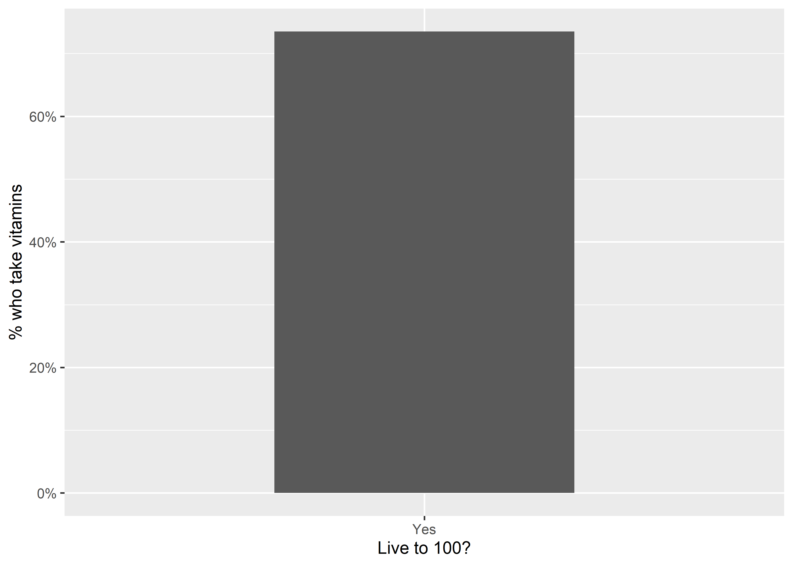
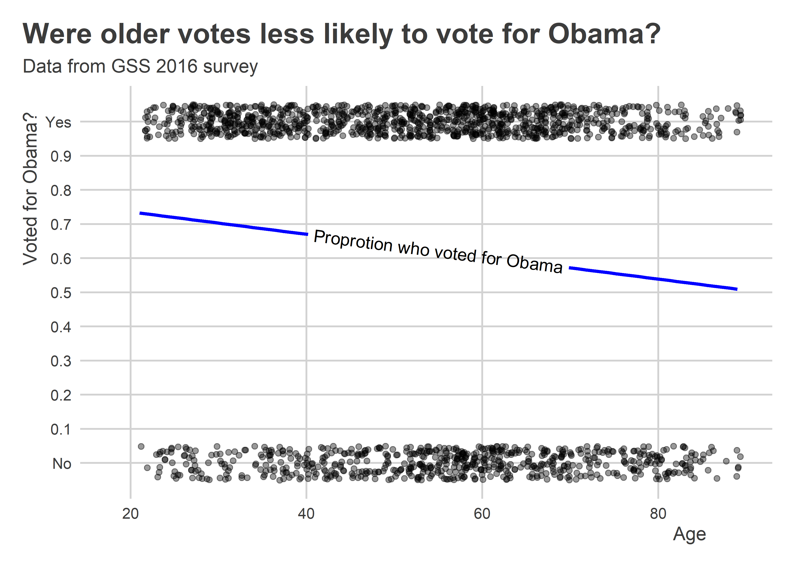

Selection: Why We Need Variation for Correlation
================

## Learning Goals

-   Understand why variation is essential for learning about the
    correlation between two features of the world.
-   Understand what **selecting on the dependent variable** is and why
    it is not recommended for quantitative analysis.
-   Understand why the temptation/pressure to select on the DV persists.

## Where we’ve been

We’ve been talking about correlation. Last time we introduced some
important concepts related to correlation (mean, variance, covariance,
linear regression, etc.) and discussed the utility of correlations
(description, prediction, and causal inference). \[[Check out the
correlation notes
here](https://github.com/milesdwilliams15/Teaching/blob/main/DPR%20201/Notes/01_correlation.md)\]

## Where we’re going

At present, I want us to sit with a particular element of correlation:
**variation**.

To estimate a correlation between two features of the world, we need
variation in each of those features. This may seem obvious, but you’d be
surprised by the number of real-world cases (in the media or even
scholarly articles) that are missing variation in at least one variable.

In Chapter 2 of our *Thinking Clearly with Data* text, we saw a few
examples of facts, some of which are correlations and others of which
are not. Can you remember which are which?

1.  People who live to 100 years of age typically take vitamins.
2.  Cities with more crime tend to higher more police officers.
3.  Successful people have spent at least ten thousand hours honing
    their craft.
4.  Most politicians facing a scandal win reelection.
5.  Older people vote more than younger people.

2 and 5 are the only two statements above that tell us about a
correlation. 1, 3, and 4 sound like they tell us something about the
relationship between two features of the world, but in reality they are
missing variation in one of those features.

Take 1. The below R code simulates some data based on the kind of
variation (or lack thereof) that statement 1 gives us. Can you catch the
problem?

``` r
library(tidyverse) 

# simulate some data
vitamin_data <- tibble(
  live_to_100 = "Yes",
  take_vitamins = rbinom(n = 200, size = 1, prob = 0.75)
)          # n = number of obs; size means 0 or 1; prob means expected proportion

# plot the relationship
vitamin_data %>%
  group_by(live_to_100) %>%
  summarize(
    mean = mean(take_vitamins)
  ) %>%
  ggplot() +
  aes(x = live_to_100, y = mean) +
  geom_col(width = 0.5) +
  scale_y_continuous(
    labels = scales::percent
  ) +
  labs(
    x = "Live to 100?",
    y = "% who take vitamins"
  )
```

<!-- -->

The problem is obvious. We don’t have variation in age!

How about 5? Or something close to it anyway. In the below code, I’m
attaching the `{socviz}` package which lets me access a dataset called
`gss_sm`. This is a selection of individual responses to the 2016
General Social Survey. It has a variable for age and a variable for
whether a person voted for Barak Obama in the 2012 election. Let’s check
out their relationship.

``` r
library(socviz)
ggplot(gss_sm) +
  aes(x = age,
      y = obama) +
  geom_smooth()
```

<!-- -->

Can you identify a relationship? Of course you can! That’s because we
have variation in both of these features of the world. We have some
people who are older, some younger. And among those groups we have
people who voted for Obama in 2012 and others that didn’t.

This analysis tells us something about a relationship or regularity in
the world. The first dealing with longevity and vitamins does not. The
fact that people who live to 100 years of age regularly take vitamins
does not tell us whether taking vitamins actually promotes longevity.
It’s just a bit of trivia about a particular age group.

## Selecting on the DV

The mistake that was made in statement 1 is an example of **selecting on
the dependent variable**. Why do many people do this?

It’s actually easier than you many think to select on the DV, even
without noticing. After all, the statement that “people who live to be
100 typically take vitamins” sounds scientific. But when we make things
a little more explicit (like I did with the R code example above), it’s
plain to see that this statement doesn’t actually tell us anything
useful (certainly not actionable).

A lot of people slip into selecting on the DV when trying to make
correlational (even causal) claims. This is partially a handicap of
talking about these things in plain English. I have to admit, I had to
think carefully about claims 1-5 above before I knew with certainty
which dealt with correlations and which didn’t.

The dead give-away that a claim or analysis is predicated on selecting
on the DV is that it starts with some phenomenon or outcome and then
tries to look backward to identify causes. This is the case with the
claim about vitamins and longevity. It starts with an outcome (living to
over 100 years of age) and looks back at habits or lifestyle factors
that are common to people who live to be this old.

We see a few different examples of this error in practice in *Thinking
Clearly with Data*.

1.  Malcom Gladwell’s claim that 10,000 hours of practice leads to
    becoming a great acheiver.
2.  Rock’n Roll is currupting the youth.
3.  High schoold dropouts.
4.  Suicide attacks.

Let’s take a look at an example using some data that were collected in a
1998 field experiment involving a get out the vote (GOTV) campaign in
New Haven, CT.

``` r
url <- "https://raw.githubusercontent.com/milesdwilliams15/Teaching/main/DPR%20201/Data/GOTV_Experiment.csv"
Data <- read_csv(url)
```

This dataset is in tidy format. It has 9 columns each corresponding to a
different variable measured on individuals (the unit of observation).
These variables are:

-   female: 0 = no, 1 = yes
-   age: in years
-   white: 0 = no, 1 = yes
-   black: 0 = no, 1 = yes
-   employed: 0 = no, 1 = yes
-   urban: 0 = no, 1 = yes
-   treatmentattempt: 0 = did not receive a GOTV phone call, 1 = did
-   successfultreatment: 0 = was not treated or didn’t answer the phone,
    1 = answered the phone if treated
-   turnout: 0 = didn’t vote, 1 = did vote

For the sake of argument, let’s just look at folks who turned out to
vote:

``` r
Data_turnout <- Data %>%
  filter(turnout == 1)
```

With this data, can we answer the question: did getting a call increase
turnout? Let’s see:

``` r
Data_turnout %>%
  summarize(
    phone_call = mean(treatmentattempt),
    answered_phone = mean(successfultreatment)
  )
```

    ## # A tibble: 1 × 2
    ##   phone_call answered_phone
    ##        <dbl>          <dbl>
    ## 1      0.536          0.441

About 53-54 percent of people who turned out to vote received a GOTV
phone call. 44 percent answered the phone. Did getting a call lead to an
increase in the likelihood of turnout?

Maybe it would help if we knew the likelihood that anyone got a call:

``` r
# What share people got a GOTV call in total?
Data %>%
  summarize(
    phone_call = mean(treatmentattempt),
    answered_phone = mean(successfultreatment)
  )
```

    ## # A tibble: 1 × 2
    ##   phone_call answered_phone
    ##        <dbl>          <dbl>
    ## 1      0.502          0.386

About 50 percent of all people got a call, and among those a little over
39 percent answered the phone. Did the GOTV campaign work?

It’s tempting to think that this is enough information. But we still
don’t have variation in the outcome of interest: turnout. Let’s see what
the data look like with this little detail in place:

``` r
Data %>%
  group_by(turnout) %>%
  summarize(
    phone_call = mean(treatmentattempt),
    answered_phone = mean(successfultreatment)
  )
```

    ## # A tibble: 3 × 3
    ##   turnout phone_call answered_phone
    ##     <dbl>      <dbl>          <dbl>
    ## 1       0      0.465          0.327
    ## 2       1      0.536          0.441
    ## 3      NA      0.457          0.337

Now we’re cooking! Those who came out to vote disproportionately
received phone calls. They were also more likely to answer the phone.

In reality, there are some issues with this field experiment, one of
which is obvious from the output above. We’re going to bracket that for
now. It is most important to note that drawing inferences by selecting
on the DV is not only irresponsible; it can be dangerous, or at the very
least expensive.

If you only looked at the phone call data among individuals who voted in
an election, you might conclude that the phone calls didn’t actually
help. But it turns out, with the bigger picture in view, people who
turned out to vote were more likely to get a call and more likely to
answer.

## Try out some examples yourself

Here are links to four different datasets. For each one, there’s a
research question. Get the data into R and see if it gives you the
variation you need to answer the research question. If it can, answer
the research question. If it can’t, can you leverage the data to draw
inferences about other correlations?

#### Terrorism and Foreign Occupation

-   **link:**
    <https://raw.githubusercontent.com/milesdwilliams15/Teaching/main/DPR%20201/Data/terror_data.csv>

-   **Research Question:** Does the presence of a foreign occupying
    force in a country lead to an increase in the number of suicide
    terrorist attacks?

#### Vote on Immigration Proposition

-   **link:**
    <https://raw.githubusercontent.com/milesdwilliams15/Teaching/main/DPR%20201/Data/immigration_proposition.csv>

-   **Research Question:** Does political ideology predict support for a
    pro-immigration proposition on the ballot?

#### Gender in Congress

-   **link:**
    <https://raw.githubusercontent.com/milesdwilliams15/Teaching/main/DPR%20201/Data/gender_in_congress.csv>

-   **Research Question:** Are women more likely to hold a seat in the
    U.S. Congress if they are Republicans or Democrats?

#### Economic Growth and Immigration

-   **link:**
    <https://raw.githubusercontent.com/milesdwilliams15/Teaching/main/DPR%20201/Data/gdp_and_immigration.csv>

-   **Research Question:** Do countries with higher GDP (gross domestic
    product) attract more immigrants?
