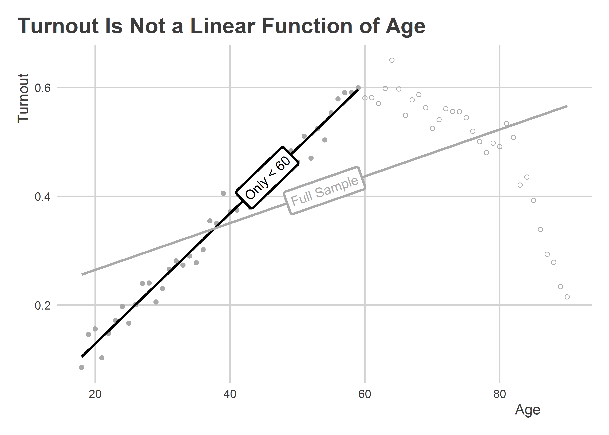
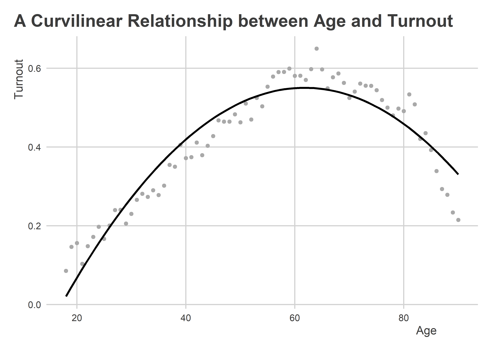
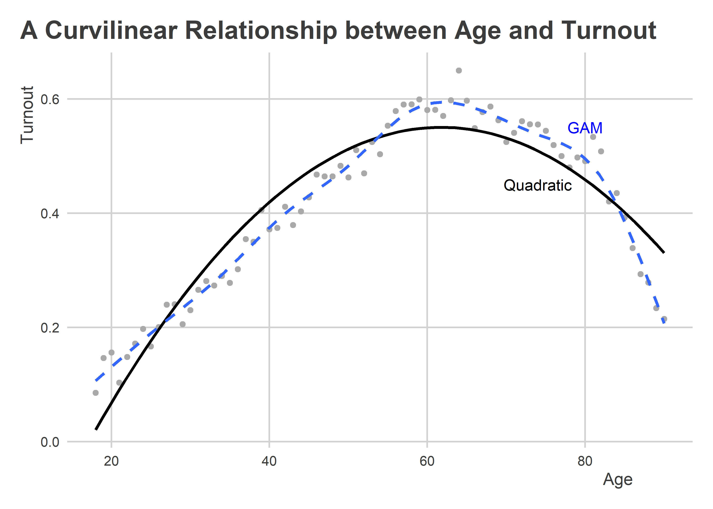

Regression for Description and Forcasting
================

## Goals

-   Understand the intuition behind linear regression.
-   Know how to use it to describe the relationship between variables.
-   Know how to use it to forecast/predict outcomes.
-   Learn some tools to test how well the linear regression fits the
    data.
-   Understand some common pitfalls and mistakes when using linear
    regression.

## Regression…Linear Regression

Remember our Chicago crime data? Let’s read it into R.

``` r
library(tidyverse)
url <- "https://raw.githubusercontent.com/milesdwilliams15/Teaching/main/DPR%20201/Data/ChicagoCrimeTemperature2018.csv"
Data <- read_csv(url)
```

Remember that this data contains information about two features of the
world: crime rates in Chicago and the daily temperature in Chicago in
2018. The below figure is a scatter plot showing how these two features
jointly vary (how they are related to each other).

``` r
ggplot(Data) +
  aes(x = temp, y = crimes) +
  geom_point() +
  labs(
    x = "Daily Temperature",
    y = "Number of Crimes",
    title = "Correlation between Temperature and Crimes",
    subtitle = "Chicago 2018"
  )
```


This visualization is an effective way to show the relationship between
these variables, but sometimes you may need a more concise summary.
We’ve talked about a couple of ways to do this already.

You could estimate a correlation coefficient, which you can do with the
`corr()` function from `{socsci}`:

``` r
library(socsci)
Data %>%
  corr(temp, crimes)
```

    ## # A tibble: 1 × 8
    ##   estimate statistic  p.value     n conf.low conf.high method            alter…¹
    ##      <dbl>     <dbl>    <dbl> <int>    <dbl>     <dbl> <chr>             <chr>  
    ## 1    0.755      21.9 1.63e-68   363    0.707     0.796 Pearson's produc… two.si…
    ## # … with abbreviated variable name ¹​alternative

A correlation of 0.75 is a strong positive correlation, and this one
number already gives us a good summary of the data.

This isn’t the only way to summarize the relationship, though. It may
not even be the best in some circumstances. The correlation
coefficient’s biggest limitation is that it doesn’t provide a sense of
scale. It tells us that higher temperatures closely correspond with more
crimes, but it doesn’t tell us the rate at which this happens. To do
this we instead would want to use a linear regression model.

A linear regression lets us summarize the relationship between two
variables using two different parameters: a slope and an intercept. When
using regression, we usually express the relationship between two
factors using an equation like this one:


A linear regression expresses a linear relationship between an **outcome
variable** and an **explanatory variable**. You’ll sometimes see the
first called a *dependent variable* or *response* and the second called
an *independent variable* or *predictor*.

The relationship between the outcome and explanatory variable is
captured using the slope
()
and intercept
().

-   The intercept tells you what the outcome is when the explanatory
    variable is equal to zero.
-   The slope tells you how the outcome changes for each one value
    increase of the explanatory variable.

The goal with a linear regression is to find the best values of the
slope and intercept that fit the data. There are lots of ways to do
this, but the most common is called **ordinary least squares** or
**OLS**.

OLS is an **estimator** that we can use to identify the best fitting
parameters for a linear regression model. OLS is used so often with
linear regression that you’ll often see people write “OLS model” instead
of “linear model.” But this is an abuse of terms. OLS is not a model.
It’s an **estimator** or a rule for what defines the best **estimates**
of the linear model’s parameters. You can use many different rules
(estimators) other than OLS to estimate linear model parameters, which
is why it’s important not to think that one is equivalent to the other.

OLS works by finding the best values of the slope and intercept that
minimize the error between predicted values of the outcome and the
actual values of the outcome. In the case of our model of crime, any
values we give to

and

let us get a prediction for crime given temperature. Say we pick 600 for
the first and 3 for the second. Our regression line would fit the data
like so:

``` r
ggplot(Data) +
  aes(x = temp, y = crimes) +
  geom_point() +
  geom_line(
    aes(y = 600 + 3 * temp),
    color = "blue",
    size = 1
  ) +
  labs(
    x = "Daily Temperature",
    y = "Number of Crimes",
    title = "Correlation between Temperature and Crimes",
    subtitle = "Chicago 2018"
  )
```


Notice how I told ggplot to set a new y aesthetic equal to
`600 + 3 * temp` inside the `geom_smooth()` layer. This lets me plot the
linear prediction from my model using my personally selected parameter
values.

There are many possible lines that I could have drawn through the data.
For each one of these possible lines, we could calculate the
**prediction error** like so:


In the above, the subscript

is meant to alert us to the fact that there’s a different error per each
observation in the data.

Using some different combinations of the parameters, we can check how
well they do by calculating the **sum of the squared residuals** or
**SSR**. The residual is the error between our prediction and the data.
Let’s make some new columns in our data that equal the residual error in
our predictions from different versions of the model and then summarize
the results:

``` r
Data %>%
  mutate(
    error1 = crimes - (600 + 3 * temp),
    error2 = crimes - (650 + 2 * temp),
    error3 = crimes - (550 + 4 * temp)
  ) %>%
  summarize( # this returns the SSR
    across(error1:error3, ~ sum(.x^2))
  ) -> errors
errors
```

    ## # A tibble: 1 × 3
    ##     error1   error2   error3
    ##      <dbl>    <dbl>    <dbl>
    ## 1 1393016. 1542564. 1554284.

If we compare these, it looks like the first fit does best. The others
don’t fair quite as well. If we wanted, we could keep trying a bunch of
different combinations until we found the *one* that fits the best. This
would take a lot of time, though. Thankfully OLS is here to save us the
trouble.

OLS uses SSR to benchmark the goodness of different parameter values. It
defines the best values as the ones that minimize the SSR such that no
other possible combinations get get you something smaller. Smart people
have found that the parameter values that meet this criteria have a
closed-form solution—which is just a fancy way to say that we just need
to use a simple equation to get the answer.

In previous notes, we already discussed the solution for the slope.
Remember when we talked about how covariance is important for estimating
both a correlation and a regression slope? The best fitting regression
slope is just the covariance of our two variables divided by the
variance in the explanatory variable. We can calculate this directly in
R by writing:

``` r
slope <- cov(Data$temp, Data$crimes) / var(Data$temp)
```

The intercept is then just the value of the outcome when the explanatory
variable is zero. We haven’t talked about this before, but this also has
a really easy to calculate solution. To find it we just write:

``` r
intercept <- mean(Data$crimes) - slope * mean(Data$temp)
```

The intercept is just the average of the outcome minus the product of
the estimated slope and the average of the explanatory variable.

That gives us the following pair of parameters:

``` r
params <- c(intercept = intercept, slope = slope)
params
```

    ##  intercept      slope 
    ## 567.271621   3.106274

If we check to see if the SSR with these parameters is smaller than
those we got with our other hand-picked values of the parameters, it
should be smaller than the alternatives.

``` r
ssr <- sum((Data$crimes - (intercept + slope * Data$temp))^2)
errors # original errors
```

    ## # A tibble: 1 × 3
    ##     error1   error2   error3
    ##      <dbl>    <dbl>    <dbl>
    ## 1 1393016. 1542564. 1554284.

``` r
ssr    # new ssr
```

    ## [1] 1121073

It’s smaller!

Okay, okay, okay…that’s a lot of code to write and then remember.
Thankfully, we don’t have to write all of that code to get the slope and
intercept in R. We can use the function `lm()` instead.

``` r
fit <- lm(crimes ~ temp, data = Data)
```

`lm()` is used to fit linear regression models. By saving it as an
object, in this case as `fit`, we can use the output to do other things
with the model, like look at the coefficients or (later on) make
predictions.

For example, to look at the coefficients we can use a function called
`coef()`. Let’s do that and compare them with the parameters we
calculated using the more round-a-bout way:

``` r
params; coef(fit) # FYI a ; lets you run two seperate things in the same line.
```

    ##  intercept      slope 
    ## 567.271621   3.106274

    ## (Intercept)        temp 
    ##  567.271621    3.106274

Exactly identical.

## Why OLS?

The reason we use OLS (most of the time) to find the parameters of a
linear model is due in part to precedent and in part to convenience. OLS
was invented at a time when we didn’t have computers, so people had to
fit the parameters of a linear model by hand. As shown above, we have a
simple equation to calculate these parameters. All it would have taken
folks a 100 years ago was some dutiful number crunching. Other kinds of
solutions, like minimizing the absolute deviations (which we won’t use
in this class), don’t have a closed-form solution. You need a computer
to find it for you.

OLS also provides a close analogue to the mean. In other words, its
predictions can be interpreted as a conditional mean or average of the
outcome given the explanatory variable. For each value of temperature,
the linear model fit via OLS tells us what the average number of crimes
should be. Solutions like minimizing the absolute deviations provide
something closer to finding a conditional median—still useful, but not
as common in political science research.

## What if the data isn’t linear?

Not all data makes for a good fit with a linear regression model. Our
text talks about an interesting case dealing with the relationship
between age and voter turnout. Here’s some simulated data and a scatter
plot showing something similar:

``` r
turnout <- tibble(
  age = 18:90,
  turnout = c(
    seq(0.1, 0.6, length = sum(age < 60)),
    seq(0.6, 0.5, length = sum(age %in% 60:80)),
    seq(0.5, 0.2, length = sum(age > 80))
  ) + rnorm(n = length(age), sd = 0.02)
)
ggplot(turnout) +
  aes(x = age,
      y = turnout) +
  geom_point() +
  labs(
    x = "Age",
    y = "Turnout",
    title = "Turnout Is Not a Linear Function of Age"
  )
```


If we lop off all observations beyond 60, a linear regression model
makes for a good fit. But if we use the full data, we can see we have a
problem.

``` r
library(geomtextpath) # use functions in geomtextpath to add labels to lines
ggplot(filter(turnout, age < 60)) +
  aes(x = age, y = turnout) +
  geom_point(color = "darkgray") +
  geom_labelsmooth(
    method = "lm",
    label = "Only < 60",
    hjust = 0.7,
    linewidth = 1,
    se = F,
    color = "black"
  ) +
  geom_point(
    data = filter(turnout, age >= 60),
    shape = 21,
    color = "darkgray"
  ) +
  geom_labelsmooth(
    data = turnout,
    label = "Full Sample",
    method = "lm",
    linewidth = 1,
    se = F,
    color = "darkgray"
  ) +
  labs(
    x = "Age",
    y = "Turnout",
    title = "Turnout Is Not a Linear Function of Age"
  )
```


Thankfully, linear regression models provide a great deal of
flexibility. We could, for example, add a squared term to the model. Do
you remember using quadratic equations at all, or ever? The idea is that
we want to fit a *curve* to the data rather than a line. We can give
instructions to ggplot to do this for us:

``` r
p <- ggplot(turnout) +
  aes(x = age,
      y = turnout) +
  geom_point(
    color = "darkgray"
  ) +
  geom_smooth(
    method = "lm",
    formula = y ~ poly(x, 2),
    se = F,
    color = "black"
  ) +
  labs(
    x = "Age",
    y = "Turnout",
    title = "A Curvilinear Relationship between Age and Turnout"
  )
p 
```



We can keep adding **polynomials** (terms to the nth power) until we’re
satisfied with the fit. There are also other forms of regression that
are even more flexible. A common example is a **generalized additive
model** or **GAM**. We can tell ggplot to produce this, too:

``` r
p + 
  geom_smooth(
    method = "gam",
    se = F,
    linetype = 2
  ) +
  annotate(
    "text",
    x = c(80, 74), 
    y = c(0.55, 0.45),
    label = c("GAM", "Quadratic"),
    color = c("blue", "black")
  )
```



Linear models with polynomial terms are still technically linear, even
though they capture non-linear relationships. This is because the model
is still technically linear. All we do is take the square (or any number
of higher order powers) of a variable and add it as a variable in the
linear equation. Hence:


## Overfitting

If we continued to add polynomials to better fit the data, we would
eventually run into a problem called **overfitting**, which happens when
you keep adding new variables to a model.

On the one hand, you may think that the more variables you include, the
better your chances of making good predictions. While this sounds
intuitive, this strategy ignores an important problem that becomes worse
the more variables you have: **spurious correlation**.

Below is a simulation I wrote to illustrate the point. I told R to
simulate a matrix of variables where the number of variables range from
2, to 5, to 10, to 20. Each matrix has 100 rows (observations). I made a
function that would simulate this data matrix then calculate the maximum

between variables in the data. For each possible number of variables, I
told R to simulate the data 100 times and to collect the range of
maximum

values that get returned. I visualized the results with a boxplot that
shows for each number of variables the distribution of maximum

values that were collected. Clearly, as the number of variables goes up,
so does the likelihood of finding pairs of variables that have a strong
correlation—not because they are related causally, but just by dumb
luck.

``` r
# A function to simulate possible maximum r^2 values
X <- function(k) {
  X <- apply(matrix(0L, 100, k), c(1,2), function(i) rnorm(1))
  r <- cor(X)
  r <- c(r[upper.tri(r)])
  tibble(rsq = max(r^2))
}

# A grid to tell R how many iterations to simulate by number of variables
values <- expand_grid(it = 1:100, k = c(2, 5, 10, 20))

# Run the simulation using map_dfr() from the {purrr} package
1:nrow(values) %>%
  map_dfr(
    ~ X(k = values[.x, ]$k) %>%
      bind_cols(values[.x, ])
  ) -> sim_out

# Plot the results
sim_out %>%
  ggplot() +
  aes(x = as.factor(k),
      y = rsq) +
  geom_boxplot() +
  labs(
    x = "Number of Variables",
    y = expression("Maximum"*" "*r^2),
    title = "More Variables, More Meaningless Correlations",
    subtitle = "The maximum variation explained between 2 factors per 100 simulations"
  )
```



It’s important to think carefully about the variables you include in a
linear model. Just because it gives you good predictions doesn’t
guarantee that you used the right variables.

A good way to **validate** a model to guard against overfitting is to
split the data. One subset of the data (usually about 70% of the full
dataset) serves as a **training** dataset. We call it this because we
want to use it to “train” a linear model or fit it it’s parameters with
this data.

We then use the other subset of the data as a **test** dataset. It’s
called a test set because we will use it to test the predictive
performance of the model.

Here’s an example of how we might do that with the turnout data.

``` r
# Set the seed so this is replicable
set.seed(123)

# Use mutate to add a column called train
turnout <- turnout %>%
  mutate(
    train = rbinom(n = n(), 1, prob = 0.7)
  ) # train = 1 with probability 0.7

# Now split the data
train <- filter(turnout, train == 1)
test  <- filter(turnout, train == 0)

# Fit the linear model
fit <- lm(turnout ~ age, data = train)

# Make predictions with both datasets and compare
train_pred <- predict(fit)
test_pred  <- predict(fit, newdata = test)

# Calculate the variance explained and show results
tibble(
  Training = cor(train$turnout, train_pred)^2,
  Test = cor(test$turnout, test_pred)^2
)
```

    ## # A tibble: 1 × 2
    ##   Training  Test
    ##      <dbl> <dbl>
    ## 1    0.486 0.221

Depending on when you run this, you would see a wide range of values
produced in this exercise. In this particular run, age explains more
than twice the variation of turnout in the training data than it does in
the test data.

## Showing regression results

Depending on where you present your research, you’ll see different
conventions for reporting regression output. In an academic outlet,
you’ll often see results presented in regression tables, like this one:

<table class="texreg" style="margin: 10px auto;border-collapse: collapse;border-spacing: 0px;color: #000000;border-top: 2px solid #000000;">
<caption>This is a regression table</caption>
<thead>
<tr>
<th style="padding-left: 5px;padding-right: 5px;">&nbsp;</th>
<th style="padding-left: 5px;padding-right: 5px;">Model 1</th>
</tr>
</thead>
<tbody>
<tr style="border-top: 1px solid #000000;">
<td style="padding-left: 5px;padding-right: 5px;">Age</td>
<td style="padding-left: 5px;padding-right: 5px;">0.75<sup>&#42;&#42;&#42;</sup></td>
</tr>
<tr>
<td style="padding-left: 5px;padding-right: 5px;">&nbsp;</td>
<td style="padding-left: 5px;padding-right: 5px;">(0.05)</td>
</tr>
<tr>
<td style="padding-left: 5px;padding-right: 5px;">Age^2</td>
<td style="padding-left: 5px;padding-right: 5px;">-0.97<sup>&#42;&#42;&#42;</sup></td>
</tr>
<tr>
<td style="padding-left: 5px;padding-right: 5px;">&nbsp;</td>
<td style="padding-left: 5px;padding-right: 5px;">(0.05)</td>
</tr>
<tr style="border-top: 1px solid #000000;">
<td style="padding-left: 5px;padding-right: 5px;">R<sup>2</sup></td>
<td style="padding-left: 5px;padding-right: 5px;">0.91</td>
</tr>
<tr>
<td style="padding-left: 5px;padding-right: 5px;">Adj. R<sup>2</sup></td>
<td style="padding-left: 5px;padding-right: 5px;">0.91</td>
</tr>
<tr style="border-bottom: 2px solid #000000;">
<td style="padding-left: 5px;padding-right: 5px;">Num. obs.</td>
<td style="padding-left: 5px;padding-right: 5px;">73</td>
</tr>
</tbody>
<tfoot>
<tr>
<td style="font-size: 0.8em;" colspan="2"><sup>&#42;&#42;&#42;</sup>p &lt; 0.001; <sup>&#42;&#42;</sup>p &lt; 0.01; <sup>&#42;</sup>p &lt; 0.05</td>
</tr>
</tfoot>
</table>

When writing for a less technical audience, a coefficient plot is a
better way to go. These are even becoming more common in academic
settings, especially at academic conferences. Here’s one based on the
same results in the above table:


Of course, for many settings, a figure like those plotted earlier in
these notes would be fine, too—at least if you only want to talk about
the relationship between two variables. Once you start adding multiple
variables, a simple scatter plot becomes unfeasible.
