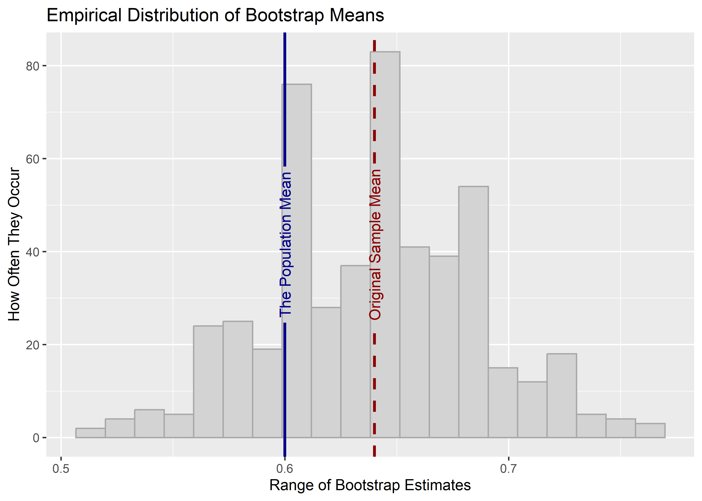
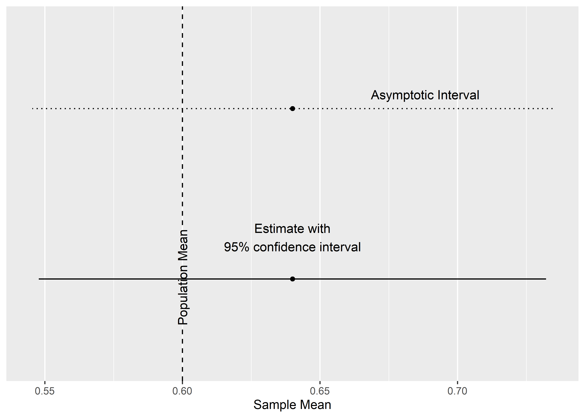

Inference and Uncertainty
================

-   [The Big Picture](#the-big-picture)
-   [Estimates](#estimates)
-   [Populations and Samples](#populations-and-samples)
-   [Be Careful of Bias](#be-careful-of-bias)
-   [What If My Sample *Is* the
    Population?](#what-if-my-sample-is-the-population)
-   [Where to Next](#where-to-next)
-   [What to Try](#what-to-try)

## The Big Picture

-   All **estimates** are a function of **signal**, **noise**, and
    **bias**.
-   We can quantify our uncertainty about how much an estimate results
    from noise, but we can’t quantify how much results from bias.

## Estimates

This week, we revisit a formula I’ve shown you before and that I told
you would make a regular appearance in the BDMF text:

*Estimate = Estimand + Bias + Noise*

-   **Estimate**: What we observe in our data.
-   **Estimand**: The true value we want to estimate.
-   **Bias**: Think of this as noise that *systematically* drives up or
    down our estimate.
-   **Noise**: *Random* variation in the world that reduces our
    precision in estimating something of interest.

To get a sense for how these concepts work in practice, it is helpful to
think in terms of populations and samples.

## Populations and Samples

Our text talks about **populations** and **samples** in its discussion
of statistical inference. This is the classical way to approach this
issue because the original purpose of statistics (why the mathematical
field was created in the first place) was to say things about a broader
population by looking only at a subset (sample). This is what pollsters
do when trying to gauge support for the American President, for example.

The problem when making inferences about a population from a sample is
that we always have uncertainty about the accuracy of our inferences.
Except in the rarest of occasions, we never have all the data we need to
calculate some relationship or characteristic of a whole population.
That means we have no way to check that the relationship or
characteristic that we observe in a sample closely matches the broader
population. Using BDMF’s lingo, our estimate of a relationship in, or
characteristic of, a population could be influenced by bias or noise, or
both.

Statistics doesn’t give us the ability to lift the veil on the capital
“T” Truth, but it does give us the ability to precisely quantify our
**uncertainty**.

We can write some R code to demonstrate. Say the true share of people in
a population of 1,000 who prefer Coke to Pepsi is 0.6. If we could ask
all 1,000 people their preference, this is the value we’d calculate.
This is called the **estimand**, and we’ll label it *p*. We can just
assign an object called “p” in R the value 0.6.

``` r
p <- 0.6
```

Next, we can create our population of 1,000 and set it so that 60% of
the population prefer Coke to Pepsi.

``` r
pop_size <- 1000
  # set the population size

population <- c(
  rep(0, (1 - p) * pop_size),
  rep(1, p * pop_size)
) # set it so p (0.6) share of the population like Coke
  # and the rest like Pepsi
```

If we were to take the mean of the population preferences, we would
return 0.6:

``` r
mean(population)
```

    ## [1] 0.6

A population of 1,000 is pretty small. It would probably be feasible to
survey everyone about their soft drink preferences, but let’s say we’re
under a limited budget and face a quickly approaching deadline. We only
have the time and resources to ask 100 people.

Ideally, we would pick these 100 individuals at random to ensure that
nothing will bias our estimate. We can use the `sample()` function to
simulate the the random sampling process:

``` r
the_sample <- sample(population, size = 100)
```

We’ve gotten our sample. Let’s see how many prefer to Coke.

``` r
mean(the_sample)
```

    ## [1] 0.64

64% of people prefer Coke!

But wait…it should be 60% percent. What happened? Did we accidentally
introduce bias? Quite the contrary. We randomly sampled individuals from
the population.

Instead, **noise** happened. The process of going from a population to a
sample allows dumb luck to do its work. If we kept repeating the
sampling process, we would have some samples where we surveyed
disproportionately more Coke-lovers, and others where we surveyed
disproportionately more Pepsi-loves. It has nothing to do with
systematic bias and everything to do with random chance.

The beauty of random sampling is that, on average, if we repeated the
sampling process the mean of the sample estimates we calculate should
closely approximate the population estimand. It would be impossible to
do this in a real survey, but since this is a simulation, we can do
whatever we want.

Below, I use the `replicate()` function to repeat the process and
collect the sample means I get.

``` r
sample_means <- replicate(
  n = 500, # tell it to do its thing 500 times
  expr = {
    new_sample <- sample(population, size = 100)
      # take a new random sample
    
    new_mean <- mean(new_sample)
      # calculate a new mean
    
    new_mean 
      # return the mean
  },
  simplify = "c" # tell it to use c() to return the output as a vector
)
```

We now have an empirical range of possible estimates. We can use a
histogram to summarize the distribution. Run the code below to draw your
own:

    library(ggplot2)

    ggplot() +
      aes(x = sample_means) +
      geom_histogram()

Here’s a more elaborate example:

``` r
library(ggplot2)
library(geomtextpath)

ggplot() +
  aes(x = sample_means) +
  geom_histogram(
    bins = 20,
    fill = "lightgrey",
    color = "darkgrey"
  ) +
  geom_textvline(
    xintercept = p,
    linewidth = 1,
    label = "The Population Mean",
    color = "darkblue"
  ) +
  geom_textvline(
    xintercept = mean(the_sample),
    linewidth = 1,
    linetype = 2,
    label = "Original Sample Mean",
    color = "darkred"
  ) +
  labs(
    x = "Range of Sample Estimates",
    y = "How Often They Occur",
    title = "Empirical Distribution of Sample Means"
  )
```


The range of estimates is wide. But, reassuringly, their central
tendency lies around the true population mean. Our original draw from
the population gave us an estimate that didn’t match the true population
mean. But, it’s within a reasonable **margin of error**.

This all begs an important question, however. Because we can’t repeat
the sampling process in practice, we instead need to quantify our
uncertainty another way. It turns out, via an approach that evokes an
*Inception*-like, Leonardo DiCaprio-esque impression of events, we can
repeatedly take samples from our sample to summarize our uncertainty
about our sample.

We call this process **bootstrapping**, a term that supposedly dates
back to the time of horses and muskets to describe a bizarre scenario
where a soldier, he and his horse stuck in the mud, pulls himself and
his horse out by pulling on his bootstraps. It’s utter nonsense, and the
statistical procedure seems just as unlikely. But it works.

Here’s some code to make it happen. Just like before, I’m using
`replicate()`, but pay attention to what’s different.

``` r
boot_means <- replicate(
  n = 500,
  expr = {
    samp_size <- length(the_sample)
      # number of individuals in the sample
    
    boot_sample <- sample(the_sample, size = samp_size, replace = T)
      # sample from the sample with replacement
    
    boot_mean <- mean(boot_sample)
      # take the mean of the new sample
    
    boot_mean # return the bootstrapped mean
  },
  simplify = "c" # return as a vector using c() on the output
)
```

Bootstrapping involves a simple process of *resampling with
replacement*. The idea is to treat your sample like a stand-in
population and repeatedly draw new samples from it. But there are two
twists. The new samples will be the same size as the original. And, the
samples will be drawn with replacement. That just means that every time
an observation is drawn, it can also be drawn again. Generally a little
over 62% of the new sample observations are unique. The rest might
either have duplicates or triplicates.

We can check the distribution of these empirical bootstrap replicates
using a histogram like before. Try running the code yourself:

    ggplot() +
      aes(x = boot_means) +
      geom_histogram()

Again, here’s a more ornate example.

``` r
ggplot() +
  aes(x = boot_means) +
  geom_histogram(
    bins = 20,
    fill = "lightgrey",
    color = "darkgrey"
  ) +
  geom_textvline(
    xintercept = 0.6,
    linewidth = 1,
    label = "The Population Mean",
    color = "darkblue"
  ) +
  geom_textvline(
    xintercept = mean(the_sample),
    linewidth = 1,
    linetype = 2,
    label = "Original Sample Mean",
    color = "darkred"
  ) +
  labs(
    x = "Range of Bootstrap Estimates",
    y = "How Often They Occur",
    title = "Empirical Distribution of Bootstrap Means"
  )
```



In this case, we can see that the true population mean is well within
the range of the empirical bootstrapped distribution of estimates.

At this point, we can calculate a few more values of interest.
Generally, we don’t use a histogram to summarize our uncertainty about a
sample estimate. We instead calculate a **standard error**. The standard
error has a close connection to the standard deviation, but it
quantifies something different.

Remember that a standard deviation tells us the average difference
between observed values in our data and their mean. A standard error
tells us the average difference between the range of values our estimate
could have plausibly taken with repeated samples and the estimate we
calculated.

If that sounds unintuitive, it’s okay. It will help to see how the
standard error is calculated using the bootstrapping procedure we just
applied. Check out the R code below.

The estimate is obvious. It’s the sample mean. The standard error, then,
is just the standard deviation of the empirical distribution of sample
means we collected by bootstrapping.

Generally, we don’t just calculate the standard error and leave it at
that. We often use it to calculate 95% **confidence intervals**. Despite
their less-than-helpful name, these intervals do not tell us how
confident we are that a true population relationship or characteristic
falls within said interval (they would if we were talking about Bayesian
statistics, but that’s a subject for another day).

Instead, confidence intervals are just a way of summarizing uncertainty.
Technically, they give us a range around a sample estimate such that 95%
of the time the true parameter would fall if we could take repeated
samples.

If that confuses you, just remember that:

1.  Confidence intervals summarize uncertainty or imprecision in our
    estimate.
2.  The wider they are, the more uncertainty or imprecision we have.
3.  If they contain some value or reference point, we would say that our
    estimate is not statically different from that reference point at
    the 95% level. (This is the usual threshold for statistical
    significance.)

We can calculate these by multiplying the standard error by a constant.
Our text says 2, but it’s actually closer to 1.96. The code below
calculates the upper and lower bound of the 95% confidence intervals for
our sample estimate.

``` r
lo95 <- estimate - 1.96 * std_error
hi95 <- estimate + 1.96 * std_error
```

The below code creates a figure that plots these and the sample estimate
to summarize.

``` r
p <- ggplot() +
  aes(
    x = estimate,
    xmin = lo95,
    xmax = hi95,
    y = 1,
    label = "Estimate with\n95% confidence interval"
  ) +
  geom_point() +
  geom_text(vjust = -1) +
  geom_errorbarh(height = 0) +
  geom_textvline(
    xintercept = 0.6,
    linetype = 2,
    label = "Population Mean",
    hjust = 0.2
  ) +
  scale_y_continuous(breaks = NULL) +
  labs(
    x = "Sample Mean",
    y = NULL
  )
p
```


The reason I showed you how to bootstrap is not because that is the only
way to calculate the standard error and, by extension, the 95%
confidence intervals. Instead, I showed you bootstrapping because I find
it way easier to grasp what the closed-form solutions for these values
are supposed to approximate.

We can calculate these values using the data itself without needing to
resort to extra computational steps. Check out the below code.

I told you that the standard deviation and standard error have a close
connection. We calculate the standard error for a sample mean by taking
the sample standard deviation and then dividing by the square root of
the number of observations in the sample. We then calculate the
confidence intervals using this standard error. The below plot compares
this with the ones we calculated before by bootstrapping.

``` r
p + 
  geom_point(
    aes(
      x = estimate,
      y = 2
    )
  ) +
  geom_errorbarh(
    aes(
      xmin = asym_lo95,
      xmax = asym_hi95,
      y = 2
    ),
    height = 0,
    linetype = 3
  ) +
  geom_text(
    aes(
      y = 2,
      x = estimate + asym_std_error,
      label = "Asymptotic Interval"
    ),
    vjust = -1
  ) +
  scale_y_continuous(
    breaks = NULL,
    limits = c(0.5, 2.5)
  )
```



From what you can tell based on the way the standard error is
constructed, what do you think will happen if we were to increase the
sample size? Would our estimates get more precise, or less?

## Be Careful of Bias

The process of quantifying uncertainty using standard errors and
confidence intervals hinges on something really critical being true: no
bias. Bootstrapping, for example, only works if the sample is a random
sample. If the sample is biased in any way, it’s safe to say that our
confidence interval will mislead us because when we resample from a
biased sample, we’ll get biased bootstrapped samples, too.

Unfortunately, unlike with noise, we have no way to quantify bias—unless
of course we knew the “Truth.” This is why understanding, or better yet
controlling, where your data come from is so essential to making sound
inferences.

In the case of our sample in the previous example, we can feel confident
that any deviations between the characteristics of the sample and the
population result from random chance rather than a biased selection
process.

We could easily introduce one for illustration’s sake. Say that some
*unobserved* characteristic, call it *U*, makes individuals harder to
contact to ask them about their preferences. And, say Coke-lovers
disproportionately have this characteristic. The below R code sets up
the scenario.

``` r
library(tidyverse)
  # open the tidyverse

# make population data
set.seed(111)
pop_data <- tibble(
  coke = population,
  u = rbinom(
    length(coke), 
    size = 1, 
    prob = 0.5 * coke + 0.25 * (1 - coke)
  )        # this bit here controls the prob of characteristic "u"
)
```

In our population of 1,000, Coke-lovers have characteristic *U* at twice
the rate as Pepsi-lovers. By extension, that means Coke-lovers are about
twice as unlikely to be contacted to ask them about their preferences.
The below R code simulates how this affects the sampling process.

``` r
biased_sample <- pop_data %>%
  # give the population data to slice_sample()
  slice_sample(
    n = 100, # pull out 100 observations
    weight_by = 1 - u # only picks non-U obs.
  )
```

Let’s check the sample mean to see if we notice anything odd.

``` r
mean(biased_sample$coke)
```

    ## [1] 0.43

In the sample, only 43% of people indicated they prefer Coke to Pepsi.
That’s way lower than in the actual population.

Even worse, if we calculated 95% confidence intervals for this sample,
we’d find that our sample estimate is statistically different from the
population mean. The below R code uses the `%>%` operator and the
`summarize()` function from `{dplyr}` to compute these values.

``` r
biased_sample %>%
  summarize(
    estimate = mean(coke),
    std.error = sd(coke) / sqrt(n()),
    lo95 = estimate - 1.96 * std.error,
    hi95 = estimate + 1.96 * std.error
  )
```

    ## # A tibble: 1 × 4
    ##   estimate std.error  lo95  hi95
    ##      <dbl>     <dbl> <dbl> <dbl>
    ## 1     0.43    0.0498 0.332 0.528

An alternative function to produce similar output is `mean_ci()` from
the `{socsci}` package. To use it, we would write:

``` r
library(socsci)
biased_sample %>%
  mean_ci(coke)
```

    ## # A tibble: 1 × 7
    ##    mean    sd     n  level     se lower upper
    ##   <dbl> <dbl> <int>  <dbl>  <dbl> <dbl> <dbl>
    ## 1  0.43 0.498   100 0.0500 0.0498 0.331 0.529

The tough thing about bias is that it’s difficult to devise a test to
determine if it is present in or influenced the collection or creation
of our data. We know that the estimate shown above is influenced by bias
only because we simulated the data. This is hard to do, often
impossible, in the real world.

## What If My Sample *Is* the Population?

Our text covers this, but it’s worth carving out some space to think
about this issue here. You often see in research (mine included)
individuals making statistical inferences when they have data for the
full population under study. Why?

You’ll see a lot of explanations online, some better than others. My
personal favorite is based on the *multiverse* (no, not the one from
Marvel, though if you’re familiar you may get the idea). The idea is
that reality contains an inherent randomness or, if you prefer, unknown
sources of noise that could have resulted in any number of other
observed relationships. That means any time we deal with a relationship
between variables in a population, it could be the result of causation,
or possibly just dumb luck. Some other unknown and unobserved variables
in the population could explain it. We therefore would like to know the
probability that the relationship we observe could have occurred due to
pure chance.

I short, even if we have all the observations, we never have all the
variables. That means we always will have uncertainty when we measure
relationships or characteristics within a population.

## Where to Next

This is only the beginning of our exploration of statistical inference.
Next time, we’ll talk about hypothesis testing and the almighty
*p*-value.

## What to Try

We not only can use inference for estimating population characteristics
but also for estimating relationships. Try the below code which takes a
random sample from the population data and then estimates the
correlation between being a Coke-lover and having the unknown
characteristic *U*:

    sample_data <- pop_data %>%
      slice_sample(n = 100)

    sample_data %>%
      corr(coke, u)

We can also do this with linear regression. A nice extension to using
`lm()` from the base R package is `lm_robust()` from the `{estimatr}`
package (this is the package we use at OES, by the way). First, run the
below code in the R console to install it:

    install.packages("estimatr")

Then try the below code to return inference statistics for a linear
model of being a Coke-lover as a function of characteristic *U*.

    library(estimatr)
    fit <- lm_robust(coke ~ u, data = sample_data, se_type = "classical")
    summary(fit)

Finally, for kicks and giggles…

Read the presidential forecast data into R.

    url <- "https://raw.githubusercontent.com/milesdwilliams15/Teaching/main/DPR%20201/Data/predict_prez.csv"
    prez_data <- read_csv(url)

Then, run the following.

    fit <- lm(incelectvotes ~ juneapp, data = prez_data)
    plot(
      x = prez_data$juneapp,
      y = prez_data$incelectvotes,
      pch = 19,
      xlab = "June Approval",
      ylab = "Electoral College Votes",
      main = "Predicting the Vote"
    )
    abline(reg = fit)
    for(i in 1:200) {
        newdata <- sample_n(prez_data, size = nrow(prez_data), T)
        newfit <- lm(incelectvotes ~ juneapp, data = newdata)
        abline(reg = newfit, col = adjustcolor("grey", alpha = 0.2))
      }

What’s going on in the figure?
