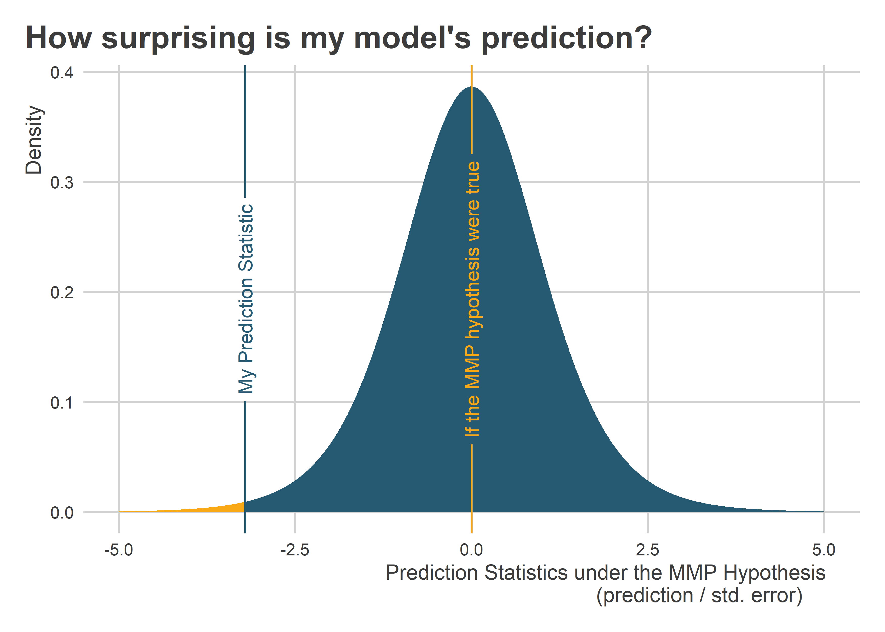

Hypothesis Testing
================

-   [What is a hypothesis?](#what-is-a-hypothesis)
-   [The Null Hypothesis and the Alternative
    Hypothesis](#the-null-hypothesis-and-the-alternative-hypothesis)
-   [What is a hypothesis test?](#what-is-a-hypothesis-test)
-   [Hypothesis tests and confidence
    intervals](#hypothesis-tests-and-confidence-intervals)
-   [More on p-values](#more-on-p-values)
-   [Try it out](#try-it-out)

## What is a hypothesis?

A hypothesis in science is usually specified in terms of some equality
between two things. It could be that the mean of *x* in group A is equal
to the mean of *x* in group B. Or something like: the correlation
between *x* and *y* is equal to zero.

Whatever it is, it takes the form of *something* being equal to
*something else*.

In practice, hypotheses can get pretty sophisticated, but even more
baroque hypotheses are nothing but a riff on this core formulation.

Let’s use your presidential forecasts as an example. Say we really
believe in the power of our forecasts. So, we hypothesize that our
projected prediction for Biden’s Electoral College vote is the same as
his actual performance in 2020. Call this the *my model is perfect
hypothesis* or MMP hypothesis for short.

We can specify this more formally. Let *V* be Trump’s number of votes in
2020 and let *P* be the predicted number of votes. *D* is the difference
between the two. The MMP hypothesis holds that:

MMP: *D = V - P = 0*

In orders, the difference between my prediction and the actual outcome
will be zero.

Let me train a really simple model to put this hypothesis to the test.
First I need to read in the data from my GitHub.

``` r
library(tidyverse)
url <- "https://raw.githubusercontent.com/milesdwilliams15/Teaching/main/DPR%20201/Data/predict_prez.csv"
Data <- read_csv(url)
```

Next I need to train a linear regression model. I’ll try out a quadratic
equation where an incumbent’s total votes in the Electoral College is a
curvilinear function of his June net approval ratings.

``` r
fit <- lm(incelectvotes ~ poly(juneapp, 2), data = Data)
```

Trump was the incumbent in 2020. According to Gallup, his net approval
in June of that year was -19. I’ll plug that value into my fitted linear
model to get a prediction for the 2020 election in November.

``` r
newdata <- tibble(juneapp = -19)
pred <- predict(fit, newdata)
pred # check it out
```

    ##        1 
    ## 131.8098

To win the presidential election you need 270 votes. The actual number
Trump received in 2020 was 232. My model predicted he would only get
132. The direction of the prediction is the same as the outcome, but
Trump clearly outperformed relative to my model’s forecast. In short,
contrary to my hypothesis that *D = V - P = 0*, instead *D = V - P \>
0*.

Clearly the data don’t support the MMP hypothesis. So we should reject
it, right?

Well, it’s actually more complicated than that. Remember our discussion
about uncertainty when we make inferences? Before we can think about
rejecting or not rejecting any hypotheses, we need to take uncertainty
into account. We need to run a **hypothesis test**.

## The Null Hypothesis and the Alternative Hypothesis

Usually in research we draw a distinction between the “null” and the
“alternative” hypothesis. Say I run an election study and hypothesize
that self-reported Republicans have a lower likelihood of voting for
President Biden (shocking!). If I wanted to test this formally, I would
actually try to test the hypothesis that Republicans are no more or less
likely to vote for Biden than other groups.

This is the null hypothesis (null = zero). We use the null as a
benchmark because it’s a precise number we can nail down. If we fail to
reject the null, that means we don’t have support for the alternative.
In this case, the alternative is that Republicans are less likely to
vote for Biden.

This all goes back to the idea that hypotheses (generally) have to do
with statements about the equality of two values. It’s easier to test
the null than the alternative.

In the case of the MMP hypothesis, the hypothesis itself is the null
hypothesis. It holds that there is no difference between my model’s
prediction and what happened in 2020. In other words, that this
difference is *zero*.

I could have framed my research question in terms of an alternative
hypothesis: that my model will under-predict how well Trump does in
2020. But, I would still test the null or MMP hypothesis rather than the
alternative. Zero gives me clearly defined benchmark. But I don’t
realistically know by how much my model will under-predict Trump’s
performance.

## What is a hypothesis test?

A hypothesis test is a statistical test that reports the likelihood of
observing the relationship, difference, or value you estimate with your
data assuming your hypothesis is true. The idea is that differences
between reality and our idealized hypotheses may simply be the product
of random chance. Just like with using samples to make inferences to
populations, we can use statistics to make inferences about hypotheses.

The likelihood, or probability, of calculating an estimate with our
data, assuming our hypothesis is true, is called a *p-value*. The *p*
stands for *probability*. A p-value can be anywhere from 0 to 1. A value
close to 0 means that the likelihood of getting the estimate we got if
our hypothesis is true is quite small.

Think of a p-value as a way to quantify how embarrassed our hypothesis
is by the data. Generally in political science research we use the *p \<
0.05* threshold to decide whether to reject a hypothesis. If the p-value
is less than 0.05, we reject the hypothesis. If it isn’t, we say that we
“fail to reject” the hypothesis.

Note that we never accept hypotheses. We only reject or fail to reject
them. Think of it this way. Science is a process of eliminating or
ruling out possibilities to home in on the truth. This is a never-ending
process. To say we accept a hypothesis would be to say we don’t think
other explanations or forces could be at work that would explain it
away. That’s just bad science.

## Hypothesis tests and confidence intervals

Confidence intervals, which we talked about last time, have a direct
correspondence with with p-values. Think of them as a collection of
p-values. 95% confidence intervals in particular directly correspond
with the 0.05 threshold for p-values. If some value is contained within
the 95% confidence intervals, then our estimate is not statistically
distinguishable from that value at the *p \< 0.05* threshold.

If you put this all together, it means that if we want to test the MMP
hypothesis, we need to get a confidence interval for our prediction. If
zero falls within the bounds of the interval, then even though my
model’s prediction doesn’t exactly match Trump’s performance I cannot
reject the hypothesis that my model is perfect.

We can tell R we want the confidence intervals for a prediction by
udating some commands in the `predict()` function. All we need to do is
write:

``` r
pred_ci <- predict(fit, newdata, 
                   se.fit = T,
                   interval = "confidence")
pred_ci # print
```

    ## $fit
    ##        fit      lwr      upr
    ## 1 131.8098 55.55727 208.0624
    ## 
    ## $se.fit
    ## [1] 33.06697
    ## 
    ## $df
    ## [1] 8
    ## 
    ## $residual.scale
    ## [1] 58.85913

We can see from the output that the function is doing a lot more under
the hood now. The main output to pay attention to is `$fit`. We can look
at that specifically by writing:

``` r
pred_ci$fit
```

    ##        fit      lwr      upr
    ## 1 131.8098 55.55727 208.0624

The output tells us the model’s prediction and it gives us the upper and
lower bounds of the 95% confidence intervals.

Should we reject the MMP hypothesis? Based on these results, we should.
Trump’s actual number of votes in 2020 (238) doesn’t fall within the
bounds of the confidence intervals.

## More on p-values

If we wanted to construct a p-value for our prediction based on the MMP
hypothesis, we would compute a test statistic. This is generally the
value of our estimate relative to its standard error. Depending on the
estimate in question, this could be a t-value, or z-value, or
chi-squared, etc.

Each one has its own theoreticl distribution under a particular
hypothesis. In the case of my model’s prediction the MMP hypothesis,
this distribution looks something like this:



The statistic for my prediction is the prediction itself divided by its
standard error. The standard error for a forecast is calculated
differently from the standard error of a mean, but the idea is the same.

The p-value for my prediction given the MMP hypothesis is quite small,
which is clear from the above figure. Specifically, it’s 0.012. That
means that my hypothesis should be really, really embarrassed by the
data.

Any time we calculate a p-value it comes from a distribution like the
one above. Not all distributions are the same, but R knows how to give
you the right p-value based on the specific hypothesis test you want to
run.

## Try it out

What happens if you use a simple linear model rather than the quadratic
one I estimated? Do you get a better prediction? Do you still reject the
MMP hypothesis?
