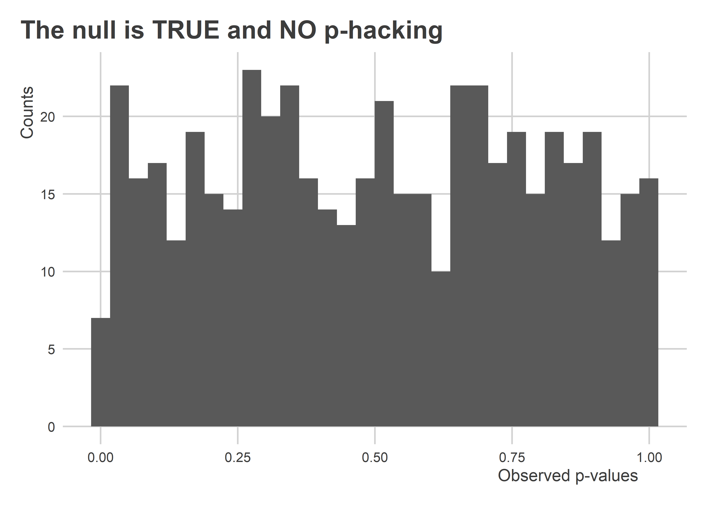

Over-Comparing, Under-Reporting, Part 1
================

## Goals

-   Consider why *over-comparing* and *under-reporting* of research
    findings is bad for the general accumulation of scientific
    knowledge.
-   Use data from the 2016 election to get hands-on experience with the
    over-comparing and under-reporting problem.

## Four Scenarios

Our text talked about four basic scenarios that can occur in scientific
research.

1.  The null hypothesis is true and no p-hacking exists.
2.  The null hypothesis is false and no-packing exists.
3.  The null hypothesis is true and p-hacking does exist.
4.  The null hypothesis is false and p-hacking does exist.

Let’s simulate some data using the `{seerrr}` package and check what the
distribution of p-values looks like under the null and the alternative.

If you don’t have the `{seerrr}` package, you’ll need to run
`devtools::install_github("milesdwilliams15/seerrr)` in the R console
first.

``` r
library(seerrr) # use tools from {seerrr}

# simulate data where the null is true
null_data <- simulate(
  R = 500,
  N = 500,
  x = rnorm(N),
  y = rnorm(N)
)

# simulate data where the null is false
alt_data <- simulate(
  R = 500,
  N = 500,
  x = rnorm(N),
  y = 0.1 * x + rnorm(N)
)
```

The above code creates two lists of simulated datasets. In the first,
the true underlying data-generating process is such that x and y have no
relationships. In the second, x and y have a modest positive
relationship.

### When the null is true

Using the `estimate()` function from `{seerrr}`, we can collect the
range of regression estimates for the relationship between x and y for
all the null datasets. The output contains a `p.value` column that
contains the p-value for each of the estimates per null dataset. We can
look at their distribution using a histogram.

``` r
est_null <- estimate(
  formula = y ~ x,
  data = null_data,
  vars = "x"
)

ggplot(est_null) +
  aes(x = p.value) +
  geom_histogram() +
  labs(
    x = "Observed p-values",
    y = "Counts",
    title = "The null is TRUE and NO p-hacking"
  )
```



There’s some noise in our data, but if we repeated this process infinity
times these bars would all converge toward the same value, consistent
with a uniform distribution.

### When the alternative is true

This code is similar to the previous. But this time we’re using the
alternative dataset. Look at the distribution of p-values this time.

``` r
est_alt <- estimate(
  formula = y ~ x,
  data = alt_data,
  vars = "x"
)

ggplot(est_alt) +
  aes(x = p.value) +
  geom_histogram() +
  labs(
    x = "Observed p-values",
    y = "Counts",
    title = "The null is FALSE and NO p-hacking"
  )
```


The p-values are clustered toward the low end. This is because, if the
null hypothesis is false, we should, with repeated samples, accumulate
studies that disproportionately reject the null.

## An example: Prior exposure to Trump and voting preferences

We have access to some data from 2016 from a survey that asked
individuals about who they voted for in 2016 for US President and
whether they had ever watched the show *The Apprentice* and the movie
*Home Alone 2*. Did prior exposure to Trump in pop-culture sway people’s
voting preferences for or away from Trump?

### Reading the Data into R

Here’s the data:

``` r
library(tidyverse)
url <- "https://raw.githubusercontent.com/milesdwilliams15/Teaching/main/DPR%20201/Data/VoterSurveyData2016.csv"
Data <- read_csv(url)
```

Let’s take a look:

``` r
glimpse(Data)
```

    ## Rows: 1,000
    ## Columns: 22
    ## $ id           <dbl> 1, 2, 3, 4, 5, 6, 7, 8, 9, 10, 11, 12, 13, 14, 15, 16, 17…
    ## $ voted16      <dbl> 1, 0, 0, 0, 0, 0, 1, 0, 0, 0, 1, 1, 0, 1, 0, 1, 0, 1, 1, …
    ## $ trump16      <dbl> 0, 0, 0, 0, 0, 0, 0, 0, 0, 0, 1, 1, 0, 0, 0, 1, 0, 0, 0, …
    ## $ clinton16    <dbl> 1, 0, 0, 0, 0, 0, 1, 0, 0, 0, 0, 0, 0, 1, 0, 0, 0, 1, 0, …
    ## $ voted12      <dbl> 1, 1, 1, 0, 1, 0, 1, 0, 0, 1, 0, 1, 1, 1, 0, 1, 0, 1, 1, …
    ## $ obama12      <dbl> 1, 1, 1, 0, 0, 0, 1, 0, 0, 1, 0, 0, 1, 1, 0, 0, 0, 1, 1, …
    ## $ romney12     <dbl> 0, 0, 0, 0, 1, 0, 0, 0, 0, 0, 0, 1, 0, 0, 0, 1, 0, 0, 0, …
    ## $ democrat     <dbl> 1, 0, 1, 1, 0, 0, 1, 0, 0, 1, 0, 0, 1, 1, 0, 0, 1, 1, 1, …
    ## $ republican   <dbl> 0, 0, 0, 0, 1, 0, 0, 0, 0, 0, 1, 1, 0, 0, 0, 1, 0, 0, 0, …
    ## $ liberal      <dbl> 1, 0, 1, 1, 0, 0, 0, 0, 0, 0, 0, 0, 1, 0, 1, 0, 1, 1, 1, …
    ## $ conservative <dbl> 0, 0, 0, 0, 1, 1, 0, 0, 0, 1, 0, 1, 0, 0, 0, 1, 0, 0, 0, …
    ## $ age          <dbl> 56, 32, 28, 47, 79, 60, 58, 20, 46, 36, 61, 59, 33, 60, 3…
    ## $ female       <dbl> 1, 0, 1, 0, 0, 1, 0, 1, 0, 0, 1, 1, 0, 1, 1, 1, 1, 1, 1, …
    ## $ white        <dbl> 1, 1, 1, 1, 1, 1, 0, 1, 1, 1, 1, 1, 1, 1, 1, 1, 0, 1, 0, …
    ## $ black        <dbl> 0, 0, 0, 0, 0, 0, 0, 0, 0, 0, 0, 0, 0, 0, 0, 0, 1, 0, 1, …
    ## $ hispanic     <dbl> 0, 0, 0, 0, 0, 0, 1, 0, 0, 0, 0, 0, 0, 0, 0, 0, 0, 0, 0, …
    ## $ asian        <dbl> 0, 0, 0, 0, 0, 0, 0, 0, 0, 0, 0, 0, 0, 0, 0, 0, 0, 0, 0, …
    ## $ income100    <dbl> 0, 0, 0, 0, 1, 0, 0, 0, 0, 0, 0, 0, 0, 0, 0, 0, 0, 1, 1, …
    ## $ church       <dbl> 0, 1, 0, 0, 1, 0, 0, 0, 0, 0, 0, 0, 1, 0, 0, 1, 0, 0, 0, …
    ## $ south        <dbl> 0, 0, 1, 1, 0, 0, 0, 1, 0, 0, 1, 1, 0, 0, 0, 0, 0, 0, 1, …
    ## $ apprentice   <dbl> 0, 1, 0, 0, 1, 0, 0, 1, 0, 0, 0, 0, 0, 0, 0, 0, 0, 0, 0, …
    ## $ homealone2   <dbl> 1, 1, 0, 0, 1, 0, 1, 1, 0, 1, 0, 0, 0, 0, 1, 0, 1, 0, 1, …

Can we find a significant relationship between watching *The Apprentice*
and voting for Trump?

``` r
library(estimatr)
fit <- lm_robust(trump16 ~ apprentice, data = Data)
fit
```

    ##                Estimate Std. Error   t value     Pr(>|t|)   CI Lower   CI Upper
    ## (Intercept)  0.22409639 0.01448252 15.473580 1.429522e-48  0.1956767 0.25251606
    ## apprentice  -0.03586109 0.03337517 -1.074484 2.828654e-01 -0.1013546 0.02963246
    ##              DF
    ## (Intercept) 998
    ## apprentice  998

There’s a negative relationship, but it isn’t statistically significant.
What about *Home Alone 2*?

``` r
newfit <- lm_robust(trump16 ~ homealone2, data = Data)
newfit
```

    ##               Estimate Std. Error   t value     Pr(>|t|)   CI Lower    CI Upper
    ## (Intercept)  0.2535787 0.01969421 12.875803 3.297957e-35  0.2149319  0.29222554
    ## homealone2  -0.0696257 0.02611903 -2.665708 7.806762e-03 -0.1208802 -0.01837119
    ##              DF
    ## (Intercept) 998
    ## homealone2  998

Whoa! People who saw *Home Alone 2* were significantly less likely to
vote for Trump.

### Try it out

Can you figure out if the effect of seeing *Home Alone 2* holds up to
scientific scrutiny? Is the null effect of seeing *The Apprentice*
legitimate?

It’s possible that other variables in the data could explain these
relationships (or non-relationships). You can adjust for observed
characteristics in a linear model by using the `+` operator between the
names of predictor variables. For example, we can write:

    lm_robust(trump16 ~ homealone2 + apprentice + age, 
              data = Data)

Try controlling for different variables and see how the estimates for
these two shows changes.

Does it look like the null might be true in either case, or is the
alternative true?
