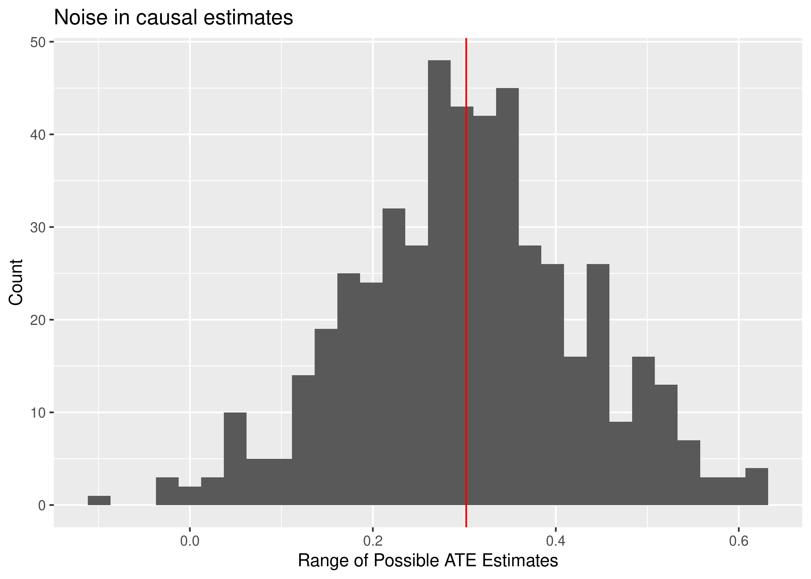
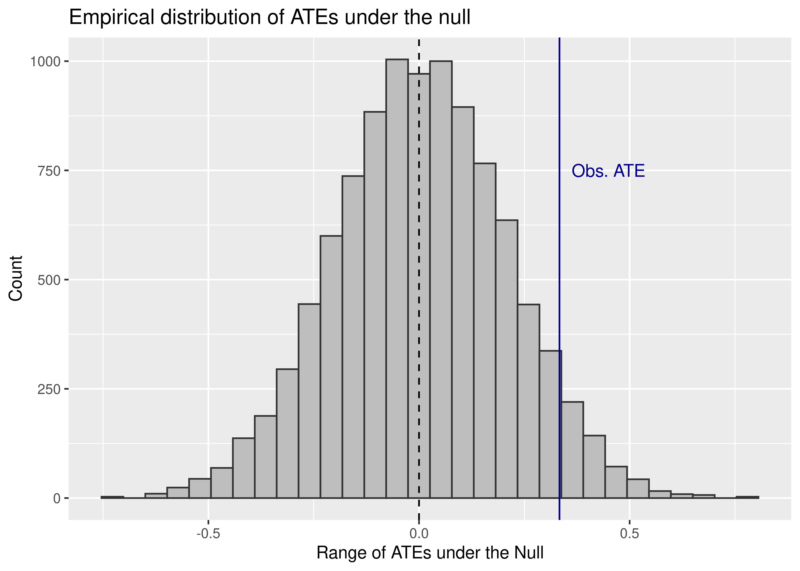

Getting started with causation: a simulation
================

-   <a href="#goals" id="toc-goals">Goals</a>
-   <a href="#simulating-potential-outcomes"
    id="toc-simulating-potential-outcomes">Simulating potential outcomes</a>
-   <a href="#causal-inference-and-the-sharp-null"
    id="toc-causal-inference-and-the-sharp-null">Causal Inference and the
    Sharp Null</a>

## Goals

-   Use a simulation to introduce the intuition behind the potential
    outcomes framework
-   Provide intuition for hypothesis testing with causal inference using
    the sharp null

## Simulating potential outcomes

Counterfactuals can be tricky, or philosophically subtle as BDMF put it
in our text. I generally find that running a simulation helps me to
better understand what’s going on with statistical concepts.

So, let’s gather our tools:

``` r
library(tidyverse)
```

And now, let’s simulate some data to illustrate:

``` r
set.seed(123)
tibble(
  # values without treatment
  Y0 = rnorm(100),
  
  # values with treatment
  Y1 = 1/2 + rnorm(100),
  
  # treatment assignemnt
  Tr = rep(0:1, each = 50) %>%
    sample(),
  
  # reveal outcomes
  Yobs = Y1 * Tr + Y0 * (1 - Tr)
) -> simData
```

Since we’ve simulated the data, we can directly calculate the ATE:

``` r
theATE <- mean(simData$Y1 - simData$Y0)
theATE
```

    ## [1] 0.3020473

And we can compare this to our estimate of the ATE:

``` r
estATE <- mean(simData$Yobs[simData$Tr==1]) - 
  mean(simData$Yobs[simData$Tr==0])
estATE
```

    ## [1] 0.3333896

Note that linear regression models when estimated via OLS correspond to
the mean. So we could also just use `lm()` to calculate the estimated
ATE as well:

``` r
model_fit <- lm(Yobs ~ Tr, simData)
estATE <- coef(model_fit)["Tr"]
estATE
```

    ##        Tr 
    ## 0.3333896

The estimated ATE is unlikely to be exactly equal to the true ATE. This
happens for a couple of reasons.

As we’ve talked about before, when we estimate quantities using data,
our estimates reflect a combination of three things. These are captured
by the following equation:

*Estimate = Estimand + Bias + Noise*

-   *Estimate*: the thing that we calculate.
-   *Estimand*: the thing we want to estimate.
-   *Bias*: factors that systematically skew our estimate up or down.
-   *Noise*: factors that randomly skew our estimate up or down.

In the case of the data-generating process we simulated above, *Noise*
enters the equation through the randomization process. If we could
repeat the process of assigning students to treatment, we’d see that we
could have gotten a range of different ATE estimates:

``` r
replicate(
  500,
  {
    newData <- simData %>%
      mutate(
        Tr = sample(Tr),
        Yobs = Tr * Y1 + (1 - Tr) * Y0
      )
    newATE <- mean(newData$Yobs[newData$Tr==1]) - 
      mean(newData$Yobs[newData$Tr==0])
    newATE
  },
  "c"
) -> possibleATEs

ggplot() +
  aes(possibleATEs) +
  geom_histogram() +
  geom_vline(xintercept = theATE,
             color = "red") +
  labs(x = "Range of Possible ATE Estimates",
       y = "Count",
       title = "Noise in causal estimates")
```



The red line shows the true ATE and the histogram summarizes the range
of possible ATE estimates we could have obtained with the data.

## Causal Inference and the Sharp Null

Hypothesis testing, which we’ve already discussed, operates in much the
same way with causal inference as it does with descriptive inferernce.
But sometimes with causation it often is justified to test a very
special kind of null hypothesis for a treatment effect: *the sharp
null*.

The idea comes from the same Ronald Fisher we talked about several weeks
ago (the one who said smoking doesn’t cause cancer). The idea is simple.
If the null hypothesis is true then any difference in means between
treatment and control groups is simply due to the luck of draw with the
randomizing process itself. That means we can rerandomize treatment and
get a range of treatment effects under the null and use this
distribution to make an inference about how unlikely our observed
estimate of the ATE is.

This process is called *permutation* and it’s a computational approach
to statistical inference. Here’s how it works using some code:

``` r
replicate(
  10000,
  coef(lm(Yobs ~ sample(Tr), simData))[2],
  "c"
) -> permATEs

2 * min(
  mean(permATEs <= estATE),
  mean(permATEs >= estATE)
) -> p.value
p.value # the permutation p-value
```

    ## [1] 0.109

This p-value is literally just the proportion of times the permutation
process gives us an ATE at least as extreme as the one we estimated with
the original treatment assignment.

What I like about this approach (and most computational approaches for
that matter) is that we can plot the *empirical* distribution of
possible treatment effects under the null. That is, if the null really
is true, this is what the actual empirical distribution of treatment
effects looks like:

``` r
ggplot() +
  aes(x = permATEs) +
  geom_histogram(
    fill = "gray",
    color = "gray20"
  ) +
  geom_vline(
    xintercept = c(0, estATE),
    lty = c(2, 1),
    color = c("black", "darkblue")
  ) +
  labs(
    x = "Range of ATEs under the Null",
    y = "Count",
    title = "Empirical distribution of ATEs under the null"
  ) +
  annotate(
    "text",
    x = 0.45,
    y = 750,
    label = "Obs. ATE",
    color = "darkblue"
  )
```


