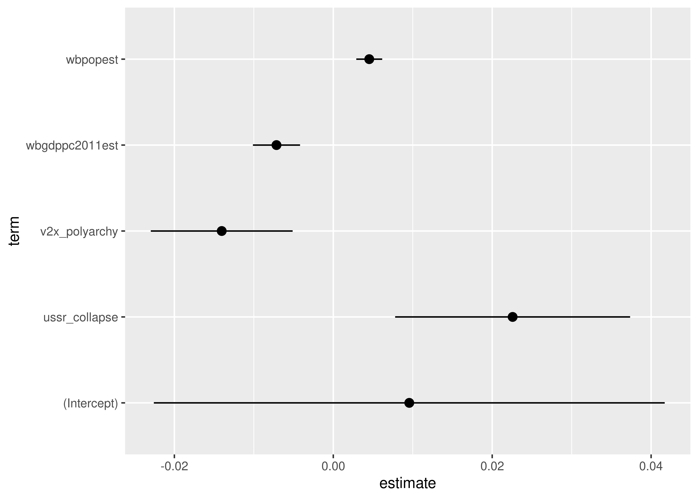
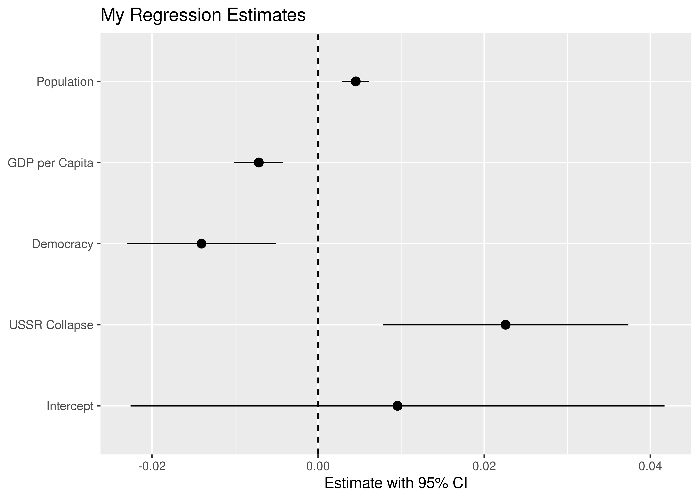
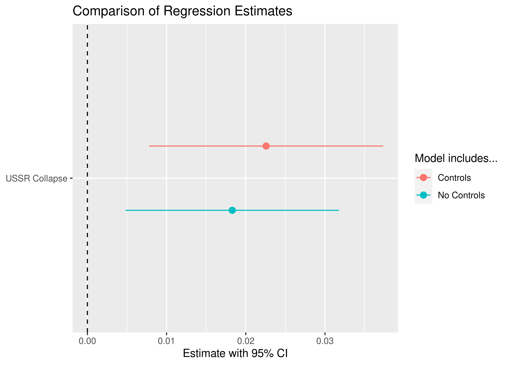

Estimating the ATE in R
================

-   <a href="#goals" id="toc-goals">Goals</a>
-   <a href="#the-average-treatment-effect"
    id="toc-the-average-treatment-effect">The Average Treatment Effect</a>
-   <a href="#how-to-estimate-the-ate-in-r"
    id="toc-how-to-estimate-the-ate-in-r">How to estimate the ATE in R</a>
-   <a href="#summarizing-the-ate-with-regression-tables"
    id="toc-summarizing-the-ate-with-regression-tables">Summarizing the ATE
    with Regression Tables</a>
-   <a href="#summarizing-the-ate-with-coefficient-plots"
    id="toc-summarizing-the-ate-with-coefficient-plots">Summarizing the ATE
    with Coefficient Plots</a>

## Goals

-   The average treatment effect or ATE is usually our target estimand
    in causal inference.
-   R provides an infinite variety of tools for estimating the ATE, but
    there are advantages to using the `lm_robust()` function from
    `{estimatr}`.
-   There are also many tools for reporting your results like regression
    tables and coefficient plots.

## The Average Treatment Effect

The average treatment effect is defined as the *average difference in
some outcome due to a causal variable or treatment*.

In a recent assigment, we talked about the effects of letters to
households on household applications for fire-proofing inspections.

Let’s use

to denote treatment where 1 means a household got a letter and 0 means
they didn’t. Let

denote whether a household applied for an inspection:


Using this notation, the effect of the letters on applications for
household

is:


This difference or “delta” tells us the causal effect of the letters.
Often times, we’re more interested in the average causal effect rather
than the effect for an individual observation. We would represent this
as follows:


With this notation, we can specify the *average treatment effect* or ATE
as:


As you’ll recall, we face a practical challenge when it comes to
calculating the ATE. Namely, we can’t actually calculate it—not directly
anyway—because we cannot observe all potential outcomes in the study.
The randomization process leads the the following revealed outcomes:

")

We can only estimate the ATE using the revealed outcomes. The simplest
way to do this is to take the average of the outcome among the treated
and compare it to the average of the outcome among the untreated:

 & = \text{average outcome for all units where } T_i = 1\\
\overline Y(T_i = 0) & = \text{average outcome for all units where } T_i = 0
\end{aligned}")

Using this notation we have:

 - \overline Y(T_i = 0)")

This “delta hat” is the best we can do, and under the right conditions,
it actually is a pretty good approximation for the true ATE.

## How to estimate the ATE in R

In the most recent assignment, you all estimated the ATE for letters on
inspections using a linear regression model. In political science, this
is our preferred way to do this. There are other approaches, but linear
regression is the most flexible and it provides a nice framework for
adjusting for confounding covariates.

At places like the Office of Evaluation Sciences the method we always
teach newcomers is the `lm_robust()` function from the `{estimatr}`
package. We prefer this to `lm()` for a few reasons:

1.  `lm_robust()` makes doing statistical inference much easier.
2.  `lm_robust()` can be quickly converted to a form useful for data
    viz.
3.  `lm_robust()` makes dealing with fixed effects easier (we’ll talk
    about these later).

Let’s look at an example involving conflict and the Cold War. We’re
going to use some political science data from the `{peacesciencer}`
package:

``` r
library(tidyverse)
library(peacesciencer)
create_stateyears(subset_years = 1945:2007) %>%
  add_cow_wars(type = "intra") %>%
  add_sdp_gdp() %>%
  add_democracy() -> Data
```

The period during the collapse of the Soviet Union was a tumultuous
time. Did instability in the USSR have an effect on political
instability and conflict globally? Let’s add a variable to our data that
indicates the period of time during which the USSR began to and
ultimately did meet its end:

``` r
Data %>%
  mutate(
    ussr_collapse = ifelse(year %in% 1989:1992, 1, 0)
  ) -> Data
```

Then we’ll fit the model:

``` r
library(estimatr)
lm_fit <- lm_robust(
  cowintraonset ~ ussr_collapse, 
  data = Data,
  se_type = "HC1"
)
```

If we use summary to check the results, we can see whether this period
really was more conflict-prone:

``` r
summary(lm_fit)
```

    ## 
    ## Call:
    ## lm_robust(formula = cowintraonset ~ ussr_collapse, data = Data, 
    ##     se_type = "HC1")
    ## 
    ## Standard error type:  HC1 
    ## 
    ## Coefficients:
    ##               Estimate Std. Error t value  Pr(>|t|) CI Lower CI Upper   DF
    ## (Intercept)    0.01387   0.001296  10.703 1.427e-26 0.011331  0.01641 8828
    ## ussr_collapse  0.01829   0.006870   2.662 7.771e-03 0.004825  0.03176 8828
    ## 
    ## Multiple R-squared:  0.001588 ,  Adjusted R-squared:  0.001475 
    ## F-statistic: 7.089 on 1 and 8828 DF,  p-value: 0.007771

The estimate is indeed statistically significant and positive. Let’s
interpret the coefficients really quickly.

-   Intercept: This tells us the average rate of civil war onset durring
    all years in the data other than 1989-1992. This value equals
    0.01387. Multiply that by 100 and we have a conflict initiation rate
    of 1.4%.
-   Slope: This tels us the difference in the average rate of civil war
    onset outside of 1989-1992 and during this period. This value equals
    0.01829. Multiply that by 100 and we have an average 1.8 percentage
    point increase in conflict initiation during this period. That’s
    more than double the conflict.

The results suggest that the collapse of the Soviet Union may have had
an effect on conflict globally. Does that make sense to you? Can you
think of reasons why this correlation might be spurious?

Our data includes a number of other covariates that we can try to adjust
for. We’ll talk more indepth about controlling for covariates later. For
now, let’s just add a few under the assumption that they help us rule
out whether these other variables might explain the correlation between
the collapse of the USSR and global conflict:

``` r
lm_fit_controls <- lm_robust(
  cowintraonset ~ ussr_collapse + 
    v2x_polyarchy + wbgdppc2011est + wbpopest,
  data = Data,
  se_type = "HC1"
)
```

The above allows us to control for the following covariates:

-   `v2x_polyarchy`: This is the Varieties of Democracy (V-Dem)
    project’s measure of the quality of democracy. Values range from 0-1
    where 1 means most democratic and 0 means least.
-   `wbgdppc2011est`: This is the natural log of GDP per capita in
    countries over time.
-   `wbpopest`: This is the natural log of country population over time.

Does accounting for these variables change our estimate of the effect of
the Soviet Union’s collapse?

``` r
summary(lm_fit_controls)
```

    ## 
    ## Call:
    ## lm_robust(formula = cowintraonset ~ ussr_collapse + v2x_polyarchy + 
    ##     wbgdppc2011est + wbpopest, data = Data, se_type = "HC1")
    ## 
    ## Standard error type:  HC1 
    ## 
    ## Coefficients:
    ##                 Estimate Std. Error t value  Pr(>|t|)  CI Lower  CI Upper   DF
    ## (Intercept)     0.009564  0.0164001  0.5832 5.598e-01 -0.022584  0.041712 8198
    ## ussr_collapse   0.022571  0.0075431  2.9923 2.777e-03  0.007785  0.037358 8198
    ## v2x_polyarchy  -0.014041  0.0045531 -3.0838 2.050e-03 -0.022966 -0.005116 8198
    ## wbgdppc2011est -0.007148  0.0015131 -4.7242 2.348e-06 -0.010114 -0.004182 8198
    ## wbpopest        0.004526  0.0008324  5.4379 5.547e-08  0.002895  0.006158 8198
    ## 
    ## Multiple R-squared:  0.01402 ,   Adjusted R-squared:  0.01354 
    ## F-statistic: 23.08 on 4 and 8198 DF,  p-value: < 2.2e-16

Wow! Rather than reducing the estimate, it’s greater in magnitude and
has an even smaller p-value.

Since we’re now controlling for other variables, we would say that, *all
else equal*, the collapse of the USSR increased the rate of conflict
intitiation by 2.3 percentage points.

## Summarizing the ATE with Regression Tables

When we report results for the ATE, we either will make a regression
table or a coefficient plot. We talked about these things before, but we
didn’t discuss how to make them.

Because people use R so much for their research, there are lots of
available tools for producing professional looking regression tables in
R. One of my favorites is `{texreg}`. If you don’t have it, you can
install it by writing the following in the console:

    install.packages("texreg")

We can easily plot the results from one or more regression models
side-by-side. Here’s a table with just our original model:

``` r
library(texreg)
screenreg(lm_fit)
```

    ## 
    ## ===========================
    ##                Model 1     
    ## ---------------------------
    ## (Intercept)       0.01 *   
    ##                [0.01; 0.02]
    ## ussr_collapse     0.02 *   
    ##                [0.00; 0.03]
    ## ---------------------------
    ## R^2               0.00     
    ## Adj. R^2          0.00     
    ## Num. obs.      8830        
    ## RMSE              0.12     
    ## ===========================
    ## * 0 outside the confidence interval.

Here’s one that compares both of our models:

``` r
screenreg(
  list(lm_fit, lm_fit_controls)
)
```

    ## 
    ## ============================================
    ##                 Model 1       Model 2       
    ## --------------------------------------------
    ## (Intercept)        0.01 *        0.01       
    ##                 [0.01; 0.02]  [-0.02;  0.04]
    ## ussr_collapse      0.02 *        0.02 *     
    ##                 [0.00; 0.03]  [ 0.01;  0.04]
    ## v2x_polyarchy                   -0.01 *     
    ##                               [-0.02; -0.01]
    ## wbgdppc2011est                  -0.01 *     
    ##                               [-0.01; -0.00]
    ## wbpopest                         0.00 *     
    ##                               [ 0.00;  0.01]
    ## --------------------------------------------
    ## R^2                0.00          0.01       
    ## Adj. R^2           0.00          0.01       
    ## Num. obs.       8830          8203          
    ## RMSE               0.12          0.12       
    ## ============================================
    ## * Null hypothesis value outside the confidence interval.

The above tables are produced using `screenreg()`. This produces output
that you can easily read in your R console. You can also produce html
tables:

``` r
htmlreg(list(lm_fit, lm_fit_controls)) %>%
  htmltools::HTML()
```

<table class="texreg" style="margin: 10px auto;border-collapse: collapse;border-spacing: 0px;caption-side: bottom;color: #000000;border-top: 2px solid #000000;">
<caption>Statistical models</caption>
<thead>
<tr>
<th style="padding-left: 5px;padding-right: 5px;">&nbsp;</th>
<th style="padding-left: 5px;padding-right: 5px;">Model 1</th>
<th style="padding-left: 5px;padding-right: 5px;">Model 2</th>
</tr>
</thead>
<tbody>
<tr style="border-top: 1px solid #000000;">
<td style="padding-left: 5px;padding-right: 5px;">(Intercept)</td>
<td style="padding-left: 5px;padding-right: 5px;">0.01<sup>&#42;</sup></td>
<td style="padding-left: 5px;padding-right: 5px;">0.01</td>
</tr>
<tr>
<td style="padding-left: 5px;padding-right: 5px;">&nbsp;</td>
<td style="padding-left: 5px;padding-right: 5px;">[0.01; 0.02]</td>
<td style="padding-left: 5px;padding-right: 5px;">[-0.02;  0.04]</td>
</tr>
<tr>
<td style="padding-left: 5px;padding-right: 5px;">ussr_collapse</td>
<td style="padding-left: 5px;padding-right: 5px;">0.02<sup>&#42;</sup></td>
<td style="padding-left: 5px;padding-right: 5px;">0.02<sup>&#42;</sup></td>
</tr>
<tr>
<td style="padding-left: 5px;padding-right: 5px;">&nbsp;</td>
<td style="padding-left: 5px;padding-right: 5px;">[0.00; 0.03]</td>
<td style="padding-left: 5px;padding-right: 5px;">[ 0.01;  0.04]</td>
</tr>
<tr>
<td style="padding-left: 5px;padding-right: 5px;">v2x_polyarchy</td>
<td style="padding-left: 5px;padding-right: 5px;">&nbsp;</td>
<td style="padding-left: 5px;padding-right: 5px;">-0.01<sup>&#42;</sup></td>
</tr>
<tr>
<td style="padding-left: 5px;padding-right: 5px;">&nbsp;</td>
<td style="padding-left: 5px;padding-right: 5px;">&nbsp;</td>
<td style="padding-left: 5px;padding-right: 5px;">[-0.02; -0.01]</td>
</tr>
<tr>
<td style="padding-left: 5px;padding-right: 5px;">wbgdppc2011est</td>
<td style="padding-left: 5px;padding-right: 5px;">&nbsp;</td>
<td style="padding-left: 5px;padding-right: 5px;">-0.01<sup>&#42;</sup></td>
</tr>
<tr>
<td style="padding-left: 5px;padding-right: 5px;">&nbsp;</td>
<td style="padding-left: 5px;padding-right: 5px;">&nbsp;</td>
<td style="padding-left: 5px;padding-right: 5px;">[-0.01; -0.00]</td>
</tr>
<tr>
<td style="padding-left: 5px;padding-right: 5px;">wbpopest</td>
<td style="padding-left: 5px;padding-right: 5px;">&nbsp;</td>
<td style="padding-left: 5px;padding-right: 5px;">0.00<sup>&#42;</sup></td>
</tr>
<tr>
<td style="padding-left: 5px;padding-right: 5px;">&nbsp;</td>
<td style="padding-left: 5px;padding-right: 5px;">&nbsp;</td>
<td style="padding-left: 5px;padding-right: 5px;">[ 0.00;  0.01]</td>
</tr>
<tr style="border-top: 1px solid #000000;">
<td style="padding-left: 5px;padding-right: 5px;">R<sup>2</sup></td>
<td style="padding-left: 5px;padding-right: 5px;">0.00</td>
<td style="padding-left: 5px;padding-right: 5px;">0.01</td>
</tr>
<tr>
<td style="padding-left: 5px;padding-right: 5px;">Adj. R<sup>2</sup></td>
<td style="padding-left: 5px;padding-right: 5px;">0.00</td>
<td style="padding-left: 5px;padding-right: 5px;">0.01</td>
</tr>
<tr>
<td style="padding-left: 5px;padding-right: 5px;">Num. obs.</td>
<td style="padding-left: 5px;padding-right: 5px;">8830</td>
<td style="padding-left: 5px;padding-right: 5px;">8203</td>
</tr>
<tr style="border-bottom: 2px solid #000000;">
<td style="padding-left: 5px;padding-right: 5px;">RMSE</td>
<td style="padding-left: 5px;padding-right: 5px;">0.12</td>
<td style="padding-left: 5px;padding-right: 5px;">0.12</td>
</tr>
</tbody>
<tfoot>
<tr>
<td style="font-size: 0.8em;" colspan="3"><sup>&#42;</sup> Null hypothesis value outside the confidence interval.</td>
</tr>
</tfoot>
</table>

By default, these `*reg()` functions produce tables with 95% confidence
intervals. If you want to show standard errors instead, you can just say
so:

``` r
htmlreg(list(lm_fit, lm_fit_controls),
        include.ci = F) %>%
  htmltools::HTML()
```

<table class="texreg" style="margin: 10px auto;border-collapse: collapse;border-spacing: 0px;caption-side: bottom;color: #000000;border-top: 2px solid #000000;">
<caption>Statistical models</caption>
<thead>
<tr>
<th style="padding-left: 5px;padding-right: 5px;">&nbsp;</th>
<th style="padding-left: 5px;padding-right: 5px;">Model 1</th>
<th style="padding-left: 5px;padding-right: 5px;">Model 2</th>
</tr>
</thead>
<tbody>
<tr style="border-top: 1px solid #000000;">
<td style="padding-left: 5px;padding-right: 5px;">(Intercept)</td>
<td style="padding-left: 5px;padding-right: 5px;">0.01<sup>&#42;&#42;&#42;</sup></td>
<td style="padding-left: 5px;padding-right: 5px;">0.01</td>
</tr>
<tr>
<td style="padding-left: 5px;padding-right: 5px;">&nbsp;</td>
<td style="padding-left: 5px;padding-right: 5px;">(0.00)</td>
<td style="padding-left: 5px;padding-right: 5px;">(0.02)</td>
</tr>
<tr>
<td style="padding-left: 5px;padding-right: 5px;">ussr_collapse</td>
<td style="padding-left: 5px;padding-right: 5px;">0.02<sup>&#42;&#42;</sup></td>
<td style="padding-left: 5px;padding-right: 5px;">0.02<sup>&#42;&#42;</sup></td>
</tr>
<tr>
<td style="padding-left: 5px;padding-right: 5px;">&nbsp;</td>
<td style="padding-left: 5px;padding-right: 5px;">(0.01)</td>
<td style="padding-left: 5px;padding-right: 5px;">(0.01)</td>
</tr>
<tr>
<td style="padding-left: 5px;padding-right: 5px;">v2x_polyarchy</td>
<td style="padding-left: 5px;padding-right: 5px;">&nbsp;</td>
<td style="padding-left: 5px;padding-right: 5px;">-0.01<sup>&#42;&#42;</sup></td>
</tr>
<tr>
<td style="padding-left: 5px;padding-right: 5px;">&nbsp;</td>
<td style="padding-left: 5px;padding-right: 5px;">&nbsp;</td>
<td style="padding-left: 5px;padding-right: 5px;">(0.00)</td>
</tr>
<tr>
<td style="padding-left: 5px;padding-right: 5px;">wbgdppc2011est</td>
<td style="padding-left: 5px;padding-right: 5px;">&nbsp;</td>
<td style="padding-left: 5px;padding-right: 5px;">-0.01<sup>&#42;&#42;&#42;</sup></td>
</tr>
<tr>
<td style="padding-left: 5px;padding-right: 5px;">&nbsp;</td>
<td style="padding-left: 5px;padding-right: 5px;">&nbsp;</td>
<td style="padding-left: 5px;padding-right: 5px;">(0.00)</td>
</tr>
<tr>
<td style="padding-left: 5px;padding-right: 5px;">wbpopest</td>
<td style="padding-left: 5px;padding-right: 5px;">&nbsp;</td>
<td style="padding-left: 5px;padding-right: 5px;">0.00<sup>&#42;&#42;&#42;</sup></td>
</tr>
<tr>
<td style="padding-left: 5px;padding-right: 5px;">&nbsp;</td>
<td style="padding-left: 5px;padding-right: 5px;">&nbsp;</td>
<td style="padding-left: 5px;padding-right: 5px;">(0.00)</td>
</tr>
<tr style="border-top: 1px solid #000000;">
<td style="padding-left: 5px;padding-right: 5px;">R<sup>2</sup></td>
<td style="padding-left: 5px;padding-right: 5px;">0.00</td>
<td style="padding-left: 5px;padding-right: 5px;">0.01</td>
</tr>
<tr>
<td style="padding-left: 5px;padding-right: 5px;">Adj. R<sup>2</sup></td>
<td style="padding-left: 5px;padding-right: 5px;">0.00</td>
<td style="padding-left: 5px;padding-right: 5px;">0.01</td>
</tr>
<tr>
<td style="padding-left: 5px;padding-right: 5px;">Num. obs.</td>
<td style="padding-left: 5px;padding-right: 5px;">8830</td>
<td style="padding-left: 5px;padding-right: 5px;">8203</td>
</tr>
<tr style="border-bottom: 2px solid #000000;">
<td style="padding-left: 5px;padding-right: 5px;">RMSE</td>
<td style="padding-left: 5px;padding-right: 5px;">0.12</td>
<td style="padding-left: 5px;padding-right: 5px;">0.12</td>
</tr>
</tbody>
<tfoot>
<tr>
<td style="font-size: 0.8em;" colspan="3"><sup>&#42;&#42;&#42;</sup>p &lt; 0.001; <sup>&#42;&#42;</sup>p &lt; 0.01; <sup>&#42;</sup>p &lt; 0.05</td>
</tr>
</tfoot>
</table>

Same if you want to show more digits after the decimal point:

``` r
htmlreg(list(lm_fit, lm_fit_controls),
        include.ci = F,
        digits = 3) %>%
  htmltools::HTML()
```

<table class="texreg" style="margin: 10px auto;border-collapse: collapse;border-spacing: 0px;caption-side: bottom;color: #000000;border-top: 2px solid #000000;">
<caption>Statistical models</caption>
<thead>
<tr>
<th style="padding-left: 5px;padding-right: 5px;">&nbsp;</th>
<th style="padding-left: 5px;padding-right: 5px;">Model 1</th>
<th style="padding-left: 5px;padding-right: 5px;">Model 2</th>
</tr>
</thead>
<tbody>
<tr style="border-top: 1px solid #000000;">
<td style="padding-left: 5px;padding-right: 5px;">(Intercept)</td>
<td style="padding-left: 5px;padding-right: 5px;">0.014<sup>&#42;&#42;&#42;</sup></td>
<td style="padding-left: 5px;padding-right: 5px;">0.010</td>
</tr>
<tr>
<td style="padding-left: 5px;padding-right: 5px;">&nbsp;</td>
<td style="padding-left: 5px;padding-right: 5px;">(0.001)</td>
<td style="padding-left: 5px;padding-right: 5px;">(0.016)</td>
</tr>
<tr>
<td style="padding-left: 5px;padding-right: 5px;">ussr_collapse</td>
<td style="padding-left: 5px;padding-right: 5px;">0.018<sup>&#42;&#42;</sup></td>
<td style="padding-left: 5px;padding-right: 5px;">0.023<sup>&#42;&#42;</sup></td>
</tr>
<tr>
<td style="padding-left: 5px;padding-right: 5px;">&nbsp;</td>
<td style="padding-left: 5px;padding-right: 5px;">(0.007)</td>
<td style="padding-left: 5px;padding-right: 5px;">(0.008)</td>
</tr>
<tr>
<td style="padding-left: 5px;padding-right: 5px;">v2x_polyarchy</td>
<td style="padding-left: 5px;padding-right: 5px;">&nbsp;</td>
<td style="padding-left: 5px;padding-right: 5px;">-0.014<sup>&#42;&#42;</sup></td>
</tr>
<tr>
<td style="padding-left: 5px;padding-right: 5px;">&nbsp;</td>
<td style="padding-left: 5px;padding-right: 5px;">&nbsp;</td>
<td style="padding-left: 5px;padding-right: 5px;">(0.005)</td>
</tr>
<tr>
<td style="padding-left: 5px;padding-right: 5px;">wbgdppc2011est</td>
<td style="padding-left: 5px;padding-right: 5px;">&nbsp;</td>
<td style="padding-left: 5px;padding-right: 5px;">-0.007<sup>&#42;&#42;&#42;</sup></td>
</tr>
<tr>
<td style="padding-left: 5px;padding-right: 5px;">&nbsp;</td>
<td style="padding-left: 5px;padding-right: 5px;">&nbsp;</td>
<td style="padding-left: 5px;padding-right: 5px;">(0.002)</td>
</tr>
<tr>
<td style="padding-left: 5px;padding-right: 5px;">wbpopest</td>
<td style="padding-left: 5px;padding-right: 5px;">&nbsp;</td>
<td style="padding-left: 5px;padding-right: 5px;">0.005<sup>&#42;&#42;&#42;</sup></td>
</tr>
<tr>
<td style="padding-left: 5px;padding-right: 5px;">&nbsp;</td>
<td style="padding-left: 5px;padding-right: 5px;">&nbsp;</td>
<td style="padding-left: 5px;padding-right: 5px;">(0.001)</td>
</tr>
<tr style="border-top: 1px solid #000000;">
<td style="padding-left: 5px;padding-right: 5px;">R<sup>2</sup></td>
<td style="padding-left: 5px;padding-right: 5px;">0.002</td>
<td style="padding-left: 5px;padding-right: 5px;">0.014</td>
</tr>
<tr>
<td style="padding-left: 5px;padding-right: 5px;">Adj. R<sup>2</sup></td>
<td style="padding-left: 5px;padding-right: 5px;">0.001</td>
<td style="padding-left: 5px;padding-right: 5px;">0.014</td>
</tr>
<tr>
<td style="padding-left: 5px;padding-right: 5px;">Num. obs.</td>
<td style="padding-left: 5px;padding-right: 5px;">8830</td>
<td style="padding-left: 5px;padding-right: 5px;">8203</td>
</tr>
<tr style="border-bottom: 2px solid #000000;">
<td style="padding-left: 5px;padding-right: 5px;">RMSE</td>
<td style="padding-left: 5px;padding-right: 5px;">0.123</td>
<td style="padding-left: 5px;padding-right: 5px;">0.124</td>
</tr>
</tbody>
<tfoot>
<tr>
<td style="font-size: 0.8em;" colspan="3"><sup>&#42;&#42;&#42;</sup>p &lt; 0.001; <sup>&#42;&#42;</sup>p &lt; 0.01; <sup>&#42;</sup>p &lt; 0.05</td>
</tr>
</tfoot>
</table>

There generally is no need to show more than 3.

Finally, you can clean up the variable names and add a title:

``` r
htmlreg(list(lm_fit, lm_fit_controls),
        include.ci = F,
        digits = 3,
        caption = "My Regression Estimates",
        caption.above = T,
        custom.coef.names = c("Intercept",
                              "USSR Collapse",
                              "Democracy",
                              "GDP per Capita",
                              "Population")) %>%
  htmltools::HTML()
```

<table class="texreg" style="margin: 10px auto;border-collapse: collapse;border-spacing: 0px;color: #000000;border-top: 2px solid #000000;">
<caption>My Regression Estimates</caption>
<thead>
<tr>
<th style="padding-left: 5px;padding-right: 5px;">&nbsp;</th>
<th style="padding-left: 5px;padding-right: 5px;">Model 1</th>
<th style="padding-left: 5px;padding-right: 5px;">Model 2</th>
</tr>
</thead>
<tbody>
<tr style="border-top: 1px solid #000000;">
<td style="padding-left: 5px;padding-right: 5px;">Intercept</td>
<td style="padding-left: 5px;padding-right: 5px;">0.014<sup>&#42;&#42;&#42;</sup></td>
<td style="padding-left: 5px;padding-right: 5px;">0.010</td>
</tr>
<tr>
<td style="padding-left: 5px;padding-right: 5px;">&nbsp;</td>
<td style="padding-left: 5px;padding-right: 5px;">(0.001)</td>
<td style="padding-left: 5px;padding-right: 5px;">(0.016)</td>
</tr>
<tr>
<td style="padding-left: 5px;padding-right: 5px;">USSR Collapse</td>
<td style="padding-left: 5px;padding-right: 5px;">0.018<sup>&#42;&#42;</sup></td>
<td style="padding-left: 5px;padding-right: 5px;">0.023<sup>&#42;&#42;</sup></td>
</tr>
<tr>
<td style="padding-left: 5px;padding-right: 5px;">&nbsp;</td>
<td style="padding-left: 5px;padding-right: 5px;">(0.007)</td>
<td style="padding-left: 5px;padding-right: 5px;">(0.008)</td>
</tr>
<tr>
<td style="padding-left: 5px;padding-right: 5px;">Democracy</td>
<td style="padding-left: 5px;padding-right: 5px;">&nbsp;</td>
<td style="padding-left: 5px;padding-right: 5px;">-0.014<sup>&#42;&#42;</sup></td>
</tr>
<tr>
<td style="padding-left: 5px;padding-right: 5px;">&nbsp;</td>
<td style="padding-left: 5px;padding-right: 5px;">&nbsp;</td>
<td style="padding-left: 5px;padding-right: 5px;">(0.005)</td>
</tr>
<tr>
<td style="padding-left: 5px;padding-right: 5px;">GDP per Capita</td>
<td style="padding-left: 5px;padding-right: 5px;">&nbsp;</td>
<td style="padding-left: 5px;padding-right: 5px;">-0.007<sup>&#42;&#42;&#42;</sup></td>
</tr>
<tr>
<td style="padding-left: 5px;padding-right: 5px;">&nbsp;</td>
<td style="padding-left: 5px;padding-right: 5px;">&nbsp;</td>
<td style="padding-left: 5px;padding-right: 5px;">(0.002)</td>
</tr>
<tr>
<td style="padding-left: 5px;padding-right: 5px;">Population</td>
<td style="padding-left: 5px;padding-right: 5px;">&nbsp;</td>
<td style="padding-left: 5px;padding-right: 5px;">0.005<sup>&#42;&#42;&#42;</sup></td>
</tr>
<tr>
<td style="padding-left: 5px;padding-right: 5px;">&nbsp;</td>
<td style="padding-left: 5px;padding-right: 5px;">&nbsp;</td>
<td style="padding-left: 5px;padding-right: 5px;">(0.001)</td>
</tr>
<tr style="border-top: 1px solid #000000;">
<td style="padding-left: 5px;padding-right: 5px;">R<sup>2</sup></td>
<td style="padding-left: 5px;padding-right: 5px;">0.002</td>
<td style="padding-left: 5px;padding-right: 5px;">0.014</td>
</tr>
<tr>
<td style="padding-left: 5px;padding-right: 5px;">Adj. R<sup>2</sup></td>
<td style="padding-left: 5px;padding-right: 5px;">0.001</td>
<td style="padding-left: 5px;padding-right: 5px;">0.014</td>
</tr>
<tr>
<td style="padding-left: 5px;padding-right: 5px;">Num. obs.</td>
<td style="padding-left: 5px;padding-right: 5px;">8830</td>
<td style="padding-left: 5px;padding-right: 5px;">8203</td>
</tr>
<tr style="border-bottom: 2px solid #000000;">
<td style="padding-left: 5px;padding-right: 5px;">RMSE</td>
<td style="padding-left: 5px;padding-right: 5px;">0.123</td>
<td style="padding-left: 5px;padding-right: 5px;">0.124</td>
</tr>
</tbody>
<tfoot>
<tr>
<td style="font-size: 0.8em;" colspan="3"><sup>&#42;&#42;&#42;</sup>p &lt; 0.001; <sup>&#42;&#42;</sup>p &lt; 0.01; <sup>&#42;</sup>p &lt; 0.05</td>
</tr>
</tfoot>
</table>

## Summarizing the ATE with Coefficient Plots

In some settings, communicating about your results with regression
tables doesn’t do you many favors. In presentations or posters, a
coefficient plot can be better.

``` r
tidy(lm_fit_controls) %>%
  ggplot() +
  aes(x = estimate,
      xmin = conf.low,
      xmax = conf.high,
      y = term) +
  geom_pointrange()
```



Generally, you’ll want to clean up the data viz a bit, just like with
regression tables:

``` r
tidy(lm_fit_controls) %>%
  ggplot() +
  aes(x = estimate,
      xmin = conf.low,
      xmax = conf.high,
      y = term) +
  geom_pointrange() +
  # add a vertical line at zero
  geom_vline(xintercept = 0,
             linetype = 2) +
  # update the plot labels
  labs(x = "Estimate with 95% CI",
       y = NULL,
       title = "My Regression Estimates") +
  # update variable names
  scale_y_discrete(labels = c("Intercept",
                              "USSR Collapse",
                              "Democracy",
                              "GDP per Capita",
                              "Population"))
```



Say you wanted to highlight how controlling for democracy, GDP per
capita, and population change the estimates. You can do that, too:

``` r
bind_rows(
  tidy(lm_fit),
  tidy(lm_fit_controls)
) %>%
  filter(term == "ussr_collapse") %>%
  mutate(model = c("No Controls", "Controls")) %>%
  ggplot() +
  aes(x = estimate,
      xmin = conf.low,
      xmax = conf.high,
      y = term,
      color = model) +
  geom_pointrange(position = ggstance::position_dodge2v(.5)) +
  geom_vline(xintercept = 0,
             linetype = 2) +
  labs(x = "Estimate with 95% CI",
       y = NULL,
       title = "Comparison of Regression Estimates",
       color = "Model includes... ") +
  scale_y_discrete(label = "USSR Collapse")
```


