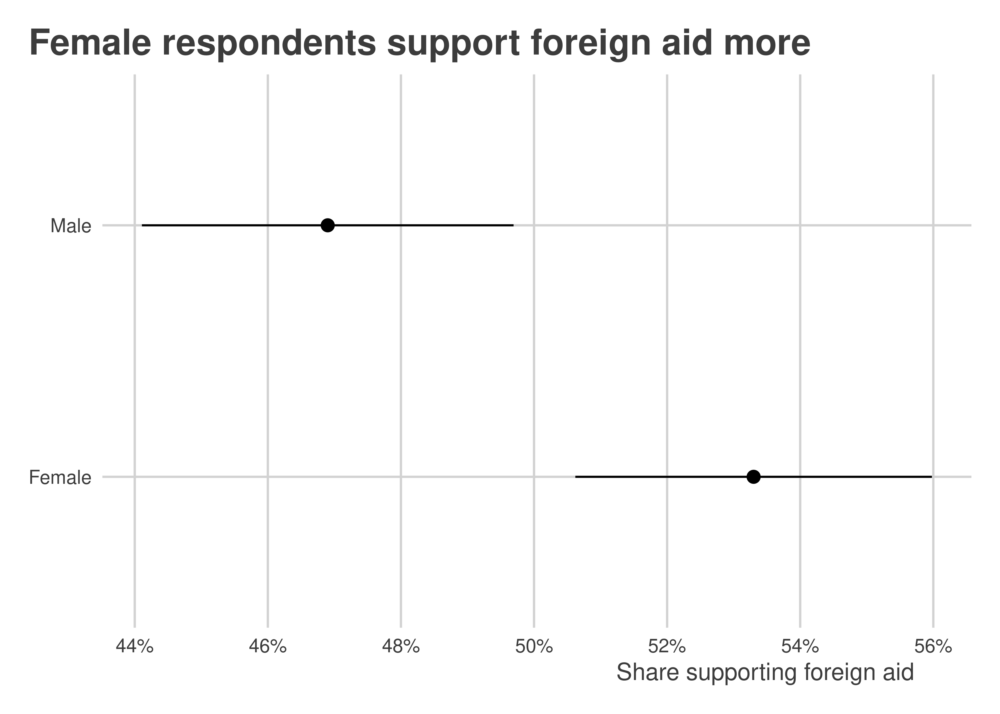
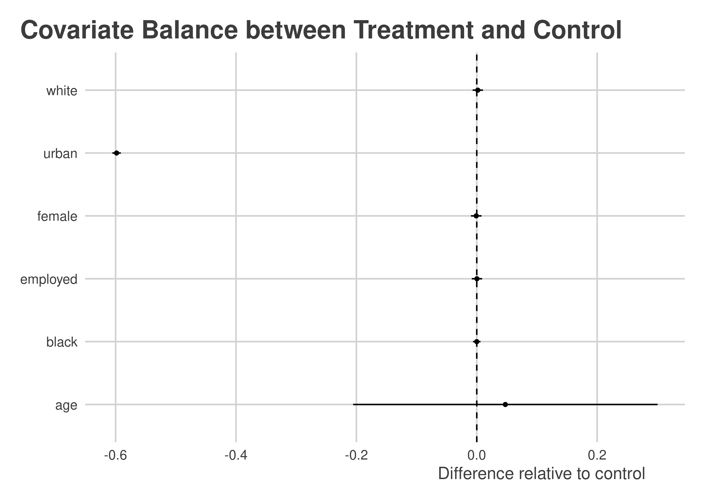
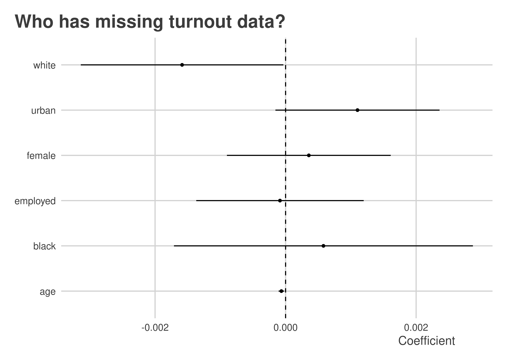

Randomized Experiments
================

-   <a href="#goals" id="toc-goals">Goals</a>
-   <a href="#why-randomized-experiments"
    id="toc-why-randomized-experiments">Why Randomized Experiments?</a>
-   <a href="#random-treatment-assignment-with-randomizr"
    id="toc-random-treatment-assignment-with-randomizr">Random Treatment
    Assignment with <code>{randomizr}</code></a>
    -   <a href="#simple-randomization" id="toc-simple-randomization">Simple
        randomization</a>
    -   <a href="#complete-randomization"
        id="toc-complete-randomization">Complete Randomization</a>
    -   <a href="#block-randomization" id="toc-block-randomization">Block
        Randomization</a>
    -   <a href="#cluster-assignment" id="toc-cluster-assignment">Cluster
        Assignment</a>
-   <a href="#the-ate" id="toc-the-ate">The ATE</a>
    -   <a href="#simple-and-complete-randomization"
        id="toc-simple-and-complete-randomization">Simple and complete
        randomization</a>
    -   <a href="#block-randomization-1" id="toc-block-randomization-1">Block
        randomization</a>
    -   <a href="#cluster-randomization" id="toc-cluster-randomization">Cluster
        randomization</a>
-   <a href="#the-itt-and-cate" id="toc-the-itt-and-cate">The ITT and
    CATE</a>
-   <a href="#checking-balance-and-nonrandom-attrition"
    id="toc-checking-balance-and-nonrandom-attrition">Checking Balance and
    (Non)Random Attrition</a>

## Goals

-   Randomized experiments provide the best way to make causal
    inferences.
-   The randomization process helps us avoid the problem of bias or
    confounding in our data.
-   We have lots of simple to use tools in R for doing randomization and
    estimating treatment effects.

You’ll need the following packages in your environment to follow along
with the notes:

    library(tidyverse)
    library(socsci)
    library(here)
    library(estimatr)
    library(randomizr)

## Why Randomized Experiments?

A randomized experiment is a **research design** that allows us to
obtain unbaised estimates of a treatment effect or other target
estimand. The randomization process, when done correctly, is the only
method we have in the social sciences to ensure that getting some
treatment or policy intervention is independent of both *observed* and
*unobserved* factors that might bias our analysis.

## Random Treatment Assignment with `{randomizr}`

There may be cases in your research where you aren’t directly
responsible for assigning treatment. You might outsource this task to
another partner organization, for example. But, in cases where you are
responsible for deciding what individuals or groups to assign to
treatment, you want to make sure you’re using reliable tools that will
be consistent and can give your results that others can replicate.

The `{randomizr}` package was created with all of this in mind. You can
read more about the package here:
<https://declaredesign.org/r/randomizr/>.

The package provides functions that make it easy to implement
randomization according to five different comment research designs:

-   Simple randomization
-   Complete randomization
-   Block randomization
-   Cluster randomization
-   Block cluster randomization

We’ll just focus on the first four.

For each of these kinds of randomization, we’re going simulate an
experiment based on some actual data:

    url <- "https://raw.githubusercontent.com/milesdwilliams15/Teaching/main/DPR%20201/Data/aidExperiment.csv"
    Data <- read_csv(url)

Take a glimpse at the data:

``` r
glimpse(Data)
```

    ## Rows: 1,289
    ## Columns: 12
    ## $ aid         <dbl> 1, 0, 1, 0, 0, 0, 1, 1, 1, 0, 0, 0, 1, 1, 1, 1, 1, 1, 1, 0…
    ## $ gender      <dbl> 0, 0, 1, 0, 0, 0, 1, 1, 1, 1, 0, 1, 0, 1, 1, 0, 1, 0, 0, 0…
    ## $ educ        <dbl> 3, 5, 3, 3, 3, 2, 3, 5, 5, 5, 5, 5, 2, 3, 6, 5, 2, 3, 6, 2…
    ## $ relimp      <dbl> 2, 4, 3, 3, 4, 2, 2, 1, 3, 1, 1, 4, 3, 3, 2, 1, 3, 1, 1, 3…
    ## $ treat_cash  <dbl> 0, 0, 0, 1, 1, 1, 1, 1, 0, 1, 1, 0, 1, 1, 1, 1, 0, 0, 1, 1…
    ## $ treat_black <dbl> 0, 1, 1, 0, 0, 1, 1, 0, 1, 1, 0, 0, 1, 1, 1, 0, 1, 1, 1, 1…
    ## $ loinc       <dbl> 1, 0, 0, 0, 0, 0, 0, 0, 0, 0, 0, 0, 0, 0, 0, 0, 0, 0, 0, 0…
    ## $ age         <dbl> 28, 37, 68, 55, 71, 69, 73, 58, 66, 43, 42, 40, 79, 59, 61…
    ## $ fullemploy  <dbl> 1, 1, 0, 1, 0, 0, 0, 0, 0, 1, 1, 1, 1, 0, 0, 1, 0, 1, 1, 1…
    ## $ ties3       <dbl> 0, 1, 2, 0, 0, 0, 0, 0, 1, 1, 0, 1, 1, 1, 2, 0, 0, 0, 1, 1…
    ## $ lib         <dbl> 1, 0, 0, 0, 0, 0, 0, 1, 1, 0, 0, 0, 0, 0, 1, 1, 0, 1, 1, 0…
    ## $ race3       <dbl> 1, 1, 3, 1, 1, 1, 1, NA, 1, 1, 1, 1, 1, 3, 1, 1, 1, 1, 1, …

There are some real treatments in this data, but we’ll ignore these for
now.

The data comes from [this
study](https://academic.oup.com/isq/article/64/1/133/5715658) published
in 2020 in *International Studies Quarterly* that looks at support for
foreign aid by the American public. The `aid` column equals “1” if an
individual supports a foreign aid project and “0” if they don’t. The
other columns provide some other background information about individual
respondents.

### Simple randomization

As the name implies, simple randomization involves just assinging each
individual in the data the same probability of getting treatment and
then letting a random number generate do its thing. The relevant
function is `simple_ra()`:

``` r
Data %>%
  mutate(
    simpleTr = simple_ra(N = n())
  ) -> Data
```

The thing about simple randomization is that we can end up, by random
chance, with unequally sized treatment and control groups:

``` r
table(Data$simpleTr)
```

    ## 
    ##   0   1 
    ## 655 634

Maybe that’s no big deal, but in some cases we may have fixed number of
available treatments. In this case, we need to use complete
randomization.

### Complete Randomization

We use `complete_ra()` for complete randomization:

``` r
Data %>%
  mutate(
    completeTr = complete_ra(N = n())
  ) -> Data
```

This approach will by default give us equal (or almost equal if our data
has an odd number of rows) treatment and control groups:

``` r
table(Data$completeTr)
```

    ## 
    ##   0   1 
    ## 645 644

If we want to control the number of individuals who get treatment, we
can just modify the `m =` command:

``` r
Data %>%
  mutate(
    completeTr = complete_ra(N = n(),
                             m = 500)
  ) -> Data
```

Now there are only 500 treated individuals:

``` r
table(Data$completeTr)
```

    ## 
    ##   0   1 
    ## 789 500

### Block Randomization

The beauty of randomized experiments is that in principle treatment
assignment is independent of observed and unobserved factors that might
bias our analysis. But in practice we can still get imballances between
treatment and control groups due purely to random chance. Maybe this is
no big deal, but it could be a problem if treated and nontreated
individuals also differ on a covariate that might influence the outcome
we’re interested in studying.

For example, if we look at the relationship between gender and support
for foreign aid, women are more likely than men to indicate that they
support foreign aid:

``` r
Data %>%
  group_by(gender) %>%
  mean_ci(aid) %>%
  ggplot() +
  aes(x = mean,
      xmin = mean - 1.39 * se,
      xmax = mean + 1.39 * se,
      y = ifelse(gender==1, "Female", "Male")) +
  geom_pointrange() +
  scale_x_continuous(
    labels = scales::percent,
    n.breaks = 6
  ) +
  labs(
    x = "Share supporting foreign aid",
    y = NULL,
    title = "Female respondents support foreign aid more"
  )
```



We might want to randomly assign treatment within blocks or strata
defined on gender to ensure we have equal numbers of treated male and
female respondents. We can do this with `block_ra()`:

``` r
Data %>%
  mutate(
    blockTr = block_ra(blocks = gender)
  ) -> Data
```

Check it out:

``` r
Data %>%
  group_by(gender) %>%
  count(blockTr)
```

    ## # A tibble: 4 × 3
    ## # Groups:   gender [2]
    ##   gender blockTr     n
    ##    <dbl>   <int> <int>
    ## 1      0       0   309
    ## 2      0       1   309
    ## 3      1       0   335
    ## 4      1       1   336

Compare this with complete random assignment:

``` r
Data %>%
  group_by(gender) %>%
  count(completeTr)
```

    ## # A tibble: 4 × 3
    ## # Groups:   gender [2]
    ##   gender completeTr     n
    ##    <dbl>      <int> <int>
    ## 1      0          0   389
    ## 2      0          1   229
    ## 3      1          0   400
    ## 4      1          1   271

We can also block randomize on multiple categories:

``` r
Data %>%
  mutate(
    blockTr = block_ra(blocks = paste(gender, race3))
  ) -> Data
```

### Cluster Assignment

Cluster assginemnt involves randomizing, not at the level of individuals
or within strata, but instead at the level of groups or clusters.

A classic example of a clustered design is an experiment involving
classrooms in a school. Some studies looking at the effect of curriculum
or teacher characteristics follow a clustered research design for
logistical reasons. It often is impossible to offer different students
in the same classroom different interventions. Instead, researchers will
have to assign different classrooms to different interventions.

The `cluster_ra()` function does cluster randomization. For the sake of
example, say we clustered treatment by education:

``` r
Data %>%
  mutate(
    clusterTr = cluster_ra(clusters = educ)
  ) -> Data
```

Notice that individuals in different education categories have either
all gotten treatment or all been assigned to the control condition:

``` r
Data %>%
  group_by(educ) %>%
  count(clusterTr)
```

    ## # A tibble: 6 × 3
    ## # Groups:   educ [6]
    ##    educ clusterTr     n
    ##   <dbl>     <int> <int>
    ## 1     1         1    42
    ## 2     2         0   467
    ## 3     3         1   296
    ## 4     4         1   122
    ## 5     5         0   228
    ## 6     6         0   134

It practice, clustering on education would make no sense, but for the
sake of showing how the function works, there you go.

We could also imagine that individuals who took our survey were from
different cities and we could only implement our intervention at the
level of cities, as would be the case with a public messaging
intervention for example:

``` r
Data %>%
  mutate(
    city = sample(LETTERS[1:10], n(), T),
    clusterTr = cluster_ra(clusters = city)
  ) -> Data
```

Check it out:

``` r
Data %>%
  group_by(city) %>%
  count(clusterTr)
```

    ## # A tibble: 10 × 3
    ## # Groups:   city [10]
    ##    city  clusterTr     n
    ##    <chr>     <int> <int>
    ##  1 A             1   122
    ##  2 B             0   145
    ##  3 C             1   122
    ##  4 D             0   125
    ##  5 E             0   117
    ##  6 F             0   134
    ##  7 G             1   134
    ##  8 H             1   115
    ##  9 I             0   136
    ## 10 J             1   139

## The ATE

For each one of these designs, we’ll estimate treatment effects. Since
we’ve included our treatments randomly to our data, after collecting
information about outcomes, the null hypothesis is technically true. So
in each of the following examples, we should expect to fail to reject
the null.

Different designs involve different estimation approaches. The rule of
thumb is to estimate relationships as you randomized.

### Simple and complete randomization

We can use `lm_robust()` like so with a simple randomization:

``` r
lm_robust(aid ~ simpleTr, data = Data)
```

    ##                Estimate Std. Error     t value      Pr(>|t|)    CI Lower
    ## (Intercept) 0.501529052 0.01956642 25.63213091 2.163118e-117  0.46314345
    ## simpleTr    0.001625522 0.02788860  0.05828627  9.535297e-01 -0.05308662
    ##               CI Upper   DF
    ## (Intercept) 0.53991466 1286
    ## simpleTr    0.05633766 1286

We can do exaclty the same with complete randomization:

``` r
lm_robust(aid ~ completeTr, data = Data)
```

    ##              Estimate Std. Error   t value      Pr(>|t|)    CI Lower  CI Upper
    ## (Intercept) 0.4784264 0.01780648 26.868111 1.406690e-126 0.443493465 0.5133593
    ## completeTr  0.0615736 0.02854586  2.157006  3.118999e-02 0.005572036 0.1175752
    ##               DF
    ## (Intercept) 1286
    ## completeTr  1286

### Block randomization

If we block randomized, we can technically apply the same approach as
above, but it is recommended that we instead calculate the averate
treatment effect *within* blocks. This technically is a weighted ATE.

The value of accounting for blocks in the analysis becomes increasingly
important to the extent that the blocks are of different sizes and
individuals within blocks had different probabilities of being assigned
to treatment.

The standard approach for some time has been to just add block fixed
effects:

``` r
lm_robust(aid ~ blockTr,
          fixed_effects = ~ gender,
          data = Data)
```

    ##           Estimate Std. Error    t value  Pr(>|t|)    CI Lower   CI Upper   DF
    ## blockTr -0.0187356 0.02783482 -0.6730995 0.5010051 -0.07334228 0.03587108 1285

But some research has shown that this approach can sometimes give us
inappropriate weights and actual bias our estimate of the ATE. Instead,
we can use a method called the Lin Estimator. This approach involves
*interacting* the treatment with blocks or strata after *mean centering*
them.

This can be an involved process, but `lm_lin()` function from
`{estimatr}` makes using the Lin Estimator easy:

``` r
lm_lin(aid ~ blockTr,
       covariates = ~ gender,
       data = Data)
```

    ##                      Estimate Std. Error     t value      Pr(>|t|)    CI Lower
    ## (Intercept)       0.511711050 0.01970426 25.96956378 7.479445e-120  0.47305497
    ## blockTr          -0.018735599 0.02784565 -0.67283752  5.011717e-01 -0.07336357
    ## gender_c          0.062951766 0.03944270  1.59603105  1.107279e-01 -0.01442744
    ## blockTr:gender_c  0.001310832 0.05573758  0.02351792  9.812408e-01 -0.10803589
    ##                    CI Upper   DF
    ## (Intercept)      0.55036713 1284
    ## blockTr          0.03589237 1284
    ## gender_c         0.14033097 1284
    ## blockTr:gender_c 0.11065756 1284

### Cluster randomization

When we use a cluster randomized design, we don’t need to add special
fixed effects, but we do need to change the way we calculate our
standard errors. The reason is that uncertainty that comes from random
assignment is not at the individual level but at the level of clusters.

That means that we want our standard errors to capture uncertainty, not
from shaking up which individuals got treatment, but instead by shaking
up which clusters got treatment. In our case, for the treatment we
assigned by cities, we would do the following:

``` r
lm_robust(aid ~ clusterTr, data = Data,
          clusters = city)
```

    ##                Estimate Std. Error   t value     Pr(>|t|)    CI Lower
    ## (Intercept)  0.51219512 0.01371360 37.349438 3.266312e-06  0.47402710
    ## clusterTr   -0.02010651 0.01951448 -1.030338 3.331740e-01 -0.06515599
    ##               CI Upper       DF
    ## (Intercept) 0.55036315 3.975432
    ## clusterTr   0.02494297 7.950303

## The ITT and CATE

Sometimes people don’t comply with our experimental designs. This can
influence the results of our studies, but under the right conditions, we
can adjust for noncompliance.

People can fall into one of four different categories:

-   Compliers: People that follow the treatment given.
-   Always-takers: People that always are treated no matter their
    assignment.
-   Never-takers: People that never are treated no matter their
    assignment.
-   Defiers: People that always do the opposite of what they are
    assigned.

Remember the get-out-the-vote experiment we talked about several weeks
ago:

``` r
url <- "https://raw.githubusercontent.com/milesdwilliams15/Teaching/main/DPR%20201/Data/GOTV_Experiment.csv"
gotv <- read_csv(url) 
glimpse(gotv)
```

    ## Rows: 50,000
    ## Columns: 9
    ## $ female              <dbl> 0, 1, 0, 1, 0, 0, 1, 0, 0, 0, 0, 0, 0, 0, 0, 0, 1,…
    ## $ age                 <dbl> 34, 37, 43, 45, 47, 45, 57, 20, 30, 25, 36, 27, 25…
    ## $ white               <dbl> 1, 0, 1, 1, 0, 1, 1, 1, 1, 0, 1, 0, 0, 1, 1, 0, 0,…
    ## $ black               <dbl> 0, 0, 0, 0, 1, 0, 0, 0, 0, 1, 0, 1, 0, 0, 0, 0, 1,…
    ## $ employed            <dbl> 1, 1, 1, 0, 1, 0, 1, 1, 0, 1, 1, 1, 1, 0, 1, 0, 1,…
    ## $ urban               <dbl> 1, 0, 0, 0, 0, 0, 1, 1, 0, 0, 0, 0, 0, 1, 1, 1, 1,…
    ## $ treatmentattempt    <dbl> 0, 1, 1, 1, 0, 1, 0, 0, 1, 1, 0, 1, 1, 0, 1, 0, 0,…
    ## $ successfultreatment <dbl> 0, 1, 1, 0, 0, 0, 0, 0, 0, 0, 0, 1, 1, 0, 1, 0, 0,…
    ## $ turnout             <dbl> 1, 0, 1, 0, 1, 1, 1, 0, 1, 0, 0, 0, 0, 0, 1, 0, 1,…

Not all individuals in the data who were randomly assigned to get a
get-out-the-vote phone call actually picked up the phone. To put a
precise number on it:

``` r
complied <- mean(gotv$successfultreatment[gotv$treatmentattempt==1])
complied
```

    ## [1] 0.7688753

That means that in the data we have a 77% compliance rate with the
treatment.

We can use this information to recover a special kind of causal estimate
called the compliers average treatment effect or CATE. To calculate it,
we first need to calculate something else called the intention to treat
effect or ITT.

The ITT is actaully calculated the same as the ATE, but since we know
that we have noncompliers in the data the estimate has a conceptually
different interpretation:

``` r
ITT <- coef(lm(turnout ~ treatmentattempt, gotv))[2]
ITT
```

    ## treatmentattempt 
    ##       0.07098882

The ITT is the product of a couple of different things: (1) the
compliance rate and (2) the CATE:


Using some simple algebra, we can take our known quantities of ITT and
the compliance rate *c* to recover the CATE estimate.


So in R we would just write:

``` r
CATE <- ITT / complied
CATE
```

    ## treatmentattempt 
    ##       0.09232814

We can get this same estimate using regression. Specifically,
*instrumental variables* regression. This approach involves a two-stage
process of arriving at the CATE. The function `iv_robust()` from
`{estimatr}` takes care of these steps for us. We just need to give it a
slightly different way of writing a formula than we’ve done up to now:

``` r
iv_robust(turnout ~ successfultreatment | treatmentattempt, 
          data = gotv)
```

    ##                       Estimate  Std. Error   t value     Pr(>|t|)   CI Lower
    ## (Intercept)         0.48467348 0.003176074 152.60146 0.000000e+00 0.47844834
    ## successfultreatment 0.09231023 0.005788652  15.94676 4.159227e-57 0.08096441
    ##                      CI Upper    DF
    ## (Intercept)         0.4908986 49740
    ## successfultreatment 0.1036561 49740

See how the coefficient for successfultreatment is identical to the one
we previously calculated.

Notice that this isn’t the same thing as just doing this:

``` r
lm_robust(turnout ~ successfultreatment,
          data = gotv)
```

    ##                      Estimate  Std. Error   t value      Pr(>|t|)  CI Lower
    ## (Intercept)         0.4742721 0.002857794 165.95741  0.000000e+00 0.4686707
    ## successfultreatment 0.1192421 0.004552561  26.19231 3.412514e-150 0.1103190
    ##                      CI Upper    DF
    ## (Intercept)         0.4798734 49740
    ## successfultreatment 0.1281652 49740

To show what’s going on here, I’ll use `lm()` and break the process
down. It involves two stages.

In stage 1, we first need to estimate the relationship between treatment
assignment and treatment compliance:

``` r
stage1_fit <- lm(successfultreatment ~ treatmentattempt, gotv)
```

There should be a significant relationship between the two:

``` r
summary(stage1_fit)
```

    ## 
    ## Call:
    ## lm(formula = successfultreatment ~ treatmentattempt, data = gotv)
    ## 
    ## Residuals:
    ##     Min      1Q  Median      3Q     Max 
    ## -0.7689  0.0000  0.0000  0.2311  0.2311 
    ## 
    ## Coefficients:
    ##                    Estimate Std. Error t value Pr(>|t|)    
    ## (Intercept)      -1.716e-15  1.893e-03     0.0        1    
    ## treatmentattempt  7.689e-01  2.671e-03   287.8   <2e-16 ***
    ## ---
    ## Signif. codes:  0 '***' 0.001 '**' 0.01 '*' 0.05 '.' 0.1 ' ' 1
    ## 
    ## Residual standard error: 0.2987 on 49998 degrees of freedom
    ## Multiple R-squared:  0.6236, Adjusted R-squared:  0.6236 
    ## F-statistic: 8.283e+04 on 1 and 49998 DF,  p-value: < 2.2e-16

In stage 2, we’ll do something clever. Rather than look at the
relationship between successful treatment and turnout, we’ll look at the
relationship between *predicted* successful treatment and turnout:

``` r
stage2_fit <- lm(turnout ~ predict(stage1_fit), gotv)
summary(stage2_fit)
```

    ## 
    ## Call:
    ## lm(formula = turnout ~ predict(stage1_fit), data = gotv)
    ## 
    ## Residuals:
    ##     Min      1Q  Median      3Q     Max 
    ## -0.5557 -0.4847  0.4443  0.4443  0.5153 
    ## 
    ## Coefficients:
    ##                     Estimate Std. Error t value Pr(>|t|)    
    ## (Intercept)         0.484673   0.003167  153.04   <2e-16 ***
    ## predict(stage1_fit) 0.092328   0.005812   15.88   <2e-16 ***
    ## ---
    ## Signif. codes:  0 '***' 0.001 '**' 0.01 '*' 0.05 '.' 0.1 ' ' 1
    ## 
    ## Residual standard error: 0.4983 on 49740 degrees of freedom
    ##   (258 observations deleted due to missingness)
    ## Multiple R-squared:  0.005048,   Adjusted R-squared:  0.005028 
    ## F-statistic: 252.3 on 1 and 49740 DF,  p-value: < 2.2e-16

This coefficient is identical to those we got before. Importantly, the
standard error from this approach is incorrect. The reason is that the
first-stage predictions used in the second-stage model are estimates.
That means that the classical OLS standard errors aren’t going to
capture all the relevant uncertainty in the data. Thankfully,
`iv_robust()` takes care of this for us and reports the correct standard
errors.

Another nice feature of the regression approach to estimating the CATE
is that it can accomodate controlling for covariates. For example:

``` r
iv_robust(turnout ~ successfultreatment + urban | treatmentattempt + urban, 
          data = gotv)
```

    ##                        Estimate  Std. Error    t value     Pr(>|t|)    CI Lower
    ## (Intercept)          0.52966399 0.005518537  95.979063 0.000000e+00  0.51884759
    ## successfultreatment  0.04842280 0.007313844   6.620704 3.611159e-11  0.03408758
    ## urban               -0.05639415 0.005625235 -10.025207 1.243799e-23 -0.06741967
    ##                        CI Upper    DF
    ## (Intercept)          0.54048038 49739
    ## successfultreatment  0.06275802 49739
    ## urban               -0.04536862 49739

Just note that you must include the same covariates on both sides of the
`|`.

## Checking Balance and (Non)Random Attrition

Sometimes in our studies, experiments break. This was certainly the case
in the GOTV experiment. A sign that something has gone wrong is when
treatment and control groups differ substantially on observed
covariates.

To assess balance quickly, we can get `lm_robust()` to tell us how much
our covariate differ by treatment. Notice the use of `cbind()` on the
left-hand side of the equation:

``` r
## First, regress each covariate on treatment assignment
lm_robust(cbind(female, age, white, 
                black, employed, urban) ~ treatmentattempt, 
          data = gotv) %>%
  ## tidy the results
  tidy() %>%
  filter(term != "(Intercept)") %>%
  ## plot
  ggplot() +
  aes(x = estimate,
      xmin = conf.low,
      xmax = conf.high,
      y = outcome) +
  geom_pointrange(size = .1) +
  geom_vline(xintercept = 0, lty = 2) +
  labs(x = "Difference relative to control",
       y = NULL,
       title = "Covariate Balance between Treatment and Control")
```



Wow! It looks like people in urban settings were unusually unlikely to
be in the treatment condition. If urban status is important for
predicting turnout (which it is), that’s a problem.

Attrition can be a problem in experiments, too. In this same experiment,
we have missing data for 258 individuals regarding whether they turned
out to vote. Is missingness correlated with other characteristics of
respondents? Yes, as a matter of fact. Both non-white and younger
respondents were more likely to have missing values for turnout. This
could also bias estimates for the effect of the GOTV campaign.

``` r
lm_robust(
  is.na(turnout) ~ female + age + white + black + employed + urban,
  data = gotv
) %>%
  tidy() %>%
  filter(term != "(Intercept)") %>%
  ggplot() +
  aes(x = estimate,
      xmin = conf.low,
      xmax = conf.high,
      y = term) +
  geom_pointrange(size = .1) +
  labs(x = "Coefficient",
       y = NULL,
       title = "Who has missing turnout data?") +
  geom_vline(xintercept = 0,
             lty = 2)
```


