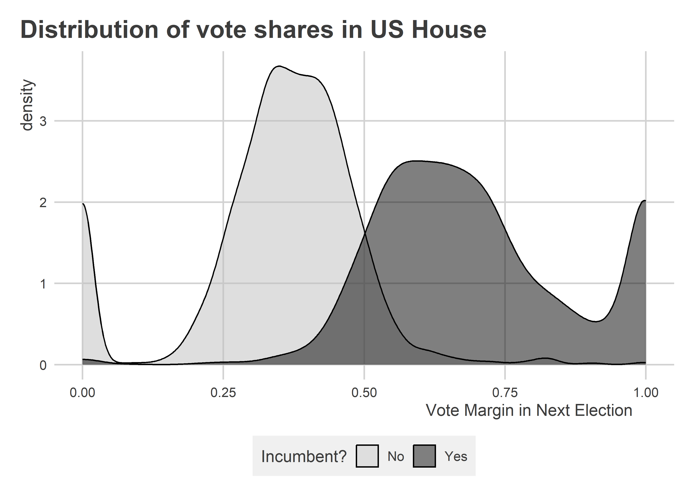
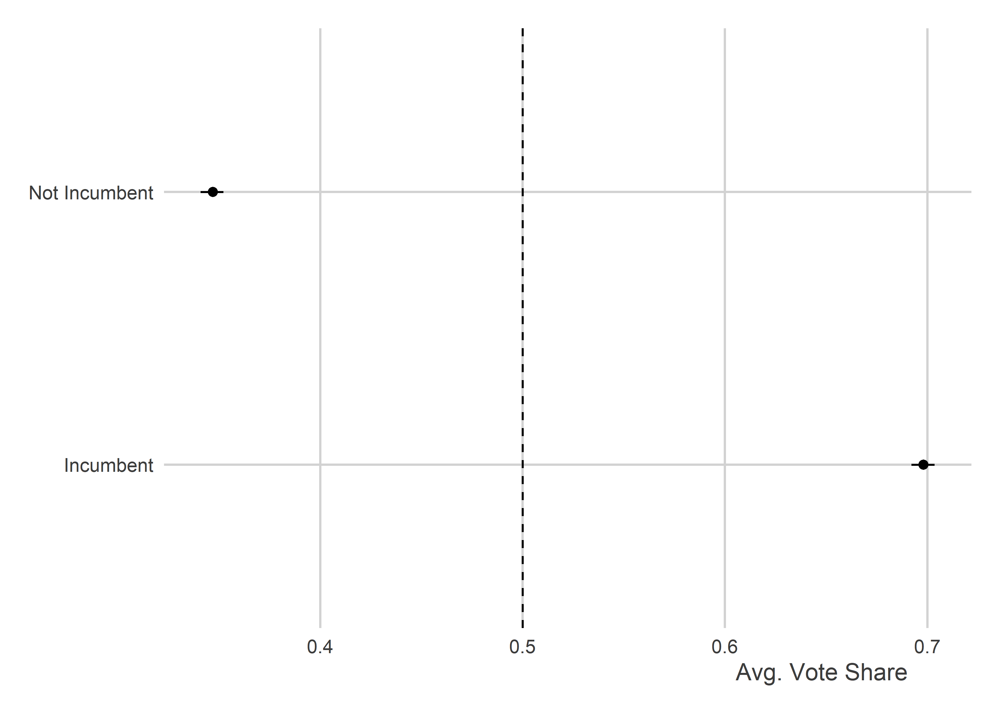
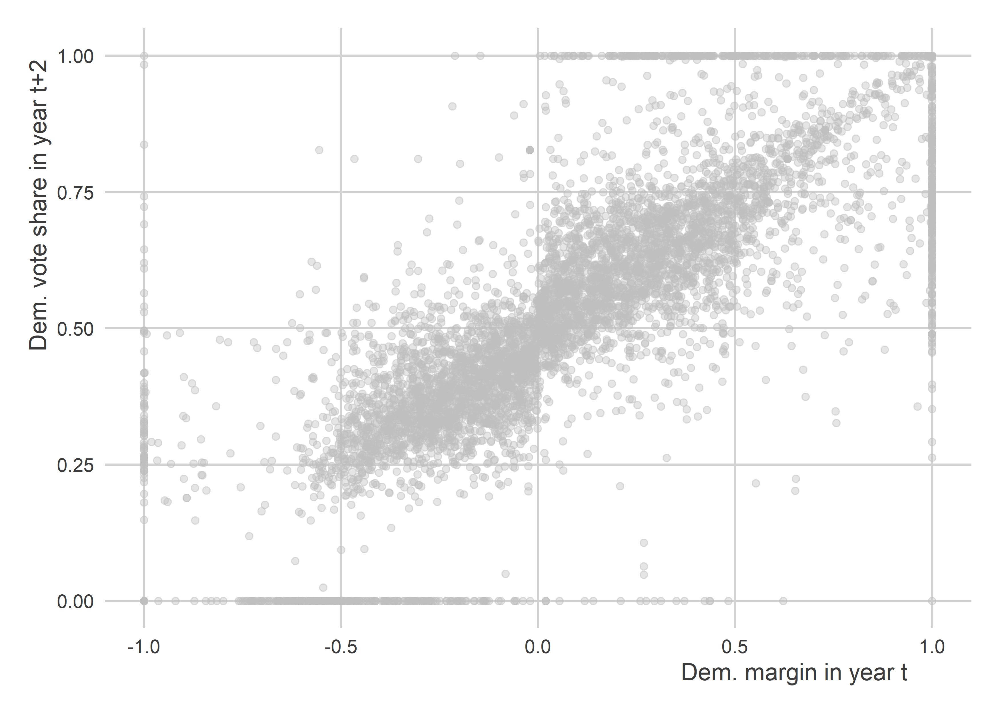
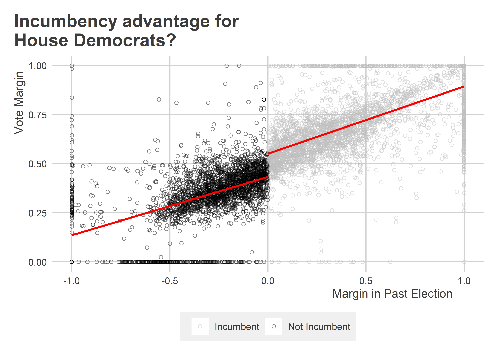
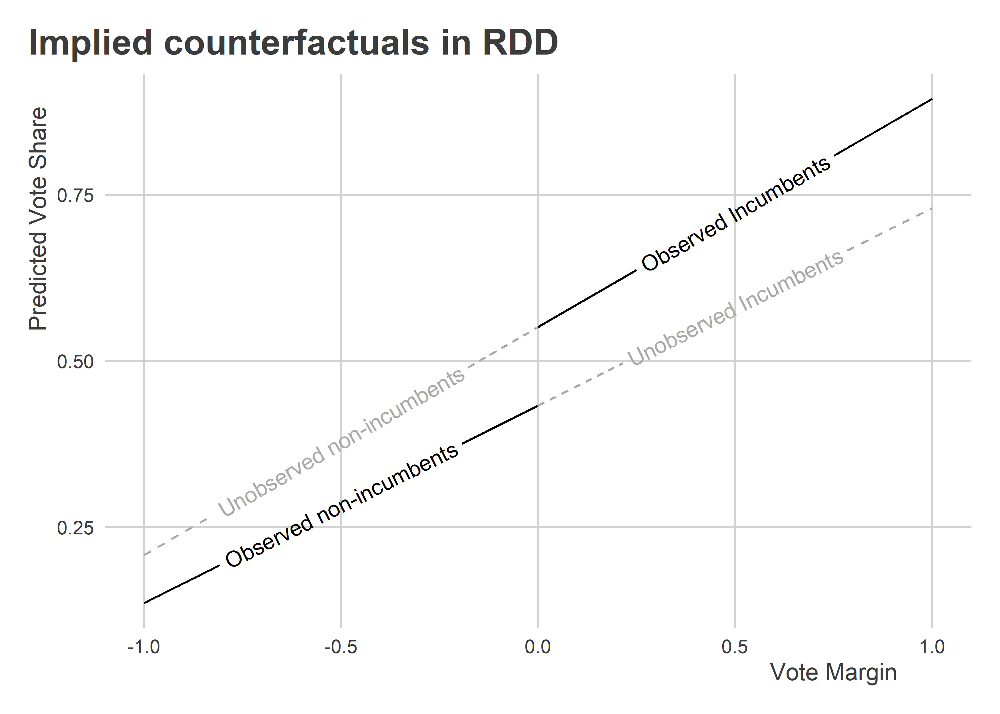
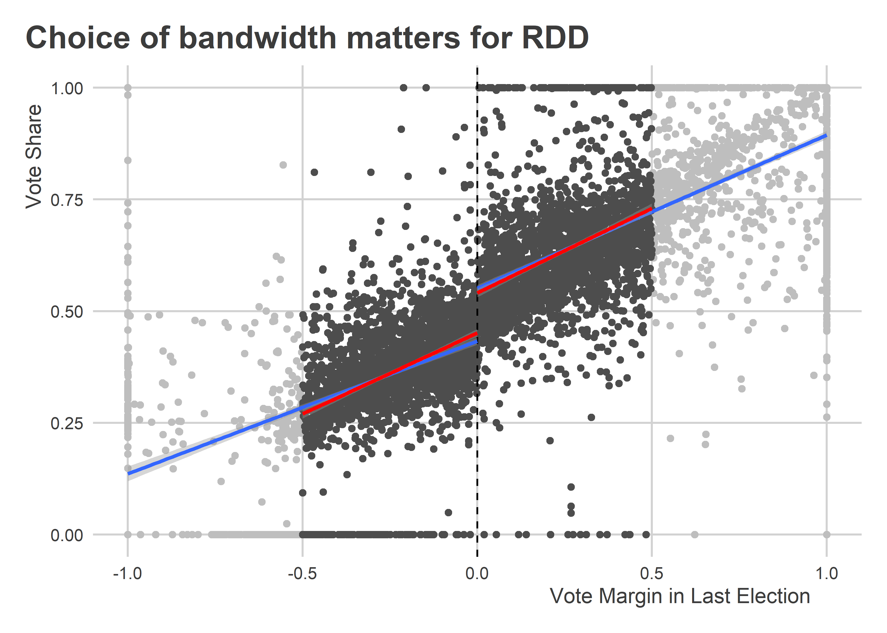
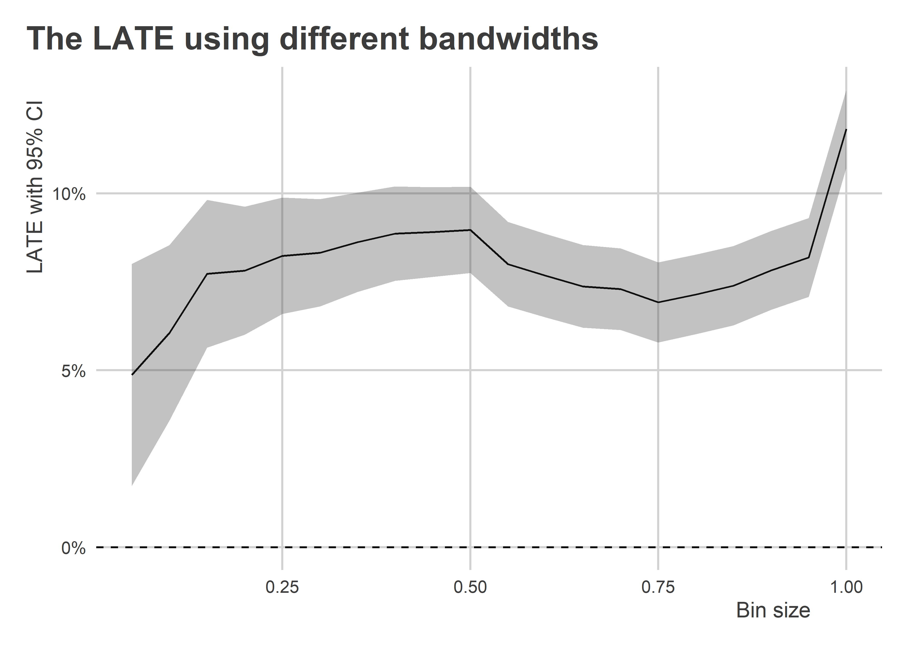
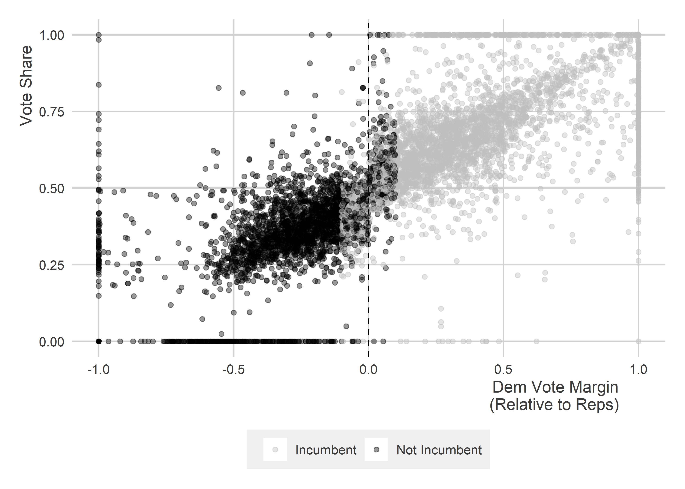

Regression Discontinuity Designs
================

-   [Goals](#goals)
-   [What we need for a regression discontinuity design or
    RDD](#what-we-need-for-a-regression-discontinuity-design-or-rdd)
-   [Implementing an RDD](#implementing-an-rdd)
-   [Special considerations](#special-considerations)
    -   [What are the counterfactuals in a
        RDD?](#what-are-the-counterfactuals-in-a-rdd)
    -   [Bandwidth: Bias vs. precision](#bandwidth-bias-vs-precision)
    -   [Continuity at the threshold](#continuity-at-the-threshold)
    -   [Fuzzy RDDs](#fuzzy-rdds)

## Goals

-   Controlling for covariates in a selection on observables or SOO
    design using a multiple regression model is one way to recover
    causal estimates from non-experiments.
-   But SOO designs are notoriously susceptible to omitted variable bias
    and a host of other challenges.
-   However, in some settings we can exploit certain facts about how
    data were generated to make more reliable causal inferences.
-   One such approach is to use a discontinuity in some data to estimate
    a local average treatment effect or LATE.
-   When we do this, we are using a *regression discontinuity design* or
    RDD.

Packages you need:

    library(tidyverse)
    library(socsci)
    library(estimatr)
    library(texreg)
    library(coolorrr)
    set_theme()
    set_palette(
      binary = c("gray", "black"), 
      from_coolors = F
    )

## What we need for a regression discontinuity design or RDD

To implement an RDD to answer a causal question, we need just a few
basic things:

-   An outcome
-   A treatment
-   A running variable that determines treatment

Let’s use some example data from a paper published by Lee (2008) to test
whether U.S. House members enjoy an incumbency advantage. To access it,
you’ll need to install `{rddtools}`.

``` r
library(rddtools)
data(house) #Lee data
head(house)
```

    ##         x      y
    ## 1  0.1049 0.5810
    ## 2  0.1393 0.4611
    ## 3 -0.0736 0.5434
    ## 4  0.0868 0.5846
    ## 5  0.3994 0.5803
    ## 6  0.1681 0.6244

The dataset has two columns, x and y, that correspond to the Democratic
vote margin in year *t* (column x) and the Democratic vote share in year
*t+2* (column y). If x \< 0, then a candidate lost the previous
election. If x \>= 0, then a candidate won the last election and, hence,
is an incumbent.

If we just do a simple comparison of future election performance based
on incumbency we can clearly see that incumbents also tend to have a
larger vote share in future elections:

``` r
ggplot(house) +
  aes(x = y) +
  geom_density(
    aes(fill = ifelse(x < 0, "No", "Yes")),
    alpha = 0.5
  ) +
  labs(
    x = "Vote Margin in Next Election",
    fill = "Incumbent?",
    title = "Distribution of vote shares in US House"
  ) +
  ggpal("binary", "fill")
```



The difference is actually quite staggering:

``` r
house %>%
  mutate(
    incumbent = ifelse(x < 0, "Not Incumbent", "Incumbent")
  ) %>%
  group_by(incumbent) %>%
  mean_ci(y) %>%
  ggplot() +
  aes(x = mean,
      xmin = lower,
      xmax = upper,
      y = incumbent) +
  geom_pointrange(
    size = .3
  ) +
  geom_vline(
    xintercept = 0.5,
    lty = 2
  ) +
  labs(
    x = "Avg. Vote Share",
    y = NULL
  )
```



To put an even finer point on it:

``` r
lm_robust(y ~ (x > 0),
          data = house) %>%
  screenreg(
    include.ci = F,
    digits = 3,
    custom.coef.names = c("Intercept", "Incumbency")
  )
```

    ## 
    ## ========================
    ##             Model 1     
    ## ------------------------
    ## Intercept      0.347 ***
    ##               (0.003)   
    ## Incumbency     0.351 ***
    ##               (0.004)   
    ## ------------------------
    ## R^2            0.517    
    ## Adj. R^2       0.517    
    ## Num. obs.   6558        
    ## RMSE           0.168    
    ## ========================
    ## *** p < 0.001; ** p < 0.01; * p < 0.05

The above implies that incumbency confers an additional 35.1 percentage
point boost in vote share.

Can this be? Does incumbency really have such a strong effect?

While there may indeed by an incumbency advantage, the above analysis is
insufficient for drawing this inference. For starters, what might appear
like an incumbency advantage could actually just be a reflection of an
enduring voting pattern in a congressional district.

After all, the previous election margin in a given district is a good
predictor of the margin in the next election:

``` r
ggplot(house) +
  aes(x = x, y = y) +
  geom_point(
    alpha = 0.4,
    color = "gray"
  ) +
  labs(
    x = "Dem. margin in year t",
    y = "Dem. vote share in year t+2"
  ) 
```



Can you see how this might give us some issues in testing incumbency
advantage? How do we adjust for this to determine if there’s something
extra special about incumbency?

Enter RDD. Say incumbency is our *treatment* variable and vote share in
an election is our *outcome*. We can use the previous election vote
margin as our running variable and the 0 cutoff as the discontinuity. We
can then see if incumbents get an extra bump in performance by virtue of
incumbency at the 0 cutoff.

The idea is that candidates that lose an election by one percentage
point or less are probably pretty similar to candidates that win by no
more than one percentage point. That means that we can make an
apples-to-apples comparison between House candidates near this
threshold, because presumably the factors that got one candidate past
the threshold (and not another) are pretty random and idiosyncratic.
Anything from the weather, to a bad day at work, or an unusually long
line at the ballot box could marginally affect voter turnout. This makes
getting treatment (winning an election in one year and thus getting an
incumbency advantage in the next election) plausibly random at the 0
percentage point vote margin.

Put that all together, and we have all the ingredients for a RDD recipe:

-   Outcome: vote share in an election
-   Treatment: incumbency
-   Running variable that determines treatment: previous election vote
    margin

## Implementing an RDD

The idea with an RDD is to find a way to estimate the *local average
treatment effect* or LATE. The RDD design is powerful because we can use
it to find a space in the data where treatment assignment is plausibly
random. The limitation, though, is that this location in the data is
usually relevant for only a small proportion of the full dataset. As a
result we can only estimate the average treatment effect or ATE for
observations close or *local* to the discontinuity.

Our tool of choice for doing this is the same as our preferred tool for
controlling for confounders in an SOO design: multiple regression. But,
while the tool is the same, how we specify our linear model and
interpret the results will be different because of what we know about
the data-generating process.

What we generally want to do is estimate the effect of the treatment
right at the point of the discontinuity. To do that, we need to use an
*interaction* between a treatment indicator and the running variable.
And ideally our running variable will be set so it equals zero at the
point of the discontinuity.

In the case of the House incumbency data, our regression model will be
specified as:

 + \epsilon_{it+2}
")

The estimate that we get for

will be the LATE for incumbency advantage. The reason is that when we
estimate a regression model with an interaction or *multiplicative* term
(e.g., the incumbent indicator is multiplied by the previous election
vote margin), the interpretation of the model coefficients all have very
special, conditional interpretations.

-   :
    More than just the average difference in vote share due to
    incumbency, this is precisely the estimated vote share when the vote
    margin is strictly equal to 0.
-   :
    More than just the difference in vote share per a unit increase in
    the vote margin in the previous election, this is the difference
    exclusively for all observations without an incumbency advantage.
-   :
    This is the change to
    
    per a unit increase in the previous election vote margin. This is
    also the change to
    
    when observations are incumbents.

The idea may be clearer by visualizing the data. The end result of this
process is to essentially give us two different regression slopes with
different intercepts per the incumbency cutoff:

``` r
ggplot(house) +
  aes(x = x, y = y) +
  geom_point(
    aes(color = ifelse(x < 0, 
                      "Not Incumbent", 
                      "Incumbent")),
    shape = 21,
    alpha = 0.5
  ) +
  geom_smooth(
    method = lm,
    aes(group = x < 0), 
    se = F,
    color = "red"
  ) +
  ggpal("binary") +
  labs(
    x = "Margin in Past Election",
    y = "Vote Margin",
    color = NULL,
    title = "Incumbency advantage for\nHouse Democrats?"
  ) 
```



The jump from the line to the left of the discontinuity to the line to
the right of the discontinuity is
.

To calculate the LATE, we just need to use a multiple regression model
with an interaction between the incumbency “treatment” and the previous
election vote margin. The below code adds a treatment column to the data
then estimates a multiplicative model using `lm_robust()`:

``` r
## Add treatment column (1 = treated, 0 = otherwise)
house$tr <- (house$x>0)+0

## Estimate the model
rdd_fit <- lm_robust(
  y ~ tr * x, data = house
)

## Show the results
screenreg(rdd_fit,
          include.ci = F,
          digits = 3)
```

    ## 
    ## =========================
    ##              Model 1     
    ## -------------------------
    ## (Intercept)     0.433 ***
    ##                (0.004)   
    ## tr              0.118 ***
    ##                (0.006)   
    ## x               0.297 ***
    ##                (0.016)   
    ## tr:x            0.046 *  
    ##                (0.018)   
    ## -------------------------
    ## R^2             0.671    
    ## Adj. R^2        0.671    
    ## Num. obs.    6558        
    ## RMSE            0.138    
    ## =========================
    ## *** p < 0.001; ** p < 0.01; * p < 0.05

Instead of writing `tr + x` the above code is written as `tr * x`. This
form tells R that it should estimate the interaction of the variables in
addition to the *lower order* terms. For clarity:

}^\text{Second order term} + \epsilon_{it+2}
")

If we wanted to be more explicit about this, we could instead write the
formula in R like so:

    lm_robust(y ~ tr + x + tr:x, data = house)

The estimated LATE for incumbency is more modest than implied by the
more naive approach we took earlier by just looking at the average
difference in vote share between incumbents and non-incumbents. Our
estimate from the RDD tells us that the LATE equals 0.118. That means
that incumbency confers a 11.8 percentage point boost to electoral
performance for candidates close to the 0 percentage point vote margin.
This estimate is also statistically significant with a p-value less than
0.001, so we can reject the null hypothesis that the LATE is zero.

## Special considerations

The RDD approach to causal inference is a handy tool. But just like any
tool, it should be used responsibly. So before you go out into the world
thinking about how you can start applying the RDD willy nilly, there are
some things you need to consider.

### What are the counterfactuals in a RDD?

Underneath the RDD regression estimates are a set of implied
counterfactuals. In particular:

``` r
library(geomtextpath)
ggplot() +
  geom_textline(
    data = house %>% filter(tr==0),
    aes(x, predict(rdd_fit, house %>% filter(tr==0))),
    label = "Observed non-incumbents"
  ) +
  geom_textline(
    data = house %>% filter(tr==1),
    aes(x, predict(rdd_fit, house %>% filter(tr==1))),
    label = "Observed Incumbents"
  ) +
  geom_textline(
    data = house %>% filter(tr==0),
    aes(x, predict(rdd_fit, house %>% filter(tr==0) %>%
                     mutate(tr = 1))),
    label = "Unobserved non-incumbents",
    linetype = 2,
    color = "darkgray"
  ) +
  geom_textline(
    data = house %>% filter(tr==1),
    aes(x, predict(rdd_fit, house %>% filter(tr==1) %>%
                     mutate(tr = 0))),
    label = "Unobserved Incumbents",
    linetype = 2,
    color = "darkgray"
  ) +
  labs(
    x = "Vote Margin",
    y = "Predicted Vote Share",
    title = "Implied counterfactuals in RDD"
  )
```



As you can see, the above shows that the treatment effect of incumbency
is non-constant. This doesn’t really matter for the LATE we estimated,
but it does matter for our ability to generalize beyond the point of the
discontinuity. You should always be careful about interpreting the LATE
and avoid making claims that go beyond what you can support with your
data.

### Bandwidth: Bias vs. precision

For many running variables, it is not always obvious how far out from
the point of the discontinuity we should go when considering what
observations to include in our analysis. The example above used all of
the data, but that also means that the pre- and post-discontinuity
slopes are influenced by observations that fall very far from the
discontinuity itself. That can possibly bias our estimate of the LATE.

Sometimes we may think it’s a good idea to limit our “bandwidth” or
“binwidth.” So, we may truncate our sample so that we drop observations
beyond a certain distance from the discontinuity. Say we did so with the
house data by only looking at margins +/- 25 percentage points from the
incumbency threshold:

``` r
ggplot(house) +
  aes(x = x,
      y = y) +
  geom_point(
    color = "gray"
  ) +
  geom_point(
    data = house %>% filter(between(x, -0.5, 0.5)),
    color = "gray30"
  ) +
  geom_vline(
    xintercept = 0,
    lty = 2
  ) +
  geom_smooth(
    method = lm,
    aes(group = tr)
  ) +
  geom_smooth(
    method = lm,
    data = house %>% filter(between(x, -0.5, 0.5)),
    aes(group = tr),
    color = "red"
  ) +
  labs(
    x = "Vote Margin in Last Election",
    y = "Vote Share",
    title = "Choice of bandwidth matters for RDD"
  )
```



Using the alternative bandwidth for the data, we get a slightly smaller
estimate of the LATE:

``` r
rdd_fit2 <- lm_robust(
  y ~ tr * x, data = house %>% filter(between(x, -0.5, 0.5))
)

## Show the results
screenreg(list(rdd_fit, rdd_fit2),
          include.ci = F,
          digits = 3)
```

    ## 
    ## =======================================
    ##              Model 1       Model 2     
    ## ---------------------------------------
    ## (Intercept)     0.433 ***     0.451 ***
    ##                (0.004)       (0.004)   
    ## tr              0.118 ***     0.090 ***
    ##                (0.006)       (0.006)   
    ## x               0.297 ***     0.362 ***
    ##                (0.016)       (0.018)   
    ## tr:x            0.046 *       0.016    
    ##                (0.018)       (0.026)   
    ## ---------------------------------------
    ## R^2             0.671         0.551    
    ## Adj. R^2        0.671         0.551    
    ## Num. obs.    6558          4900        
    ## RMSE            0.138         0.125    
    ## =======================================
    ## *** p < 0.001; ** p < 0.01; * p < 0.05

However, before you’re tempted to apply the most narrow bandwidth
possible to the data, limiting the sample like this comes at a cost.
Because we’re dropping data points from the analysis, we end up losing
statistical precision. That means the narrower and narrower our
bandwidth, the wider and wider our standard errors are going to get. The
below code iterates over a bunch of different bandwidth and then plots
the estimated LATE with its 95% CI:

``` r
# vector of binwidths:
bin_sizes <- seq(0.05, 1, by = 0.05)

# estimate the RDD for each binwidth:
bin_sizes %>%
  map_dfr(
    ~ lm_robust(y ~ tr * x,
                data = house %>%
                  filter(between(x, -.x, .x))) %>%
      tidy() %>%
      filter(term == "tr") %>%
      mutate(
        bin = .x
      )
  ) -> results

# plot the results:
ggplot(results) +
  aes(x = bin,
      y = estimate,
      ymin = conf.low,
      ymax = conf.high) +
  geom_line() +
  geom_ribbon(
    alpha = 0.3
  ) +
  geom_hline(
    yintercept = 0,
    lty = 2
  ) +
  labs(
    x = "Bin size",
    y = "LATE with 95% CI",
    title = "The LATE using different bandwidths"
  ) +
  scale_y_continuous(
    labels = scales::percent
  )
```



Clearly as we truncate the data closer to the point of the
discontinuity, our estimate of the LATE of incumbency shrinks. When we
get to a bandwidth of +/- 5 percentage points, the LATE is half the size
of the original estimate we got using the full dataset.

At the same time that narrowing the bandwidth attenuates the estimate of
the LATE, it also leads to an inflation of our statistical uncertainty.
As the bandwidth shrinks, we estimate the LATE with less and less
statistical precision.

### Continuity at the threshold

The validity of RDD hinges on the conceit that observations at the point
of the discontinuity offer us apples-to-apples comparisons. This only
works provided the discontinuity in the running variable doesn’t also
influence other baseline characteristics of the units being studied.

In some real world cases, crossing the running variable threshold might
be linked to a change in “treatment” status along a host of dimensions;
not just one. That makes it hard to identify the causal effect of a
single treatment since multiple things change about the status of
observations at the point of discontinuity.

When you apply a RD design, you’ll need to do the work necessary to
ensure continuity at the threshold plausibly holds. If it doesn’t, then
you won’t be able to claim that you’re making apples-to-apples
comparisons at the threshold.

### Fuzzy RDDs

When we talked about randomized experiments, we discussed treatment
compliance. Ideally, when individuals are assigned to treatment they
will take the treatment. But that isn’t always the case. When it isn’t,
just like we needed to take an instrumental variables approach in our
experimental design, we need to do the same in our RD design.

When treatment is assigned perfectly at the discontinuity, we say we
have a *sharp* RDD. But when it isn’t, say some people past the
discontinuity aren’t treated and some before it are, we have a *fuzzy*
RDD.

Let’s imagine a world where, somehow, third parties are more prevalent
and competitive in US politics. They don’t dominate, but they’re
prevalance is such that using the 0 margin threshold for congressional
data no longer offers a sharp discontinuity in incumbency status. We can
simulate this by randomizing tr for a narrow bandwidth of observations
near the original discontinuity in the data:

``` r
house %>%
  group_split(
    between(x, -0.1, 0.1)
  ) -> fuzzy_house
fuzzy_house[[2]]$tr <- sample(fuzzy_house[[2]]$tr)
fuzzy_house <- bind_rows(fuzzy_house)
```

Now, if we plot it:

``` r
ggplot(fuzzy_house) +
  aes(x = x, 
      y = y, 
      color = ifelse(tr==1, "Incumbent", "Not Incumbent")) +
  geom_point(
    alpha = 0.4
  ) +
  ggpal("binary") +
  geom_vline(
    xintercept = 0,
    lty = 2
  ) +
  labs(
    x = "Dem Vote Margin\n(Relative to Reps)",
    y = "Vote Share",
    color = NULL
  )
```



We can clearly see that treatment is no longer perfectly determined by
the running variable.

Here’s how we can recover an estimate of the LATE using a fuzzy RDD:

``` r
## Use iv_robust
fuzzy_fit <- iv_robust(
  y ~ tr * x | (x > 0) * x,
  data = fuzzy_house
)

## Check with "naive" sharp RDD
sharp_fit <- lm_robust(
  y ~ tr * x,
  data = fuzzy_house
)

## Compare
screenreg(
  list(fuzzy_fit, sharp_fit),
  include.ci = F,
  digits = 3
)
```

    ## 
    ## =======================================
    ##              Model 1       Model 2     
    ## ---------------------------------------
    ## (Intercept)     0.383 ***     0.460 ***
    ##                (0.007)       (0.004)   
    ## tr              0.210 ***     0.071 ***
    ##                (0.011)       (0.006)   
    ## x               0.198 ***     0.357 ***
    ##                (0.020)       (0.016)   
    ## tr:x            0.085 ***     0.017    
    ##                (0.018)       (0.018)   
    ## ---------------------------------------
    ## R^2             0.625         0.657    
    ## Adj. R^2        0.624         0.657    
    ## Num. obs.    6558          6558        
    ## RMSE            0.148         0.141    
    ## =======================================
    ## *** p < 0.001; ** p < 0.01; * p < 0.05

You can see that using a standard regression approach yields a downward
bias in the effect of incumbency.

The idea with the instrumental variables approach is to use the
discontinuity threshold as the *instrumental variable* for the
treatment. You then use the predicted likelihood of treatment as your
causal variable rather than the treatment itself.
