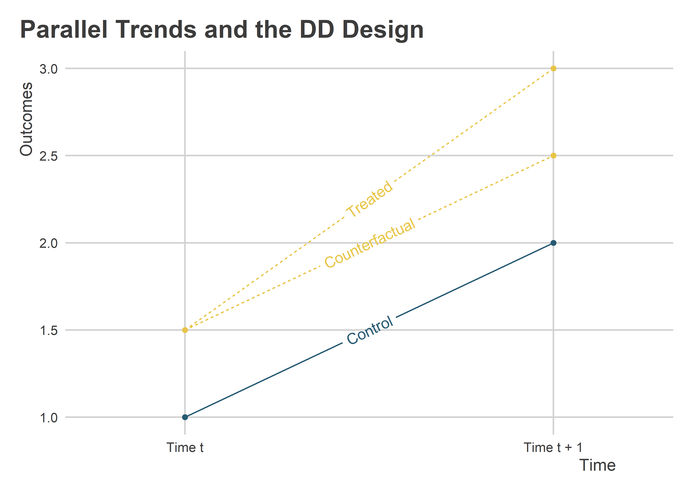
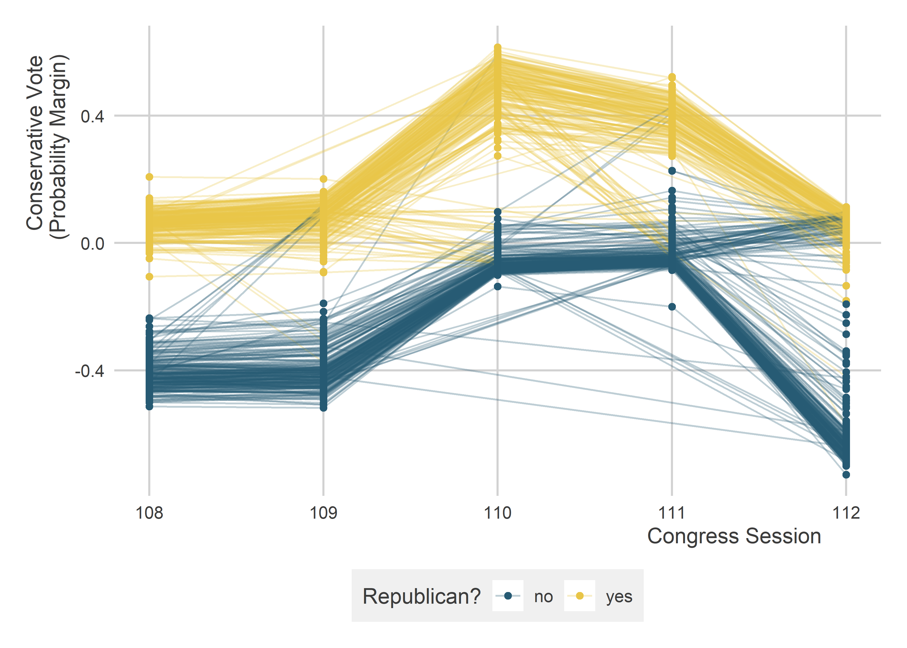

Difference-in-Differences Designs
================

-   [Goals](#goals)
-   [Counterfactuals in a DD Design](#counterfactuals-in-a-dd-design)
-   [The Standard DD Design](#the-standard-dd-design)
-   [The Generalized DD Design](#the-generalized-dd-design)
-   [Checking Pre-Trends](#checking-pre-trends)

## Goals

-   When treatment status changes over time for some observations but
    not others, we can possibly use a *difference-in-differences* or DD
    design.
-   DD designs let us control for all non-time-varying confounders.
-   But, DD designs require some assumptions to be met.

What you’ll need to run the code in these notes:

``` r
library(tidyverse)
library(geomtextpath)
library(coolorrr)
library(estimatr)
library(texreg)
set_theme()
set_palette()
```

## Counterfactuals in a DD Design

The DD design has a lot in common with the regression discontinuity or
RD design. The main difference is that when we get to the discontinuity
in the running variable, some units receive treatment but others do not.

This kind of design is helpful if we want to know whether some policy
affected outcomes. Whether the unit of observation is a city, US state,
or a country, if we can find some places that implemented a policy and
others that didn’t, we can compare outcomes pre- and post-policy change
using places that didn’t implement the change as our “control” group.

The *difference-in-differences* part of the design comes from the fact
that we use the trends in an outcome of interest per some running
variable for both units that get treatment and those that don’t,
calculate the difference in outcomes for both groups at the point that
the treated units actually get treatment, and then use the difference in
the differences as our estimate of the treatment effect.

Here’s a data visualization (and the code to produce it) to illustrate:

``` r
dd_data <-
  tibble(
    x = c(1, 2, 1, 2, 1, 2),
    y = c(1, 2, 1.5, 3, 1.5, 2.5),
    tr = c("No", "No", "Yes", "Yes", "Yes", "Yes"),
    label = c("Control", "Control", "Treated", "Treated",
              "Counterfactual", "Counterfactual")
  )
ggplot(dd_data) +
  aes(
    x = x,
    y = y,
    color = tr,
    label = label
  ) +
  geom_point(
    show.legend = F
  ) +
  geom_textline(
    aes(
      linetype = tr, 
      group = label
    ),
    show.legend = F
  ) +
  ggpal() +
  scale_x_continuous(
    breaks = 1:2,
    labels = c("Time t", "Time t + 1"),
    limits = c(0.75, 2.25)
  ) +
  labs(
    x = "Time",
    y = "Outcomes",
    title = "Parallel Trends and the DD Design"
  )
```



The idea is that at time *t*, all units are untreated. But at *t + 1*
some get treatment and others don’t. The difference in the change from
*t* to *t + 1* between treated and control units at *t + 1* is our
estimate of the treatment effect.

To put it more formally, our DD design helps us to arrive at the
following estimate:

First, calculate the difference for the control group:

> *D0 = Y0(t + 1) - Y0(t)*

Then, calculate the difference for the treated group:

> *D1 = Y1(t + 1) - Y1(t)*

Finally, calculate the difference in the differences:

> *DD = D1 - D0*

This difference in the differences rather than the raw difference
between treatment and control is our estimate of the treatment effect.
This approach helps us to account for background characteristics of
units that might otherwise explain outcomes.

## The Standard DD Design

The classical DD design involves a study where we have some treated
units, some untreated units, and two time periods (one pre-treatment and
the other post-treatment).

We can simulate a simple example:

``` r
t  <- 0:1
Y0 <- rnorm(100) + t
Y1 <- 1 + rnorm(100) + t*1.75
dt <- tibble(
  Y = c(Y0, Y1),
  D = rep(0:1, each = 100)* (t == 1),
  t = rep(t, len = 200),
  i = rep(1:100, each = 2)
)
```

To get the DD estimate, we can use a regression framework to regress the
outcome on treatment status with *fixed effects* for the time period (t
= 0 or t = 2) and the individual unit of observation (i = 1, 2, 3,
etc.). This approach helps us to adjust for:

1.  Time-invariant background characteristics of individuals that might
    influence outcomes
2.  The average trend in outcomes for all units

Using `lm_robust()`, we can implement it like this:

``` r
dd_fit <- lm_robust(
  Y ~ D,
  data = dt,
  fixed_effects = ~ i + t
)
screenreg(dd_fit, include.ci = F)
```

    ## 
    ## ====================
    ##            Model 1  
    ## --------------------
    ## D            0.86 **
    ##             (0.28)  
    ## --------------------
    ## R^2          0.73   
    ## Adj. R^2     0.46   
    ## Num. obs.  200      
    ## RMSE         0.98   
    ## ====================
    ## *** p < 0.001; ** p < 0.01; * p < 0.05

In our simulate, the true *DD = 0.75*. The estimate we obtain from the
above is pretty close: 0.86.

Our text talks about a couple of other approaches for arriving at this
same estimate. However, these approaches have limited applicability
since they only will work in the the classic DD design setup with
multiple units of observation but only two periods. The regression
framework applied above, however, easily generalizes to cases with more
than just two periods.

## The Generalized DD Design

When we’re dealing with data that has more than a couple time periods
corresponding with the timing of treatment, we use what’s called a
*generalized DD design*, so called because we’re generalizing the design
to be more flexible to different kinds of data.

The approach is quite similar the regression framework applied above,
but with a few key considerations. To illustrate, let’s look at some US
Congressional data. You can read more about it here:
[README](https://github.com/milesdwilliams15/Teaching/blob/main/DPR%20201/Data/Files%20for%20Data%20Exercises/13_README.txt)

``` r
congress_dt <- read_csv(
  "https://raw.githubusercontent.com/milesdwilliams15/Teaching/main/DPR%20201/Data/CongressionalData.csv"
)
```

Say we wanted to know the effect of party membership on voting behavior.
We did this before using a simple SOO approach, but with the
`congress_dt` data we can use a DD design.

We can specify this as follows using `cvp ~ republican` as our main
formula object and indicating that we want state-district and individual
congress fixed effects using:

``` r
cong_dd_fit <- lm_robust(
  cvp ~ republican,
  data = congress_dt,
  fixed_effects = ~ state_dist + cong
)
screenreg(cong_dd_fit, include.ci = F)
```

    ## 
    ## =======================
    ##             Model 1    
    ## -----------------------
    ## republican     0.46 ***
    ##               (0.01)   
    ## -----------------------
    ## R^2            0.98    
    ## Adj. R^2       0.97    
    ## Num. obs.   2074       
    ## RMSE           0.05    
    ## =======================
    ## *** p < 0.001; ** p < 0.01; * p < 0.05

## Checking Pre-Trends

Like all quasi-experimental designs, the DD design is powerful, but it
relies on certain identifying assumptions—i.e., things we need to be
true for the DD estimate to be unbiased.

The key assumption that comes up for DD designs is the *parallel trends*
assumption. This idea was captured with the first figure produced in
these notes. The idea is that in order to be sure that a policy
intervention is the cause of changes in an outcome, we need to be
convinced that both treated and untreated units would have had the same
post-treatment trend absent the intervention.

Knowing whether parallel trends holds post-treatment is impossible. But
we can at least get some reassurance by checking pre-treatment trends.
Take our data above.

``` r
ggplot(congress_dt) +
  aes(
    x = cong, 
    y = cvp, 
    color = ifelse(republican == 1, "yes", "no")
  ) +
  geom_line(
    aes(group = state_dist),
    alpha = 0.3
  ) +
  geom_point() +
  labs(
    x = "Congress Session",
    y = "Conservative Vote\n(Probability Margin)",
    color = "Republican?"
  ) +
  ggpal()
```



In the above our DD design is helping us to identify whether a shift in
the voting behavior of a congress member from a particular district is
due simply to an average trend in voting for that district or due to the
partisanship of the person in office. It seems that generally from one
session of congress to the next, the trend remains roughly parallel and
the biggest changes come from seats where we observe a change in party
control of the seat.
