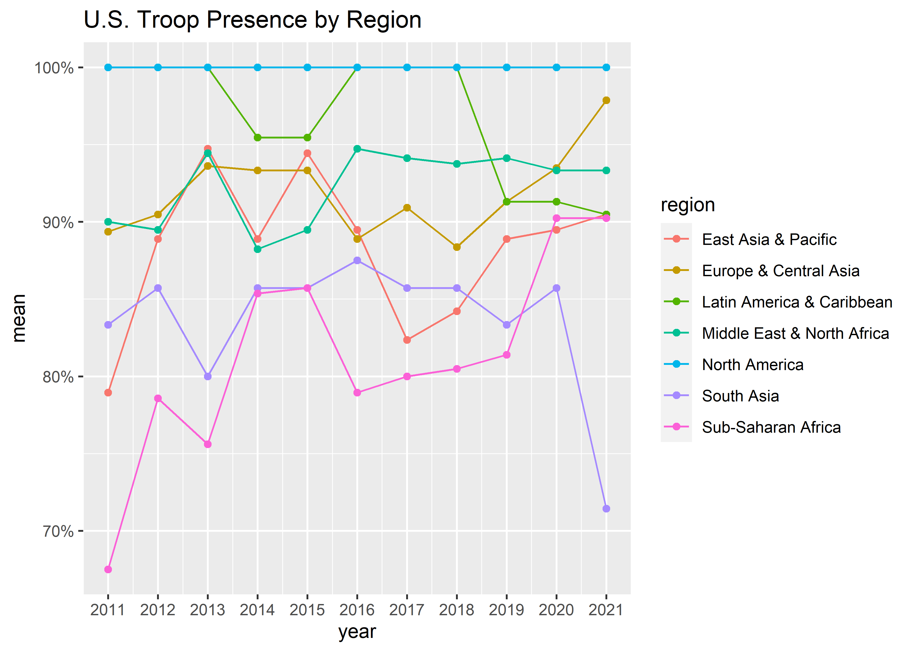

Terrorism and US Interventions
================
Miles D. Williams
2023-04-24

``` r
library(tidyverse)
library(troopdata)
terror <- read_csv(
  "Terr_dt.csv"
)
troops <- get_troopdata(startyear = 2011, endyear = 2021)
```

Clean up the terror data:

``` r
terror %>%
  select(1:12) %>%
  pivot_longer(
    cols = -Country
  ) %>%
  mutate(
    year = rep(
      2011:2022, len = n()
    ),
    iso3c = countrycode::countrycode(
      Country, "country.name", "iso3c"
    )
  ) -> terror
```

``` r
left_join(
  terror,
  troops
) -> full_dt
```

Test it out:

``` r
## US troop presence
full_dt %>%
  group_by(year, region) %>%
  summarize(
    mean = mean(troops > 0, na.rm=T)
  ) %>%
  drop_na() %>%
  ggplot() +
  aes(x = year, y = mean, color = region) +
  geom_line() +
  geom_point() +
  scale_y_continuous(
    labels = scales::percent
  ) +
  scale_x_continuous(
    breaks = 2011:2021
  ) +
  labs(
    title = "U.S. Troop Presence by Region"
  )
```



``` r
ggplot(full_dt) +
  aes(x = troops+1, y = value) +
  geom_point(color = "gray") +
  geom_smooth() +
  scale_x_log10()
```


``` r
library(estimatr)
lm_robust(
  value ~ I(troops == 1),
  fixed_effects = ~ year + Country,
  data = full_dt %>%
    filter(
      region != "North America"
    ),
  se_type = "stata"
)
```

    ##                      Estimate Std. Error   t value  Pr(>|t|)   CI Lower
    ## I(troops == 1)TRUE -0.3626888  0.2143899 -1.691725 0.0909076 -0.7832271
    ##                     CI Upper   DF
    ## I(troops == 1)TRUE 0.0578495 1489

``` r
full_dt %>%
  filter(region != "North America") %>%
  group_split(region) %>%
  map_dfr(
    ~ lm_robust(
      value ~ I(troops == 1),
      fixed_effects = ~ year + Country,
      data = .x,
      se_type = "stata"
    ) %>%
      tidy() %>%
      mutate(
        region = unique(.x$region)
      )
  ) %>%
  drop_na() %>%
  ggplot() +
  aes(
    x = estimate,
    xmin = conf.low,
    xmax = conf.high,
    y = reorder(region, estimate)
  ) +
  geom_pointrange() +
  geom_vline(
    xintercept = 0,
    lty = 2
  ) +
  labs(
    x = "Effect of U.S. Troop Presence",
    y = NULL,
    title = "Effect of U.S. Troops by Region"
  )
```


