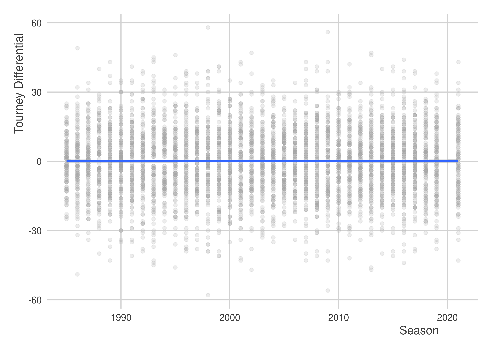

March Madness, 2023
================

## Introduction

Let’s try out some predictions for March Madness 2023.

## Setup

First, I need to gather my tools and set some options for my session:

``` r
library(tidyverse)
library(coolorrr)
set_theme()
set_palette()
```

## Data

Now I need to read in and merge some historical data on team performance
in past years. The below files come from Kaggle:
<https://www.kaggle.com/competitions/mens-march-mania-2022/data>

``` r
## First, team identifiers
d1 <- read_csv("MTeams.csv")

## Then, team seeds
d2 <- read_csv("MNCAATourneySeeds.csv")

## Finally, outcomes
d3 <- read_csv("MRegularSeasonCompactResults.csv")
```

For each team in a given year, I want a record and the seed:

``` r
d1 %>%
  select(TeamID, TeamName) %>%
  right_join(
    d2
  ) %>%
  mutate(
    Seed = str_remove(Seed, "[A-Z]") %>%
      str_remove("[a-z]") %>%
      as.numeric()
  ) -> Data

d3 %>%
  group_by(Season, WTeamID) %>%
  summarize(
    Score = mean(WScore),
    Differential = mean(WScore - LScore),
    N = n()
  ) %>%
  ungroup %>%
  rename(TeamID = WTeamID) -> win_d
d3 %>%
  group_by(Season, LTeamID) %>%
  summarize(
    Score = mean(LScore),
    Differential = mean(LScore - WScore),
    N = n()
  ) %>%
  ungroup %>%
  rename(TeamID = LTeamID) -> loss_d

bind_rows(
  win_d,
  loss_d
) %>%
  group_by(Season, TeamID) %>%
  summarize(
    AvgScore = sum(N * Score) / sum(N),
    Differential = sum(N * Differential) / sum(N)
  ) %>%
  ungroup -> outcomes

Data %>%
  left_join(outcomes, by = c("Season", "TeamID")) -> Data
```

## Explore some trends

It should probably be the case that teams with better records have
better seeds:

``` r
ggplot(Data) +
  aes(x = Differential,
      y = Seed) +
  geom_point() +
  geom_smooth(method = "loess",
              se = F) +
  labs(x = "Average Point Differential",
       y = "Tourney Seed",
       title = "A scatter plot")
```


How about a summary:

``` r
library(socsci)
Data %>%
  group_by(Seed) %>%
  mean_ci(Differential) %>%
  ggplot() +
  aes(x = mean,
      y = Seed,
      xmin = lower,
      xmax = upper) +
  geom_pointrange() +
  geom_vline(xintercept = 0) +
  labs(x = "Average Differential",
       y = "Seed",
       title = "A dotwhisker plot") +
  scale_y_continuous(
    breaks = 1:16
  )
```


## Adding tourney performance

Okay, I need to add in performance in the tournaments:

``` r
d4 <- read_csv("MNCAATourneyCompactResults.csv")
```

I think I want to make something like a directed dyad dataset:

``` r
bind_rows(
  d4 %>%
    rename(TeamID1 = WTeamID,
           Score1 = WScore,
           TeamID2 = LTeamID,
           Score2 = LScore),
  d4 %>%
    rename(TeamID2 = WTeamID,
           Score2 = WScore,
           TeamID1 = LTeamID,
           Score1 = LScore)
) %>%
  select(1:6) -> tourney_data
```

Okay, let’s find a way to match this with the season data:

``` r
# Make a version for each team of the dyad
Data1 <- Data
Data2 <- Data
names(Data1) <- paste0(names(Data), 1)
names(Data2) <- paste0(names(Data), 2)

# I need the season column to be the same in each
Data1 <- Data1 %>% rename(Season = Season1)
Data2 <- Data2 %>% rename(Season = Season2)

# These should merge nicely with the tourney data
tourney_data %>%
  left_join(Data1, by = c("TeamID1", "Season")) %>%
  left_join(Data2, by = c("TeamID2", "Season")) -> full_data
```

## Look at the data again

Can we see a correlation between regular season performance and tourney
outcomes?

Let’s try a scatter plot:

``` r
library(geomtextpath)
ggplot(full_data) +
  aes(x = AvgScore1,
      y = Score1) +
  geom_point(color = "darkgray",
             alpha = 0.2) +
  labs(x = "Average Season Points Scored",
       y = "Points Scored in Tourney") +
  geom_textabline(
    slope = 1,
    intercept = 0,
    label = "45 degrees",
    linetype = 2,
    color = "red",
    hjust = .8
  ) +
  geom_textsmooth(
    method = lm,
    label = "OLS Line of Best Fit",
    color = "darkblue"
  )
```


Yeah, just about. But…

``` r
ggplot(full_data) +
  aes(x = Score1 - AvgScore1) +
  geom_density(fill = "gray",
               color = "black") +
  geom_vline(xintercept = 0,
             lty = 2) +
  labs(x = "Tourney Score minus Season Avg.")
```


It looks like teams tend to do slightly worse in March Madness than in
the regular season. On average, they do about 5 points worse, and this
difference is statistically significant, too:

``` r
t.test(Score1 - AvgScore1 ~ 1, full_data)
```

    ## 
    ##  One Sample t-test
    ## 
    ## data:  Score1 - AvgScore1
    ## t = -31.816, df = 4633, p-value < 2.2e-16
    ## alternative hypothesis: true mean is not equal to 0
    ## 95 percent confidence interval:
    ##  -5.675650 -5.016798
    ## sample estimates:
    ## mean of x 
    ## -5.346224

Now, let’s take a look at differentials:

``` r
ggplot(full_data) +
  aes(x = Differential1 - Differential2,
      y = Score1 - Score2) +
  geom_point(color = "darkgray",
             alpha = 0.2) +
  geom_textabline(
    slope = 1,
    intercept = 0,
    label = "45 degrees",
    linetype = 2,
    color = "red",
    hjust = .8
  ) +
  geom_textsmooth(
    method = lm,
    label = "OLS Line of Best Fit",
    color = "darkblue"
  )
```


I wonder if seed is predicitive?

``` r
ggplot(full_data) +
  aes(x = Seed1 - Seed2,
      y = Score1 - Score2) +
  geom_point(color = "darkgray",
             alpha = 0.2) +
  geom_textsmooth(
    method = lm,
    label = "OLS Line of Best Fit",
    color = "darkblue"
  )
```


Ooo… That’s pretty good. I think I have some ideas for a predictive
model.

But, let’s do one more thing. In a previous figure I got the impression
that there could be a secular upward trend in the regular season point
differentials for Tourney teams. Is that worth modeling?

``` r
ggplot(full_data) +
  aes(x = Season,
      y = Score1 - Score2) +
  geom_point(color = "darkgray",
             alpha = 0.2) +
  labs(x = "Season",
       y = "Tourney Differential") +
  geom_smooth(method = lm)
```



Nah. That’s pretty flat. Okay…on with the model.

## Train the model

I’m going to make a model that predicts the tourney point differential
as a function of the seed differential between the teams matched against
each other and the difference in their regular season average point
differential.

The model:

``` r
model <- tourneyDiff1 ~ diffDiff1 + seedDiff1
```

Add the necessary columns to the data:

``` r
full_data %>%
  mutate(tourneyDiff1 = Score1 - Score2,
         seedDiff1 = Seed1 - Seed2,
         diffDiff1 = Differential1 - Differential2) -> full_data
```

Fit the model to the data:

``` r
fit <- lm(model, full_data)
```

Let’s take a quick look:

``` r
summary(fit)
```

    ## 
    ## Call:
    ## lm(formula = model, data = full_data)
    ## 
    ## Residuals:
    ##     Min      1Q  Median      3Q     Max 
    ## -42.405  -7.528   0.000   7.528  42.405 
    ## 
    ## Coefficients:
    ##               Estimate Std. Error t value Pr(>|t|)    
    ## (Intercept)  1.100e-15  1.670e-01    0.00        1    
    ## diffDiff1    4.838e-01  3.177e-02   15.23   <2e-16 ***
    ## seedDiff1   -8.955e-01  2.924e-02  -30.62   <2e-16 ***
    ## ---
    ## Signif. codes:  0 '***' 0.001 '**' 0.01 '*' 0.05 '.' 0.1 ' ' 1
    ## 
    ## Residual standard error: 11.37 on 4631 degrees of freedom
    ## Multiple R-squared:  0.4013, Adjusted R-squared:  0.401 
    ## F-statistic:  1552 on 2 and 4631 DF,  p-value: < 2.2e-16

Okay, it’s a good idea to try some hypothetical predictions and also to
translate predictions to win probabilities. To do that, I want to take a
bootstrapping procedure.

First, my bootstrapping function:

``` r
boot_lm <- function(form, data, R = 500) {
  ## The main fit
  fit <- lm(form, data)
  
  ## Bootstrap the data and refit
  boot_fits <- 1:R %>%
    map(~sample_n(data, nrow(data), T)) %>%
    map(~lm(form, .x))
  
  ## Return the output
  list(
    fit = fit,
    boot_fits = boot_fits
  )
}
```

Now, apply it:

``` r
boot_fit <- boot_lm(model, full_data, R = 999)
```

Okay, now I need a function that will get the original plus bootstrapped
predictions:

``` r
boot_predict <- function(fit, newdata = NULL, ref = 0) {
  ## The main prediction
  pred <- predict(fit$fit, newdata)
  ## The bootstrapped predictions
  boot_preds <- fit$boot_fits %>%
    map(~ predict(.x, newdata)) 
  ## For each obs, get prob x > ref
  boot_probs <- 1:nrow(newdata) %>%
    map_dfr(
      ~ {
        obs <- .x
        boot_preds %>%
          map_dfr(
            ~ tibble(val = .x[obs]) 
          ) %>%
          summarize(prob = mean(val > 0)) %>%
          mutate(pred = pred[obs]) %>%
          select(pred, prob) 
      }
    )
  ## Return
  list(pred = pred,
       boot_preds = boot_preds,
       boot_probs = boot_probs)
}
```

Try it out:

``` r
newdata <- tibble(
  diffDiff1 = -5:5,
  seedDiff1 = 3
)
boot_pred <- boot_predict(fit = boot_fit, newdata, ref = 0)
boot_pred$boot_probs
```

    ## # A tibble: 11 × 2
    ##      pred  prob
    ##     <dbl> <dbl>
    ##  1 -5.11  0    
    ##  2 -4.62  0    
    ##  3 -4.14  0    
    ##  4 -3.65  0    
    ##  5 -3.17  0    
    ##  6 -2.69  0    
    ##  7 -2.20  0    
    ##  8 -1.72  0    
    ##  9 -1.24  0    
    ## 10 -0.751 0    
    ## 11 -0.267 0.153

## Make predictions for 2023

Okay, first I need information about the season performance and seeds of
current teams…

An hour of data collection later, I have it!

``` r
googsheeturl <- "https://docs.google.com/spreadsheets/d/1JdIoZBExz5AygMH7E6QMfTCjQ75wkiRMpimdNq-2qiU/edit?usp=sharing"
library(googlesheets4)
gs4_deauth()
data23 <- range_speedread(googsheeturl)
glimpse(data23)
```

    ## Rows: 32
    ## Columns: 7
    ## $ TeamName1     <chr> "Alabama", "Maryland", "San Diego St", "Virginia", "Crei…
    ## $ Differential1 <dbl> 13.7, 7.2, 7.5, 7.6, 8.2, 6.9, 4.9, 11.2, 18.5, 5.8, 7.3…
    ## $ Seed1         <dbl> 1, 8, 5, 4, 6, 3, 7, 2, 1, 8, 5, 4, 6, 3, 7, 2, 1, 8, 5,…
    ## $ TeamName2     <chr> "TAM C. Christi", "West Virginia", "Col Charleston", "Fu…
    ## $ Differential2 <dbl> 5.3, 5.3, 13.0, 9.0, 7.4, 6.1, 8.0, 6.1, 2.5, 5.7, 9.5, …
    ## $ Seed2         <dbl> 16, 9, 12, 13, 11, 14, 10, 15, 16, 9, 12, 13, 11, 14, 10…
    ## $ Round         <dbl> 1, 1, 1, 1, 1, 1, 1, 1, 1, 1, 1, 1, 1, 1, 1, 1, 1, 1, 1,…

Okay, let’s create seedDiff1 and diffDiff1:

``` r
data23 %>%
  mutate(
    seedDiff1 = Seed1 - Seed2,
    diffDiff1 = Differential1 - Differential2
  ) -> data23
```

Now, I can make some first round predictions:

``` r
fst_pred <- boot_predict(boot_fit, data23)
fst_pred$boot_probs %>%
  cbind(., data23)
```

    ##          pred prob    TeamName1 Differential1 Seed1      TeamName2
    ## 1  17.4967642    1      Alabama          13.7     1 TAM C. Christi
    ## 2   1.8147912    1     Maryland           7.2     8  West Virginia
    ## 3   3.6074212    1 San Diego St           7.5     5 Col Charleston
    ## 4   7.3821545    1     Virginia           7.6     4         Furman
    ## 5   4.8645827    1    Creighton           8.2     6       NC State
    ## 6  10.2375993    1       Baylor           6.9     3           UCSB
    ## 7   1.1866166    1     Missouri           4.9     7        Utah St
    ## 8  14.1090998    1      Arizona          11.2     2      Princeton
    ## 9  21.1739181    1      Houston          18.5     1     N Kentucky
    ## 10  0.9438864    1         Iowa           5.8     8         Auburn
    ## 11  5.2040801    1        Miami           7.3     5          Drake
    ## 12  6.7047840    1      Indiana           6.6     4        Kent St
    ## 13  4.5742810    1      Iowa St           5.7     6           Pitt
    ## 14 12.0277926    1       Xavier           7.4     3    Kennesaw St
    ## 15  4.1864000    1    Texas A&M           7.0     7        Penn St
    ## 16 12.3672900    1        Texas          10.4     2        Colgate
    ## 17 18.3192855    1       Purdue          10.4     1            FDU
    ## 18 -1.5236774    0      Memphis           7.9     8            FAU
    ## 19  4.3815588    1         Duke           8.6     5   Oral Roberts
    ## 20 12.3172821    1    Tennessee          13.8     4      Louisiana
    ## 21  4.5742810    1     Kentucky           7.0     6     Providence
    ## 22 11.0117369    1    Kansas St           6.5     3     Montana St
    ## 23  1.3801510    1  Michigan St           2.8     7            USC
    ## 24 13.5768801    1    Marquette           9.4     2        Vermont
    ## 25 16.3355577    1       Kansas           7.0     1         Howard
    ## 26  0.5568175    1     Arkansas           7.0     8       Illinois
    ## 27  7.4781095    1      St Mary          11.0     5            VCU
    ## 28  9.0271970    1        UConn          13.4     4           Iona
    ## 29  6.7999268    1          TCU           7.4     6     Arizona St
    ## 30 14.2050548    1      Gonzaga          12.6     3   Grand Canyon
    ## 31  1.8156034    1 Northwestern           5.2     7       Boise St
    ## 32 16.4315128    1         UCLA          13.6     2  UNC Asheville
    ##    Differential2 Seed2 Round seedDiff1 diffDiff1
    ## 1            5.3    16     1       -15       8.4
    ## 2            5.3     9     1        -1       1.9
    ## 3           13.0    12     1        -7      -5.5
    ## 4            9.0    13     1        -9      -1.4
    ## 5            7.4    11     1        -5       0.8
    ## 6            6.1    14     1       -11       0.8
    ## 7            8.0    10     1        -3      -3.1
    ## 8            6.1    15     1       -13       5.1
    ## 9            2.5    16     1       -15      16.0
    ## 10           5.7     9     1        -1       0.1
    ## 11           9.5    12     1        -7      -2.2
    ## 12           9.4    13     1        -9      -2.8
    ## 13           5.5    11     1        -5       0.2
    ## 14           2.9    14     1       -11       4.5
    ## 15           3.9    10     1        -3       3.1
    ## 16           8.9    15     1       -13       1.5
    ## 17           0.3    16     1       -15      10.1
    ## 18          12.9     9     1        -1      -5.0
    ## 19          12.5    12     1        -7      -3.9
    ## 20           5.0    13     1        -9       8.8
    ## 21           6.8    11     1        -5       0.2
    ## 22           4.1    14     1       -11       2.4
    ## 23           5.5    10     1        -3      -2.7
    ## 24           5.4    15     1       -13       4.0
    ## 25           1.0    16     1       -15       6.0
    ## 26           7.7     9     1        -1      -0.7
    ## 27           8.5    12     1        -7       2.5
    ## 28          11.4    13     1        -9       2.0
    ## 29           2.6    11     1        -5       4.8
    ## 30           3.6    14     1       -11       9.0
    ## 31           7.0    10     1        -3      -1.8
    ## 32           3.7    15     1       -13       9.9

Okay, so I need to keep the teams that are predicted to win:

``` r
fst_pred$boot_probs %>%
  cbind(., data23) %>%
  mutate(
    winner = ifelse(prob > 0.5, 
                    TeamName1, 
                    TeamName2),
    prob = ifelse(prob > 0.5,
                  paste0(round(100 * prob, 3), "%"),
                  paste0(round(100 * (1 - prob), 3), "%")) 
  ) %>%
  select(
    winner, prob
  ) -> fst_round_winners
fst_round_winners %>%
  kableExtra::kable("html", caption = "1st Round Predictions")
```

<table>
<caption>
1st Round Predictions
</caption>
<thead>
<tr>
<th style="text-align:left;">
winner
</th>
<th style="text-align:left;">
prob
</th>
</tr>
</thead>
<tbody>
<tr>
<td style="text-align:left;">
Alabama
</td>
<td style="text-align:left;">
100%
</td>
</tr>
<tr>
<td style="text-align:left;">
Maryland
</td>
<td style="text-align:left;">
100%
</td>
</tr>
<tr>
<td style="text-align:left;">
San Diego St
</td>
<td style="text-align:left;">
100%
</td>
</tr>
<tr>
<td style="text-align:left;">
Virginia
</td>
<td style="text-align:left;">
100%
</td>
</tr>
<tr>
<td style="text-align:left;">
Creighton
</td>
<td style="text-align:left;">
100%
</td>
</tr>
<tr>
<td style="text-align:left;">
Baylor
</td>
<td style="text-align:left;">
100%
</td>
</tr>
<tr>
<td style="text-align:left;">
Missouri
</td>
<td style="text-align:left;">
100%
</td>
</tr>
<tr>
<td style="text-align:left;">
Arizona
</td>
<td style="text-align:left;">
100%
</td>
</tr>
<tr>
<td style="text-align:left;">
Houston
</td>
<td style="text-align:left;">
100%
</td>
</tr>
<tr>
<td style="text-align:left;">
Iowa
</td>
<td style="text-align:left;">
100%
</td>
</tr>
<tr>
<td style="text-align:left;">
Miami
</td>
<td style="text-align:left;">
100%
</td>
</tr>
<tr>
<td style="text-align:left;">
Indiana
</td>
<td style="text-align:left;">
100%
</td>
</tr>
<tr>
<td style="text-align:left;">
Iowa St
</td>
<td style="text-align:left;">
100%
</td>
</tr>
<tr>
<td style="text-align:left;">
Xavier
</td>
<td style="text-align:left;">
100%
</td>
</tr>
<tr>
<td style="text-align:left;">
Texas A&M
</td>
<td style="text-align:left;">
100%
</td>
</tr>
<tr>
<td style="text-align:left;">
Texas
</td>
<td style="text-align:left;">
100%
</td>
</tr>
<tr>
<td style="text-align:left;">
Purdue
</td>
<td style="text-align:left;">
100%
</td>
</tr>
<tr>
<td style="text-align:left;">
FAU
</td>
<td style="text-align:left;">
100%
</td>
</tr>
<tr>
<td style="text-align:left;">
Duke
</td>
<td style="text-align:left;">
100%
</td>
</tr>
<tr>
<td style="text-align:left;">
Tennessee
</td>
<td style="text-align:left;">
100%
</td>
</tr>
<tr>
<td style="text-align:left;">
Kentucky
</td>
<td style="text-align:left;">
100%
</td>
</tr>
<tr>
<td style="text-align:left;">
Kansas St
</td>
<td style="text-align:left;">
100%
</td>
</tr>
<tr>
<td style="text-align:left;">
Michigan St
</td>
<td style="text-align:left;">
100%
</td>
</tr>
<tr>
<td style="text-align:left;">
Marquette
</td>
<td style="text-align:left;">
100%
</td>
</tr>
<tr>
<td style="text-align:left;">
Kansas
</td>
<td style="text-align:left;">
100%
</td>
</tr>
<tr>
<td style="text-align:left;">
Arkansas
</td>
<td style="text-align:left;">
100%
</td>
</tr>
<tr>
<td style="text-align:left;">
St Mary
</td>
<td style="text-align:left;">
100%
</td>
</tr>
<tr>
<td style="text-align:left;">
UConn
</td>
<td style="text-align:left;">
100%
</td>
</tr>
<tr>
<td style="text-align:left;">
TCU
</td>
<td style="text-align:left;">
100%
</td>
</tr>
<tr>
<td style="text-align:left;">
Gonzaga
</td>
<td style="text-align:left;">
100%
</td>
</tr>
<tr>
<td style="text-align:left;">
Northwestern
</td>
<td style="text-align:left;">
100%
</td>
</tr>
<tr>
<td style="text-align:left;">
UCLA
</td>
<td style="text-align:left;">
100%
</td>
</tr>
</tbody>
</table>

Now, set things up for second round. I need to match the team above with
the team below in pairs.

``` r
r2_data <- tibble(
  TeamName = fst_round_winners$winner,
  side = paste0("TeamName",rep(1:2, len = 32))
) %>%
  pivot_wider(
    values_from = TeamName,
    names_from = side
  ) %>%
  unnest %>%
  mutate(
    Differential1 = 0,
    Seed1 = 0,
    Differential2 = 0,
    Seed2 = 0
  )
keep1 <- which(r2_data$TeamName1 %in% data23$TeamName1)
keep2 <- which(data23$TeamName1 %in% r2_data$TeamName1) 
r2_data[keep1, 3:4] <- data23[keep2, 2:3]
keep1 <- which(r2_data$TeamName2 %in% data23$TeamName1)
keep2 <- which(data23$TeamName1 %in% r2_data$TeamName2) 
r2_data[keep1, 5:6] <- data23[keep2, 2:3]
keep1 <- which(r2_data$TeamName1 %in% data23$TeamName2)
keep2 <- which(data23$TeamName2 %in% r2_data$TeamName1) 
r2_data[keep1, 3:4] <- data23[keep2, 5:6]
keep1 <- which(r2_data$TeamName2 %in% data23$TeamName2)
keep2 <- which(data23$TeamName2 %in% r2_data$TeamName2)
r2_data[keep1, 5:6] <- data23[keep2, 5:6]
r2_data
```

    ## # A tibble: 16 × 6
    ##    TeamName1    TeamName2 Differential1 Seed1 Differential2 Seed2
    ##    <chr>        <chr>             <dbl> <dbl>         <dbl> <dbl>
    ##  1 Alabama      Maryland           13.7     1           7.2     8
    ##  2 San Diego St Virginia            7.5     5           7.6     4
    ##  3 Creighton    Baylor              8.2     6           6.9     3
    ##  4 Missouri     Arizona             4.9     7          11.2     2
    ##  5 Houston      Iowa               18.5     1           5.8     8
    ##  6 Miami        Indiana             7.3     5           6.6     4
    ##  7 Iowa St      Xavier              5.7     6           7.4     3
    ##  8 Texas A&M    Texas               7       7          10.4     2
    ##  9 Purdue       FAU                10.4     1          12.9     9
    ## 10 Duke         Tennessee           8.6     5          13.8     4
    ## 11 Kentucky     Kansas St           7       6           6.5     3
    ## 12 Michigan St  Marquette           2.8     7           9.4     2
    ## 13 Kansas       Arkansas            7       1           7       8
    ## 14 St Mary      UConn              11       5          13.4     4
    ## 15 TCU          Gonzaga             7.4     6          12.6     3
    ## 16 Northwestern UCLA                5.2     7          13.6     2

There we go! Now I need the new predictors:

``` r
r2_data %>%
  mutate(
    seedDiff1 = Seed1 - Seed2,
    diffDiff1 = Differential1 - Differential2
  ) -> r2_data
```

Now I can make round 2 predictions:

``` r
snd_pred <- boot_predict(boot_fit, r2_data)
```

Check out the predictions:

``` r
snd_pred$boot_probs %>%
  cbind(., r2_data) %>%
  mutate(
    winner = ifelse(prob > 0.5, 
                    TeamName1, 
                    TeamName2),
    prob = ifelse(prob > 0.5,
                  paste0(round(100 * prob, 3), "%"),
                  paste0(round(100 * (1 - prob), 3), "%")) 
  ) %>%
  select(
    winner, prob
  ) -> snd_round_winners
snd_round_winners %>%
  kableExtra::kable("html", caption = "2nd Round Predictions")
```

<table>
<caption>
2nd Round Predictions
</caption>
<thead>
<tr>
<th style="text-align:left;">
winner
</th>
<th style="text-align:left;">
prob
</th>
</tr>
</thead>
<tbody>
<tr>
<td style="text-align:left;">
Alabama
</td>
<td style="text-align:left;">
100%
</td>
</tr>
<tr>
<td style="text-align:left;">
Virginia
</td>
<td style="text-align:left;">
100%
</td>
</tr>
<tr>
<td style="text-align:left;">
Baylor
</td>
<td style="text-align:left;">
100%
</td>
</tr>
<tr>
<td style="text-align:left;">
Arizona
</td>
<td style="text-align:left;">
100%
</td>
</tr>
<tr>
<td style="text-align:left;">
Houston
</td>
<td style="text-align:left;">
100%
</td>
</tr>
<tr>
<td style="text-align:left;">
Indiana
</td>
<td style="text-align:left;">
100%
</td>
</tr>
<tr>
<td style="text-align:left;">
Xavier
</td>
<td style="text-align:left;">
100%
</td>
</tr>
<tr>
<td style="text-align:left;">
Texas
</td>
<td style="text-align:left;">
100%
</td>
</tr>
<tr>
<td style="text-align:left;">
Purdue
</td>
<td style="text-align:left;">
100%
</td>
</tr>
<tr>
<td style="text-align:left;">
Tennessee
</td>
<td style="text-align:left;">
100%
</td>
</tr>
<tr>
<td style="text-align:left;">
Kansas St
</td>
<td style="text-align:left;">
100%
</td>
</tr>
<tr>
<td style="text-align:left;">
Marquette
</td>
<td style="text-align:left;">
100%
</td>
</tr>
<tr>
<td style="text-align:left;">
Kansas
</td>
<td style="text-align:left;">
100%
</td>
</tr>
<tr>
<td style="text-align:left;">
UConn
</td>
<td style="text-align:left;">
100%
</td>
</tr>
<tr>
<td style="text-align:left;">
Gonzaga
</td>
<td style="text-align:left;">
100%
</td>
</tr>
<tr>
<td style="text-align:left;">
UCLA
</td>
<td style="text-align:left;">
100%
</td>
</tr>
</tbody>
</table>

Same thing as before. Line up teams by who they’ll play:

``` r
r3_data <- tibble(
  TeamName = snd_round_winners$winner,
  side = paste0("TeamName",rep(1:2, len = 16))
) %>%
  pivot_wider(
    values_from = TeamName,
    names_from = side
  ) %>%
  unnest %>%
  mutate(
    Differential1 = 0,
    Seed1 = 0,
    Differential2 = 0,
    Seed2 = 0
  )
keep1 <- which(r3_data$TeamName1 %in% data23$TeamName1)
keep2 <- which(data23$TeamName1 %in% r3_data$TeamName1) 
r3_data[keep1, 3:4] <- data23[keep2, 2:3]
keep1 <- which(r3_data$TeamName2 %in% data23$TeamName1)
keep2 <- which(data23$TeamName1 %in% r3_data$TeamName2) 
r3_data[keep1, 5:6] <- data23[keep2, 2:3]
keep1 <- which(r3_data$TeamName1 %in% data23$TeamName2)
keep2 <- which(data23$TeamName2 %in% r3_data$TeamName1) 
r3_data[keep1, 3:4] <- data23[keep2, 5:6]
keep1 <- which(r3_data$TeamName2 %in% data23$TeamName2)
keep2 <- which(data23$TeamName2 %in% r3_data$TeamName2)
r3_data[keep1, 5:6] <- data23[keep2, 5:6]
r3_data
```

    ## # A tibble: 8 × 6
    ##   TeamName1 TeamName2 Differential1 Seed1 Differential2 Seed2
    ##   <chr>     <chr>             <dbl> <dbl>         <dbl> <dbl>
    ## 1 Alabama   Virginia           13.7     1           7.6     4
    ## 2 Baylor    Arizona             6.9     3          11.2     2
    ## 3 Houston   Indiana            18.5     1           6.6     4
    ## 4 Xavier    Texas               7.4     3          10.4     2
    ## 5 Purdue    Tennessee          10.4     1          13.8     4
    ## 6 Kansas St Marquette           6.5     3           9.4     2
    ## 7 Kansas    UConn               7       1          13.4     4
    ## 8 Gonzaga   UCLA               12.6     3          13.6     2

There we go! Now I need the new predictors:

``` r
r3_data %>%
  mutate(
    seedDiff1 = Seed1 - Seed2,
    diffDiff1 = Differential1 - Differential2
  ) -> r3_data
```

Now I can make round 3 predictions:

``` r
trd_pred <- boot_predict(boot_fit, r3_data)
```

Check out the predictions:

``` r
trd_pred$boot_probs %>%
  cbind(., r3_data) %>%
  mutate(
    winner = ifelse(prob > 0.5, 
                    TeamName1, 
                    TeamName2),
    prob = ifelse(prob > 0.5,
                  paste0(round(100 * prob, 3), "%"),
                  paste0(round(100 * (1 - prob), 3), "%")) 
  ) %>%
  select(
    winner, prob
  ) -> trd_round_winners
trd_round_winners %>%
  kableExtra::kable("html", caption = "3rd Round Predictions")
```

<table>
<caption>
3rd Round Predictions
</caption>
<thead>
<tr>
<th style="text-align:left;">
winner
</th>
<th style="text-align:left;">
prob
</th>
</tr>
</thead>
<tbody>
<tr>
<td style="text-align:left;">
Alabama
</td>
<td style="text-align:left;">
100%
</td>
</tr>
<tr>
<td style="text-align:left;">
Arizona
</td>
<td style="text-align:left;">
100%
</td>
</tr>
<tr>
<td style="text-align:left;">
Houston
</td>
<td style="text-align:left;">
100%
</td>
</tr>
<tr>
<td style="text-align:left;">
Texas
</td>
<td style="text-align:left;">
100%
</td>
</tr>
<tr>
<td style="text-align:left;">
Purdue
</td>
<td style="text-align:left;">
100%
</td>
</tr>
<tr>
<td style="text-align:left;">
Marquette
</td>
<td style="text-align:left;">
100%
</td>
</tr>
<tr>
<td style="text-align:left;">
UConn
</td>
<td style="text-align:left;">
89.389%
</td>
</tr>
<tr>
<td style="text-align:left;">
UCLA
</td>
<td style="text-align:left;">
100%
</td>
</tr>
</tbody>
</table>

Same thing as before. Line up teams by who they’ll play:

``` r
r4_data <- tibble(
  TeamName = trd_round_winners$winner,
  side = paste0("TeamName",rep(1:2, len = 8))
) %>%
  pivot_wider(
    values_from = TeamName,
    names_from = side
  ) %>%
  unnest %>%
  mutate(
    Differential1 = 0,
    Seed1 = 0,
    Differential2 = 0,
    Seed2 = 0
  )
keep1 <- which(r4_data$TeamName1 %in% data23$TeamName1)
keep2 <- which(data23$TeamName1 %in% r4_data$TeamName1) 
r4_data[keep1, 3:4] <- data23[keep2, 2:3]
keep1 <- which(r4_data$TeamName2 %in% data23$TeamName1)
keep2 <- which(data23$TeamName1 %in% r4_data$TeamName2) 
r4_data[keep1, 5:6] <- data23[keep2, 2:3]
keep1 <- which(r4_data$TeamName1 %in% data23$TeamName2)
keep2 <- which(data23$TeamName2 %in% r4_data$TeamName1) 
r4_data[keep1, 3:4] <- data23[keep2, 5:6]
keep1 <- which(r4_data$TeamName2 %in% data23$TeamName2)
keep2 <- which(data23$TeamName2 %in% r4_data$TeamName2)
r4_data[keep1, 5:6] <- data23[keep2, 5:6]
r4_data
```

    ## # A tibble: 4 × 6
    ##   TeamName1 TeamName2 Differential1 Seed1 Differential2 Seed2
    ##   <chr>     <chr>             <dbl> <dbl>         <dbl> <dbl>
    ## 1 Alabama   Arizona            13.7     1          11.2     2
    ## 2 Houston   Texas              18.5     1          10.4     2
    ## 3 Purdue    Marquette          10.4     1           9.4     2
    ## 4 UConn     UCLA               13.4     4          13.6     2

There we go! Now I need the new predictors:

``` r
r4_data %>%
  mutate(
    seedDiff1 = Seed1 - Seed2,
    diffDiff1 = Differential1 - Differential2
  ) -> r4_data
```

Now I can make round 4 predictions:

``` r
fth_pred <- boot_predict(boot_fit, r4_data)
```

Check out the predictions:

``` r
fth_pred$boot_probs %>%
  cbind(., r4_data) %>%
  mutate(
    winner = ifelse(prob > 0.5, 
                    TeamName1, 
                    TeamName2),
    prob = ifelse(prob > 0.5,
                  paste0(round(100 * prob, 3), "%"),
                  paste0(round(100 * (1 - prob), 3), "%")) 
  ) %>%
  select(
    winner, prob
  ) -> fth_round_winners
fth_round_winners %>%
  kableExtra::kable("html", caption = "4th Round Predictions")
```

<table>
<caption>
4th Round Predictions
</caption>
<thead>
<tr>
<th style="text-align:left;">
winner
</th>
<th style="text-align:left;">
prob
</th>
</tr>
</thead>
<tbody>
<tr>
<td style="text-align:left;">
Alabama
</td>
<td style="text-align:left;">
100%
</td>
</tr>
<tr>
<td style="text-align:left;">
Houston
</td>
<td style="text-align:left;">
100%
</td>
</tr>
<tr>
<td style="text-align:left;">
Purdue
</td>
<td style="text-align:left;">
100%
</td>
</tr>
<tr>
<td style="text-align:left;">
UCLA
</td>
<td style="text-align:left;">
100%
</td>
</tr>
</tbody>
</table>

Same thing as before. Line up teams by who they’ll play:

``` r
r5_data <- tibble(
  TeamName = fth_round_winners$winner,
  side = paste0("TeamName",rep(1:2, each = 2))
) %>%
  pivot_wider(
    values_from = TeamName,
    names_from = side
  ) %>%
  unnest %>%
  mutate(
    Differential1 = 0,
    Seed1 = 0,
    Differential2 = 0,
    Seed2 = 0
  )
keep1 <- which(r5_data$TeamName1 %in% data23$TeamName1)
keep2 <- which(data23$TeamName1 %in% r5_data$TeamName1) 
r5_data[keep1, 3:4] <- data23[keep2, 2:3]
keep1 <- which(r5_data$TeamName2 %in% data23$TeamName1)
keep2 <- which(data23$TeamName1 %in% r5_data$TeamName2) 
r5_data[keep1, 5:6] <- data23[keep2, 2:3]
keep1 <- which(r5_data$TeamName1 %in% data23$TeamName2)
keep2 <- which(data23$TeamName2 %in% r5_data$TeamName1) 
r5_data[keep1, 3:4] <- data23[keep2, 5:6]
keep1 <- which(r5_data$TeamName2 %in% data23$TeamName2)
keep2 <- which(data23$TeamName2 %in% r5_data$TeamName2)
r5_data[keep1, 5:6] <- data23[keep2, 5:6]
r5_data
```

    ## # A tibble: 2 × 6
    ##   TeamName1 TeamName2 Differential1 Seed1 Differential2 Seed2
    ##   <chr>     <chr>             <dbl> <dbl>         <dbl> <dbl>
    ## 1 Alabama   Purdue             13.7     1          10.4     1
    ## 2 Houston   UCLA               18.5     1          13.6     2

There we go! Now I need the new predictors:

``` r
r5_data %>%
  mutate(
    seedDiff1 = Seed1 - Seed2,
    diffDiff1 = Differential1 - Differential2
  ) -> r5_data
```

Now I can make round 5 predictions:

``` r
fvth_pred <- boot_predict(boot_fit, r5_data)
```

Check out the predictions:

``` r
fvth_pred$boot_probs %>%
  cbind(., r5_data) %>%
  mutate(
    winner = ifelse(prob > 0.5, 
                    TeamName1, 
                    TeamName2),
    prob = ifelse(prob > 0.5,
                  paste0(round(100 * prob, 3), "%"),
                  paste0(round(100 * (1 - prob), 3), "%")) 
  ) %>%
  select(
    winner, prob
  ) -> fvth_round_winners
fvth_round_winners %>%
  kableExtra::kable("html", caption = "5th Round Predictions")
```

<table>
<caption>
5th Round Predictions
</caption>
<thead>
<tr>
<th style="text-align:left;">
winner
</th>
<th style="text-align:left;">
prob
</th>
</tr>
</thead>
<tbody>
<tr>
<td style="text-align:left;">
Alabama
</td>
<td style="text-align:left;">
100%
</td>
</tr>
<tr>
<td style="text-align:left;">
Houston
</td>
<td style="text-align:left;">
100%
</td>
</tr>
</tbody>
</table>

Same thing as before. Line up teams by who they’ll play:

``` r
r6_data <- tibble(
  TeamName = fvth_round_winners$winner,
  side = paste0("TeamName",rep(1:2, len = 2))
) %>%
  pivot_wider(
    values_from = TeamName,
    names_from = side
  ) %>%
  unnest %>%
  mutate(
    Differential1 = 0,
    Seed1 = 0,
    Differential2 = 0,
    Seed2 = 0
  )
keep1 <- which(r6_data$TeamName1 %in% data23$TeamName1)
keep2 <- which(data23$TeamName1 %in% r6_data$TeamName1) 
r6_data[keep1, 3:4] <- data23[keep2, 2:3]
keep1 <- which(r6_data$TeamName2 %in% data23$TeamName1)
keep2 <- which(data23$TeamName1 %in% r6_data$TeamName2) 
r6_data[keep1, 5:6] <- data23[keep2, 2:3]
keep1 <- which(r6_data$TeamName1 %in% data23$TeamName2)
keep2 <- which(data23$TeamName2 %in% r6_data$TeamName1) 
r6_data[keep1, 3:4] <- data23[keep2, 5:6]
keep1 <- which(r6_data$TeamName2 %in% data23$TeamName2)
keep2 <- which(data23$TeamName2 %in% r6_data$TeamName2)
r6_data[keep1, 5:6] <- data23[keep2, 5:6]
r6_data
```

    ## # A tibble: 1 × 6
    ##   TeamName1 TeamName2 Differential1 Seed1 Differential2 Seed2
    ##   <chr>     <chr>             <dbl> <dbl>         <dbl> <dbl>
    ## 1 Alabama   Houston            13.7     1          18.5     1

There we go! Now I need the new predictors:

``` r
r6_data %>%
  mutate(
    seedDiff1 = Seed1 - Seed2,
    diffDiff1 = Differential1 - Differential2
  ) -> r6_data
```

Now I can make final predictions:

``` r
final_pred <- boot_predict(boot_fit, r6_data)
```

Check out the predictions:

``` r
final_pred$boot_probs %>%
  cbind(., r6_data) %>%
  mutate(
    winner = ifelse(prob > 0.5, 
                    TeamName1, 
                    TeamName2),
    prob = ifelse(prob > 0.5,
                  paste0(round(100 * prob, 3), "%"),
                  paste0(round(100 * (1 - prob), 3), "%")) 
  ) %>%
  select(
    winner, prob
  ) -> final_round_winners
final_round_winners %>%
  kableExtra::kable("html", caption = "Final Round Predictions")
```

<table>
<caption>
Final Round Predictions
</caption>
<thead>
<tr>
<th style="text-align:left;">
winner
</th>
<th style="text-align:left;">
prob
</th>
</tr>
</thead>
<tbody>
<tr>
<td style="text-align:left;">
Houston
</td>
<td style="text-align:left;">
100%
</td>
</tr>
</tbody>
</table>
