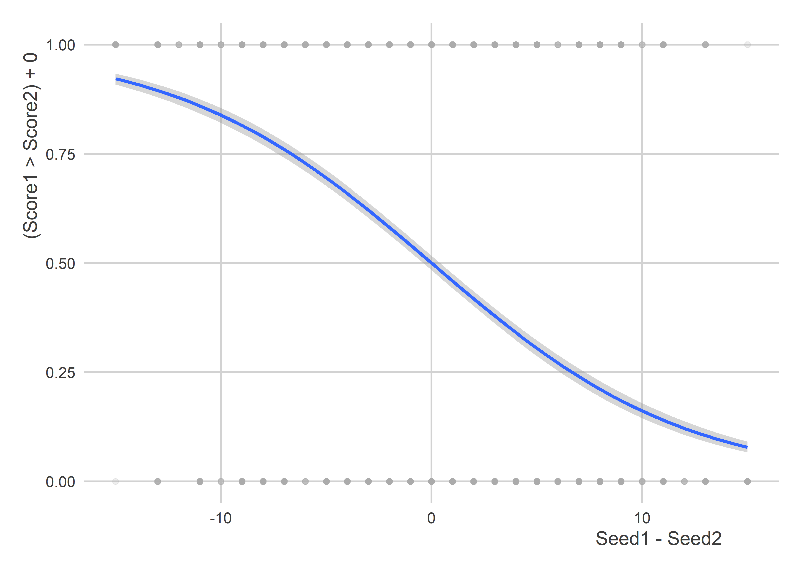

March Madness 2023 (2.0)
================

-   [Introduction](#introduction)
-   [Getting Started](#getting-started)
-   [Data](#data)
-   [Look at the data again](#look-at-the-data-again)
-   [Train the model](#train-the-model)
-   [Make Sweet 16 Predictions](#make-sweet-16-predictions)
    -   [Revisiting the Past](#revisiting-the-past)
    -   [A Second Chance](#a-second-chance)

## Introduction

I’m trying again with the Sweet 16. There were some big upsets in my
bracket, like Purdue lossing in the first round to a 16 seed! I had
Purdue going all the way to the Final Four.

I’m doing something different with my models, too. Instead of predicting
the point margin I’m going to predict the win probability. I’ll just use
a simple logit. I might try something a little more complicated next
year.

## Getting Started

First, I need to gather my tools and set some options for my session:

``` r
library(tidyverse)
library(coolorrr)
set_theme()
set_palette()
```

## Data

Now I need to read in and merge some historical data on team performance
in past years. The below files come from Kaggle:
<https://www.kaggle.com/competitions/mens-march-mania-2022/data>

``` r
## First, team identifiers
d1 <- read_csv("MTeams.csv")

## Then, team seeds
d2 <- read_csv("MNCAATourneySeeds.csv")

## Finally, outcomes
d3 <- read_csv("MRegularSeasonCompactResults.csv")
```

For each team in a given year, I want a record and the seed:

``` r
d1 %>%
  select(TeamID, TeamName) %>%
  right_join(
    d2
  ) %>%
  mutate(
    Seed = str_remove(Seed, "[A-Z]") %>%
      str_remove("[a-z]") %>%
      as.numeric()
  ) -> Data

d3 %>%
  group_by(Season, WTeamID) %>%
  summarize(
    Score = mean(WScore),
    Differential = mean(WScore - LScore),
    N = n()
  ) %>%
  ungroup %>%
  rename(TeamID = WTeamID) -> win_d
d3 %>%
  group_by(Season, LTeamID) %>%
  summarize(
    Score = mean(LScore),
    Differential = mean(LScore - WScore),
    N = n()
  ) %>%
  ungroup %>%
  rename(TeamID = LTeamID) -> loss_d

bind_rows(
  win_d,
  loss_d
) %>%
  group_by(Season, TeamID) %>%
  summarize(
    AvgScore = sum(N * Score) / sum(N),
    Differential = sum(N * Differential) / sum(N)
  ) %>%
  ungroup -> outcomes

Data %>%
  left_join(outcomes, by = c("Season", "TeamID")) -> Data
```

Okay, I need to add in performance in the tournaments:

``` r
d4 <- read_csv("MNCAATourneyCompactResults.csv")
```

I think I want to make something like a directed dyad dataset:

``` r
bind_rows(
  d4 %>%
    rename(TeamID1 = WTeamID,
           Score1 = WScore,
           TeamID2 = LTeamID,
           Score2 = LScore),
  d4 %>%
    rename(TeamID2 = WTeamID,
           Score2 = WScore,
           TeamID1 = LTeamID,
           Score1 = LScore)
) %>%
  select(1:6) -> tourney_data
```

Okay, let’s find a way to match this with the season data:

``` r
# Make a version for each team of the dyad
Data1 <- Data
Data2 <- Data
names(Data1) <- paste0(names(Data), 1)
names(Data2) <- paste0(names(Data), 2)

# I need the season column to be the same in each
Data1 <- Data1 %>% rename(Season = Season1)
Data2 <- Data2 %>% rename(Season = Season2)

# These should merge nicely with the tourney data
tourney_data %>%
  left_join(Data1, by = c("TeamID1", "Season")) %>%
  left_join(Data2, by = c("TeamID2", "Season")) -> full_data
```

## Look at the data again

Can we see a correlation between regular season performance and tourney
outcomes? This time, rather than look at point margins I’m going to look
just at expected wins.

Let’s try a scatter plot:

``` r
library(geomtextpath)
ggplot(full_data) +
  aes(x = AvgScore1 - AvgScore2,
      y = (Score1 > Score2)+0) +
  geom_point(color = "darkgray",
             alpha = 0.2) +
  labs(x = "Average Season Point Margin",
       y = "Win Probability") +
  geom_textsmooth(
    method = "glm",
    method.args = list(family = binomial),
    label = "Logit Line of Best Fit",
    color = "darkblue"
  )
```


The seed differential should be predictive, too:

``` r
ggplot(full_data) +
  aes(x = Seed1 - Seed2,
      y = (Score1 > Score2)+0) +
  geom_point(color = "darkgray",
             alpha = 0.2) +
  stat_smooth(
    method = glm,
    method.args = list(family = binomial)
  )
```



## Train the model

I’m going to make a model that predicts the tourney win probability as a
function of the seed differential between the teams matched against each
other and the difference in their regular season average point
differential.

The model:

``` r
model <- tourneyDiff1>0 ~ diffDiff1 + seedDiff1
```

Add the necessary columns to the data:

``` r
full_data %>%
  mutate(tourneyDiff1 = Score1 - Score2,
         seedDiff1 = Seed1 - Seed2,
         diffDiff1 = Differential1 - Differential2) -> full_data
```

Fit the model to the data:

``` r
fit <- glm(model, full_data, family = binomial)
```

Let’s take a quick look:

``` r
summary(fit)
```

    ## 
    ## Call:
    ## glm(formula = model, family = binomial, data = full_data)
    ## 
    ## Deviance Residuals: 
    ##     Min       1Q   Median       3Q      Max  
    ## -2.3833  -0.8916   0.0000   0.8916   2.3833  
    ## 
    ## Coefficients:
    ##               Estimate Std. Error z value Pr(>|z|)    
    ## (Intercept) -2.134e-15  3.421e-02   0.000        1    
    ## diffDiff1    6.152e-02  6.827e-03   9.012   <2e-16 ***
    ## seedDiff1   -1.335e-01  6.326e-03 -21.104   <2e-16 ***
    ## ---
    ## Signif. codes:  0 '***' 0.001 '**' 0.01 '*' 0.05 '.' 0.1 ' ' 1
    ## 
    ## (Dispersion parameter for binomial family taken to be 1)
    ## 
    ##     Null deviance: 6424.1  on 4633  degrees of freedom
    ## Residual deviance: 5073.8  on 4631  degrees of freedom
    ## AIC: 5079.8
    ## 
    ## Number of Fisher Scoring iterations: 4

Since this is a logistic model and the output can be directly converted
to probabilities, I’m going to save myself some computational time and
not do bootstrapping like before.

Let’s test out some predictions:

``` r
newdata <- tibble(
  diffDiff1 = -5:5,
  seedDiff1 = 3
)
pred <- predict(fit,
                newdata = newdata,
                type = "response")
pred
```

    ##         1         2         3         4         5         6         7         8 
    ## 0.3300175 0.3437599 0.3577690 0.3720254 0.3865079 0.4011941 0.4160598 0.4310799 
    ##         9        10        11 
    ## 0.4462278 0.4614762 0.4767970

## Make Sweet 16 Predictions

Read in the data:

``` r
googsheeturl <- "https://docs.google.com/spreadsheets/d/1JdIoZBExz5AygMH7E6QMfTCjQ75wkiRMpimdNq-2qiU/edit?usp=sharing"
library(googlesheets4)
gs4_deauth()
data23 <- range_speedread(googsheeturl)
glimpse(data23)
```

    ## Rows: 32
    ## Columns: 7
    ## $ TeamName1     <chr> "Alabama", "Maryland", "San Diego St", "Virginia", "Crei…
    ## $ Differential1 <dbl> 13.7, 7.2, 7.5, 7.6, 8.2, 6.9, 4.9, 11.2, 18.5, 5.8, 7.3…
    ## $ Seed1         <dbl> 1, 8, 5, 4, 6, 3, 7, 2, 1, 8, 5, 4, 6, 3, 7, 2, 1, 8, 5,…
    ## $ TeamName2     <chr> "TAM C. Christi", "West Virginia", "Col Charleston", "Fu…
    ## $ Differential2 <dbl> 5.3, 5.3, 13.0, 9.0, 7.4, 6.1, 8.0, 6.1, 2.5, 5.7, 9.5, …
    ## $ Seed2         <dbl> 16, 9, 12, 13, 11, 14, 10, 15, 16, 9, 12, 13, 11, 14, 10…
    ## $ Round         <dbl> 1, 1, 1, 1, 1, 1, 1, 1, 1, 1, 1, 1, 1, 1, 1, 1, 1, 1, 1,…

Okay, let’s create seedDiff1 and diffDiff1:

``` r
data23 %>%
  mutate(
    seedDiff1 = Seed1 - Seed2,
    diffDiff1 = Differential1 - Differential2
  ) -> data23
```

### Revisiting the Past

Now, I can make some first round predictions:

``` r
fst_pred <- predict(fit, data23, "response")
fst_pred
```

    ##         1         2         3         4         5         6         7         8 
    ## 0.9254805 0.5622726 0.6447651 0.7531242 0.6718811 0.8201980 0.5522515 0.8858700 
    ##         9        10        11        12        13        14        15        16 
    ## 0.9519753 0.5348558 0.6897887 0.7367633 0.6636922 0.8513620 0.6436433 0.8614935 
    ##        17        18        19        20        21        22        23        24 
    ## 0.9323802 0.4565806 0.6669768 0.8510521 0.6636922 0.8342601 0.5583284 0.8788470 
    ##        25        26        27        28        29        30        31        32 
    ## 0.9146356 0.5225925 0.7480593 0.7899331 0.7236813 0.8831058 0.5719352 0.9124993

Okay, so I need to keep the teams that are predicted to win:

``` r
fst_pred %>%
  cbind(prob = ., data23) %>%
  mutate(
    Winner = ifelse(prob > 0.5, 
                    TeamName1, 
                    TeamName2),
    Probability = ifelse(prob > 0.5,
                  paste0(round(100 * prob, 3), "%"),
                  paste0(round(100 * (1 - prob), 3), "%")) 
  ) %>%
  select(
    Winner, Probability
  ) -> fst_round_winners
fst_round_winners %>%
  kableExtra::kable("html", caption = "1st Round Predictions")
```

<table>
<caption>
1st Round Predictions
</caption>
<thead>
<tr>
<th style="text-align:left;">
Winner
</th>
<th style="text-align:left;">
Probability
</th>
</tr>
</thead>
<tbody>
<tr>
<td style="text-align:left;">
Alabama
</td>
<td style="text-align:left;">
92.548%
</td>
</tr>
<tr>
<td style="text-align:left;">
Maryland
</td>
<td style="text-align:left;">
56.227%
</td>
</tr>
<tr>
<td style="text-align:left;">
San Diego St
</td>
<td style="text-align:left;">
64.477%
</td>
</tr>
<tr>
<td style="text-align:left;">
Virginia
</td>
<td style="text-align:left;">
75.312%
</td>
</tr>
<tr>
<td style="text-align:left;">
Creighton
</td>
<td style="text-align:left;">
67.188%
</td>
</tr>
<tr>
<td style="text-align:left;">
Baylor
</td>
<td style="text-align:left;">
82.02%
</td>
</tr>
<tr>
<td style="text-align:left;">
Missouri
</td>
<td style="text-align:left;">
55.225%
</td>
</tr>
<tr>
<td style="text-align:left;">
Arizona
</td>
<td style="text-align:left;">
88.587%
</td>
</tr>
<tr>
<td style="text-align:left;">
Houston
</td>
<td style="text-align:left;">
95.198%
</td>
</tr>
<tr>
<td style="text-align:left;">
Iowa
</td>
<td style="text-align:left;">
53.486%
</td>
</tr>
<tr>
<td style="text-align:left;">
Miami
</td>
<td style="text-align:left;">
68.979%
</td>
</tr>
<tr>
<td style="text-align:left;">
Indiana
</td>
<td style="text-align:left;">
73.676%
</td>
</tr>
<tr>
<td style="text-align:left;">
Iowa St
</td>
<td style="text-align:left;">
66.369%
</td>
</tr>
<tr>
<td style="text-align:left;">
Xavier
</td>
<td style="text-align:left;">
85.136%
</td>
</tr>
<tr>
<td style="text-align:left;">
Texas A&M
</td>
<td style="text-align:left;">
64.364%
</td>
</tr>
<tr>
<td style="text-align:left;">
Texas
</td>
<td style="text-align:left;">
86.149%
</td>
</tr>
<tr>
<td style="text-align:left;">
Purdue
</td>
<td style="text-align:left;">
93.238%
</td>
</tr>
<tr>
<td style="text-align:left;">
FAU
</td>
<td style="text-align:left;">
54.342%
</td>
</tr>
<tr>
<td style="text-align:left;">
Duke
</td>
<td style="text-align:left;">
66.698%
</td>
</tr>
<tr>
<td style="text-align:left;">
Tennessee
</td>
<td style="text-align:left;">
85.105%
</td>
</tr>
<tr>
<td style="text-align:left;">
Kentucky
</td>
<td style="text-align:left;">
66.369%
</td>
</tr>
<tr>
<td style="text-align:left;">
Kansas St
</td>
<td style="text-align:left;">
83.426%
</td>
</tr>
<tr>
<td style="text-align:left;">
Michigan St
</td>
<td style="text-align:left;">
55.833%
</td>
</tr>
<tr>
<td style="text-align:left;">
Marquette
</td>
<td style="text-align:left;">
87.885%
</td>
</tr>
<tr>
<td style="text-align:left;">
Kansas
</td>
<td style="text-align:left;">
91.464%
</td>
</tr>
<tr>
<td style="text-align:left;">
Arkansas
</td>
<td style="text-align:left;">
52.259%
</td>
</tr>
<tr>
<td style="text-align:left;">
St Mary
</td>
<td style="text-align:left;">
74.806%
</td>
</tr>
<tr>
<td style="text-align:left;">
UConn
</td>
<td style="text-align:left;">
78.993%
</td>
</tr>
<tr>
<td style="text-align:left;">
TCU
</td>
<td style="text-align:left;">
72.368%
</td>
</tr>
<tr>
<td style="text-align:left;">
Gonzaga
</td>
<td style="text-align:left;">
88.311%
</td>
</tr>
<tr>
<td style="text-align:left;">
Northwestern
</td>
<td style="text-align:left;">
57.194%
</td>
</tr>
<tr>
<td style="text-align:left;">
UCLA
</td>
<td style="text-align:left;">
91.25%
</td>
</tr>
</tbody>
</table>

I think those are all the same as before. But now there’s much more
uncertainty reflected in the results, which I think is closer to the
truth.

### A Second Chance

Okay, let’s start over with some Sweet 16 picks. First I need to keep
all the relevant teams. Then I’ll make predictions:

``` r
team1 <- c("Alabama", "Creighton",
           "Houston", "Xavier",
           "FAU", "Kansas St",
           "Arkansas", "Gonzaga")
team2 <- c("San Diego St", "Princeton",
           "Miami", "Texas",
           "Tennessee", "Michigan St",
           "UConn", "UCLA")
s16_data <- tibble(
  TeamName = c(team1, team2),
  side = paste0("TeamName",rep(1:2, each = 8))
) %>%
  pivot_wider(
    values_from = TeamName,
    names_from = side
  ) %>%
  unnest %>%
  mutate(
    Differential1 = 0,
    Seed1 = 0,
    Differential2 = 0,
    Seed2 = 0
  )
keep1 <- which(s16_data$TeamName1 %in% data23$TeamName1)
keep2 <- which(data23$TeamName1 %in% s16_data$TeamName1) 
s16_data[keep1, 3:4] <- data23[keep2, 2:3]
keep1 <- which(s16_data$TeamName2 %in% data23$TeamName1)
keep2 <- which(data23$TeamName1 %in% s16_data$TeamName2) 
s16_data[keep1, 5:6] <- data23[keep2, 2:3]
keep1 <- which(s16_data$TeamName1 %in% data23$TeamName2)
keep2 <- which(data23$TeamName2 %in% s16_data$TeamName1) 
s16_data[keep1, 3:4] <- data23[keep2, 5:6]
keep1 <- which(s16_data$TeamName2 %in% data23$TeamName2)
keep2 <- which(data23$TeamName2 %in% s16_data$TeamName2)
s16_data[keep1, 5:6] <- data23[keep2, 5:6]

## Add predictors
s16_data %>%
  mutate(
    seedDiff1 = Seed1 - Seed2,
    diffDiff1 = Differential1 - Differential2
  ) -> s16_data

## Make predictions
s16_pred <- predict(fit, s16_data, "response")
s16_pred %>%
  cbind(prob = ., s16_data) %>%
  mutate(
    Winner = ifelse(prob > 0.5, 
                    TeamName1, 
                    TeamName2),
    Probability = ifelse(prob > 0.5,
                  paste0(round(100 * prob, 3), "%"),
                  paste0(round(100 * (1 - prob), 3), "%")) 
  ) %>%
  select(
    Winner, Probability
  ) -> s16_round_winners
s16_round_winners %>%
  kableExtra::kable("html", caption = "Sweet 16 Predictions")
```

<table>
<caption>
Sweet 16 Predictions
</caption>
<thead>
<tr>
<th style="text-align:left;">
Winner
</th>
<th style="text-align:left;">
Probability
</th>
</tr>
</thead>
<tbody>
<tr>
<td style="text-align:left;">
Alabama
</td>
<td style="text-align:left;">
71.411%
</td>
</tr>
<tr>
<td style="text-align:left;">
Creighton
</td>
<td style="text-align:left;">
79.095%
</td>
</tr>
<tr>
<td style="text-align:left;">
Houston
</td>
<td style="text-align:left;">
77.26%
</td>
</tr>
<tr>
<td style="text-align:left;">
Texas
</td>
<td style="text-align:left;">
57.885%
</td>
</tr>
<tr>
<td style="text-align:left;">
Tennessee
</td>
<td style="text-align:left;">
67.324%
</td>
</tr>
<tr>
<td style="text-align:left;">
Kansas St
</td>
<td style="text-align:left;">
68.171%
</td>
</tr>
<tr>
<td style="text-align:left;">
UConn
</td>
<td style="text-align:left;">
71.662%
</td>
</tr>
<tr>
<td style="text-align:left;">
UCLA
</td>
<td style="text-align:left;">
54.86%
</td>
</tr>
</tbody>
</table>

Okay, now the next round:

``` r
qf_data <- tibble(
  TeamName = s16_round_winners$Winner,
  side = paste0("TeamName",rep(1:2, len = 8))
) %>%
  pivot_wider(
    values_from = TeamName,
    names_from = side
  ) %>%
  unnest %>%
  mutate(
    Differential1 = 0,
    Seed1 = 0,
    Differential2 = 0,
    Seed2 = 0
  )
keep1 <- which(qf_data$TeamName1 %in% data23$TeamName1)
keep2 <- which(data23$TeamName1 %in% qf_data$TeamName1) 
qf_data[keep1, 3:4] <- data23[keep2, 2:3]
keep1 <- which(qf_data$TeamName2 %in% data23$TeamName1)
keep2 <- which(data23$TeamName1 %in% qf_data$TeamName2) 
qf_data[keep1, 5:6] <- data23[keep2, 2:3]
keep1 <- which(qf_data$TeamName1 %in% data23$TeamName2)
keep2 <- which(data23$TeamName2 %in% qf_data$TeamName1) 
qf_data[keep1, 3:4] <- data23[keep2, 5:6]
keep1 <- which(qf_data$TeamName2 %in% data23$TeamName2)
keep2 <- which(data23$TeamName2 %in% qf_data$TeamName2)
qf_data[keep1, 5:6] <- data23[keep2, 5:6]

## Add predictors:
qf_data %>%
  mutate(
    seedDiff1 = Seed1 - Seed2,
    diffDiff1 = Differential1 - Differential2
  ) -> qf_data

## Make predictions:
qf_pred <- predict(fit, qf_data, "response")
qf_pred %>%
  cbind(prob = ., qf_data) %>%
  mutate(
    Winner = ifelse(prob > 0.5, 
                    TeamName1, 
                    TeamName2),
    Probability = ifelse(prob > 0.5,
                  paste0(round(100 * prob, 3), "%"),
                  paste0(round(100 * (1 - prob), 3), "%")) 
  ) %>%
  select(
    Winner, Probability
  ) -> qf_round_winners
qf_round_winners %>%
  kableExtra::kable("html", caption = "Quarter Final Predictions")
```

<table>
<caption>
Quarter Final Predictions
</caption>
<thead>
<tr>
<th style="text-align:left;">
Winner
</th>
<th style="text-align:left;">
Probability
</th>
</tr>
</thead>
<tbody>
<tr>
<td style="text-align:left;">
Alabama
</td>
<td style="text-align:left;">
73.221%
</td>
</tr>
<tr>
<td style="text-align:left;">
Houston
</td>
<td style="text-align:left;">
65.29%
</td>
</tr>
<tr>
<td style="text-align:left;">
Tennessee
</td>
<td style="text-align:left;">
57.826%
</td>
</tr>
<tr>
<td style="text-align:left;">
UCLA
</td>
<td style="text-align:left;">
56.937%
</td>
</tr>
</tbody>
</table>

And now the Final Four:

``` r
f4_data <- tibble(
  TeamName = qf_round_winners$Winner[c(1, 3, 2, 4)],
  side = paste0("TeamName",rep(1:2, len = 4))
) %>%
  pivot_wider(
    values_from = TeamName,
    names_from = side
  ) %>%
  unnest %>%
  mutate(
    Differential1 = 0,
    Seed1 = 0,
    Differential2 = 0,
    Seed2 = 0
  )
keep1 <- which(f4_data$TeamName1 %in% data23$TeamName1)
keep2 <- which(data23$TeamName1 %in% f4_data$TeamName1) 
f4_data[keep1, 3:4] <- data23[keep2, 2:3]
keep1 <- which(f4_data$TeamName2 %in% data23$TeamName1)
keep2 <- which(data23$TeamName1 %in% f4_data$TeamName2) 
f4_data[keep1, 5:6] <- data23[keep2, 2:3]
keep1 <- which(f4_data$TeamName1 %in% data23$TeamName2)
keep2 <- which(data23$TeamName2 %in% f4_data$TeamName1) 
f4_data[keep1, 3:4] <- data23[keep2, 5:6]
keep1 <- which(f4_data$TeamName2 %in% data23$TeamName2)
keep2 <- which(data23$TeamName2 %in% f4_data$TeamName2)
f4_data[keep1, 5:6] <- data23[keep2, 5:6]

## Add predictors:
f4_data %>%
  mutate(
    seedDiff1 = Seed1 - Seed2,
    diffDiff1 = Differential1 - Differential2
  ) -> f4_data

## Make predictions:
f4_pred <- predict(fit, f4_data, "response")
f4_pred %>%
  cbind(prob = ., f4_data) %>%
  mutate(
    Winner = ifelse(prob > 0.5, 
                    TeamName1, 
                    TeamName2),
    Probability = ifelse(prob > 0.5,
                  paste0(round(100 * prob, 3), "%"),
                  paste0(round(100 * (1 - prob), 3), "%")) 
  ) %>%
  select(
    Winner, Probability
  ) -> f4_round_winners
f4_round_winners %>%
  kableExtra::kable("html", caption = "Quarter Final Predictions")
```

<table>
<caption>
Quarter Final Predictions
</caption>
<thead>
<tr>
<th style="text-align:left;">
Winner
</th>
<th style="text-align:left;">
Probability
</th>
</tr>
</thead>
<tbody>
<tr>
<td style="text-align:left;">
Alabama
</td>
<td style="text-align:left;">
59.733%
</td>
</tr>
<tr>
<td style="text-align:left;">
Houston
</td>
<td style="text-align:left;">
60.706%
</td>
</tr>
</tbody>
</table>

And who will be the champ?

``` r
ff_data <- tibble(
  TeamName = f4_round_winners$Winner,
  side = paste0("TeamName",1:2)
) %>%
  pivot_wider(
    values_from = TeamName,
    names_from = side
  ) %>%
  unnest %>%
  mutate(
    Differential1 = 0,
    Seed1 = 0,
    Differential2 = 0,
    Seed2 = 0
  )
keep1 <- which(ff_data$TeamName1 %in% data23$TeamName1)
keep2 <- which(data23$TeamName1 %in% ff_data$TeamName1) 
ff_data[keep1, 3:4] <- data23[keep2, 2:3]
keep1 <- which(ff_data$TeamName2 %in% data23$TeamName1)
keep2 <- which(data23$TeamName1 %in% ff_data$TeamName2) 
ff_data[keep1, 5:6] <- data23[keep2, 2:3]
keep1 <- which(ff_data$TeamName1 %in% data23$TeamName2)
keep2 <- which(data23$TeamName2 %in% ff_data$TeamName1) 
ff_data[keep1, 3:4] <- data23[keep2, 5:6]
keep1 <- which(ff_data$TeamName2 %in% data23$TeamName2)
keep2 <- which(data23$TeamName2 %in% ff_data$TeamName2)
ff_data[keep1, 5:6] <- data23[keep2, 5:6]

## Add predictors:
ff_data %>%
  mutate(
    seedDiff1 = Seed1 - Seed2,
    diffDiff1 = Differential1 - Differential2
  ) -> ff_data

## Make predictions:
ff_pred <- predict(fit, ff_data, "response")
ff_pred %>%
  cbind(prob = ., ff_data) %>%
  mutate(
    Winner = ifelse(prob > 0.5, 
                    TeamName1, 
                    TeamName2),
    Probability = ifelse(prob > 0.5,
                  paste0(round(100 * prob, 3), "%"),
                  paste0(round(100 * (1 - prob), 3), "%")) 
  ) %>%
  select(
    Winner, Probability
  ) -> ff_round_winners
ff_round_winners %>%
  kableExtra::kable("html", caption = "Final Prediction")
```

<table>
<caption>
Final Prediction
</caption>
<thead>
<tr>
<th style="text-align:left;">
Winner
</th>
<th style="text-align:left;">
Probability
</th>
</tr>
</thead>
<tbody>
<tr>
<td style="text-align:left;">
Houston
</td>
<td style="text-align:left;">
57.33%
</td>
</tr>
</tbody>
</table>
